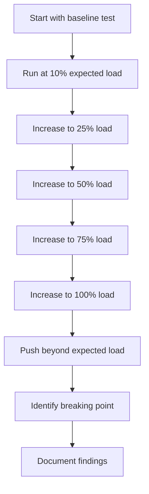

# Benchmarking Tools

## Introduction

Benchmarking is a critical practice when working with Grafana Loki to ensure your logging system performs optimally under various workloads. In this guide, we'll explore the benchmarking tools available for Grafana Loki, understand how to use them effectively, and interpret their results to make informed optimization decisions.

Benchmarking allows you to:
- Establish performance baselines
- Identify bottlenecks before they affect production
- Compare different configuration options
- Plan capacity for future growth
- Validate performance improvements after tuning

## Loki's Built-in Benchmarking Tools

Grafana Loki comes with several built-in tools to help you measure various aspects of its performance. Let's explore the most important ones.

### Using `loki-bench`

The `loki-bench` tool is specifically designed to benchmark Loki's write and query performance. It simulates log ingestion and querying at scale to help you understand how your configuration performs under load.

#### Installation

To install `loki-bench`:

```bash
go install github.com/grafana/loki/cmd/loki-bench@latest
```

#### Basic Usage

Here's a simple example to benchmark write performance:

```bash
loki-bench write --addr=http://localhost:3100 --batches=100 --batch-size=10 --batch-wait=1s
```

This command will:
- Send 100 batches of logs to your Loki instance
- Each batch contains 10 log entries
- Wait 1 second between batches

The output will look similar to:

```
Write benchmark results:
Total logs sent: 1000
Total duration: 2m15.4s
Average throughput: 7.4 logs/second
Success rate: 99.8%
Errors: 2
```

For query benchmarking:

```bash
loki-bench query --addr=http://localhost:3100 --query='{app="test"}' --iterations=50 --query-wait=2s
```

This will:
- Run the query `{app="test"}` 50 times
- Wait 2 seconds between queries
- Report on query performance

#### Advanced Configuration

For more complex benchmarking scenarios, you can use a configuration file:

```bash
loki-bench --config=bench-config.yaml
```

Example `bench-config.yaml`:

```yaml
write:
  addr: http://localhost:3100
  tenants: 5
  batches: 200
  batch-size: 20
  streams: 100
  labels: '{app="benchmark", env="production", level="info"}'
  workers: 10
  
query:
  addr: http://localhost:3100
  queries:
    - query: '{app="benchmark"} |= "error"'
      range: 1h
    - query: 'rate({app="benchmark"}[5m])'
      range: 6h
  iterations: 25
```

### Using `logcli bench`

The `logcli` tool, which is Loki's command-line client, also includes a benchmarking capability specifically focused on query performance.

#### Installation

```bash
go install github.com/grafana/loki/cmd/logcli@latest
```

#### Basic Usage

```bash
logcli bench --addr=http://localhost:3100 --query='{job="varlogs"}' --limit=1000 --iterations=10
```

This command will:
- Connect to your Loki instance
- Run the specified query 10 times
- Return up to 1000 log lines per query
- Calculate average query time and other performance metrics

Sample output:

```
Benchmarking query: {job="varlogs"}
Iterations: 10
Average query time: 0.567 seconds
Min query time: 0.432 seconds
Max query time: 0.789 seconds
95th percentile: 0.765 seconds
Query throughput: 1.76 queries per second
```

## Third-Party Benchmarking Tools

In addition to Loki's built-in tools, several third-party solutions can be used to benchmark different aspects of Loki's performance.

### k6 for HTTP Endpoint Testing

[k6](https://k6.io/) is an open-source load testing tool that's particularly effective for benchmarking Loki's HTTP API endpoints.

#### Sample k6 Script for Loki

```javascript
import http from 'k6/http';
import { sleep, check } from 'k6';

export const options = {
  vus: 10,  // 10 virtual users
  duration: '30s',
};

export default function () {
  // Benchmark pushing logs
  const pushUrl = 'http://localhost:3100/loki/api/v1/push';
  const payload = JSON.stringify({
    streams: [
      {
        stream: {
          app: 'benchmark-app',
          environment: 'production',
        },
        values: [
          [`${Date.now() * 1000000}`, 'This is a benchmark log line from k6'],
        ],
      },
    ],
  });

  const params = {
    headers: {
      'Content-Type': 'application/json',
    },
  };

  const pushRes = http.post(pushUrl, payload, params);
  
  check(pushRes, {
    'push status is 204': (r) => r.status === 204,
  });

  // Benchmark queries
  const queryUrl = 'http://localhost:3100/loki/api/v1/query_range';
  const queryParams = {
    query: '{app="benchmark-app"}',
    start: (Date.now() - 3600000) * 1000000,  // 1 hour ago in nanoseconds
    end: Date.now() * 1000000,  // now in nanoseconds
    limit: 100,
  };

  const queryRes = http.get(queryUrl, { params: queryParams });
  
  check(queryRes, {
    'query status is 200': (r) => r.status === 200,
    'query returns results': (r) => {
      const body = JSON.parse(r.body);
      return body.data && body.data.result && body.data.result.length > 0;
    },
  });

  sleep(1);
}
```

Run this with:

```bash
k6 run loki-benchmark.js
```

### Prometheus for Long-term Performance Monitoring

While not a benchmarking tool per se, [Prometheus](https://prometheus.io/) is invaluable for monitoring Loki's performance metrics over time, which complements your benchmarking efforts.

Configure Prometheus to scrape Loki's metrics endpoint:

```yaml
scrape_configs:
  - job_name: 'loki'
    static_configs:
      - targets: ['localhost:3100']
    metrics_path: '/metrics'
```

Key metrics to monitor:

- `loki_distributor_bytes_received_total`: Total bytes received per tenant
- `loki_ingester_chunk_size_bytes`: Size of chunks persisted to storage
- `loki_ingester_chunk_utilization`: Percentage of chunk space utilized
- `loki_query_frontend_query_seconds_bucket`: Query latency histogram

## Benchmarking Best Practices

For reliable benchmark results, follow these best practices:

### 1. Isolate Your Testing Environment

Ensure your benchmarking is performed in an environment that closely resembles production but is isolated from it:

```bash
docker run -d --name loki-benchmark -p 3100:3100 -v $(pwd)/loki-config.yaml:/etc/loki/local-config.yaml grafana/loki:latest
```

### 2. Create Realistic Test Data

Generate log data that resembles your actual workloads:

```bash
for i in {1..10000}; do
  timestamp=$(date +%s%N)
  echo "{\"streams\": [{\"stream\": {\"app\": \"test-app\", \"env\": \"prod\"}, \"values\": [[\"$timestamp\", \"User id-$RANDOM logged in from IP 192.168.$((RANDOM % 255)).$((RANDOM % 255))\"]]}]}" | \
  curl -H "Content-Type: application/json" -X POST -d @- http://localhost:3100/loki/api/v1/push
  sleep 0.01
done
```

### 3. Progressive Load Testing

Start with a small load and progressively increase it to find the breaking point:



### 4. Measure Multiple Dimensions

Don't focus only on throughput; measure:
- Latency (average, 95th, 99th percentiles)
- Error rates
- Resource usage (CPU, memory, disk I/O)
- Query performance
- Cardinality handling

### 5. Benchmark with Different Configurations

Compare performance across different Loki configurations:

```bash
# Run benchmark with default config
loki-bench write --addr=http://localhost:3100 --batches=100 --batch-size=100 > default_results.txt

# Update configuration and restart Loki
# ...

# Run identical benchmark with new config
loki-bench write --addr=http://localhost:3100 --batches=100 --batch-size=100 > tuned_results.txt

# Compare results
diff default_results.txt tuned_results.txt
```

## Real-World Benchmarking Scenarios

Let's explore some practical benchmarking scenarios you might encounter when working with Grafana Loki.

### Scenario 1: Sizing for Log Volume Growth

If you expect your log volume to grow significantly, you need to benchmark how your Loki deployment will handle the increased load:

```bash
# Benchmark current log volume
loki-bench write --addr=http://localhost:3100 --batches=100 --batch-size=$(current_daily_logs / 1000) --workers=5

# Benchmark projected log volume (e.g., 5x growth)
loki-bench write --addr=http://localhost:3100 --batches=100 --batch-size=$(current_daily_logs * 5 / 1000) --workers=5
```

### Scenario 2: Query Performance Tuning

If your users are experiencing slow queries, benchmark different query optimization techniques:

```bash
# Benchmark baseline query performance
logcli bench --addr=http://localhost:3100 --query='{app="frontend"} |= "error"' --iterations=20 --range=1h

# After implementing index improvements, chunk caching, etc.
logcli bench --addr=http://localhost:3100 --query='{app="frontend"} |= "error"' --iterations=20 --range=1h
```

### Scenario 3: Comparing Storage Backends

Benchmark to compare the performance impact of different storage backends:

```bash
# Configure Loki with local filesystem backend
# Run benchmark
loki-bench write --addr=http://localhost:3100 --batches=200 --batch-size=50 > filesystem_results.txt

# Reconfigure Loki with S3 storage backend
# Run identical benchmark
loki-bench write --addr=http://localhost:3100 --batches=200 --batch-size=50 > s3_results.txt

# Compare results
```

## Interpreting Benchmark Results

Understanding your benchmark results is as important as running the benchmarks. Here's what to look for:

### Throughput Analysis

Look at how many logs per second your system can handle:

```
Write throughput: 15,000 logs/second
Read throughput: 50 queries/second
```

### Latency Breakdown

Pay close attention to latency percentiles, not just averages:

```
Average query time: 250ms
95th percentile: 450ms
99th percentile: 780ms
```

If there's a large gap between average and high percentiles, it indicates inconsistent performance that will affect user experience.

### Resource Utilization

Monitor system resources during benchmarks:

```bash
# Use tools like top, htop, or prometheus metrics
```

Look for:
- CPU saturation
- Memory growth
- Disk I/O bottlenecks
- Network saturation

### Identify Breaking Points

Document when and how your system begins to fail:

```
System performs well up to 20,000 logs/second
At 25,000 logs/second:
- Error rate increases to 5%
- Query latency increases by 3x
- Memory usage grows unbounded
```

## Common Benchmarking Pitfalls

Be aware of these common mistakes when benchmarking Loki:

1. **Not warming up the system**: Always run a warm-up phase before recording benchmark results.

2. **Ignoring cardinality**: Test with realistic label cardinality; low-cardinality benchmarks won't reveal real-world performance.

3. **Neglecting cleanup**: In long-running benchmarks, ensure proper cleanup to avoid skewed results due to disk space issues.

4. **Single-dimension focus**: Don't optimize only for ingest performance at the expense of query performance, or vice versa.

5. **Unrealistic data**: Using synthetic data that doesn't match your production patterns can lead to misleading results.

## Summary

Benchmarking tools are essential for understanding, optimizing, and maintaining Grafana Loki performance. By following a systematic approach to benchmarking, you can:

- Establish reliable performance baselines
- Identify potential bottlenecks before they impact users
- Make data-driven decisions about configuration changes
- Plan effectively for future growth
- Validate the impact of your performance tuning efforts

Remember that benchmarking is not a one-time activity but an ongoing process that should be integrated into your development and operations workflows.

## Additional Resources

- [Grafana Loki GitHub Repository](https://github.com/grafana/loki)
- [Loki Performance Best Practices](https://grafana.com/docs/loki/latest/best-practices/)
- [Loki Metrics Documentation](https://grafana.com/docs/loki/latest/operations/observability/)

## Exercises

1. Set up a basic Loki instance and use `loki-bench` to establish baseline performance metrics.

2. Create a custom k6 script that simulates your specific log patterns and query patterns.

3. Compare Loki's performance with different chunk sizes and see how it affects both ingest and query performance.

4. Benchmark how increasing label cardinality affects your Loki deployment.

5. Create a Grafana dashboard that displays the key performance metrics from your Loki benchmarks.