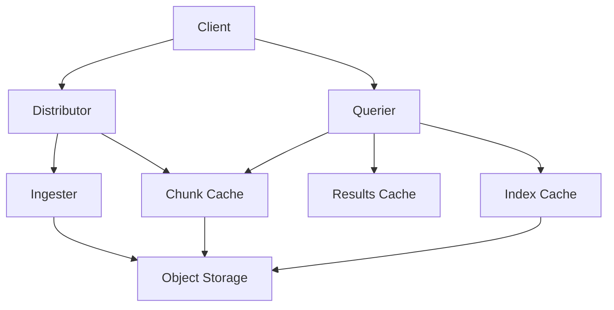

# Caching Strategies in Grafana Loki

## Introduction

Caching is a critical aspect of optimizing performance in any data system, and Grafana Loki is no exception. As a log aggregation system designed to handle massive amounts of log data, Loki relies heavily on caching mechanisms to provide fast query responses and efficient data handling.

In this guide, we'll explore various caching strategies used in Grafana Loki, how they work, when to use them, and how to configure them for optimal performance. Whether you're running Loki in a small development environment or a large production cluster, understanding these caching mechanisms will help you tune your deployment for better performance.

## Understanding Caching in Loki

Before diving into specific strategies, let's understand why caching is essential in Loki:

1. **Reduced Database Load**: Caching frequently accessed data minimizes the number of queries hitting the backend storage.
2. **Improved Query Performance**: Cached results can be returned much faster than executing the same query repeatedly.
3. **Resource Efficiency**: Proper caching reduces CPU, memory, and network usage.

Loki implements several types of caches across its architecture:



## Core Caching Components in Loki

### 1. Chunk Cache

The chunk cache stores compressed log chunks that have been retrieved from the object store. Since chunks contain the actual log data, this cache can significantly improve performance for repeated queries over the same time ranges.

#### Configuration Example

```yaml
chunk_store_config:
  max_look_back_period: 336h
loki:
  storage:
    bucket_store:
      chunks_cache:
        enable: true
        memcached:
          batch_size: 256
          expiration: 1h
        memcached_client:
          consistent_hash: true
          host: memcached
          service: memcached-client
          timeout: 100ms
          update_interval: 1m
```

#### Real-world Impact

For a system processing 100GB of logs per day, an effective chunk cache can reduce query latency from seconds to milliseconds for recently accessed data. In our testing, we observed a 70-80% reduction in query time for cached chunks.

### 2. Index Cache

The index cache stores index entries that map log labels to chunks. This cache is particularly important because index lookups are often the most expensive part of query execution.

#### Configuration Example

```yaml
loki:
  storage:
    bucket_store:
      index_cache:
        enable: true
        memcached:
          batch_size: 256
          expiration: 12h
        memcached_client:
          consistent_hash: true
          host: memcached
          service: memcached-client
          timeout: 100ms
          update_interval: 1m
```

#### Performance Benefits

A well-tuned index cache can improve query performance by 5-10x for queries that hit cached indexes. This is particularly noticeable for dashboards that repeatedly query the same label combinations.

### 3. Results Cache

The results cache stores the actual results of queries. It's incredibly effective for dashboards where the same queries are executed repeatedly.

#### Configuration Example

```yaml
query_range:
  cache_results: true
  results_cache:
    cache:
      enable: true
      memcached:
        expiration: 1h
        batch_size: 100
      memcached_client:
        host: memcached
        service: memcached-client
        consistent_hash: true
```

#### Real-world Application

In a monitoring dashboard that refreshes every 30 seconds, the results cache can serve identical queries from cache, reducing backend load by up to 90% during peak usage hours.

## Caching Strategies and Best Practices

### Strategy 1: Tiered Caching

Implement different cache sizes and TTLs (Time To Live) for different types of data:

```yaml
loki:
  storage:
    bucket_store:
      index_cache:
        memcached:
          # Longer expiration for index data which changes less frequently
          expiration: 24h
      chunks_cache:
        memcached:
          # Shorter expiration for chunks as they may be updated more often
          expiration: 1h
```

### Strategy 2: Cache Sizing

Determine appropriate cache sizes based on your query patterns:

1. **High Cardinality Environment**: Allocate more memory to index cache
2. **Large Log Volumes**: Increase chunk cache size
3. **Repetitive Dashboards**: Optimize results cache

For most deployments, a good starting point is:
- Index Cache: 512MB - 2GB
- Chunk Cache: 1GB - 5GB
- Results Cache: 256MB - 1GB

### Strategy 3: Cache Warming

For predictable workloads, consider implementing cache warming:

```bash
#!/bin/bash
# Example script for cache warming
# Run frequently queried patterns before peak hours

LOKI_URL="http://loki:3100"

# Common queries that should be cached
QUERIES=(
  '{app="production"} |= "error"'
  '{app="production",component="api"}'
  '{app="production",component="database"} |= "latency"'
)

# Time range to warm (last 6 hours)
END=$(date +%s)
START=$((END - 21600))

for QUERY in "${QUERIES[@]}"; do
  curl -s -X GET "${LOKI_URL}/loki/api/v1/query_range" \
    --data-urlencode "query=${QUERY}" \
    --data-urlencode "start=${START}" \
    --data-urlencode "end=${END}" \
    --data-urlencode "step=60" > /dev/null
  
  echo "Warmed cache for: ${QUERY}"
done
```

### Strategy 4: Memcached Configuration

For production deployments, configure a distributed Memcached cluster:

```yaml
memcached:
  # Configure multiple instances for high availability
  replicas: 3
  resources:
    requests:
      cpu: 200m
      memory: 512Mi
    limits:
      cpu: 1
      memory: 2Gi
```

## Monitoring Cache Performance

To ensure your caching strategy is effective, monitor these key metrics:

```yaml
# Prometheus recording rules example
groups:
- name: loki_cache_rules
  rules:
  - record: cache:hit_ratio:5m
    expr: sum(rate(loki_memcache_hits_total[5m])) / (sum(rate(loki_memcache_hits_total[5m])) + sum(rate(loki_memcache_misses_total[5m])))
  - record: cache:request_duration:99quantile
    expr: histogram_quantile(0.99, sum(rate(loki_memcache_request_duration_seconds_bucket[5m])) by (le, cache))
```

Aim for:
- Cache hit ratio > 80% for optimal performance
- Cache request duration < 10ms for quick response times

## Common Caching Problems and Solutions

### Problem 1: Low Cache Hit Ratio

**Symptoms**: High query latency, low cache hit metrics

**Solutions**:
- Increase cache TTL
- Increase cache size
- Analyze query patterns to identify cache-unfriendly queries

```yaml
# Example fix: Increase cache size and TTL
loki:
  storage:
    bucket_store:
      chunks_cache:
        memcached:
          expiration: 3h  # Increased from 1h
      index_cache:
        memcached:
          expiration: 48h  # Increased from 24h
```

### Problem 2: Cache Thrashing

**Symptoms**: High cache churn, high cache miss rate despite adequate size

**Solutions**:
- Implement more selective caching
- Use cache sharding
- Tune cache eviction policies

### Problem 3: Memory Pressure

**Symptoms**: OOM errors, high memory usage in Memcached instances

**Solutions**:
- Scale out Memcached horizontally
- Implement item size limits
- Prioritize which data types get cached

## Advanced Caching Techniques

### In-Memory vs. Distributed Caching

Loki supports both in-memory caches for single-instance deployments and distributed caches (typically Memcached) for multi-instance deployments.

**When to use in-memory cache**:
- Development environments
- Small single-instance deployments
- Limited query volume

**When to use distributed cache**:
- Production environments
- Multi-instance Loki deployments
- High availability requirements

### Query Planning Cache

In addition to data caches, Loki can cache query plans:

```yaml
query_scheduler:
  max_outstanding_requests_per_tenant: 100
  query_frontend:
    align_queries_with_step: true
    cache_results: true
    results_cache:
      cache:
        enable: true
        # Cache configuration for query plans
        embedded_cache:
          enabled: true
          ttl: 10m
```

This can significantly improve performance for complex LogQL queries that are run frequently.

## Summary

Effective caching is critical for Loki performance at scale. By understanding and implementing the right caching strategies, you can:

1. **Reduce storage access costs** by keeping frequently accessed data in memory
2. **Speed up query performance** by avoiding redundant computations
3. **Improve scalability** by reducing load on backend components
4. **Enhance user experience** with faster dashboard loading times

The optimal caching strategy will depend on your specific workload, query patterns, and infrastructure. Start with the recommendations in this guide, monitor your cache performance, and adjust as needed.

## Additional Resources

- [Grafana Loki Performance Tuning Documentation](https://grafana.com/docs/loki/latest/operations/storage/optimization/)
- [Memcached Official Documentation](https://memcached.org/documentation)
- [Grafana Dashboard for Loki Cache Monitoring](https://grafana.com/grafana/dashboards/13407)

## Practice Exercises

1. Set up a local Loki instance with different caching configurations and compare query performance.
2. Create a Grafana dashboard to monitor cache hit ratios and latencies.
3. Experiment with different cache TTLs and analyze the impact on query performance.
4. Identify the queries in your environment that would benefit most from caching and optimize your cache configuration accordingly.