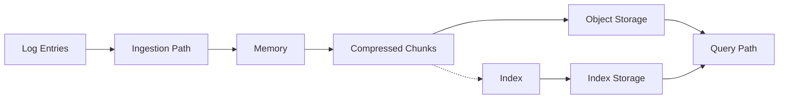

# Chunk Size Optimization

## Introduction

When working with Grafana Loki, one of the most critical performance factors is how your log data is organized into "chunks." Chunks are the fundamental storage units in Loki, and optimizing their size can significantly impact both query performance and storage efficiency.

In this guide, we'll explore what chunks are, why their size matters, and how to configure Loki for optimal chunk sizing based on your specific workload patterns.

## What Are Chunks in Loki?

Before diving into optimization, let's understand what chunks actually are:

- A **chunk** is a collection of compressed log entries for a specific stream over a particular time range
- Loki stores these chunks in object storage (like S3, GCS, etc.)
- Each chunk has associated metadata stored in the index (time range, labels, etc.)
- Chunks are the basic unit of data retrieval during queries



## Why Chunk Size Matters

Chunk size impacts Loki's performance in several key ways:

### 1. Query Performance

- **Too large**: Large chunks mean more data to download, decompress, and filter for queries
- **Too small**: Many small chunks create more index entries to scan and more objects to retrieve

### 2. Storage Efficiency

- **Too large**: Large chunks may contain more data than needed for typical queries
- **Too small**: Small chunks have higher overhead from metadata and compression inefficiency

### 3. Memory Usage

- **Too large**: Large chunks require more memory during ingestion and querying
- **Too small**: Managing many small chunks has higher overhead

## Key Chunk Size Configuration Parameters

Loki provides several configuration options to control chunk behavior:

```yaml
limits_config:
  # Maximum age of a chunk before it's flushed
  max_chunk_age: 1h
  
  # Maximum size of a chunk before it's flushed
  chunk_target_size: 1048576  # 1MB
  
  # Maximum number of log entries in a chunk
  chunk_entry_target_size: 8192
```

Let's examine each of these parameters:

### max_chunk_age

This setting determines how long Loki will keep a chunk open before flushing it to storage, regardless of its size.

- **Default**: 1h (one hour)
- **Impact**: Lower values create more chunks but improve time-based querying
- **Recommendation**: Align with your typical query time ranges (1-3h for most scenarios)

### chunk_target_size

This setting controls the maximum uncompressed size a chunk can grow to before being flushed.

- **Default**: 1MB
- **Impact**: Higher values improve compression but increase memory usage
- **Recommendation**: 1-5MB for most workloads

### chunk_entry_target_size

This limits how many log entries a single chunk can contain.

- **Default**: 8192 entries
- **Impact**: Lower values protect against huge log lines
- **Recommendation**: Adjust based on average log line size (lower for large logs)

## Practical Example: Tuning for Different Workloads

Let's look at how you might tune chunk parameters for different scenarios:

### Example 1: High-volume metrics workload

```yaml
limits_config:
  max_chunk_age: 2h
  chunk_target_size: 5242880  # 5MB
  chunk_entry_target_size: 20000
```

This configuration works well for:
- High volume metric collection
- Relatively uniform log sizes
- Queries that typically span hours

### Example 2: Low-volume detailed logs

```yaml
limits_config:
  max_chunk_age: 30m
  chunk_target_size: 1048576  # 1MB
  chunk_entry_target_size: 5000
```

This configuration works well for:
- Lower volume but detailed log entries
- Varied log sizes
- Queries that typically look at recent data

## Measuring the Impact of Chunk Size Changes

To determine if your chunk size configuration is effective, monitor these metrics:

1. **Query latency**: Track p50, p95, and p99 query times
2. **Storage utilization**: Monitor the total storage used by chunks
3. **Chunk statistics**: Look at average chunk size and count

You can use Grafana dashboards to monitor these metrics. Here's a simple example of a Prometheus query to check average chunk size:

```
avg(loki_chunk_store_chunk_size_bytes)
```

## Step-by-Step Optimization Process

Here's a methodical approach to optimizing your chunk sizes:

1. **Establish a baseline**:
   - Monitor current performance metrics
   - Understand your query patterns
   - Document storage utilization

2. **Analyze log characteristics**:
   - Average log line size
   - Typical query time ranges
   - Log volume patterns (spikes, seasonality)

3. **Start with conservative changes**:
   - Adjust one parameter at a time
   - Begin with `max_chunk_age` to match query patterns
   - Make incremental changes (±25%)

4. **Measure impact**:
   - Allow enough time to observe effects (24h minimum)
   - Compare metrics to baseline
   - Look for unexpected side effects

5. **Iterate and fine-tune**:
   - Make additional adjustments based on observations
   - Optimize for your most common query patterns
   - Document the reasoning behind each change

## Common Chunk Size Pitfalls and Solutions

| Problem | Symptom | Solution |
|---------|---------|----------|
| Chunks too large | High query latency for small time ranges | Reduce `chunk_target_size` or `max_chunk_age` |
| Chunks too small | High storage costs, slow queries across wide time ranges | Increase `chunk_target_size` and `chunk_entry_target_size` |
| Uneven chunk sizes | Some queries much slower than others | Refine label cardinality, consider stream sharding |
| Excessive memory usage | OOM errors during ingestion | Reduce `chunk_target_size` or increase memory allocation |

## Advanced Topic: Dynamic Chunk Sizing

While Loki doesn't support fully dynamic chunk sizing, you can implement a form of adaptive chunking by:

1. Using different chunk configurations for different tenants
2. Creating separate configuration for dev/test/prod environments
3. Periodically reviewing and adjusting chunk settings as workloads evolve

This can be done through Loki's multi-tenant capabilities:

```yaml
limits_config:
  per_tenant_override_config: /etc/loki/tenant-overrides.yaml
```

With a tenant override file like:

```yaml
overrides:
  tenant1:
    max_chunk_age: 3h
    chunk_target_size: 2097152  # 2MB
  tenant2:
    max_chunk_age: 1h
    chunk_target_size: 1048576  # 1MB
```

## Implementation Example: Optimizing for a Web Application Logs

Let's walk through a complete example of chunk size optimization for a typical web application:

1. **Initial analysis**:
   - Log volume: ~10GB/day
   - Typical queries: Last 15 minutes to 2 hours
   - Average log line: 500 bytes
   - Query pattern: Frequent short-range queries, occasional full-day analysis

2. **Initial configuration**:

```yaml
limits_config:
  max_chunk_age: 1h
  chunk_target_size: 1048576  # 1MB
  chunk_entry_target_size: 8192
```

3. **After monitoring**:
   - Observation: Many small chunks created due to stream cardinality
   - Query performance: Good for recent data, slow for day-range queries
   - Storage: Higher than expected due to chunk overhead

4. **Optimized configuration**:

```yaml
limits_config:
  max_chunk_age: 2h
  chunk_target_size: 2097152  # 2MB
  chunk_entry_target_size: 10000
  
schema_config:
  configs:
    - from: "2023-01-01"
      store: boltdb-shipper
      object_store: s3
      schema: v11
      index:
        prefix: loki_index_
        period: 24h
```

5. **Results**:
   - 15% reduction in storage costs
   - 30% improvement in day-range query performance
   - Minimal impact on short-range query performance
   - Better resource utilization

## Summary

Chunk size optimization is crucial for balancing query performance and storage efficiency in Grafana Loki. Key takeaways include:

- **Understand your workload**: Log volume, query patterns, and typical time ranges
- **Monitor the impact**: Track query performance, storage utilization, and resource usage
- **Iterate gradually**: Make incremental changes and observe the results
- **Consider all parameters**: `max_chunk_age`, `chunk_target_size`, and `chunk_entry_target_size` work together
- **Adjust for different workloads**: Different applications may need different configurations

By thoughtfully tuning your chunk size parameters, you can significantly improve Loki's performance while controlling costs.

## Additional Resources

- [Official Loki documentation on chunks](https://grafana.com/docs/loki/latest/fundamentals/architecture/storage/)
- [Grafana blog post on Loki performance tuning](https://grafana.com/blog/2020/08/27/the-concise-guide-to-labels-in-loki/)
- [Community best practices for Loki configuration](https://grafana.com/docs/loki/latest/best-practices/)

## Exercises

1. Measure the current chunk sizes in your Loki deployment using Prometheus metrics.
2. Experiment with different `max_chunk_age` values and measure the impact on query performance.
3. Calculate the optimal `chunk_target_size` based on your average log line size and volume.
4. Create a monitoring dashboard that tracks key chunk-related metrics to help with ongoing optimization.