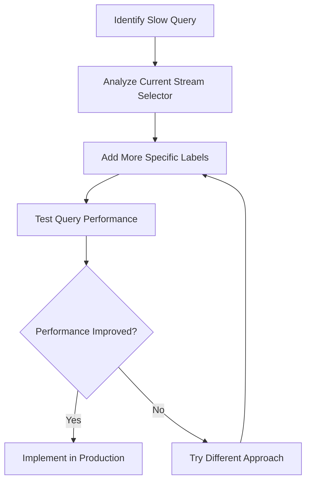

# Stream Selector Tuning

## Introduction

Stream selectors are a fundamental component of Grafana Loki queries that determine which log streams are selected for processing. Properly tuning your stream selectors is crucial for optimizing query performance, as it directly impacts the amount of data Loki needs to process. In this guide, we'll explore how to fine-tune your stream selectors to achieve better performance while still retrieving the logs you need.

## Understanding Stream Selectors

In Loki, a stream selector is enclosed in curly braces `{}` and consists of one or more label key-value pairs. For example:

```logql
{app="frontend", environment="production"}
```

This selector matches all log streams with labels `app=frontend` and `environment=production`.

### How Stream Selectors Affect Performance

Stream selectors act as the first line of filtering in your Loki queries. The more specific your selectors, the less data Loki needs to process, resulting in:

- Faster query execution
- Lower resource consumption
- Better overall system performance

## Key Principles for Stream Selector Tuning

### 1. Be as Specific as Possible

Always narrow down your stream selection to include only the data you need.

#### Example: Too Broad vs. Optimized

Too broad:
```logql
{app="frontend"}
```

Optimized:
```logql
{app="frontend", environment="production", component="auth-service"}
```

The optimized query might process only a fraction of the data compared to the broader one.

### 2. Leverage High-Cardinality Labels Carefully

Labels with high cardinality (many possible values) can be powerful for filtering but should be used strategically.

```logql
// Effective use of high-cardinality label
{app="payment-service", transaction_id="abc123"}
```

This query uses a high-cardinality label (`transaction_id`) to pinpoint specific logs rapidly.

### 3. Avoid Regex Operations When Possible

Regular expressions in stream selectors cause more processing overhead. Use exact matches when possible.

#### Example: Regex vs. Exact Match

Using regex:
```logql
{app=~"frontend.*"}
```

Using exact match:
```logql
{app="frontend-web"}
```

The exact match is processed more efficiently.

## Practical Stream Selector Optimization Techniques

### Label Organization Strategy

Organize your logging labels with query performance in mind:

1. **Include filtering-friendly labels**: Add labels specifically designed for common query patterns
2. **Standardize label naming**: Consistent label names make queries more intuitive
3. **Use hierarchical labeling**: Labels like `service`, `subservice`, and `component` create natural filtering levels

### Stream Selector Examples for Common Scenarios

#### Troubleshooting Application Errors

Unoptimized:
```logql
{app="user-service"} |= "error"
```

Optimized:
```logql
{app="user-service", level="error"}
```

The optimized version uses a label to filter at the stream selection level rather than filtering the log content after stream selection.

#### Monitoring Specific Service Components

Unoptimized:
```logql
{app="payment-service"} |= "checkout"
```

Optimized:
```logql
{app="payment-service", component="checkout"}
```

Again, moving the filtering from log content to labels improves performance.

## Measuring the Impact of Stream Selector Tuning

You can evaluate the effectiveness of your stream selector tuning by:

1. Comparing query execution times before and after optimization
2. Looking at the "Statistics" tab in Grafana's Explore view
3. Monitoring Loki's resource consumption during queries

Let's visualize a sample workflow for tuning stream selectors:



## Advanced Techniques

### Using Dynamic Labels

Add timestamp-related labels to your logs for efficient time-based filtering:

```logql
{app="api-gateway", day="2023-05-15"}
```

This allows Loki to quickly skip chunks from other days.

### Combining Stream Selectors with Line Filters

For complex scenarios, use targeted stream selectors first, then refine with line filters:

```logql
{app="payment-service", environment="production", level="error"} |= "timeout" | json | duration > 1000
```

This query:
1. Selects only error logs from the payment service in production
2. Filters for lines containing "timeout"
3. Parses JSON and filters for requests lasting longer than 1000ms

## Real-World Case Study

Consider a microservice architecture with dozens of services generating logs. Initially, a team might write a query like:

```logql
{environment="production"} |= "error" |= "payment failed"
```

This query would scan all production logs, which could be massive.

After optimization:

```logql
{environment="production", app="payment-processor", level="error", component="transaction"} |= "payment failed"
```

This optimized query could be 10-100x faster, reducing query time from minutes to seconds.

## Performance Tuning Guidelines

| Selector Pattern | Performance Impact | When to Use |
|------------------|-------------------|------------|
| `{app="name"}` | Good | When app has minimal logs |
| `{app="name", level="error"}` | Better | When focusing on errors |
| `{app="name", level="error", component="x"}` | Best | For targeted troubleshooting |
| `{app=~"name.*"}` | Poor | Avoid when exact matches are possible |

## Common Pitfalls to Avoid

1. **Using regex on high-volume labels**: This forces Loki to scan more data
2. **Omitting important filtering labels**: Include labels for your most common filtering needs
3. **Inconsistent labeling**: Ensure consistent label use across your applications
4. **Relying too much on log content filtering**: Moving filtering to the stream selector level is more efficient

## Summary

Stream selector tuning is a critical skill for optimizing Loki query performance. By being specific with your selectors, leveraging labels effectively, and moving filtering logic to stream selection when possible, you can dramatically improve query speed and system efficiency.

Remember these key points:
- Be as specific as possible with your stream selectors
- Use labels strategically to filter at the stream selection level
- Measure performance impacts of your changes
- Design your logging architecture with query performance in mind

## Additional Resources

- Grafana Loki Documentation: LogQL
- Grafana Labs Blog: Query Optimization Techniques
- Practice implementing these techniques in your own Loki environment to see the performance differences firsthand

## Exercises

1. Take a slow-performing Loki query from your environment and optimize its stream selector
2. Compare execution times between different selector strategies
3. Design a labeling strategy for a new application that would enable efficient querying