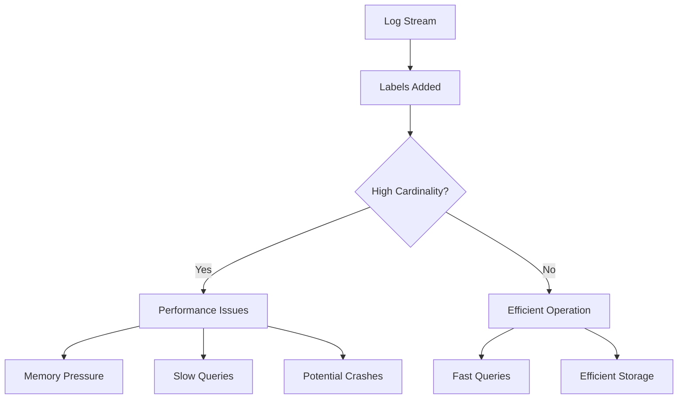

# Series Limits

## Introduction

When working with Grafana Loki, one of the key challenges you'll encounter is managing cardinality. Cardinality refers to the number of unique combinations of label values in your log data. High cardinality can lead to performance issues, increased resource consumption, and even system instability.

Series limits are a critical feature in Loki that help you control cardinality by setting boundaries on how many unique label series your system can handle. This guide will explain what series limits are, why they matter, and how to configure them effectively to optimize your Loki deployment.

## Understanding Series Cardinality

Before diving into series limits, it's essential to understand what we mean by "series" and "cardinality" in Loki:

- A **series** is a unique combination of label name-value pairs associated with log streams
- **Cardinality** refers to the total number of unique series in your system

For example, if you have logs with labels like `{app="frontend", env="prod"}` and `{app="frontend", env="dev"}`, these represent two different series.

High cardinality occurs when you have too many unique label combinations, which can happen when:

1. You add too many labels to your logs
2. Your labels have too many possible values (e.g., using user IDs or request IDs as labels)
3. You use highly dynamic values for labels



## Why Series Limits Matter

Without proper controls, Loki can experience several issues due to high cardinality:

1. **Memory Consumption**: Each unique series requires memory for its index
2. **Query Performance**: More series means more data to scan during queries
3. **Stability**: Extremely high cardinality can cause Loki components to crash
4. **Resource Costs**: Higher resource requirements mean higher operational costs

Series limits help prevent these problems by enforcing constraints on how many unique series can exist in your Loki deployment.

## Types of Series Limits in Loki

Loki provides several types of series limits that operate at different levels:

### 1. Global Series Limits

These limits apply across your entire Loki deployment:

```yaml
limits_config:
  max_global_streams_per_user: 10000
  max_global_series_per_user: 10000
  max_global_series_per_metric: 5000
```

### 2. Per-Tenant Limits

These limits apply to individual tenants (users or organizations):

```yaml
limits_config:
  ingestion_rate_mb: 10
  ingestion_burst_size_mb: 20
  max_streams_per_user: 5000
  max_series_per_user: 5000
  max_series_per_metric: 3000
```

### 3. Per-Query Limits

These limits protect against resource-intensive queries:

```yaml
limits_config:
  max_entries_limit_per_query: 5000
  max_chunks_per_query: 2000000
  max_query_series: 500
```

## Configuring Series Limits

Let's walk through configuring series limits in a Loki deployment:

### Basic Configuration

Here's a basic configuration for series limits in a small Loki deployment:

```yaml
limits_config:
  # Global limits
  max_global_streams_per_user: 5000
  max_global_series_per_user: 5000
  
  # Per-tenant limits
  max_streams_per_user: 1000
  max_series_per_user: 1000
  
  # Query limits
  max_entries_limit_per_query: 5000
  max_chunks_per_query: 1000000
  max_query_series: 500
```

### Advanced Configuration

For more granular control, you can configure different limits for different tenants:

```yaml
limits_config:
  # Default limits
  max_streams_per_user: 1000
  max_series_per_user: 1000
  
  # Tenant overrides
  per_tenant_override_config: /etc/loki/overrides.yaml
```

Your `overrides.yaml` might look like:

```yaml
tenant1:
  max_streams_per_user: 2000
  max_series_per_user: 2000
  
tenant2:
  max_streams_per_user: 5000
  max_series_per_user: 5000
```

## Monitoring Series Usage

To effectively manage series limits, you need to monitor your current usage. Loki exposes several metrics that help with this:

1. `loki_ingester_memory_streams`: Number of active streams
2. `loki_ingester_memory_series`: Number of active series
3. `loki_ingester_memory_series_created_total`: Total series created
4. `loki_ingester_memory_series_removed_total`: Total series removed

You can create a Grafana dashboard to visualize these metrics:

```yaml
# Grafana dashboard query example
sum(loki_ingester_memory_streams{cluster="$cluster"}) by (tenant)
```

## Best Practices for Managing Series Limits

Here are some best practices to help you effectively manage series limits:

### 1. Start Conservative

Start with conservative limits and gradually increase them as needed:

```yaml
limits_config:
  max_global_streams_per_user: 5000
  max_streams_per_user: 1000
```

### 2. Monitor Before Enforcing

Monitor your series usage before strictly enforcing limits to understand your baseline:

```yaml
limits_config:
  max_streams_per_user: 1000
  max_streams_per_user_warn: true
  max_streams_per_user_enforce: false
```

### 3. Use Label Normalization

Normalize labels to reduce cardinality by using the label configuration:

```yaml
limits_config:
  max_label_names_per_series: 10
  reject_old_samples: true
  reject_old_samples_max_age: 24h
```

### 4. Implement a Retention Policy

Use retention policies to limit how long high-cardinality data is kept:

```yaml
schema_config:
  configs:
    - from: 2020-07-01
      store: boltdb-shipper
      object_store: s3
      schema: v11
      index:
        prefix: index_
        period: 24h
```

## Common Issues and Solutions

### Issue: "Too many series" errors

**Symptoms:**
- Log entries with "too many series" errors
- Rejection of new log streams

**Solution:**
1. Increase series limits temporarily
2. Identify high-cardinality labels
3. Refactor your labeling strategy
4. Implement dynamic tenant limits

```yaml
limits_config:
  max_series_per_user: 10000  # Temporary increase
  max_label_names_per_series: 10  # Restrict label count
```

### Issue: High memory usage in ingesters

**Symptoms:**
- Ingester OOM (Out of Memory) errors
- High memory usage alerts

**Solution:**
1. Reduce series limits
2. Scale up ingesters
3. Implement more aggressive retention
4. Use cardinality analyzer tools

## Practical Example: E-commerce Application

Let's consider a practical example for an e-commerce application:

**Initial configuration with high cardinality issues:**

```yaml
# High cardinality labels
{
  app="ecommerce",
  service="checkout",
  user_id="123456",  # High cardinality!
  request_id="abcdef123456",  # High cardinality!
  path="/api/checkout/confirm",
  status_code="200"
}
```

**Improved configuration:**

```yaml
# Reduced cardinality
{
  app="ecommerce",
  service="checkout",
  user_id_hash="a1b2c3",  # Hashed to reduce cardinality
  path_category="checkout",  # Categorized paths
  status_class="2xx"  # Grouped status codes
}

# Loki configuration
limits_config:
  max_streams_per_user: 5000
  max_label_names_per_series: 8
  max_label_name_length: 60
  max_label_value_length: 60
```

## Summary

Series limits are an essential configuration aspect of Grafana Loki that helps you manage cardinality and ensure system stability. By understanding and properly configuring these limits, you can:

- Prevent system crashes due to high cardinality
- Optimize query performance
- Control resource utilization
- Scale your Loki deployment efficiently

Remember that the ideal configuration depends on your specific use case, data volume, and available resources. Start with conservative limits, monitor your usage, and adjust accordingly.

## Additional Resources

Here are some exercises to help you apply what you've learned:

1. **Exercise:** Analyze your current Loki deployment to identify the top 10 label combinations contributing to high cardinality.

2. **Exercise:** Create a Grafana dashboard that monitors your series usage against configured limits.

3. **Exercise:** Design a labeling strategy for a microservice architecture that minimizes cardinality while preserving necessary information for troubleshooting.