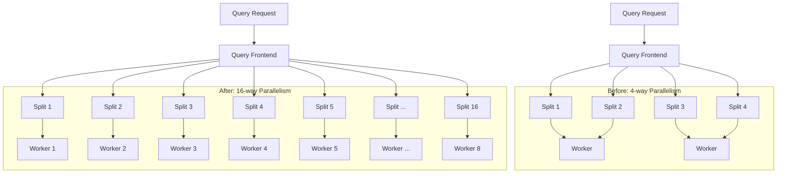

# Parallelism Settings

## Introduction

Parallelism is a fundamental concept in distributed systems like Grafana Loki that allows operations to be executed simultaneously across multiple processors, cores, or machines. In Loki, proper configuration of parallelism settings can significantly improve performance for both log ingestion and query execution.

This guide explains how parallelism works in Loki, the key settings you need to understand, and how to optimize them for your specific deployment.

## Understanding Parallelism in Loki

Loki's architecture is designed to scale horizontally, allowing it to handle massive volumes of log data by distributing work across multiple instances or processes. Parallelism settings control how this distribution happens.

### Key Concepts

- **Parallelism**: The number of concurrent operations that can be performed
- **Worker Pools**: Groups of worker processes that handle specific tasks
- **Query Sharding**: Breaking down queries to be executed in parallel
- **Ingesters**: Components that receive, process, and store incoming logs

## Important Parallelism Settings

Let's explore the most important parallelism settings in Loki:

### 1. Query Frontend Worker Configuration

The query frontend acts as a coordinator for incoming queries. It can distribute query load across multiple query workers.

```yaml
query_frontend:
  parallelism: 16
  querier_worker_concurrency: 8
```

**What these settings do:**
- `parallelism`: Controls how many splits a single query can be broken into
- `querier_worker_concurrency`: Determines how many queries a worker can process simultaneously

### 2. Querier Parallelism

Queriers execute the actual log queries. Their performance can be tuned with these settings:

```yaml
querier:
  max_concurrent: 10
  worker_parallelism: 2
  frontend_worker_concurrency: 4
```

**What these settings do:**
- `max_concurrent`: Maximum number of concurrent queries per querier
- `worker_parallelism`: Number of worker processes within each querier
- `frontend_worker_concurrency`: Number of queries handled by a single worker

### 3. Ingester Parallelism

Ingesters handle the incoming log data and are critical for ingestion performance:

```yaml
ingester:
  concurrent_flushes: 4
  flush_op_timeout: "2m"
  max_transfer_retries: 3
```

**What these settings do:**
- `concurrent_flushes`: Number of concurrent chunk flush operations
- `flush_op_timeout`: Maximum time allowed for a flush operation
- `max_transfer_retries`: Retries when transferring chunks between ingesters

## Practical Example: Tuning Query Performance

Let's look at a common scenario: you have a Loki deployment that's experiencing slow query performance, especially for queries spanning large time ranges.

### Initial Configuration

```yaml
query_frontend:
  parallelism: 4
  querier_worker_concurrency: 2

querier:
  max_concurrent: 5
  worker_parallelism: 1
```

### Problem Analysis

With these settings:
- Each query is only split into 4 parts maximum (`parallelism: 4`)
- Each worker only processes 2 queries at a time (`querier_worker_concurrency: 2`)
- Each querier only runs 5 queries simultaneously (`max_concurrent: 5`)
- No parallelism within workers (`worker_parallelism: 1`)

### Optimized Configuration

```yaml
query_frontend:
  parallelism: 16
  querier_worker_concurrency: 8

querier:
  max_concurrent: 10
  worker_parallelism: 2
```

### Performance Improvement

With this optimization:
- Queries can now be split into 16 parts, allowing better distribution
- Workers can handle up to 8 queries simultaneously
- Each querier can run up to 10 concurrent queries
- Each worker uses 2 processes for better CPU utilization

Let's visualize the difference with a diagram:



## Real-World Example: Log Ingestion Scaling

Consider a scenario where your application suddenly starts generating 3x more logs:

### Before: Limited Parallelism

```yaml
ingester:
  concurrent_flushes: 2
  max_chunk_age: "1h"
```

With these settings, ingesters might struggle to flush chunks to storage fast enough, causing:
- Memory pressure as chunks accumulate
- Potential data loss or delays
- Poor query performance

### After: Improved Parallelism

```yaml
ingester:
  concurrent_flushes: 8
  max_chunk_age: "1h"
```

With increased parallel flush operations:
- Chunks are flushed to storage more rapidly
- Memory usage remains stable even under higher ingestion loads
- Query performance stays consistent

## Best Practices for Parallelism Tuning

1. **Start Conservative**: Begin with lower parallelism values and increase gradually.

2. **Monitor Resource Usage**: Watch CPU, memory, and network usage as you adjust settings.

3. **Consider Hardware Limitations**: 
   - CPU cores determine optimal worker parallelism
   - Memory limits how many concurrent operations are possible
   - Network bandwidth can become a bottleneck with high parallelism

4. **Testing Under Load**: Use tools like `logcli` with the `--queries` flag to simulate multiple concurrent queries:

```bash
logcli query --addr=http://loki:3100 --queries=20 '{app="frontend"}' --from=2h
```

5. **Balanced Approach**: Extremely high parallelism settings can cause resource contention. Find the sweet spot for your environment.

## Advanced Configuration: Query Sharding

For large Loki deployments, query sharding provides additional parallelism by breaking queries into time-based shards:

```yaml
query_scheduler:
  max_outstanding_requests_per_tenant: 2048
  
query_frontend:
  align_queries_with_step: true
  cache_results: true
  results_cache:
    cache_size_mb: 1024
```

This configuration:
- Allows more outstanding requests per tenant
- Aligns queries with step intervals for better caching
- Enables result caching to reduce duplicate work

## Troubleshooting Parallelism Issues

### Problem: High CPU Usage with Little Throughput Gain

**Symptoms**:
- CPU usage is near 100%
- Increasing parallelism doesn't improve performance

**Solution**:
- Reduce parallelism to avoid context switching overhead
- Check for other bottlenecks (disk I/O, network)

```yaml
querier:
  worker_parallelism: 1  # Reduced from higher value
  max_concurrent: 8      # Maintained for concurrent query handling
```

### Problem: Memory Pressure During High Ingestion

**Symptoms**:
- OOM (Out of Memory) errors
- Slow query response during high ingestion

**Solution**:
- Adjust concurrent flushes and chunk settings

```yaml
ingester:
  concurrent_flushes: 6
  max_chunk_age: "30m"  # Reduced from 1h to flush more frequently
  chunk_target_size: 1572864  # Target smaller chunks (1.5MB)
```

## Summary

Parallelism settings in Grafana Loki provide powerful tools for scaling and performance optimization. Key takeaways:

- Query parallelism controls how queries are split and processed
- Ingester parallelism affects how efficiently logs are received and stored
- Proper configuration depends on your hardware resources and workload patterns
- Start with conservative settings and adjust based on monitoring
- Balance parallelism to avoid resource contention

By properly tuning parallelism settings, you can significantly improve both ingestion and query performance in your Loki deployment, allowing it to handle larger volumes of logs while maintaining responsive query capabilities.

## Additional Resources

- [Loki Architecture Documentation](https://grafana.com/docs/loki/latest/fundamentals/architecture/)
- [Loki Configuration Reference](https://grafana.com/docs/loki/latest/configuration/)
- [Query Performance Optimization Guide](https://grafana.com/docs/loki/latest/operations/query-optimization/)

## Exercises

1. **Basic Configuration**: Create a Loki configuration file with parallelism settings optimized for a system with 8 CPU cores and 16GB RAM.

2. **Performance Testing**: Use `logcli` to test query performance with different parallelism settings and document the results.

3. **Scaling Exercise**: Design parallelism settings for a Loki deployment that needs to handle:
   - 100GB of logs per day
   - Peak of 20 concurrent users running queries
   - 5 querier instances
   - 3 ingester instances