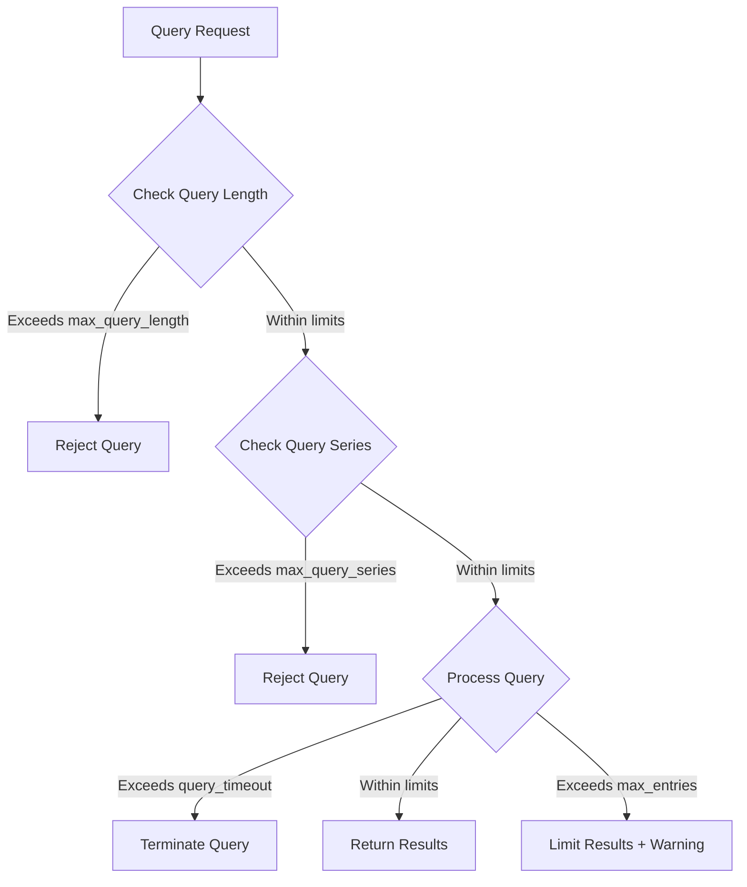

# Query Limits Configuration

## Introduction

When working with Grafana Loki in production environments, managing query performance and resource utilization becomes critical as your log volume grows. Query limits configuration allows you to set boundaries on query execution to prevent resource exhaustion, protect your cluster from overload, and ensure consistent performance for all users.

In this tutorial, we'll explore how to configure query limits in Grafana Loki, understand the impact of different settings, and learn best practices for optimizing query performance.

## Understanding Query Limits in Loki

Loki provides several configuration options to limit query execution. These limits help prevent queries that might consume excessive resources or take too long to complete, which could impact the overall system performance.

### Why Query Limits Matter

Without proper query limits:

- A single complex query could consume excessive resources
- Long-running queries might block other important queries
- Your Loki instance could become unresponsive during peak loads
- Users might experience timeouts or slow responses

## Key Query Limit Parameters

Let's explore the essential query limit parameters you can configure in Loki:

### 1. Query Timeout

This setting controls the maximum time a query can run before Loki terminates it.

```yaml
limits_config:
  query_timeout: 1m
```

In this example, any query that takes longer than 1 minute will be automatically terminated.

### 2. Max Query Length

This setting limits how far back in time users can query:

```yaml
limits_config:
  max_query_length: 720h  # 30 days
```

This prevents users from executing queries that span extremely long time ranges, which could put significant load on the system.

### 3. Max Query Parallelism

This controls how many queries can be processed concurrently:

```yaml
limits_config:
  max_query_parallelism: 14
```

Higher parallelism allows more queries to execute simultaneously but increases resource consumption.

### 4. Max Query Series

Limits the maximum number of series a query can process:

```yaml
limits_config:
  max_query_series: 500
```

This prevents queries that would match too many series, which could consume excessive memory.

### 5. Max Entries Limits

Controls the maximum number of log entries that can be processed:

```yaml
limits_config:
  max_entries_limit_per_query: 5000
  max_entries_limit_per_stream: 1000
```

These limits help prevent memory exhaustion when processing queries that match a large number of log entries.

## Complete Configuration Example

Here's a more comprehensive example of query limits configuration:

```yaml
limits_config:
  # Query time limits
  query_timeout: 2m
  max_query_length: 720h
  
  # Parallelism and concurrency
  max_query_parallelism: 16
  max_outstanding_per_tenant: 100
  
  # Result size limits
  max_query_series: 500
  max_entries_limit_per_query: 10000
  max_entries_limit_per_stream: 1000
  
  # Rate limits
  per_tenant_query_limit: 10
```

## Practical Configuration Example: Multi-Tenant Environment

In multi-tenant environments, you might want to apply different limits for different tenants based on their requirements and resource allocation:

```yaml
limits_config:
  # Default limits for all tenants
  query_timeout: 1m
  max_query_length: 168h  # 7 days
  max_query_parallelism: 8
  
  # Per-tenant overrides
  per_tenant_override_config:
    filename: /etc/loki/tenant-overrides.yaml
```

And in your `/etc/loki/tenant-overrides.yaml` file:

```yaml
overrides:
  premium_tenant:
    query_timeout: 5m
    max_query_length: 720h  # 30 days
    max_query_parallelism: 16
  basic_tenant:
    query_timeout: 30s
    max_query_length: 24h  # 1 day
    max_query_parallelism: 4
```

## Implementing Progressive Query Limits

A best practice is to implement progressive query limits based on the time range. This approach applies stricter limits for queries spanning longer time ranges:

```yaml
limits_config:
  query_split_duration: 24h  # Split queries into 24h chunks
  
  # Progressive limits based on query time range
  per_tenant_query_limits:
    - query_time_range_sec: 3600  # 1 hour
      max_entries_limit_per_query: 100000
    - query_time_range_sec: 86400  # 1 day
      max_entries_limit_per_query: 50000
    - query_time_range_sec: 604800  # 1 week
      max_entries_limit_per_query: 10000
```

## Real-World Query Limits Flow

This diagram illustrates how query limits are applied in Loki:



## Monitoring Query Limits

To ensure your query limits configuration is effective, you should monitor metrics related to query performance. Loki exposes several metrics through its `/metrics` endpoint:

- `loki_query_duration_seconds`: Histogram of query execution times
- `loki_query_frontend_queries_total`: Total number of queries
- `loki_query_frontend_query_limit_hits_total`: Count of queries that hit limits

These metrics can help you identify whether your limits need adjustment.

## Optimizing Query Limits: Best Practices

1. **Start Conservative**: Begin with strict limits and gradually relax them as needed
2. **Monitor User Experience**: Balance protection against user experience
3. **Adjust for Workloads**: Configure different limits for different query types or tenants
4. **Consider Resource Availability**: Align limits with your infrastructure capacity
5. **Use Progressive Limits**: Apply stricter limits for longer time ranges
6. **Implement Retry Mechanisms**: For applications, implement retry logic with narrower time ranges

## Troubleshooting Common Issues

### Query Timeout Errors

If users frequently encounter query timeout errors:

```
Error: query timed out after 1m
```

Solutions:
- Increase `query_timeout` for specific tenants
- Recommend narrowing the time range of queries
- Optimize label selectors to reduce the data being processed

### Max Entries Limit Exceeded

When this error appears:

```
Error: max entries limit per query reached (limit: 5000)
```

Solutions:
- Increase the `max_entries_limit_per_query` for specific use cases
- Recommend adding more specific label filters
- Split queries into smaller time chunks

## Summary

Properly configuring query limits in Grafana Loki is essential for maintaining system stability, ensuring fair resource allocation, and providing consistent performance. By understanding and fine-tuning these limits, you can protect your Loki deployment from excessive resource consumption while still meeting your users' needs.

Key points to remember:
- Query limits protect your Loki installation from resource exhaustion
- Different limits can be applied to different tenants based on their needs
- Progressive limits help manage queries over larger time ranges
- Monitoring query metrics helps you refine your configuration

## Additional Resources

- [Grafana Loki Configuration Documentation](https://grafana.com/docs/loki/latest/configuration/)
- [Loki Query Performance Optimization](https://grafana.com/blog/2020/08/27/the-concise-guide-to-labels-in-loki/)
- [Grafana Loki Best Practices](https://grafana.com/docs/loki/latest/best-practices/)

## Exercises

1. **Basic Configuration Exercise**: Configure Loki with a 30-second query timeout and a maximum query length of 24 hours.

2. **Multi-Tenant Exercise**: Create a configuration with different query limits for two tenants: a "basic" tenant with restricted limits and a "premium" tenant with higher limits.

3. **Progressive Limits Exercise**: Configure progressive query limits that reduce the maximum entries limit as the query time range increases.

4. **Monitoring Exercise**: Set up a Grafana dashboard to monitor Loki query performance metrics and limit hits.