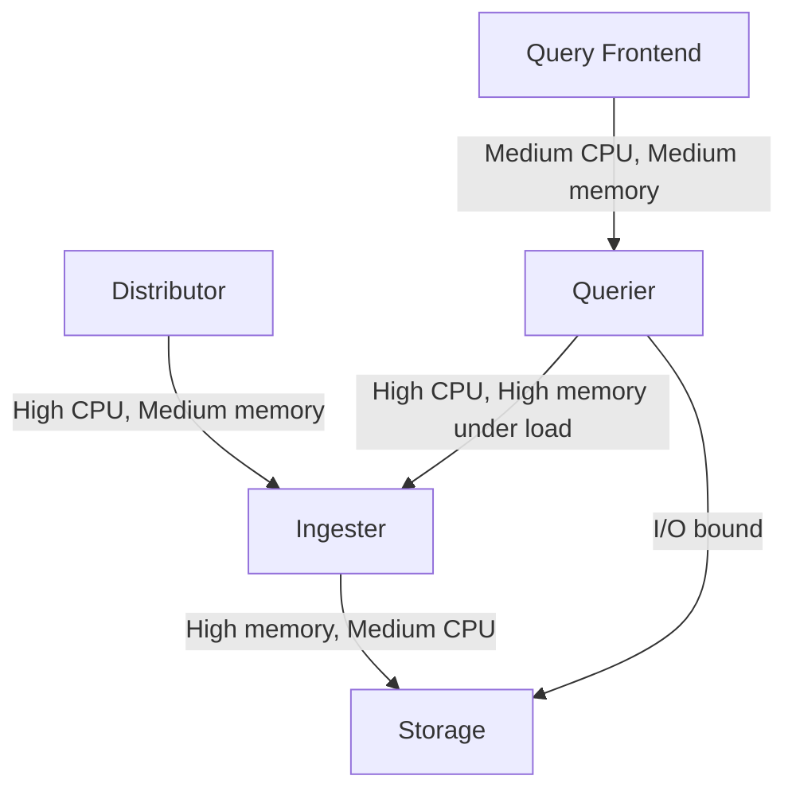

# Resource Allocation

## Introduction

Resource allocation is a critical aspect of performance tuning in Grafana Loki. As your logging system scales, proper allocation of computational resources (CPU, memory, storage) becomes essential for maintaining efficiency and reliability. This guide will help you understand how Loki consumes resources and how to allocate them effectively to achieve optimal performance without unnecessary costs.

## Why Resource Allocation Matters

Grafana Loki's distributed architecture means that different components have different resource needs. Improper resource allocation can lead to:

- Query timeouts and failures
- Log ingestion bottlenecks
- Increased operational costs
- System instability under load

Understanding how to properly size your Loki deployment can solve these issues and help you build a reliable logging system.

## Understanding Loki's Resource Consumption

Before diving into specific allocation strategies, let's understand how different Loki components consume resources:

### Key Components and Resource Patterns



- **Distributor**: CPU-intensive during high ingestion, modest memory requirements
- **Ingester**: Memory-intensive for buffering recent logs, moderate CPU usage
- **Querier**: CPU and memory intensive, especially for complex queries across large datasets
- **Query Frontend**: Moderate resource usage for query scheduling and splitting
- **Compactor**: Periodic high CPU and memory usage during compaction jobs

## Memory Allocation

Memory is particularly critical for Loki components. Here's how to approach memory allocation:

### Ingesters

Ingesters hold recent, unshipped chunks in memory, making them memory-hungry:

```yaml
limits_config:
  ingestion_rate_mb: 10
  ingestion_burst_size_mb: 20
  
ingester:
  chunk_idle_period: 1h
  max_chunk_age: 2h
  chunk_target_size: 1048576  # 1MB
  chunk_retain_period: 30s
  max_transfer_retries: 0
```

Memory usage formula for ingesters:

```
memory_required = (ingestion_rate_mb * max_chunk_age) + overhead
```

For example, with 10MB/s ingestion rate and 2-hour chunk age:
- 10MB/s * 7200s = 72GB raw ingestion
- Add ~30% overhead: ~94GB recommended memory allocation

### Queriers

Memory allocation for queriers depends on query complexity and concurrency:

```yaml
querier:
  max_concurrent_queries: 10
  query_timeout: 2m
  engine:
    timeout: 3m
    max_look_back_period: 12h
```

Start with a baseline of 2-4GB per concurrent query, then monitor and adjust based on query patterns.

## CPU Allocation

CPU allocation considerations for Loki components:

### Distributors

Distributors are often CPU-bound during high ingestion periods:

```yaml
distributor:
  ring:
    kvstore:
      store: memberlist
  receivers:
    otlp:
      protocols:
        http:
          endpoint: 0.0.0.0:3200
```

Allocate 2-4 CPU cores per distributor for moderate log volume, scaling up for higher ingestion rates.

### Query Path

The query path (Query Frontend and Queriers) benefits from multiple cores for parallel processing:

```yaml
query_frontend:
  # Allow splitting queries by time range
  split_queries_by_interval: 30m
  align_queries_with_step: true
  cache_results: true
  max_retries: 5
  parallelise_shardable_queries: true
```

Start with 4-8 cores for queriers handling complex queries or high query volumes.

## Practical Sizing Examples

Let's look at some real-world examples of resource allocation for different scales:

### Small Deployment (< 100GB logs/day)

```yaml
# Simplified configuration for small deployments
distributor:
  replicas: 2
  resources:
    requests:
      cpu: 2
      memory: 2Gi
    limits:
      cpu: 4
      memory: 4Gi

ingester:
  replicas: 3
  resources:
    requests:
      cpu: 2
      memory: 8Gi
    limits:
      cpu: 4
      memory: 12Gi

querier:
  replicas: 2
  resources:
    requests:
      cpu: 2
      memory: 4Gi
    limits:
      cpu: 4
      memory: 8Gi

query_frontend:
  replicas: 2
  resources:
    requests:
      cpu: 1
      memory: 2Gi
    limits:
      cpu: 2
      memory: 4Gi
```

### Medium Deployment (100GB - 1TB logs/day)

```yaml
# Medium-scale deployment recommendation
distributor:
  replicas: 3
  resources:
    requests:
      cpu: 4
      memory: 4Gi
    limits:
      cpu: 8
      memory: 8Gi

ingester:
  replicas: 6
  resources:
    requests:
      cpu: 4
      memory: 16Gi
    limits:
      cpu: 8
      memory: 24Gi

querier:
  replicas: 4
  resources:
    requests:
      cpu: 4
      memory: 8Gi
    limits:
      cpu: 8
      memory: 16Gi

query_frontend:
  replicas: 2
  resources:
    requests:
      cpu: 2
      memory: 4Gi
    limits:
      cpu: 4
      memory: 8Gi
```

### Large Deployment (> 1TB logs/day)

For larger deployments, consider:

- Horizontal scaling of components
- Dedicated nodes for ingesters and queriers
- Aggressive query splitting and parallelization
- Custom tuning based on query patterns

## Storage Considerations

Storage resource allocation is equally important:

### Object Storage

Configure storage limits to manage costs:

```yaml
limits_config:
  retention_period: 744h  # 31 days
  
compactor:
  retention_enabled: true
  retention_delete_delay: 2h
  retention_delete_worker_count: 150
```

### Index Storage

BoltDB-shipper index storage requirements:

```yaml
storage_config:
  boltdb_shipper:
    active_index_directory: /loki/index
    cache_location: /loki/boltdb-cache
    cache_ttl: 24h
    shared_store: s3
```

For large deployments, allocate sufficient disk space for active indexes:
- Small: 10-20GB
- Medium: 50-100GB
- Large: 200GB+

## Monitoring Resource Usage

Always implement monitoring to track actual resource usage:

```yaml
server:
  http_listen_port: 3100

# Export metrics for Prometheus
instrumentation:
  tracing:
    enabled: true
```

Key metrics to monitor:
- `loki_distributor_bytes_received_total`
- `loki_ingester_memory_chunks`
- `loki_ingester_memory_used_bytes`
- `loki_query_frontend_queries_total`
- `container_memory_usage_bytes` (for actual container memory)
- `container_cpu_usage_seconds_total` (for actual CPU usage)

## Dynamic Resource Allocation

For Kubernetes environments, consider implementing HPA (Horizontal Pod Autoscaler) for dynamic resource allocation:

```yaml
apiVersion: autoscaling/v2
kind: HorizontalPodAutoscaler
metadata:
  name: loki-distributor
spec:
  scaleTargetRef:
    apiVersion: apps/v1
    kind: Deployment
    name: loki-distributor
  minReplicas: 2
  maxReplicas: 10
  metrics:
  - type: Resource
    resource:
      name: cpu
      target:
        type: Utilization
        averageUtilization: 70
```

## Optimization Strategies

Beyond basic allocation, consider these strategies:

1. **Component Co-location**: For small to medium deployments, co-locate compatible components like Query Frontend and Querier to reduce network overhead

2. **Autoscaling**: Implement autoscaling based on load patterns:
   - Scale distributors based on ingestion rate
   - Scale queriers based on query load
   - Keep ingesters more stable to avoid data rebalancing

3. **Resource Limits vs Requests**: Set appropriate resource limits:
   - Set memory requests close to expected usage
   - Set memory limits ~1.5x to 2x the requests
   - Set CPU requests based on baseline load
   - Set CPU limits higher to handle spikes

4. **Shard by Tenant**: For multi-tenant environments, consider tenant-based sharding for better resource isolation

## Common Resource Allocation Pitfalls

1. **Undersized Ingesters**: Insufficient memory leads to OOM errors and data loss
2. **CPU Starvation**: Too few CPU cores for distributors causes backpressure and dropped logs
3. **Query Timeout**: Insufficient resources for queriers leads to query failures
4. **Ignoring Burst Capacity**: Not planning for traffic spikes causes system instability
5. **Excessive Over-provisioning**: Allocating too many resources increases costs unnecessarily

## Practical Exercise: Resource Planning

Let's work through a practical exercise for sizing a Loki deployment:

### Scenario:
- Daily log volume: 500GB
- Peak ingestion rate: 50MB/second
- Average query rate: 10 queries/minute
- Complex queries spanning 24 hours of data
- Retention period: 14 days

### Solution Approach:

1. **Distributor Sizing**:
   - Peak ingestion: 50MB/s
   - Recommended: 3 replicas with 4-8 cores each, 8GB memory

2. **Ingester Sizing**:
   - 50MB/s * 7200s (2h chunk age) = 360GB raw ingestion buffer
   - With 6 replicas: ~80GB memory per ingester (including overhead)

3. **Querier Sizing**:
   - 10 queries/minute with 24-hour span
   - 4 replicas with 8 cores and 16GB memory each

4. **Storage Sizing**:
   - 500GB * 14 days = 7TB total storage
   - Compression (typically 10x): ~700GB storage required
   - Index size: ~100GB

## Summary

Effective resource allocation is essential for a well-performing Grafana Loki deployment. Key takeaways:

- Different Loki components have different resource needs
- Memory is critical for ingesters, CPU for query processing
- Start with conservative estimates and monitor actual usage
- Scale horizontally for increased capacity
- Regular monitoring and adjustment is essential

By understanding the resource requirements of each component and implementing proper allocation strategies, you can ensure your Loki deployment performs optimally while maintaining cost efficiency.

## Additional Resources

- [Grafana Loki Documentation](https://grafana.com/docs/loki/latest/)
- [Loki Architecture](https://grafana.com/docs/loki/latest/fundamentals/architecture/)
- [Loki Best Practices](https://grafana.com/docs/loki/latest/best-practices/)

## Practice Exercises

1. Calculate the memory requirements for ingesters handling 20MB/s of log data with a 3-hour chunk age.
2. Design a resource allocation plan for a Loki deployment processing 200GB of logs per day with a 30-day retention period.
3. Create a monitoring dashboard for tracking Loki component resource usage and identifying bottlenecks.