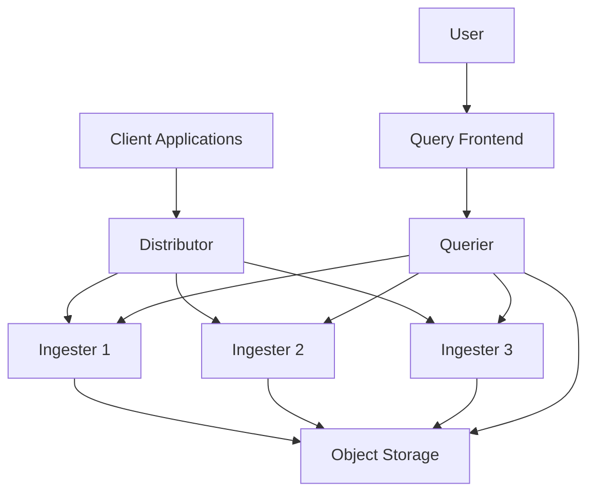

# Load Distribution in Grafana Loki

## Introduction

Load distribution is a critical aspect of performance tuning in Grafana Loki. As your logging system scales with increased log volume and query demands, properly distributing this load across your Loki infrastructure becomes essential. This guide will walk you through the concepts, strategies, and best practices for achieving optimal load distribution in your Grafana Loki deployment.

Load distribution in Loki refers to how log data, queries, and processing workloads are spread across different components and instances of your Loki deployment. Effective load distribution helps prevent bottlenecks, ensures high availability, and maximizes resource utilization.

## Why Load Distribution Matters

Before diving into implementation details, let's understand why load distribution is crucial for Loki:

1. **Scalability**: As log volumes grow, a single instance can quickly become overwhelmed
2. **Performance**: Distributing load helps maintain consistent query response times
3. **Reliability**: Prevents single points of failure in your logging infrastructure
4. **Cost Efficiency**: Optimizes resource utilization across your infrastructure

## Loki's Architecture and Load Distribution

Loki's microservices architecture is designed with load distribution in mind. Understanding how different components interact helps in planning effective load distribution strategies.



### Key Components for Load Distribution

- **Distributor**: Routes incoming logs to the appropriate ingesters
- **Ingesters**: Process and store log data temporarily before flushing to storage
- **Query Frontend**: Splits complex queries into smaller ones and distributes them
- **Queriers**: Execute queries against ingesters and storage

## Load Distribution Strategies

### 1. Horizontal Scaling

The most straightforward approach to load distribution is horizontally scaling Loki components.

```yaml
# Example docker-compose.yaml snippet showing multiple instances
services:
  loki-1:
    image: grafana/loki:latest
    # configuration
  
  loki-2:
    image: grafana/loki:latest
    # configuration
  
  load-balancer:
    image: nginx:latest
    # load balancer configuration
```

### 2. Sharding with a Hash Ring

Loki uses a hash ring to distribute load across ingesters. This ensures logs with the same labels always go to the same ingesters.

```yaml
# Example Loki configuration with ring settings
ingester:
  lifecycler:
    ring:
      kvstore:
        store: memberlist
      replication_factor: 3
```

### 3. Query Splitting and Parallelization

The Query Frontend component can split large queries into smaller ones and parallelize their execution.

```yaml
# Query frontend configuration
query_frontend:
  max_outstanding_per_tenant: 100
  split_queries_by_interval: 30m
  align_queries_with_step: true
  cache_results: true
```

## Practical Implementation Examples

Let's explore some practical examples of implementing load distribution in Loki.

### Example 1: Basic Load Balancing with NGINX

```nginx
# Example NGINX load balancer configuration
upstream loki_distributors {
  server loki-distributor-1:3100;
  server loki-distributor-2:3100;
  server loki-distributor-3:3100;
}

server {
  listen 80;
  
  location /loki/api/v1/push {
    proxy_pass http://loki_distributors;
    proxy_http_version 1.1;
  }
}
```

### Example 2: Scaling Ingesters Based on Load

```yaml
# Kubernetes HPA example for Loki ingesters
apiVersion: autoscaling/v2beta2
kind: HorizontalPodAutoscaler
metadata:
  name: loki-ingester
  namespace: logging
spec:
  scaleTargetRef:
    apiVersion: apps/v1
    kind: StatefulSet
    name: loki-ingester
  minReplicas: 3
  maxReplicas: 10
  metrics:
  - type: Resource
    resource:
      name: cpu
      target:
        type: Utilization
        averageUtilization: 70
```

### Example 3: Optimizing Query Distribution

```yaml
# Loki configuration for query distribution
query_frontend:
  parallelise_shardable_queries: true
  
query_scheduler:
  max_outstanding_requests_per_tenant: 100
  
querier:
  max_concurrent: 8
```

## Monitoring Load Distribution

Effective load distribution requires ongoing monitoring. Here are key metrics to watch:

1. **Ingester Write Throughput**: Monitor the rate of incoming logs per ingester
2. **Query Latency**: Track how long queries take to execute
3. **CPU and Memory Usage**: Watch for uneven resource utilization
4. **Queue Lengths**: Monitor request queues to detect bottlenecks

```yaml
# Example Grafana dashboard query for monitoring ingester load
sum(rate(loki_distributor_bytes_received_total[5m])) by (ingester)
```

## Common Load Distribution Challenges and Solutions

### Challenge 1: Hotspots in the Ring

**Problem:** Some ingesters receive disproportionately more data due to uneven label distribution.

**Solution:** Use tenant-based sharding and ensure diverse label values.

```yaml
# Configure more tokens in the hash ring for better distribution
ingester:
  lifecycler:
    ring:
      tokens_file_path: /etc/loki/tokens
      num_tokens: 512  # Increase from default
```

### Challenge 2: Query Timeouts

**Problem:** Complex queries spanning large time ranges time out.

**Solution:** Configure query splitting and increase querier resources.

```yaml
# Adjust query timeout and splitting settings
query_frontend:
  split_queries_by_interval: 1h
  max_retries: 5
  
querier:
  timeout: 2m
```

### Challenge 3: Uneven Write Distribution

**Problem:** Log writes aren't evenly distributed across ingesters.

**Solution:** Review your replication factor and token distribution.

```yaml
# Adjust replication factor for better distribution
ingester:
  lifecycler:
    ring:
      replication_factor: 3
```

## Best Practices for Load Distribution

1. **Start Simple, Scale as Needed**: Begin with a basic setup and scale components as you identify bottlenecks
2. **Monitor Everything**: Set up comprehensive monitoring of all Loki components
3. **Use Autoscaling**: Implement autoscaling rules based on CPU, memory, and queue metrics
4. **Optimize Log Volume**: Use label filtering and log level controls to reduce unnecessary log volume
5. **Consider Query Patterns**: Design your infrastructure based on your typical query patterns
6. **Separate Read and Write Paths**: Consider running dedicated instances for read and write operations

## Implementation Examples

Let's look at a more comprehensive example for a production environment:

```yaml
# Production-grade Loki configuration with load distribution focus
auth_enabled: true

server:
  http_listen_port: 3100

ingester:
  lifecycler:
    address: 127.0.0.1
    ring:
      kvstore:
        store: memberlist
      replication_factor: 3
    final_sleep: 0s
  chunk_idle_period: 5m
  chunk_retention_period: 30s
  max_transfer_retries: 0
  wal:
    enabled: true
    dir: /tmp/wal

storage_config:
  aws:
    bucketnames: loki-data
    region: us-west-2
  boltdb_shipper:
    active_index_directory: /tmp/loki/index
    cache_location: /tmp/loki/index_cache
    cache_ttl: 24h
    shared_store: s3

limits_config:
  enforce_metric_name: false
  reject_old_samples: true
  reject_old_samples_max_age: 168h
  max_query_parallelism: 32
  split_queries_by_interval: 15m
  cardinality_limit: 100000
  max_streams_per_user: 10000
  max_query_length: 721h

frontend:
  compress_responses: true
  log_queries_longer_than: 10s
  
query_range:
  parallelise_shardable_queries: true
  split_queries_by_interval: 30m
  align_queries_with_step: true
  cache_results: true
  results_cache:
    cache:
      enable_fifocache: true
      fifocache:
        size: 1024MB
        validity: 24h

frontend_worker:
  parallelism: 16
```

## Summary

Effective load distribution is essential for maintaining a high-performing Grafana Loki installation. By understanding Loki's architecture and implementing the right load distribution strategies, you can ensure your logging system scales with your needs while providing reliable and fast access to your log data.

Key takeaways:
- Use horizontal scaling to distribute load across multiple Loki components
- Configure the hash ring properly to ensure even distribution
- Implement query splitting for complex queries
- Monitor your system to identify and address bottlenecks
- Use autoscaling to handle varying workloads efficiently

## Further Learning and Exercises

### Exercise 1: Test Different Replication Factors

Experiment with different replication factors in your test environment and observe the impact on load distribution and query performance.

### Exercise 2: Query Performance Analysis

Compare query performance with and without query splitting enabled. Document the differences for various query complexities.

### Exercise 3: Load Testing

Set up a load testing scenario to identify bottlenecks in your Loki deployment and develop a scaling plan to address them.

### Resources

- [Grafana Loki Documentation](https://grafana.com/docs/loki/latest/)
- [Loki Architecture Documentation](https://grafana.com/docs/loki/latest/fundamentals/architecture/)
- [Scaling Loki](https://grafana.com/docs/loki/latest/fundamentals/architecture/deployment-modes/)