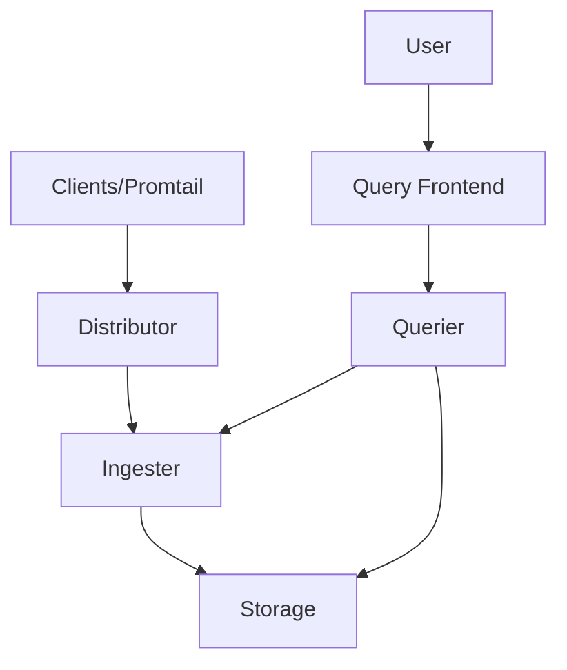

# Monitoring Loki Components

## Introduction

Monitoring the components of your Grafana Loki deployment is essential for maintaining a healthy and performant logging system. Loki, being a horizontally scalable log aggregation system, consists of several microservices that work together to provide efficient log storage and querying capabilities. By monitoring these components, you can detect issues early, optimize resource usage, and ensure your logging infrastructure remains reliable.

In this guide, we'll explore how to monitor different Loki components, what metrics to focus on, and how to set up effective dashboards and alerts to keep your logging stack running smoothly.

## Loki Architecture Overview

Before diving into monitoring specifics, let's briefly review Loki's architecture to understand what components we need to monitor:



The main components to monitor include:

- **Distributor**: Receives logs from clients like Promtail
- **Ingester**: Writes logs to long-term storage
- **Querier**: Handles queries from users
- **Query Frontend**: Optimizes and schedules queries
- **Compactor**: Optimizes storage by compacting data (not shown in diagram)
- **Storage**: Backend storage (object store and index)

Let's explore how to monitor each component effectively.

## Monitoring Distributor

The distributor is the entry point for logs in Loki and handles the distribution of incoming logs to ingesters.

### Key Metrics to Monitor

```yaml
# Distributor metrics to watch
- loki_distributor_received_samples_total: Total number of received log lines
- loki_distributor_bytes_received_total: Total bytes received
- loki_distributor_forward_errors_total: Errors when forwarding logs to ingesters
- loki_distributor_ingester_append_failures_total: Failures when appending to ingesters
```

### Practical Example: Tracking Distributor Load

To monitor distributor load, you can create a simple PromQL query:

```promql
sum(rate(loki_distributor_received_samples_total[5m])) by (tenant)
```

This query shows the rate of log lines received per tenant over 5-minute windows, helping you identify high-volume tenants that might be overloading your system.

## Monitoring Ingesters

Ingesters are responsible for writing log data to your storage backend and are critical to Loki's reliability.

### Key Metrics to Monitor

```yaml
# Ingester metrics to watch
- loki_ingester_chunks_stored: Number of chunks stored in the ingester
- loki_ingester_chunks_flushed_total: Total number of chunks flushed
- loki_ingester_flush_duration_seconds: Time taken to flush chunks
- loki_ingester_memory_chunks: Number of chunks in memory
- loki_ingester_memory_streams: Number of streams in memory
```

### Setting Up Ingester Memory Alerts

Ingesters primarily use memory to buffer logs before flushing to storage. Monitoring memory usage is crucial:

```promql
# Alert when ingesters are using more than 80% of their memory limit
sum(loki_ingester_memory_chunks) / 
  sum(kube_pod_container_resource_limits{container="ingester", resource="memory"}) > 0.8
```

## Monitoring Queriers

Queriers handle user requests to search and retrieve logs, making them essential for user experience.

### Key Performance Indicators

```yaml
# Querier metrics to track
- loki_querier_request_duration_seconds: Time taken to execute queries
- loki_querier_request_errors_total: Total count of query errors
- loki_querier_queries_total: Total number of queries
- loki_querier_chunk_store_index_entries_per_chunk: Index entries per chunk
```

### Query Performance Analysis

To identify slow queries:

```promql
histogram_quantile(0.95, sum(rate(loki_querier_request_duration_seconds_bucket[5m])) by (le, query_type))
```

This shows the 95th percentile query duration by query type, helping you identify which types of queries might need optimization.

## Monitoring Query Frontend

The query frontend splits large queries into smaller ones and queues them to protect your Loki deployment from overload.

### Key Metrics

```yaml
# Query frontend metrics
- loki_query_frontend_queries_total: Total queries received
- loki_query_frontend_queue_length: Current queue length
- loki_query_frontend_queue_duration_seconds: Time spent in queue
- loki_query_frontend_retries: Number of query retries
```

### Practical Example: Queue Health

To monitor queue saturation:

```promql
max(loki_query_frontend_queue_length) by (tenant)
```

This helps identify tenants whose queries might be backlogged, potentially affecting query performance.

## Monitoring Compactor

The compactor optimizes storage by compacting and deduplicating chunks, improving query performance over time.

### Important Metrics

```yaml
# Compactor metrics
- loki_compactor_runs_total: Total number of compaction runs
- loki_compactor_runs_failed_total: Number of failed compaction runs
- loki_compactor_garbage_collected_bytes_total: Bytes deleted during compaction
- loki_compactor_compacted_blocks_total: Number of compacted blocks
```

### Tracking Compaction Progress

```promql
rate(loki_compactor_compacted_blocks_total[1h])
```

This query shows the rate of block compaction, helping you verify that compaction is making progress.

## Monitoring Storage

Backend storage (both the object store and index) is critical for Loki's long-term reliability.

### Object Store Metrics

```yaml
# Object store metrics
- loki_boltdb_shipper_uploads_total: Number of index uploads
- loki_boltdb_shipper_upload_failures_total: Number of failed uploads
- loki_boltdb_shipper_download_duration_seconds: Time taken to download index files
```

### Index Store Health

```promql
sum(rate(loki_boltdb_shipper_upload_failures_total[5m])) / 
  sum(rate(loki_boltdb_shipper_uploads_total[5m])) > 0.01
```

This alert triggers when more than 1% of index uploads are failing, which could indicate storage connectivity issues.

## Creating a Comprehensive Loki Monitoring Dashboard

Let's put together a comprehensive dashboard for monitoring all Loki components:

### Dashboard Panels

1. **Overall Health**
   - Log ingestion rate
   - Query success rate
   - Error rates by component

2. **Distributor Performance**
   - Ingestion rate by tenant
   - Error rates
   - Request duration

3. **Ingester Health**
   - Memory usage
   - Chunk flush rates
   - Flush durations

4. **Query Performance**
   - Query latency by type
   - Queue length
   - Cache hit ratios

5. **Storage Health**
   - Upload/download success rates
   - Compaction progress
   - Storage growth rate

### Dashboard Configuration Example

Here's a simple example of how to configure Grafana JSON for a Loki monitoring dashboard:

```json
{
  "panels": [
    {
      "title": "Log Ingestion Rate",
      "datasource": "Prometheus",
      "targets": [
        {
          "expr": "sum(rate(loki_distributor_received_samples_total[5m]))",
          "legendFormat": "Lines/sec"
        }
      ],
      "type": "graph"
    },
    {
      "title": "Query Latency",
      "datasource": "Prometheus",
      "targets": [
        {
          "expr": "histogram_quantile(0.95, sum by(le) (rate(loki_querier_request_duration_seconds_bucket[5m])))",
          "legendFormat": "P95 Latency"
        }
      ],
      "type": "graph"
    }
  ]
}
```

## Setting Up Critical Alerts

Based on our monitoring metrics, here are some essential alerts to configure:

### HighIngestionErrors

```yaml
alert: HighIngestionErrors
expr: sum(rate(loki_distributor_ingester_append_failures_total[5m])) / sum(rate(loki_distributor_received_samples_total[5m])) > 0.01
for: 5m
labels:
  severity: critical
annotations:
  summary: "High ingestion error rate"
  description: "More than 1% of log lines are failing to be ingested over the last 5 minutes."
```

### IngestersNearMemoryLimit

```yaml
alert: IngestersNearMemoryLimit
expr: avg(loki_ingester_memory_chunks / loki_ingester_memory_chunks_capacity) > 0.8
for: 15m
labels:
  severity: warning
annotations:
  summary: "Ingesters approaching memory limit"
  description: "Ingesters are using more than 80% of their memory capacity for 15 minutes."
```

### SlowQueries

```yaml
alert: SlowQueries
expr: histogram_quantile(0.95, sum by(le) (rate(loki_querier_request_duration_seconds_bucket{route="/loki/api/v1/query_range"}[5m]))) > 10
for: 10m
labels:
  severity: warning
annotations:
  summary: "Slow Loki queries detected"
  description: "95th percentile query latency is above 10 seconds for the last 10 minutes."
```

## Best Practices for Monitoring Loki

1. **Monitor All Components**: Don't focus solely on one component; monitor the entire pipeline.

2. **Set Up SLOs**: Define Service Level Objectives for key metrics like ingestion rate and query performance.

3. **Resource Monitoring**: Track CPU and memory usage alongside Loki-specific metrics.

4. **Regular Dashboard Reviews**: Periodically review your dashboards to ensure they still capture the most relevant metrics.

5. **Log Loki's Logs**: Use Loki to monitor itself by collecting and analyzing its own logs.

## Troubleshooting Common Issues

### High Ingestion Latency

If you observe high ingestion latency:

1. Check distributor load and error rates
2. Verify ingester memory usage
3. Inspect network connectivity between components
4. Consider scaling horizontally by adding more distributors

### Slow Query Performance

For slow queries:

1. Analyze query patterns with high latency
2. Check cache hit rates
3. Verify index and chunk cache configurations
4. Consider optimizing label cardinality

### Storage Issues

If experiencing storage problems:

1. Verify connectivity to object store
2. Check compactor logs for errors
3. Monitor index upload/download failures
4. Ensure sufficient storage capacity

## Summary

Effective monitoring of Loki components is essential for maintaining a reliable logging infrastructure. By tracking key metrics across distributors, ingesters, queriers, and storage components, you can ensure optimal performance, identify bottlenecks early, and maintain a healthy logging system.

Remember that monitoring should be proactive, not reactive. Set up comprehensive dashboards and alerts that provide visibility into all components of your Loki deployment. Regularly review and refine your monitoring strategy as your logging needs evolve.

## Additional Resources

- Explore the official Grafana Loki documentation for more detailed metrics information
- Practice setting up a test Loki environment and experimenting with different load patterns to understand how metrics respond
- Try creating custom dashboards that combine infrastructure metrics with Loki component metrics for a holistic view

## Exercise

1. Set up a local Loki instance and configure Prometheus to scrape its metrics
2. Create a Grafana dashboard showing key metrics for each Loki component
3. Simulate high log volume and observe how the metrics change
4. Write alert rules for three critical conditions that would require immediate attention