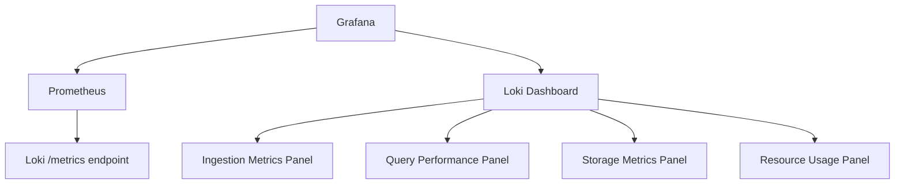

# Loki Metrics

## Introduction

Loki, like any system, needs to be monitored to ensure it's performing optimally. Metrics provide insights into Loki's health, performance, and resource usage. In this guide, we'll explore the various metrics exposed by Loki, how to collect them, visualize them in Grafana, and set up meaningful alerts to proactively identify issues before they impact your system.

## Understanding Loki Metrics

Loki exposes a variety of metrics in Prometheus format, making it easy to integrate with Prometheus for collection and Grafana for visualization. These metrics are crucial for understanding how Loki is performing, identifying bottlenecks, and ensuring the reliability of your log management system.

### Types of Loki Metrics

Loki metrics can be broadly categorized into several groups:

1. **Component Metrics**: Specific to individual Loki components (Distributor, Ingester, Querier, etc.)
2. **Request Metrics**: Related to HTTP requests processing
3. **Operational Metrics**: Covering memory usage, CPU, goroutines, etc.
4. **Storage Metrics**: Tracking storage operations and performance
5. **Query Performance Metrics**: Measuring query execution times and resource usage

## Collecting Loki Metrics

Loki exposes metrics via an HTTP endpoint (by default at `/metrics`). Here's how to configure Prometheus to scrape these metrics:

```yaml
scrape_configs:
  - job_name: loki
    static_configs:
      - targets: ['loki:3100']
```

When using Loki in microservices mode, you'll need to scrape metrics from each component:

```yaml
scrape_configs:
  - job_name: loki-distributor
    static_configs:
      - targets: ['loki-distributor:3100']
  - job_name: loki-ingester
    static_configs:
      - targets: ['loki-ingester:3100']
  - job_name: loki-querier
    static_configs:
      - targets: ['loki-querier:3100']
  # Add more components as needed
```

## Key Loki Metrics to Monitor

### Ingestion Metrics

These metrics help you understand how efficiently Loki is ingesting logs:

- `loki_distributor_bytes_received_total`: Total bytes received per tenant
- `loki_distributor_lines_received_total`: Total lines received per tenant
- `loki_ingester_chunks_created_total`: Number of chunks created in the ingester
- `loki_ingester_chunks_stored_total`: Total chunks stored in the ingester

#### Example Dashboard Query

```promql
sum(rate(loki_distributor_lines_received_total[5m])) by (tenant)
```

This shows the rate of log lines being ingested per tenant over a 5-minute window.

### Query Performance Metrics

These metrics help you understand query performance:

- `loki_querier_request_duration_seconds`: Time spent processing query requests
- `loki_querier_query_seconds`: Time spent executing queries
- `loki_querier_chunk_fetch_duration_seconds`: Time spent fetching chunks

#### Example Dashboard Query

```promql
histogram_quantile(0.99, sum(rate(loki_querier_request_duration_seconds_bucket[5m])) by (le, method))
```

This shows the 99th percentile query latency, broken down by request method.

### Storage Metrics

Storage metrics help you understand how Loki interacts with its backend storage:

- `loki_chunk_store_index_entries_per_chunk`: Number of index entries per chunk
- `loki_chunk_operations_total`: Total number of chunk operations by operation type
- `loki_chunk_store_chunk_downloads_total`: Total number of chunk downloads

### Resource Usage Metrics

These metrics help you understand resource consumption:

- `go_memstats_alloc_bytes`: Current memory usage
- `process_cpu_seconds_total`: Total user and system CPU time spent
- `process_resident_memory_bytes`: Resident memory size

## Creating a Loki Metrics Dashboard

Let's create a simple Grafana dashboard to monitor key Loki metrics:



### Sample Dashboard JSON

Here's a starter configuration for a Loki metrics dashboard (simplified):

```json
{
  "title": "Loki Monitoring Dashboard",
  "panels": [
    {
      "title": "Log Lines Ingested",
      "type": "graph",
      "targets": [
        {
          "expr": "sum(rate(loki_distributor_lines_received_total[5m])) by (tenant)",
          "legendFormat": "{{tenant}}"
        }
      ]
    },
    {
      "title": "Query Latency (99th Percentile)",
      "type": "graph",
      "targets": [
        {
          "expr": "histogram_quantile(0.99, sum(rate(loki_querier_request_duration_seconds_bucket[5m])) by (le, method))",
          "legendFormat": "{{method}}"
        }
      ]
    },
    {
      "title": "Memory Usage",
      "type": "graph",
      "targets": [
        {
          "expr": "process_resident_memory_bytes{job=~\"loki.*\"}",
          "legendFormat": "{{job}}"
        }
      ]
    }
  ]
}
```

## Setting Up Alerts for Loki Metrics

Alerting is crucial for proactive monitoring. Here are some essential alerts you should consider:

### Ingestion Failures Alert

```yaml
groups:
  - name: loki_alerts
    rules:
      - alert: LokiIngestionErrors
        expr: |
          sum(rate(loki_distributor_ingestion_failures_total[5m])) by (tenant) > 0
        for: 5m
        labels:
          severity: warning
        annotations:
          summary: "Loki ingestion errors detected"
          description: "Tenant {{ $labels.tenant }} is experiencing ingestion errors."
```

### High Query Latency Alert

```yaml
- alert: LokiSlowQueries
  expr: |
    histogram_quantile(0.99, sum(rate(loki_querier_request_duration_seconds_bucket{route="/loki/api/v1/query_range"}[5m])) by (le)) > 10
  for: 15m
  labels:
    severity: warning
  annotations:
    summary: "Loki queries are slow"
    description: "99th percentile query latency is above 10 seconds for the last 15 minutes."
```

### High Memory Usage Alert

```yaml
- alert: LokiHighMemoryUsage
  expr: |
    (process_resident_memory_bytes{job=~"loki.*"} / on(instance) node_memory_MemTotal_bytes * 100) > 80
  for: 15m
  labels:
    severity: warning
  annotations:
    summary: "Loki high memory usage"
    description: "Loki component {{ $labels.job }} on {{ $labels.instance }} is using more than 80% of available memory."
```

## Practical Example: Troubleshooting with Loki Metrics

Let's walk through a real-world example of using Loki metrics to troubleshoot a performance issue:

**Scenario**: Users report that log queries are slow during peak hours.

**Diagnosis Steps**:

1. Check query latency metrics:
   ```promql
   histogram_quantile(0.99, sum(rate(loki_querier_request_duration_seconds_bucket[5m])) by (le))
   ```

2. Identify if the issue is with query processing or chunk retrieval:
   ```promql
   histogram_quantile(0.99, sum(rate(loki_querier_chunk_fetch_duration_seconds_bucket[5m])) by (le))
   ```

3. Check for resource constraints:
   ```promql
   process_resident_memory_bytes{job="loki-querier"}
   ```

4. Examine the volume of chunks being processed:
   ```promql
   sum(rate(loki_chunk_store_chunks_downloaded_total[5m]))
   ```

**Resolution**: After analyzing the metrics, we discovered that the query latency spikes correlated with high chunk retrieval times. Increasing the querier cache size and adjusting the query split factor improved performance.

## Custom Metrics for Loki Monitoring

You can create custom metrics using recording rules to get more specific insights:

```yaml
groups:
  - name: loki_custom_metrics
    rules:
      - record: loki:ingestion_rate:tenant
        expr: sum(rate(loki_distributor_lines_received_total[5m])) by (tenant)
      
      - record: loki:query_latency_99p
        expr: histogram_quantile(0.99, sum(rate(loki_querier_request_duration_seconds_bucket[5m])) by (le, method))
```

## Best Practices for Loki Metrics

1. **Focus on the Key Metrics**: Start with the most critical metrics like ingestion rate, query latency, and error rates.

2. **Set Appropriate Thresholds**: Alert thresholds should be based on your system's normal behavior and acceptable performance levels.

3. **Use Recording Rules**: Create recording rules for complex queries to improve dashboard performance.

4. **Correlate Metrics with Logs**: When troubleshooting, correlate metrics with logs from Loki itself to get a complete picture.

5. **Monitor All Components**: In a microservices setup, monitor all components individually (distributors, ingesters, queriers, etc.).

6. **Track Trends Over Time**: Don't just look at current values; track how metrics change over time to identify gradual degradations.

## Summary

Monitoring Loki metrics is essential for maintaining a healthy and efficient log management system. By collecting, visualizing, and alerting on key metrics, you can:

- Ensure optimal performance of your Loki deployment
- Proactively identify and resolve issues
- Make informed decisions about scaling and optimization
- Provide a reliable logging experience for your users

The metrics exposed by Loki offer deep insights into every aspect of its operation, from ingestion to querying to storage. By leveraging these metrics with Prometheus and Grafana, you can build comprehensive monitoring and alerting systems that keep your Loki deployment running smoothly.

## Additional Resources

- [Grafana Loki Documentation](https://grafana.com/docs/loki/latest/operations/observability/)
- [Prometheus Query Language (PromQL) Basics](https://prometheus.io/docs/prometheus/latest/querying/basics/)
- [Grafana Alerting Documentation](https://grafana.com/docs/grafana/latest/alerting/)

## Exercises

1. Set up a Prometheus instance to scrape metrics from your Loki deployment.
2. Create a basic Grafana dashboard showing ingestion rate, query latency, and memory usage.
3. Configure an alert that triggers when query latency exceeds a threshold you define.
4. Use PromQL to identify the tenant with the highest log ingestion rate in your system.
5. Create a recording rule that calculates the ratio of successful queries to total queries.