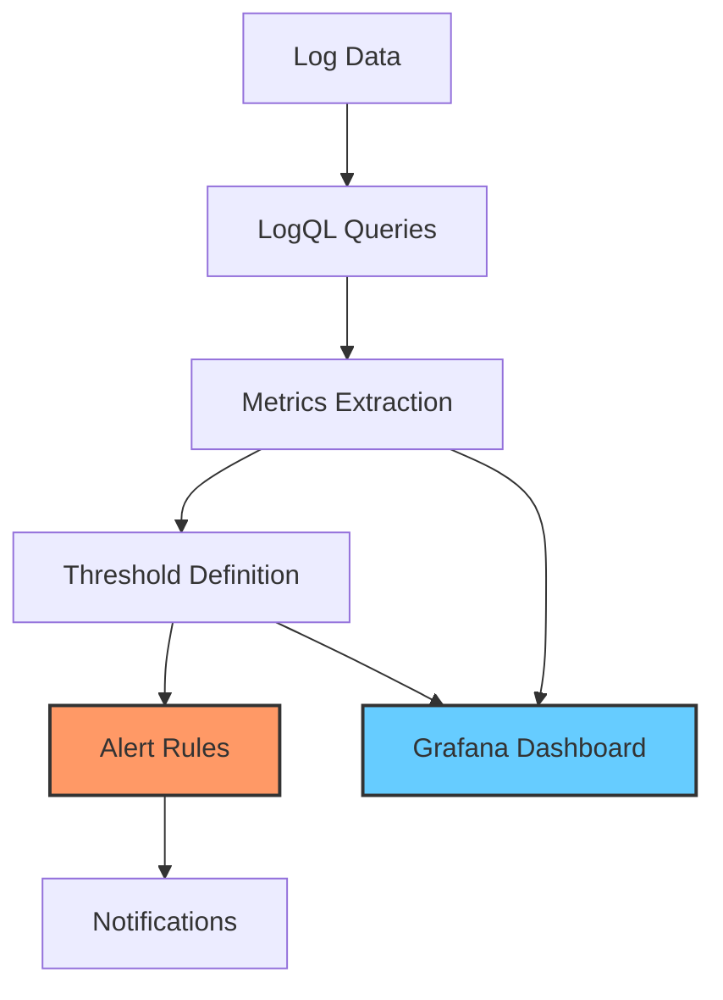

# Common Alert Patterns

## Introduction

Alert patterns are standardized approaches to detecting problems in your systems using log data. In the context of Grafana Loki, these patterns help you transform raw log data into meaningful notifications that can alert you to issues before they impact your users.

This guide explores common alert patterns when using Grafana Loki for log monitoring. You'll learn how to design effective alerts that strike the right balance between providing timely information about genuine problems while avoiding alert fatigue from false positives.

## Why Alert Patterns Matter

Before diving into specific patterns, it's important to understand why well-designed alerts are crucial:

- **Reduce noise**: Too many alerts lead to alert fatigue and ignored notifications
- **Focus on actionable information**: Alerts should indicate problems that require human intervention
- **Provide context**: Good alerts include enough information to understand and begin addressing the issue
- **Early warning**: Detect problems before they affect end users

## Common Alert Patterns in Loki

### 1. Threshold-Based Alerts

The most basic alert pattern is triggering notifications when a metric exceeds a predefined threshold. In Loki, this often means alerting when the rate of specific log entries crosses a certain level.

#### Example: Error Rate Alert

```promql
sum(rate({app="payment-service"} |= "error" [5m])) > 0.5
```

This alert triggers when the payment service logs more than 0.5 errors per second over a 5-minute window.

#### Implementation Steps:

1. Identify the log pattern that indicates an error condition
2. Determine an appropriate threshold based on historical data
3. Set a suitable evaluation interval and duration
4. Add contextual information to the alert message

#### Real-world Application:

For a production e-commerce application, you might set different thresholds for different services:

```promql
sum by(service) (rate({env="production", app=~"ecommerce-.*"} |= "ERROR" [5m])) > 0.2
```

This alerts you when any e-commerce service exceeds 0.2 errors per second, with the specific service identified in the alert.

### 2. Absence Alerts

Sometimes, the absence of expected log entries is more concerning than their presence. Absence alerts trigger when expected log patterns don't appear.

#### Example: Heartbeat Missing Alert

```promql
absent(rate({app="batch-processor", message=~"Processing completed successfully"} [30m])) == 1
```

This alert triggers if the batch processor doesn't log a successful completion message in a 30-minute window.

#### Implementation Steps:

1. Identify log messages that should appear regularly
2. Determine the maximum acceptable period of absence
3. Use the `absent()` function in your alerting rule
4. Include context about when the service last reported correctly

#### Real-world Application:

For a scheduled backup system:

```promql
absent(rate({job="database-backup", message=~"Backup completed"} [25h])) == 1
```

This alerts if no successful backup completion message appears in a 25-hour window, suggesting the daily backup might have failed.

### 3. Sudden Change Alerts

Detecting sudden changes in log patterns can identify issues before they become critical failures.

#### Example: Latency Spike Alert

```promql
sum(rate({app="api-gateway"} | json | unwrap response_time_ms [5m])) 
  > 
sum(rate({app="api-gateway"} | json | unwrap response_time_ms [5m] offset 5m)) * 2
```

This alert triggers when the current API response time is more than twice what it was 5 minutes ago.

#### Implementation Steps:

1. Identify metrics that should remain relatively stable
2. Compare current values to historical values using offset
3. Set appropriate thresholds for acceptable change
4. Include both current and historical values in alert context

#### Real-world Application:

For monitoring database query performance:

```promql
avg(rate({app="database", component="query"} | json | unwrap query_time_ms [10m])) 
  > 
avg(rate({app="database", component="query"} | json | unwrap query_time_ms [1h] offset 1h)) * 1.5
```

This alerts when average query times increase by more than 50% compared to the same time yesterday.

### 4. Correlation Alerts

Correlation alerts detect relationships between different log patterns, identifying issues that might not be visible when looking at individual metrics.

#### Example: Failed Login Spike Alert

```promql
sum(rate({app="auth-service", action="login", status="failed"} [5m])) 
  > 
sum(rate({app="auth-service", action="login", status="success"} [5m])) * 0.5
```

This alert triggers when failed logins exceed 50% of successful logins, which might indicate a brute force attack.

#### Implementation Steps:

1. Identify related log patterns to compare
2. Establish normal relationships between metrics
3. Define alert conditions based on abnormal relationships
4. Include both metrics in alert context

#### Real-world Application:

For an e-commerce checkout flow:

```promql
sum(rate({service="checkout", stage="payment_submitted"} [15m])) 
  > 
sum(rate({service="checkout", stage="payment_confirmed"} [15m])) * 3
```

This alerts when the rate of submitted payments is three times higher than confirmed payments, suggesting payment processing issues.

### 5. Pattern Anomaly Alerts

These alerts identify unusual patterns in log data that may indicate security issues or system problems.

#### Example: Unusual Access Pattern Alert

```promql
sum by(user_agent) (count_over_time({service="api-gateway"} | pattern `<ip> - - [<timestamp>] "<method> <path> <protocol>" <status> <bytes> "<referer>" "<user_agent>"` | status=~"4.." [5m])) > 100
```

This alert triggers when any user agent makes more than 100 requests resulting in 4xx status codes within 5 minutes.

#### Implementation Steps:

1. Identify normal log patterns for your application
2. Use pattern parsing to extract structured data
3. Set thresholds for unusual activity
4. Group by relevant dimensions (IP, user agent, etc.)

#### Real-world Application:

For detecting potential security issues:

```promql
sum by(src_ip) (count_over_time({service="ssh", message=~"Failed password"} [10m])) > 20
```

This alerts when any IP address has more than 20 failed SSH login attempts in 10 minutes, potentially indicating a brute force attack.

## Alert Design Best Practices

### 1. Use Labels for Context

Include relevant labels in your alerts to provide context for troubleshooting:

```promql
sum by(service, endpoint) (rate({env="production"} |= "error" [5m])) > 0.2
```

This groups errors by both service and endpoint, helping pinpoint exactly where issues are occurring.

### 2. Avoid Alert Storms

Group related alerts to prevent notification flooding:

```promql
sum by(service) (rate({env="production"} |= "error" [5m])) > 0.2
```

This generates one alert per service rather than per instance or endpoint.

### 3. Set Appropriate Evaluation Intervals

Balance between early detection and avoiding false alarms:

```promql
sum(rate({app="payment-service"} |= "error" [5m])) > 0.5 for 10m
```

This requires the error rate to exceed the threshold for a full 10 minutes before alerting, reducing false positives from brief spikes.

### 4. Include Runbook Links

Add links to troubleshooting documentation in your alert definitions:

```yaml
annotations:
  summary: "High error rate in {{ $labels.service }}"
  description: "Error rate is {{ $value }} per second, exceeding threshold of 0.5"
  runbook_url: "https://your-wiki.example/runbooks/high-error-rate"
```

### 5. Implement Alert Severity Levels

Use different thresholds for warning and critical alerts:

```promql
# Warning alert
sum(rate({app="payment-service"} |= "error" [5m])) > 0.2

# Critical alert
sum(rate({app="payment-service"} |= "error" [5m])) > 0.5
```

## Visualizing Alert Patterns

Alert patterns can be visualized in Grafana dashboards to help understand system behavior:



## Implementing Alerts in Loki

Let's walk through implementing a practical alert pattern in Grafana Loki:

### Step 1: Create a LogQL Query

First, develop a LogQL query that identifies the condition you want to alert on:

```promql
sum by(namespace, app) (
  rate({namespace="production", app=~"web-.*"} |= "ERROR" | json | response_time > 1000 [5m])
)
```

This query counts logs containing "ERROR" and with response times greater than 1000ms.

### Step 2: Test in Explore View

Before creating an alert, test your query in Grafana's Explore view to ensure it returns the expected results and understand typical values.

### Step 3: Create Alert Rule

In Grafana:
1. Navigate to "Alerting" -> "Alert Rules" -> "New alert rule"
2. Configure:
   - Rule name: "High error rate with slow response"
   - Evaluation interval: 1m
   - Condition: > 0.2 for 5m
   - Labels: severity="warning", team="platform"
   - Annotations: 
     - Summary: "High error rate with slow responses in `{{$labels.app}}`"
     - Description: "Application `{{$labels.app}}` in namespace `{{$labels.namespace}}` is experiencing `{{$value | printf "%.2f"}}` errors per second with response times `>1000ms`"

### Step 4: Configure Notifications

Set up appropriate notification channels in Grafana (Slack, email, PagerDuty, etc.) and route alerts based on labels.

## Common Pitfalls and How to Avoid Them

### 1. Too Sensitive Thresholds

**Problem**: Alerts trigger too frequently for minor issues.

**Solution**: Analyze historical data to set realistic thresholds and use longer evaluation windows.

```promql
# Better approach with historical context
sum(rate({app="api"} |= "error" [5m])) > 
  (avg_over_time(sum(rate({app="api"} |= "error" [5m])) [7d]) * 3)
```

This alerts only when error rates exceed three times the 7-day average.

### 2. Too Many Alerts

**Problem**: Teams receive too many alerts and begin ignoring them.

**Solution**: Consolidate related alerts and implement proper severity levels.

```yaml
groups:
  - name: api-alerts
    rules:
      - alert: ApiHighErrorRate
        expr: sum by(service) (rate({app="api"} |= "error" [5m])) > 0.5
        for: 5m
        labels:
          severity: critical
          team: api
        annotations:
          summary: "High error rate in {{ $labels.service }}"
```

### 3. Missing Context

**Problem**: Alerts don't provide enough information to diagnose issues.

**Solution**: Include relevant labels, values, and query links in alert descriptions.

```yaml
annotations:
  summary: "High 5xx error rate in {{ $labels.service }}"
  description: "Service {{ $labels.service }} has {{ $value | printf \"%.2f\" }} 5xx errors per second. View logs: https://grafana.example.com/explore?orgId=1&left=%5B%22now-1h%22,%22now%22,%22Loki%22,%7B%22expr%22:%22%7Bservice%3D%5C%22{{ $labels.service }}%5C%22%7D%20%7C%3D%20%5C%22error%5C%22%22%7D%5D"
```

## Summary

Effective alert patterns in Grafana Loki help transform raw log data into actionable insights. By implementing threshold-based alerts, absence alerts, sudden change alerts, correlation alerts, and pattern anomaly alerts, you can build a comprehensive monitoring system that detects issues early while minimizing false positives.

Remember to follow best practices:
- Include context in alerts with appropriate labels
- Group related alerts to avoid alert storms
- Set appropriate evaluation intervals
- Link to runbooks for faster resolution
- Implement severity levels to prioritize responses

By applying these patterns and best practices, you'll create a more effective alerting system that helps maintain system reliability without overwhelming your team.

## Additional Resources

- [Grafana Loki Official Documentation](https://grafana.com/docs/loki/latest/)
- [LogQL Query Language Reference](https://grafana.com/docs/loki/latest/logql/)
- [Grafana Alerting Documentation](https://grafana.com/docs/grafana/latest/alerting/)

## Exercises

1. Create a threshold-based alert for HTTP 500 errors in a web application
2. Implement an absence alert for a daily batch job
3. Design a correlation alert comparing failed payments to successful orders
4. Develop a pattern anomaly alert for unusual login activity
5. Set up a multi-level alert with warning and critical thresholds for API response times