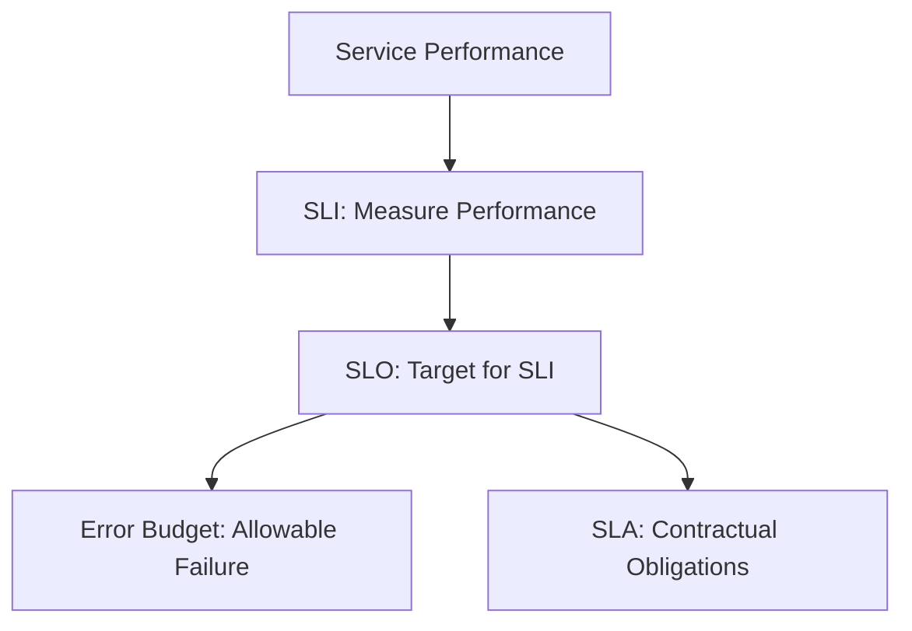

# SLO Monitoring

## Introduction

Service Level Objectives (SLOs) form the backbone of reliable systems by providing measurable targets for service performance. In this guide, we'll explore how to implement SLO monitoring with Grafana Loki, transforming your logs into actionable reliability metrics.

SLOs are derived from Service Level Indicators (SLIs), which are quantitative measures of service performance, and they help teams ensure they're meeting user expectations while providing a buffer before violating Service Level Agreements (SLAs) with customers.

## Understanding the SLO Framework

Before diving into implementation, let's clarify some key terminology:

- **SLI (Service Level Indicator)**: A quantitative measure of service performance (e.g., request latency, error rate, system throughput)
- **SLO (Service Level Objective)**: A target value or range for an SLI (e.g., 99.9% availability)
- **SLA (Service Level Agreement)**: A contract with users that includes consequences of meeting or missing SLOs
- **Error Budget**: The allowed amount of error or downtime before breaching an SLO

### The Relationship Between These Components



## Setting Up SLO Monitoring with Grafana Loki

### Step 1: Define Your SLIs

First, identify which metrics from your logs are important to track. Common SLIs include:

- **Availability**: Percentage of successful requests
- **Latency**: Response time for requests
- **Error Rate**: Percentage of error responses
- **Throughput**: Number of requests per second

### Step 2: Configure LogQL Queries for SLIs

Let's create LogQL queries to extract SLIs from your logs.

**Example: Measuring Availability**

```
sum(rate({app="myapp"} |= "status=2" [5m])) 
/ 
sum(rate({app="myapp"} |~ "status=\\d+" [5m]))
```

This query calculates the ratio of successful requests (status 2xx) to total requests.

**Example: Measuring Error Rate**

```
sum(rate({app="myapp"} |= "status=5" [5m])) 
/ 
sum(rate({app="myapp"} |~ "status=\\d+" [5m]))
```

This calculates the percentage of 5xx errors among all requests.

### Step 3: Create SLO Dashboards

Use Grafana to visualize your SLOs with appropriate thresholds.

```
# LogQL query for a Grafana panel
sum(rate({app="myapp"} |= "status=2" [5m])) 
/ 
sum(rate({app="myapp"} |~ "status=\\d+" [5m])) * 100
```

### Step 4: Implement Error Budgets

Error budgets determine how much reliability you can "spend" on new features or technical debt.

**Error Budget Calculation Example:**

If your SLO is 99.9% availability over 30 days, your error budget is:

```
30 days × 24 hours × 60 minutes × 0.001 = 43.2 minutes
```

This means you can afford 43.2 minutes of downtime per month without violating your SLO.

## Real-World SLO Implementation with Loki

### Case Study: API Availability Monitoring

Let's implement an SLO for an API service that requires 99.95% availability.

1. **Configure the LogQL Query to Track 2xx vs. Non-2xx Responses**

```
{app="api-gateway"} | json | status >= 200 and status < 300
```

2. **Create a Grafana Dashboard Panel**

```
# Availability percentage
sum(rate({app="api-gateway"} | json | status >= 200 and status < 300 [1h])) 
/ 
sum(rate({app="api-gateway"} | json [1h])) * 100
```

3. **Set Up Threshold Visualizations**

Configure thresholds on your Grafana panel:
- Green: > 99.95% (Meeting SLO)
- Yellow: 99.9-99.95% (Warning zone)
- Red: < 99.9% (Critical - SLO violation)

4. **Implement Alerting**

```
# Alert rule in Grafana
sum(rate({app="api-gateway"} | json | status >= 200 and status < 300 [1h])) 
/ 
sum(rate({app="api-gateway"} | json [1h])) * 100 < 99.9
```

This will trigger an alert when availability drops below 99.9%, giving your team time to act before breaching the 99.95% SLO.

## Multi-Window, Multi-Burn Rate Alerts

For more sophisticated SLO monitoring, implement multi-window, multi-burn rate alerts that trigger based on both short-term acute problems and longer-term gradual degradation.

```
# Short window (1 hour) - Catches acute problems
sum(rate({app="myapp"} |= "status=2" [1h])) 
/ 
sum(rate({app="myapp"} |~ "status=\\d+" [1h])) * 100 < 99.5

# Long window (24 hours) - Catches gradual degradation
sum(rate({app="myapp"} |= "status=2" [24h])) 
/ 
sum(rate({app="myapp"} |~ "status=\\d+" [24h])) * 100 < 99.9
```

## SLO Monitoring for Custom Application Metrics

You can extend SLO monitoring beyond standard metrics by parsing custom log fields.

**Example: Monitoring Authentication Success Rate**

```
sum(rate({app="auth-service"} | json | result="success" [5m])) 
/ 
sum(rate({app="auth-service"} | json [5m])) * 100 > 99.5
```

## Integrating SLOs into Your Development Workflow

To make SLOs truly effective:

1. **Make SLOs visible to all teams**
2. **Review error budgets during sprint planning**
3. **Include SLO impact in feature development discussions**
4. **Automate deployment rollbacks when SLOs are at risk**

### Example: Automated Canary Analysis

```
# LogQL query to compare error rates between canary and stable
sum(rate({app="myapp", deployment="canary"} |= "status=5" [5m])) 
/ 
sum(rate({app="myapp", deployment="canary"} |~ "status=\\d+" [5m]))

compared to

sum(rate({app="myapp", deployment="stable"} |= "status=5" [5m])) 
/ 
sum(rate({app="myapp", deployment="stable"} |~ "status=\\d+" [5m]))
```

## Best Practices for SLO Implementation

1. **Start Simple**: Begin with 2-3 key SLOs rather than trying to measure everything
2. **Make SLOs Customer-Focused**: Measure what impacts users, not just what's easy to monitor
3. **Set Realistic Targets**: 100% availability is neither realistic nor necessary
4. **Review and Revise**: SLOs should evolve as your system and user needs change
5. **Use SLOs to Drive Action**: Error budgets should inform engineering priorities

## Troubleshooting SLO Issues

When you detect an SLO breach or near-breach, follow these steps:

1. **Identify the specific SLI that's failing**
2. **Use LogQL to drill down into the affected components**
3. **Correlate with other metrics and logs**
4. **Determine if the issue is systemic or transient**

Example troubleshooting query:

```
{app="myapp"} 
| json 
| status >= 500 
| unwrap latency 
| by (endpoint)
```

This helps identify which endpoints are experiencing errors and their associated latencies.

## Summary

SLO monitoring is essential for maintaining reliable systems that meet user expectations. By implementing SLOs with Grafana Loki, you can:

- Quantify service reliability through clear, measurable objectives
- Balance innovation speed with stability using error budgets
- Identify and address issues before they impact users
- Make data-driven decisions about technical debt and feature development

Remember that effective SLOs are customer-focused, realistic, and actionable. Start with the metrics that matter most to your users, set achievable targets, and use the resulting insights to continuously improve your service.

## Practice Exercises

1. Define three SLIs for a service you're familiar with
2. Create LogQL queries to extract these SLIs from your logs
3. Set up a Grafana dashboard visualizing your SLOs
4. Calculate appropriate error budgets for each SLO
5. Implement a multi-window alert for one of your SLOs

## Further Resources

- [Google SRE Book - Chapter on SLOs](https://sre.google/sre-book/service-level-objectives/)
- [Grafana Loki Documentation](https://grafana.com/docs/loki/latest/)
- [Implementing SLOs using Prometheus and Grafana](https://grafana.com/blog/2021/04/15/how-to-monitor-slos-with-grafana-cloud/)