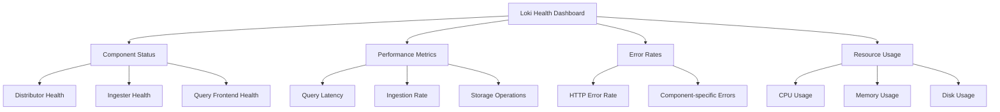

# Loki Health Checks

## Introduction

Health checks are essential components of any reliable system, and Grafana Loki is no exception. Health checks provide a way to monitor the operational status of Loki components, allowing you to detect and respond to issues before they cause significant problems. In this guide, we'll explore what health checks are in the context of Loki, why they're important, and how to implement and use them effectively.

## What Are Loki Health Checks?

Health checks in Loki are endpoint-based monitoring tools that report on the status and availability of different Loki components. These checks help you:

- Identify when components are experiencing issues
- Automate recovery procedures
- Provide visibility into system health
- Support load balancing decisions
- Enable proactive monitoring and alerting

## Loki's Built-in Health Check Endpoints

Loki provides several built-in HTTP endpoints for health checking:

### 1. `/ready` Endpoint

The `/ready` endpoint indicates whether a Loki component is ready to receive traffic.

```bash
# Example request
curl http://localhost:3100/ready

# Example output when healthy
ready
```

When a component is not ready, it will return a non-200 HTTP status code.

### 2. `/metrics` Endpoint

The `/metrics` endpoint exposes Prometheus metrics that can be used for health monitoring.

```bash
# Example request
curl http://localhost:3100/metrics

# Partial example output
# HELP loki_distributor_received_samples_total The total number of received samples.
# TYPE loki_distributor_received_samples_total counter
loki_distributor_received_samples_total 12345
```

### 3. `/healthz` Endpoint

The `/healthz` endpoint provides a basic check to determine if the service is running.

```bash
# Example request
curl http://localhost:3100/healthz

# Example output when healthy
OK
```

## Implementing Custom Health Checks

Besides the built-in endpoints, you can also create custom health checks for Loki. Here's how to set up a comprehensive health monitoring system:

### Step 1: Configure Loki Components to Expose Health Endpoints

Ensure all Loki components have their health check endpoints properly configured in your Loki configuration file:

```yaml
server:
  http_listen_port: 3100

distributor:
  ring:
    kvstore:
      store: inmemory

ingester:
  lifecycler:
    ring:
      kvstore:
        store: inmemory
      replication_factor: 1
    final_sleep: 0s
  chunk_idle_period: 5m
  chunk_retain_period: 30s

limits_config:
  enforce_metric_name: false
  reject_old_samples: true
  reject_old_samples_max_age: 168h

schema_config:
  configs:
    - from: 2020-10-24
      store: boltdb-shipper
      object_store: filesystem
      schema: v11
      index:
        prefix: index_
        period: 24h

storage_config:
  boltdb_shipper:
    active_index_directory: /tmp/loki/boltdb-shipper-active
    cache_location: /tmp/loki/boltdb-shipper-cache
    cache_ttl: 24h
    shared_store: filesystem
  filesystem:
    directory: /tmp/loki/chunks

compactor:
  working_directory: /tmp/loki/compactor
  shared_store: filesystem

# Health check configuration
http_server:
  http_listen_port: 3100
  graceful_shutdown_timeout: 5s
  http_server_read_timeout: 30s
  http_server_write_timeout: 30s
  http_server_idle_timeout: 120s
```

### Step 2: Create Prometheus Alerting Rules

Create Prometheus alerting rules to monitor Loki component health:

```yaml
groups:
- name: loki_health_alerts
  rules:
  - alert: LokiComponentDown
    expr: up{job=~"loki.*"} == 0
    for: 5m
    labels:
      severity: critical
    annotations:
      summary: "Loki component {{ $labels.job }} on {{ $labels.instance }} is down"
      description: "The Loki component has been down for more than 5 minutes."
      
  - alert: LokiHighErrorRate
    expr: sum(rate(loki_request_duration_seconds_count{status_code=~"5.."}[5m])) by (job, route) / sum(rate(loki_request_duration_seconds_count[5m])) by (job, route) > 0.05
    for: 5m
    labels:
      severity: warning
    annotations:
      summary: "Loki {{ $labels.job }} has high error rate on {{ $labels.route }}"
      description: "The Loki component {{ $labels.job }} has a high error rate (>5%) on the {{ $labels.route }} endpoint."
```

### Step 3: Implement Health Check Probes in Kubernetes

If you're running Loki in Kubernetes, you can implement health check probes in your deployment:

```yaml
apiVersion: apps/v1
kind: Deployment
metadata:
  name: loki
spec:
  selector:
    matchLabels:
      app: loki
  template:
    metadata:
      labels:
        app: loki
    spec:
      containers:
      - name: loki
        image: grafana/loki:latest
        ports:
        - containerPort: 3100
          name: http-metrics
        readinessProbe:
          httpGet:
            path: /ready
            port: http-metrics
          initialDelaySeconds: 15
          timeoutSeconds: 1
        livenessProbe:
          httpGet:
            path: /healthz
            port: http-metrics
          initialDelaySeconds: 30
          timeoutSeconds: 1
        startupProbe:
          httpGet:
            path: /ready
            port: http-metrics
          failureThreshold: 30
          periodSeconds: 10
```

## Monitoring Loki Health Metrics

Besides the basic health check endpoints, Loki exposes detailed metrics that provide insights into its operational health:

### Key Health Metrics to Monitor

1. **Query Performance**
   ```promql
   histogram_quantile(0.99, sum(rate(loki_query_frontend_query_duration_seconds_bucket[5m])) by (le))
   ```

2. **Ingestion Rate**
   ```promql
   sum(rate(loki_distributor_bytes_received_total[5m]))
   ```

3. **Memory Usage**
   ```promql
   container_memory_usage_bytes{container="loki"}
   ```

4. **Storage Operations**
   ```promql
   sum(rate(loki_ingester_chunk_size_bytes_bucket[5m])) by (le)
   ```

5. **Request Failures**
   ```promql
   sum(rate(loki_request_duration_seconds_count{status_code=~"5.."}[5m])) by (route)
   ```

## Creating a Loki Health Dashboard

You can create a comprehensive health dashboard in Grafana to monitor Loki:



## Practical Example: Setting Up Comprehensive Loki Health Monitoring

Let's walk through a practical example of setting up a comprehensive health monitoring system for Loki.

### 1. Create a Docker Compose Setup for Loki with Prometheus and Grafana

```yaml
version: '3'
services:
  loki:
    image: grafana/loki:latest
    ports:
      - "3100:3100"
    volumes:
      - ./loki-config.yaml:/etc/loki/local-config.yaml
    command: -config.file=/etc/loki/local-config.yaml

  prometheus:
    image: prom/prometheus:latest
    ports:
      - "9090:9090"
    volumes:
      - ./prometheus.yml:/etc/prometheus/prometheus.yml
    depends_on:
      - loki

  grafana:
    image: grafana/grafana:latest
    ports:
      - "3000:3000"
    environment:
      - GF_SECURITY_ADMIN_PASSWORD=admin
      - GF_USERS_ALLOW_SIGN_UP=false
    depends_on:
      - prometheus
      - loki
```

### 2. Configure Prometheus to Scrape Loki Metrics

Create a `prometheus.yml` file:

```yaml
global:
  scrape_interval: 15s
  evaluation_interval: 15s

scrape_configs:
  - job_name: 'loki'
    static_configs:
      - targets: ['loki:3100']
```

### 3. Create a Health Check Script

Create a health check script that can be run periodically:

```bash
#!/bin/bash

LOKI_HOST="localhost:3100"
ALERT_THRESHOLD=500

# Check if Loki is ready
ready_check=$(curl -s -o /dev/null -w "%{http_code}" http://${LOKI_HOST}/ready)
if [ $ready_check -ne 200 ]; then
  echo "CRITICAL: Loki readiness check failed with HTTP code $ready_check"
  exit 2
fi

# Check if Loki is healthy
health_check=$(curl -s -o /dev/null -w "%{http_code}" http://${LOKI_HOST}/healthz)
if [ $health_check -ne 200 ]; then
  echo "CRITICAL: Loki health check failed with HTTP code $health_check"
  exit 2
fi

# Check query performance
query_time=$(curl -s "http://${LOKI_HOST}/metrics" | grep loki_query_frontend_query_duration_seconds_sum | awk '{print $2}')
if (( $(echo "$query_time > $ALERT_THRESHOLD" | bc -l) )); then
  echo "WARNING: Query performance is degraded, taking ${query_time}s"
  exit 1
fi

echo "OK: All Loki health checks passed"
exit 0
```

## Troubleshooting Common Health Check Issues

### Issue: Loki Components Show as Not Ready

**Possible Causes:**
- Recently started components haven't completed initialization
- Configuration errors
- Resource constraints

**Solutions:**
- Check Loki logs for initialization errors
- Review configuration for mistakes
- Ensure adequate resources are allocated

### Issue: High Error Rates in Requests

**Possible Causes:**
- Incorrect query syntax
- Resource exhaustion
- Rate limits being hit

**Solutions:**
- Review query patterns for optimization
- Scale up resources
- Adjust rate limits in configuration

```yaml
limits_config:
  ingestion_rate_mb: 10
  ingestion_burst_size_mb: 20
  per_stream_rate_limit: 10MB
  per_stream_rate_limit_burst: 15MB
```

### Issue: High Memory Usage

**Possible Causes:**
- Too many in-memory queries
- Large query ranges
- Inefficient chunk caching

**Solutions:**
- Limit concurrent queries
- Restrict query time ranges
- Tune cache size

```yaml
query_range:
  split_queries_by_interval: 30m
  cache_results: true
  max_retries: 5
  
limits_config:
  max_query_parallelism: 16
  max_query_series: 10000
```

## Proactive Health Management with Alerting

Beyond basic health checks, implementing proactive alerting helps prevent issues before they impact users.

### 1. Set Up Grafana Alerting for Loki

Configure alerting rules in Grafana to notify you of potential issues:

```yaml
# Example Grafana alert rule (as JSON)
{
  "alertName": "LokiQueryLatencyHigh",
  "expr": "histogram_quantile(0.99, sum(rate(loki_query_frontend_query_duration_seconds_bucket[5m])) by (le)) > 10",
  "for": "5m",
  "labels": {
    "severity": "warning"
  },
  "annotations": {
    "summary": "Loki query latency is high",
    "description": "99th percentile query latency is above 10 seconds for the last 5 minutes."
  }
}
```

### 2. Implement Automated Recovery Actions

You can set up automated recovery actions triggered by your monitoring system:

```bash
#!/bin/bash
# Example recovery script for Loki OOM issues

LOKI_CONTAINER=$(docker ps | grep loki | awk '{print $1}')

if [ $(docker stats --no-stream $LOKI_CONTAINER | awk 'NR>1 {print $7}') -gt 90 ]; then
  echo "Loki memory usage high, restarting container..."
  docker restart $LOKI_CONTAINER
  
  # Notify administrators
  curl -X POST -H 'Content-type: application/json' \
    --data '{"text":"Loki container restarted due to high memory usage"}' \
    $WEBHOOK_URL
fi
```

## Summary

Health checks are a critical component of maintaining a reliable and performant Loki deployment. By implementing proper health check endpoints, monitoring key metrics, setting up alerting, and having automated recovery procedures, you can ensure that your Loki installation remains healthy and available.

In this guide, we've covered:
- The importance of health checks in Loki
- Built-in health check endpoints
- Implementing custom health checks
- Monitoring key health metrics
- Creating a health dashboard
- Practical implementation examples
- Troubleshooting common health issues
- Proactive health management with alerting

## Additional Resources

To further enhance your understanding of Loki health checks:

- Explore the [Loki documentation](https://grafana.com/docs/loki/latest/) for detailed information
- Review Prometheus [alerting best practices](https://prometheus.io/docs/practices/alerting/)
- Practice implementing health checks in a test environment before deploying to production
- Experiment with different alert thresholds to find the right balance for your environment

## Exercises

1. Set up a local Loki instance and configure the built-in health check endpoints
2. Create a Grafana dashboard to visualize key Loki health metrics
3. Implement a Prometheus alerting rule for Loki component availability
4. Write a script to periodically check Loki health and send notifications on failure
5. Simulate a failure scenario and test your recovery procedures