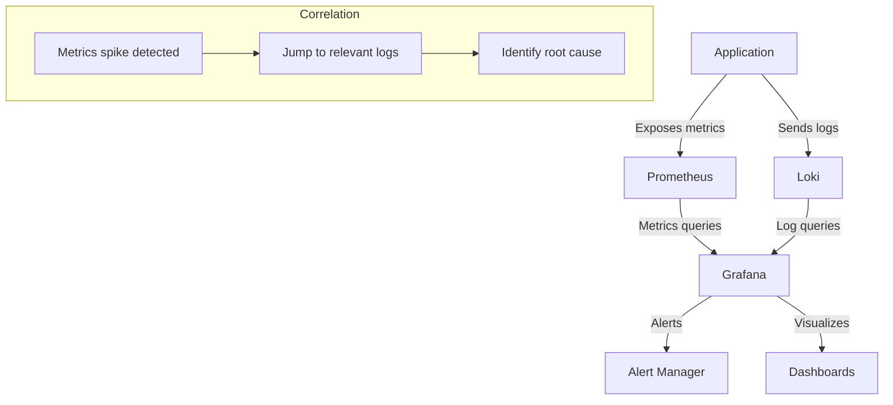

# Prometheus Integration

## Introduction

Prometheus integration is a powerful capability in the Grafana Loki ecosystem that allows you to combine Loki's log aggregation strengths with Prometheus' time-series metrics monitoring. This integration creates a comprehensive observability solution where logs and metrics work together to provide deeper insights into your systems.

In this guide, we'll explore how to integrate Prometheus with Loki, understand the benefits of this pairing, and learn how to create effective cross-platform alerts and dashboards. By the end, you'll be able to correlate logs and metrics to quickly identify and resolve issues in your applications and infrastructure.

## What is Prometheus?

Before diving into the integration details, let's briefly understand what Prometheus is:

Prometheus is an open-source systems monitoring and alerting toolkit originally built at SoundCloud. It is now a standalone project and maintained independently as part of the Cloud Native Computing Foundation (CNCF). Key features include:

- A multi-dimensional data model with time series data identified by metric name and key-value pairs
- A flexible query language called PromQL
- No reliance on distributed storage; single server nodes are autonomous
- Time series collection via a pull model over HTTP
- Targets are discovered via service discovery or static configuration
- Multiple modes of graphing and dashboarding support

## Why Integrate Prometheus with Loki?

The integration of Prometheus and Loki offers several advantages:

1. **Complete Observability**: Metrics (Prometheus) + Logs (Loki) provide a more complete picture of system behavior
2. **Correlation**: Easily correlate metrics spikes with related log entries
3. **Unified Alerting**: Create alerts based on both metrics and log data
4. **Streamlined Debugging**: Jump from a metrics anomaly directly to relevant logs
5. **Resource Efficiency**: Use metrics for regular monitoring and logs for deeper investigation

## Setting Up Prometheus Integration

Let's walk through the process of integrating Prometheus with Loki:

### Prerequisites

- A running Loki instance
- A running Prometheus instance
- Grafana installed and configured
- Basic understanding of monitoring concepts

### Step 1: Configure Prometheus as a Data Source in Grafana

First, we need to add Prometheus as a data source in Grafana:

1. Log in to your Grafana instance
2. Navigate to Configuration > Data Sources
3. Click "Add data source"
4. Select "Prometheus" from the list
5. Enter your Prometheus server URL (typically `http://prometheus:9090`)
6. Configure any additional settings as needed
7. Click "Save & Test" to verify the connection

```javascript
// Example Prometheus configuration in Grafana JSON format
{
  "name": "Prometheus",
  "type": "prometheus",
  "url": "http://prometheus:9090",
  "access": "proxy",
  "basicAuth": false
}
```

### Step 2: Configure Loki as a Data Source

Similarly, add Loki as a data source if you haven't already:

1. Navigate to Configuration > Data Sources
2. Click "Add data source"
3. Select "Loki" from the list
4. Enter your Loki server URL (typically `http://loki:3100`)
5. Click "Save & Test"

```javascript
// Example Loki configuration in Grafana JSON format
{
  "name": "Loki",
  "type": "loki",
  "url": "http://loki:3100",
  "access": "proxy",
  "basicAuth": false
}
```

### Step 3: Set Up Metric-to-Log Correlation

To enable jumping from metrics to related logs, we need to configure derived fields in Loki:

1. Go to the Loki data source configuration
2. Scroll down to the "Derived fields" section
3. Add a new derived field that extracts a value from your logs (like a request ID)
4. Configure this field to link to a Grafana dashboard or external system

```javascript
// Example derived field configuration
[
  {
    "name": "trace_id",
    "matcherRegex": "traceID=(\\w+)",
    "url": "http://tempo:16686/trace/${__value.raw}",
    "datasourceUid": "tempo"
  }
]
```

## Creating Cross-Platform Dashboards

Now let's create dashboards that combine Prometheus metrics and Loki logs:

### Step 1: Create a New Dashboard

1. Click the "+" icon in the sidebar
2. Select "Create Dashboard"
3. Click "Add new panel"

### Step 2: Add a Prometheus Panel

1. In the query editor, select "Prometheus" as the data source
2. Enter a PromQL query, for example:

```
rate(http_requests_total{job="api-server"}[5m])
```

3. Configure panel settings as needed
4. Click "Apply"

### Step 3: Add a Loki Panel

1. Add another panel
2. Select "Loki" as the data source
3. Enter a LogQL query, for example:

```
{job="api-server"} |= "error"
```

4. Configure panel settings
5. Click "Apply"

### Step 4: Add Variable Templates for Correlation

To enable easy filtering across both panels:

1. Go to dashboard settings
2. Select "Variables"
3. Click "New"
4. Create a variable that works with both data sources, such as "job" or "instance"

```javascript
// Example variable configuration
{
  "name": "job",
  "type": "query",
  "datasource": "Prometheus",
  "query": "label_values(job)",
  "refresh": 1
}
```

5. Use this variable in both your Prometheus and Loki queries

## Practical Example: Monitoring a Web Application

Let's walk through a real-world example of monitoring a web application using both Prometheus and Loki:

### Scenario

We have a web service that processes user requests. We want to monitor:
- Request rate and latency (metrics)
- Error logs (logs)
- Correlation between high latency and specific errors

### Step 1: Set Up Metrics Collection

Configure your application to expose Prometheus metrics:

```javascript
// Example Node.js code for exposing Prometheus metrics
const express = require('express');
const client = require('prom-client');
const app = express();

// Create a Registry to register the metrics
const register = new client.Registry();
client.collectDefaultMetrics({ register });

// Create a custom histogram metric for HTTP request duration
const httpRequestDurationMicroseconds = new client.Histogram({
  name: 'http_request_duration_seconds',
  help: 'Duration of HTTP requests in seconds',
  labelNames: ['method', 'route', 'status_code'],
  buckets: [0.1, 0.3, 0.5, 0.7, 1, 3, 5, 7, 10]
});
register.registerMetric(httpRequestDurationMicroseconds);

// Example middleware to measure request duration
app.use((req, res, next) => {
  const end = httpRequestDurationMicroseconds.startTimer();
  res.on('finish', () => {
    end({ method: req.method, route: req.route?.path || req.path, status_code: res.statusCode });
  });
  next();
});

// Expose metrics endpoint
app.get('/metrics', async (req, res) => {
  res.set('Content-Type', register.contentType);
  res.end(await register.metrics());
});

app.listen(3000, () => {
  console.log('Server is running on port 3000');
});
```

### Step 2: Set Up Log Collection

Configure your application to send logs to Loki:

```javascript
// Example Node.js logging with Winston and Loki transport
const winston = require('winston');
const LokiTransport = require('winston-loki');

const logger = winston.createLogger({
  level: 'info',
  format: winston.format.json(),
  defaultMeta: { service: 'web-service' },
  transports: [
    new winston.transports.Console(),
    new LokiTransport({
      host: 'http://loki:3100',
      labels: { job: 'web-service' },
      json: true,
      batching: true,
      interval: 5
    })
  ]
});

// Example usage in API endpoint
app.get('/api/users', (req, res) => {
  const requestId = generateRequestId();
  logger.info(`Processing request`, { requestId, path: '/api/users' });
  
  try {
    // Process request
    res.json({ success: true });
  } catch (error) {
    logger.error(`Error processing request`, { 
      requestId, 
      path: '/api/users', 
      error: error.message 
    });
    res.status(500).json({ error: 'Internal Server Error' });
  }
});
```

### Step 3: Create an Integrated Dashboard

Now, create a dashboard with both metrics and logs:

1. Create a graph panel showing request latency from Prometheus:

```
histogram_quantile(0.95, sum(rate(http_request_duration_seconds_bucket{job="web-service"}[5m])) by (le))
```

2. Create a logs panel showing errors from Loki:

```
{job="web-service"} | json | level="error"
```

3. Add a dashboard variable for filtering by service:

```
label_values(http_request_duration_seconds_count, job)
```

### Step 4: Set Up Correlated Alerting

Create alerts that combine metrics and logs:

1. In Grafana, go to Alerting > New Alert Rule
2. Create a condition based on high latency:

```
histogram_quantile(0.95, sum(rate(http_request_duration_seconds_bucket{job="web-service"}[5m])) by (le)) > 2
```

3. Add annotations that link to relevant logs

## Advanced Integration Techniques

### Using Exemplars

Exemplars are a powerful feature that links specific metric samples to trace data:

1. Configure Prometheus to collect exemplars
2. In your application code, add trace IDs to metrics:

```javascript
// Example of adding exemplars in Node.js
httpRequestDurationMicroseconds.observe({ 
  method: req.method, 
  route: req.path, 
  status_code: res.statusCode 
}, responseTime, { traceID: currentTraceId });
```

3. In Grafana, enable exemplars in panel settings
4. Click on exemplar points to jump directly to related logs or traces

### Using LogQL and PromQL Together

You can use LogQL to generate metrics from logs and then use those in conjunction with Prometheus metrics:

```
sum(rate({job="web-service"} |= "error" [5m])) by (job)
```

This creates a metric of error rate from logs that can be compared to request rate from Prometheus.

## Creating Alerts with Prometheus and Loki

Grafana allows you to create alerts based on both Prometheus and Loki data:

### Example 1: Alert on Error Rate Spike

```
sum(rate({job="web-service"} |= "error" [5m])) / sum(rate(http_requests_total{job="web-service"}[5m])) > 0.05
```

This alert triggers when more than 5% of requests result in errors.

### Example 2: Alert on Latency with Log Correlation

Create a multi-condition alert:
- Condition A: High latency from Prometheus
- Condition B: Presence of specific error pattern in logs

## Visualizing the Integration

Let's visualize how Prometheus and Loki work together:



## Best Practices

When integrating Prometheus with Loki, follow these best practices:

1. **Use Consistent Labels**: Ensure metrics and logs use the same label names and values for easier correlation
2. **Include Request IDs**: Add unique request IDs to both logs and metrics when possible
3. **Focus on Key Metrics**: Don't try to monitor everything; focus on the Four Golden Signals:
   - Latency
   - Traffic
   - Errors
   - Saturation
4. **Structure Your Logs**: Use structured logging to make log querying more efficient
5. **Optimize Storage**: Use appropriate retention policies for both metrics and logs
6. **Create Layered Dashboards**: Start with high-level metrics and allow drill-down to detailed logs

## Troubleshooting Common Issues

### Issue 1: Missing Correlation Between Metrics and Logs

**Problem**: Unable to correlate spikes in metrics with relevant logs.

**Solution**: Ensure consistent labeling across Prometheus and Loki. Add unique identifiers (like request IDs) to both logs and metrics.

### Issue 2: High Cardinality Problems

**Problem**: Too many unique label combinations causing performance issues.

**Solution**: Limit the number of high-cardinality labels in your metrics and logs. Use recording rules in Prometheus to pre-aggregate data.

### Issue 3: Query Performance Issues

**Problem**: Slow dashboard loading due to complex queries.

**Solution**: 
- Use time range appropriate for your queries
- Implement caching where possible
- Use recording rules for common queries
- Optimize LogQL queries by using label filters before pattern matching

## Summary

Integrating Prometheus with Grafana Loki creates a powerful monitoring and alerting system that combines the strengths of metrics and logs. This integration enables:

- Comprehensive visibility into your systems
- Quick correlation between metrics anomalies and related logs
- Unified alerting based on both data types
- More efficient troubleshooting workflows

By following the steps and best practices outlined in this guide, you can build an effective observability platform that helps you detect and resolve issues quickly, ultimately improving the reliability and performance of your applications.

## Additional Resources

- [Grafana Documentation](https://grafana.com/docs/)
- [Prometheus Documentation](https://prometheus.io/docs/introduction/overview/)
- [Loki Documentation](https://grafana.com/docs/loki/latest/)
- [LogQL Query Language Reference](https://grafana.com/docs/loki/latest/logql/)
- [PromQL Query Language Reference](https://prometheus.io/docs/prometheus/latest/querying/basics/)

## Exercises

1. Set up a local development environment with Prometheus, Loki, and Grafana using Docker Compose.
2. Create a simple application that exposes Prometheus metrics and sends logs to Loki.
3. Build a dashboard that shows correlated metrics and logs for your application.
4. Create an alert that triggers based on both metrics and log patterns.
5. Implement exemplars in your application to directly link metrics to traces or logs.