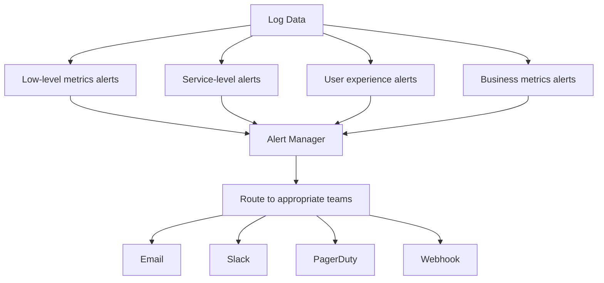

# Creating Alerting Rules

## Introduction

Alerting is a critical component of any monitoring system. While visualizing and exploring logs in Grafana Loki helps understand your system's behavior, you need a way to be proactively notified when something goes wrong, even when you're not actively looking at dashboards. This is where alerting rules come in.

In this guide, we'll learn how to create effective alerting rules in Grafana Loki that will help you detect and respond to issues before they impact your users.

## Understanding Alerting Rules in Loki

Alerting rules in Grafana Loki allow you to define conditions based on your log data that, when met, trigger notifications through various channels like email, Slack, or PagerDuty.

### Key Concepts

Before diving into creating alerting rules, let's understand some key concepts:

1. **Alert Rule** - A condition that, when met, triggers an alert
2. **Alert Instance** - A specific occurrence of an alert rule being triggered
3. **Alert State** - The current status of an alert (Normal, Pending, Firing)
4. **Notification Channel** - The method by which alerts are delivered (email, Slack, etc.)
5. **Silences** - Temporary suppression of notifications for specific alerts

## Creating Basic Alerting Rules

Let's start by creating a simple alerting rule that triggers when error logs exceed a certain threshold.

### Step 1: Navigate to Alerting in Grafana

1. Log in to your Grafana instance
2. In the left sidebar, click on "Alerting"
3. Select "Alert rules"
4. Click "New alert rule"

### Step 2: Define the Query

First, we need to define a LogQL query that will form the basis of our alert:

```logql
sum(rate({app="my-application"} |= "error" [5m])) > 5
```

This query looks for logs containing the word "error" in the application "my-application", calculates the rate over 5 minutes, and checks if it exceeds 5 errors per second.

### Step 3: Set Alert Conditions

Now we need to define:

1. **Evaluation Interval** - How often Grafana should evaluate the rule (e.g., every 1m)
2. **For** - How long the condition must be true before alerting (e.g., 5m)

For example:

```yaml
# In the Grafana UI form
Name: High Error Rate
Evaluate every: 1m
For: 5m
```

This means Grafana will check the error rate every minute, and if it exceeds our threshold continuously for 5 minutes, it will trigger an alert.

### Step 4: Add Alert Details

Configure the alert details to provide useful information when an alert triggers:

```yaml
# In the Grafana UI form
Summary: High error rate detected in my-application
Description: The application is logging more than 5 errors per second for 5 minutes
```

### Step 5: Set Notification Policies

Finally, configure how and where notifications should be sent:

1. Navigate to "Notification policies" in the Alerting section
2. Create or edit the default policy
3. Add contact points (e.g., email, Slack)
4. Configure grouping and timing options

## Advanced Alerting Rules

Now let's explore some more advanced alerting techniques.

### Multi-condition Alerts

You can create alerts based on multiple conditions:

```logql
sum(rate({app="my-application"} |= "error" [5m])) > 5
and
sum(rate({app="my-application"} |= "timeout" [5m])) > 2
```

This alert will trigger only when both error logs and timeout logs exceed their respective thresholds.

### Alerting on Log Absence

Sometimes the absence of logs is just as concerning as their presence. Here's how to alert when logs stop appearing:

```logql
sum(count_over_time({app="heartbeat-service"} [10m])) < 1
```

This alert triggers if the heartbeat service hasn't logged anything in the last 10 minutes.

### Using Labels and Annotations

Labels and annotations make your alerts more informative and help with routing:

```yaml
# In the Grafana UI form
Labels:
  severity: critical
  team: backend
  service: payment-processing

Annotations:
  summary: Payment service is experiencing high error rates
  dashboard: https://grafana.example.com/d/abc123/payment-service
  runbook: https://wiki.example.com/runbooks/payment-errors
```

## Creating Alerting Rules with Terraform (Infrastructure as Code)

For teams practicing Infrastructure as Code, you can define Grafana alerting rules using Terraform:

```hcl
resource "grafana_rule_group" "my_alert_group" {
  name             = "my-alert-group"
  folder_uid       = "my-folder-uid"
  interval_seconds = 60

  rule {
    name      = "High error rate"
    condition = "B"
    
    data {
      ref_id = "A"
      relative_time_range {
        from = 600
        to   = 0
      }
      datasource_uid = "loki-uid"
      model = jsonencode({
        expr = "sum(rate({app=\"my-application\"} |= \"error\" [5m]))",
        interval = "1m",
        legendFormat = "",
        refId = "A"
      })
    }
    
    data {
      ref_id = "B"
      relative_time_range {
        from = 600
        to   = 0
      }
      datasource_uid = "__expr__"
      model = jsonencode({
        conditions = [{
          evaluator = {
            params = [5],
            type   = "gt"
          },
          operator = {
            type = "and"
          },
          query = {
            params = ["A"]
          },
          reducer = {
            params = [],
            type   = "avg"
          },
          type = "query"
        }],
        datasource = {
          type = "__expr__",
          uid  = "__expr__"
        },
        expression = "A",
        refId      = "B",
        type       = "threshold"
      })
    }
    
    annotations = {
      summary     = "High error rate detected in my-application"
      description = "The application is logging more than 5 errors per second for 5 minutes"
    }
    
    labels = {
      severity = "critical"
    }

    for = "5m"
  }
}
```

## Best Practices for Alerting Rules

Creating effective alerts is an art. Here are some best practices:

### 1. Alert on Symptoms, Not Causes

Alert on what matters to users (e.g., high error rates, slow responses) rather than low-level system metrics that may not directly impact user experience.

### 2. Reduce Noise with Thresholds

Set appropriate thresholds to avoid alert fatigue. Start with conservative thresholds and adjust based on experience.

```logql
# Instead of alerting on any error
sum(rate({app="api"} |= "error" [5m])) > 5
```

### 3. Add Context to Alerts

Include enough information in your alerts to help responders understand and address the issue:

```yaml
# Good annotation examples
summary: Payment API error rate > 5%
description: The error rate has exceeded 5% for over 10 minutes. Most errors are HTTP 500 responses.
dashboard: https://grafana.example.com/dashboards/payment-api
runbook: https://wiki.example.com/runbooks/payment-api-errors
```

### 4. Group Related Alerts

Use labels to group related alerts and reduce notification noise:

```yaml
labels:
  service: payment-api
  component: database
  severity: critical
```

### 5. Implement Alert Severity Levels

Create a clear hierarchy of alert severity:

- **Critical**: Immediate action required, user impact
- **Warning**: Potential issues that need attention soon
- **Info**: Informational alerts that don't require immediate action

## Real-world Examples

Here are some practical examples of alerting rules for common scenarios:

### Example 1: HTTP Error Rate Alert

```logql
sum(rate({job="nginx"} |= "HTTP/1.1\" 5" [5m])) by (status_code)
/ 
sum(rate({job="nginx"} [5m])) by (status_code)
> 0.05
```

This alert triggers when more than 5% of HTTP requests result in 5xx errors over a 5-minute period.

### Example 2: Application Exception Alert

```logql
sum(count_over_time({app="payment-service"} |= "Exception" [5m])) > 10
```

This alerts when the payment service logs more than 10 exceptions in 5 minutes.

### Example 3: Service Availability Alert

```logql
absent({job="api-health-check", instance=~".*"} |= "healthy" [10m])
```

This alerts when health check logs containing "healthy" are absent for 10 minutes, indicating potential service unavailability.

## Creating a Comprehensive Alerting Strategy

A good alerting strategy combines different types of alerts:



## Summary

In this guide, we've learned how to:

1. Create basic alerting rules in Grafana Loki
2. Define advanced alerting conditions
3. Implement alerting as code using Terraform
4. Follow best practices for effective alerting
5. Create practical, real-world alerting rules

Effective alerting is a critical component of a robust monitoring strategy. By following these guidelines, you'll be able to create alerting rules that help you detect and respond to issues promptly, minimizing downtime and improving system reliability.

## Exercises

1. Create an alert that triggers when logs containing "database connection failed" appear more than 3 times in 5 minutes.
2. Build an alert that detects when a service stops logging entirely.
3. Design a multi-condition alert that combines error rate and latency metrics.
4. Implement a hierarchical alerting strategy with different severity levels for a microservice architecture.
5. Set up alert routing to direct different types of alerts to the appropriate teams.

## Additional Resources

- [Grafana Alerting Documentation](https://grafana.com/docs/grafana/latest/alerting/)
- [LogQL Query Language Reference](https://grafana.com/docs/loki/latest/logql/)
- [Prometheus Alerting Rules Best Practices](https://prometheus.io/docs/practices/alerting/)
- [SRE Book: Practical Alerting from Google SRE](https://sre.google/sre-book/practical-alerting/)