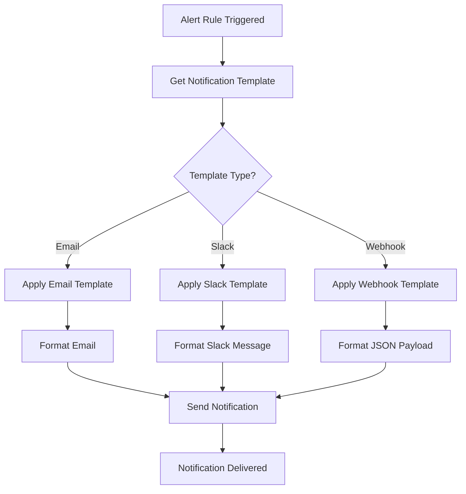

# Notification Templates

## Introduction

Notification templates in Grafana Loki allow you to customize the structure and content of alert notifications sent to various channels such as Slack, email, or webhook endpoints. Rather than receiving generic alerts, templates enable you to craft rich, context-aware notifications that include specific details about the alert, making troubleshooting faster and more efficient.

In this guide, you'll learn:
- What notification templates are and why they're important
- How to create basic and advanced templates using Go templating syntax
- How to include query results and metadata in your notifications
- Best practices for designing effective notification templates

## What Are Notification Templates?

Notification templates are customizable message formats that determine how alerts appear when they're delivered through notification channels. By default, Grafana provides basic templates, but creating your own templates allows you to:

- Include relevant metrics data directly in notifications
- Add links to dashboards or runbooks
- Format messages appropriately for different communication channels
- Include visualization snippets or summary data
- Add conditional content based on alert severity or other factors

## Basic Template Structure

Grafana Loki uses Go's templating language to create notification templates. Here's a basic structure of a notification template:

```yaml
apiVersion: 1

templates:
  - name: my_template
    template: |
      {{ define "my_template" }}
      Alert: {{ .Labels.alertname }}
      Severity: {{ .Labels.severity }}
      Summary: {{ .Annotations.summary }}
      Description: {{ .Annotations.description }}
      {{ end }}
```

Let's break down the components:

- `apiVersion`: The version of the template format (always 1)
- `templates`: A list of template definitions
- `name`: A unique identifier for your template
- `template`: The actual template content using Go templating syntax
- `{{ define "my_template" }}` and `{{ end }}`: Marks the beginning and end of the template definition

## Template Variables

When creating templates, you have access to various variables that contain information about the alert:

### Alert Labels and Annotations

- `.Labels`: Contains all the labels associated with the alert
  - `.Labels.alertname`: The name of the alert
  - `.Labels.severity`: The severity of the alert
  - Any custom labels defined in your alerting rules

- `.Annotations`: Contains all annotations defined in the alert rule
  - `.Annotations.summary`: A short summary of the alert
  - `.Annotations.description`: A detailed description of the alert

### Alert Status Information

- `.Status`: The current status of the alert ("firing" or "resolved")
- `.StartsAt`: Timestamp when the alert started firing
- `.EndsAt`: Timestamp when the alert resolved (if applicable)
- `.ExternalURL`: URL to the Grafana alert view

### Query Results

- `.Values`: The values that triggered the alert
- `.ValueString`: A string representation of the values

## Creating a Basic Notification Template

Let's create a simple notification template for Slack:

```yaml
apiVersion: 1

templates:
  - name: slack_notification
    template: |
      {{ define "slack_notification" }}
      {
        "blocks": [
          {
            "type": "header",
            "text": {
              "type": "plain_text",
              "text": "{{ if eq .Status "firing" }}🔥 ALERT FIRING: {{ else }}✅ ALERT RESOLVED: {{ end }}{{ .Labels.alertname }}"
            }
          },
          {
            "type": "section",
            "text": {
              "type": "mrkdwn",
              "text": "*Severity:* {{ .Labels.severity }}
*Summary:* {{ .Annotations.summary }}"
            }
          },
          {
            "type": "section",
            "text": {
              "type": "mrkdwn",
              "text": "{{ .Annotations.description }}"
            }
          },
          {
            "type": "section",
            "text": {
              "type": "mrkdwn",
              "text": "*Started:* {{ .StartsAt | since }}
*View in Grafana:* <{{ .ExternalURL }}|Open Alert>"
            }
          }
        ]
      }
      {{ end }}
```

This template:
1. Creates a header showing if the alert is firing or resolved
2. Displays the alert name, severity, and summary
3. Shows the full description
4. Includes the time since the alert started and a link to view the alert in Grafana

## Template Functions

Grafana provides several built-in functions to help format your templates:

### Time Functions

- `since`: Displays time elapsed since a timestamp
  ```
  {{ .StartsAt | since }}  <!-- e.g., "3h 15m ago" -->
  ```

- `humanize`: Converts a duration to a human-readable format
  ```
  {{ $duration := sub now .StartsAt }}
  {{ $duration | humanize }}  <!-- e.g., "3 hours" -->
  ```

### String Functions

- `toUpper` and `toLower`: Change string case
  ```
  {{ .Labels.severity | toUpper }}  <!-- "CRITICAL" -->
  ```

- `reReplaceAll`: Replace text using regex
  ```
  {{ reReplaceAll "\\." "_" .Labels.instance }}
  ```

### Comparison Functions

- `eq`, `ne`, `lt`, `gt`, etc.: Compare values
  ```
  {{ if eq .Status "firing" }}ALERT{{ else }}RESOLVED{{ end }}
  ```

## Advanced Template Example: Multi-Channel Notifications

This example shows how to create different templates for different notification channels:

```yaml
apiVersion: 1

templates:
  - name: notification_templates
    template: |
      {{ define "email.subject" }}
      [{{ .Status | toUpper }}] {{ .Labels.alertname }}
      {{ end }}
      
      {{ define "email.message" }}
      <h2>{{ if eq .Status "firing" }}🔥 Alert Firing{{ else }}✅ Alert Resolved{{ end }}: {{ .Labels.alertname }}</h2>
      <p><strong>Severity:</strong> {{ .Labels.severity }}</p>
      <p><strong>Summary:</strong> {{ .Annotations.summary }}</p>
      <hr />
      <p>{{ .Annotations.description }}</p>
      <p>
        <strong>Started:</strong> {{ .StartsAt }}<br />
        <strong>Ended:</strong> {{ if ne .Status "firing" }}{{ .EndsAt }}{{ else }}Ongoing{{ end }}
      </p>
      <p><a href="{{ .ExternalURL }}">View in Grafana</a></p>
      {{ end }}
      
      {{ define "slack.message" }}
      {
        "blocks": [
          {
            "type": "header",
            "text": {
              "type": "plain_text",
              "text": "{{ if eq .Status "firing" }}🔥 ALERT FIRING{{ else }}✅ ALERT RESOLVED{{ end }}"
            }
          },
          {
            "type": "section",
            "fields": [
              {
                "type": "mrkdwn",
                "text": "*Alert:*
{{ .Labels.alertname }}"
              },
              {
                "type": "mrkdwn",
                "text": "*Severity:*
{{ .Labels.severity }}"
              }
            ]
          },
          {
            "type": "section",
            "text": {
              "type": "mrkdwn",
              "text": "*Summary:*
{{ .Annotations.summary }}"
            }
          },
          {
            "type": "section",
            "text": {
              "type": "mrkdwn",
              "text": "{{ .Annotations.description }}"
            }
          },
          {
            "type": "context",
            "elements": [
              {
                "type": "mrkdwn",
                "text": "Started: {{ .StartsAt | since }} | <{{ .ExternalURL }}|View in Grafana>"
              }
            ]
          }
        ]
      }
      {{ end }}
```

In this example, we've defined:
- An email template with subject and message sections
- A Slack message formatted using Slack's Block Kit

## Including Query Data in Templates

One of the most powerful features of notification templates is the ability to include the actual log data that triggered the alert:

```yaml
apiVersion: 1

templates:
  - name: loki_query_template
    template: |
      {{ define "loki_data" }}
      Alert: {{ .Labels.alertname }}
      
      Query: {{ .Annotations.query }}
      
      Results:
      {{ range .Values }}
        {{ . }}
      {{ end }}
      
      {{ if gt (len .Values) 5 }}
      Showing top 5 of {{ len .Values }} results.
      {{ end }}
      {{ end }}
```

This template includes:
- The query that triggered the alert
- The actual log lines or data values from the query results
- A note if the results have been truncated

## Real-World Example: Loki Error Alert Template

Here's a practical example for alerting on error logs in your application:

```yaml
apiVersion: 1

templates:
  - name: error_alert_template
    template: |
      {{ define "error_alert" }}
      {
        "blocks": [
          {
            "type": "header",
            "text": {
              "type": "plain_text",
              "text": "🚨 Error Rate Alert: {{ .Labels.app }} {{ if eq .Status "resolved" }}✓ RESOLVED{{ end }}"
            }
          },
          {
            "type": "section",
            "text": {
              "type": "mrkdwn",
              "text": "*Error Rate Threshold Exceeded*
{{ .Annotations.summary }}"
            }
          },
          {
            "type": "section",
            "fields": [
              {
                "type": "mrkdwn",
                "text": "*Application:*
{{ .Labels.app }}"
              },
              {
                "type": "mrkdwn",
                "text": "*Environment:*
{{ .Labels.env }}"
              },
              {
                "type": "mrkdwn",
                "text": "*Current Rate:*
{{ .ValueString }} errors/min"
              },
              {
                "type": "mrkdwn",
                "text": "*Threshold:*
{{ .Annotations.threshold }} errors/min"
              }
            ]
          },
          {
            "type": "section",
            "text": {
              "type": "mrkdwn",
              "text": "*Sample Error Logs:*
```{{ range .Values }}{{ . }}
{{ end }}```"
            }
          },
          {
            "type": "section",
            "text": {
              "type": "mrkdwn",
              "text": "*Runbook:* <{{ .Annotations.runbook }}|View Runbook>"
            }
          },
          {
            "type": "context",
            "elements": [
              {
                "type": "mrkdwn",
                "text": "Alert triggered {{ .StartsAt | since }} | <{{ .ExternalURL }}|View in Grafana>"
              }
            ]
          }
        ]
      }
      {{ end }}
```

This template:
1. Shows the application name and whether the alert is resolved
2. Provides context about the error rate threshold being exceeded
3. Displays key metadata like application, environment, current rate, and threshold
4. Includes sample error logs that triggered the alert
5. Links to a runbook for remediation steps
6. Shows when the alert was triggered and a link to Grafana

## Diagram: Notification Template Flow



## Template Testing and Validation

Before implementing your templates in production, it's crucial to test them. You can use Grafana's template testing functionality:

1. Navigate to Alerting > Notification Templates
2. Create a new template or edit an existing one
3. Use the Preview tab to simulate alerts with different data
4. Verify the output matches your expectations

Common issues to watch for:
- Missing or incorrect variable references
- Template syntax errors
- Formatting problems with JSON for Slack or webhook payloads
- Truncated messages due to channel limitations

## Configuring Alert Notification Channels to Use Templates

After creating your templates, you need to associate them with notification channels:

1. Navigate to Alerting > Notification Policies
2. Create or edit a contact point
3. Select your notification channel (Slack, Email, etc.)
4. In the "Message" field, reference your template:
   ```
   {{ template "my_template" . }}
   ```
5. Save the contact point

## Best Practices for Notification Templates

To create effective notification templates, follow these guidelines:

1. **Keep it relevant**: Include only information that helps recipients understand and respond to the alert
2. **Format for readability**: Use headers, bold text, and sections to make notifications scannable
3. **Prioritize critical information**: Put the most important details at the top
4. **Include actionable links**: Add links to dashboards, runbooks, or related systems
5. **Consider the channel**: Customize formatting based on where the notification will be sent (Slack vs. Email)
6. **Use conditional formatting**: Change colors or icons based on severity
7. **Test thoroughly**: Verify templates work as expected with different alert scenarios
8. **Be mindful of size limits**: Some notification channels have message size restrictions

## Summary

Notification templates are a powerful feature in Grafana Loki that allow you to transform generic alerts into rich, context-aware notifications. By leveraging Go's templating language, you can:

- Customize notification format and content for different channels
- Include relevant metrics and log data directly in notifications
- Add conditional formatting based on alert status or severity
- Provide actionable information for faster troubleshooting

With well-designed notification templates, your team can respond more efficiently to alerts, reducing mean time to resolution (MTTR) and improving overall system reliability.

## Exercise: Create Your Own Template

Try creating a notification template for a specific use case in your environment:

1. Identify a common alert scenario (e.g., high CPU usage, error rate spikes)
2. Determine what information would be most helpful in the notification
3. Create a template using the examples in this guide
4. Test the template with simulated alert data
5. Implement the template in your Grafana Loki environment

## Additional Resources

- [Grafana Alerting Documentation](https://grafana.com/docs/grafana/latest/alerting/)
- [Go Template Language Reference](https://pkg.go.dev/text/template)
- [Slack Block Kit Documentation](https://api.slack.com/block-kit) (for Slack-specific templates)