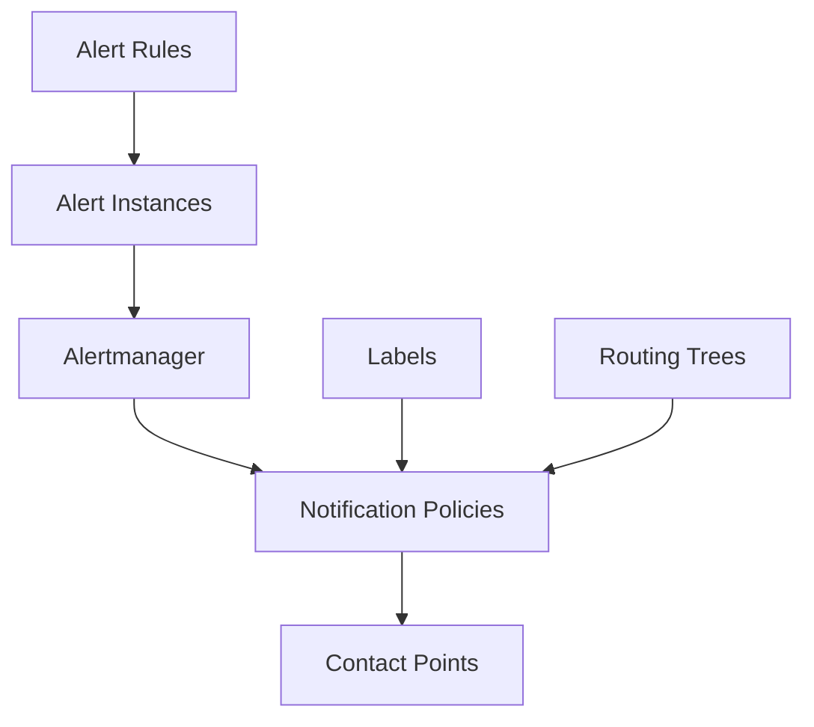

# Alert Routing

## Introduction

Alert routing is a crucial component in any monitoring and alerting system, including Grafana Loki. It ensures that the right alerts reach the right people at the right time. Without proper alert routing, important notifications might go unnoticed, or teams might be overwhelmed with alerts that aren't relevant to them.

In this guide, we'll explore how alert routing works in Grafana Loki, how to configure routing trees, and best practices for implementing an effective alert routing strategy. By the end, you'll understand how to ensure critical alerts are delivered to the appropriate teams and individuals.

## Understanding Alert Routing

Alert routing in Grafana Loki determines the path that an alert takes from the moment it's triggered until it reaches its intended recipients. This process involves several components:

1. **Alert Rules**: Define conditions that trigger alerts
2. **Alert Instances**: Individual alerts generated when conditions are met
3. **Notification Policies**: Define how alerts are grouped, inhibited, and routed
4. **Contact Points**: Specify where alerts are sent (email, Slack, etc.)
5. **Routing Trees**: Hierarchical structures that match alerts to notification policies

Let's visualize this flow:



## Configuring Alert Routing in Grafana Loki

### Setting Up Contact Points

Before configuring routing, you need to set up contact points - destinations where alerts will be delivered. Common contact points include:

- Email
- Slack
- Webhook
- PagerDuty
- OpsGenie
- Discord

Here's an example of configuring a Slack contact point using the Grafana UI:

1. Navigate to Alerting → Contact points
2. Click "New contact point"
3. Select "Slack" as the integration
4. Fill in the required fields:
   - Name: `team-backend-slack`
   - Slack webhook URL: Your webhook URL
   - Message settings: Customize as needed

Alternatively, you can configure contact points using YAML:

```yaml
apiVersion: 1
contactPoints:
- name: slack-notifications
  receivers:
  - uid: slack-backend-team
    type: slack
    settings:
      url: https://hooks.slack.com/services/your-webhook-url
      title: '{{ template "slack.default.title" . }}'
      text: '{{ template "slack.default.message" . }}'
```

### Creating Notification Policies

Notification policies determine how alerts are processed. They specify:

- Grouping of similar alerts
- Timing for notifications (when to send, resend, etc.)
- Which contact point to use
- Muting timings (when to suppress alerts)

Here's an example of a notification policy configuration:

```yaml
apiVersion: 1
policies:
- orgId: 1
  receiver: slack-notifications
  group_by: ['alertname', 'job']
  repeat_interval: 4h
  routes:
  - receiver: backend-team-email
    group_by: ['alertname', 'severity']
    matchers:
    - team = "backend"
    mute_time_intervals:
    - weekends
```

### Building Routing Trees

Routing trees define the hierarchy and rules for routing alerts to specific notification policies. They use label matchers to determine which route an alert should take.

Here's a simple routing tree example:

```yaml
apiVersion: 1
groups:
- name: Loki Rules
  rules:
  - name: high_error_rate
    condition: rate(loki_error_total[5m]) > 0.1
    labels:
      severity: critical
      team: backend
  - name: api_latency
    condition: rate(api_request_duration_seconds_sum[5m]) / rate(api_request_duration_seconds_count[5m]) > 0.5
    labels:
      severity: warning
      team: api
```

With this configuration, alerts with the label `team=backend` will be routed to the `backend-team-email` contact point, while other alerts will go to the default `slack-notifications` contact point.

## Practical Example: Setting Up Team-Based Alert Routing

Let's walk through a real-world example of configuring alert routing for different teams in an organization.

### Scenario

You have a microservices architecture with three teams:
- Backend Team: Responsible for core services
- Frontend Team: Manages user interface components
- Database Team: Handles database operations

Each team needs to receive alerts relevant to their domain.

### Step 1: Create Contact Points

First, set up contact points for each team:

```yaml
apiVersion: 1
contactPoints:
- name: backend-team
  receivers:
  - uid: backend-slack
    type: slack
    settings:
      url: https://hooks.slack.com/services/backend-webhook
- name: frontend-team
  receivers:
  - uid: frontend-slack
    type: slack
    settings:
      url: https://hooks.slack.com/services/frontend-webhook
- name: database-team
  receivers:
  - uid: database-slack
    type: slack
    settings:
      url: https://hooks.slack.com/services/database-webhook
- name: all-teams
  receivers:
  - uid: all-teams-email
    type: email
    settings:
      to: alerts@example.com
```

### Step 2: Create Notification Policies with Routing

Now, set up a routing tree with notification policies:

```yaml
apiVersion: 1
policies:
- orgId: 1
  receiver: all-teams
  group_by: ['alertname']
  routes:
  - receiver: backend-team
    matchers:
    - team = "backend"
    group_by: ['alertname', 'service']
    continue: false
  - receiver: frontend-team
    matchers:
    - team = "frontend"
    group_by: ['alertname', 'component']
    continue: false
  - receiver: database-team
    matchers:
    - team = "database"
    group_by: ['alertname', 'database']
    continue: false
```

### Step 3: Configure Alert Rules with Appropriate Labels

Configure alert rules with team labels to ensure proper routing:

```yaml
apiVersion: 1
groups:
- name: Services
  rules:
  - name: BackendServiceDown
    expr: up{job="backend"} == 0
    for: 5m
    labels:
      team: backend
      severity: critical
    annotations:
      summary: Backend service is down
      description: "Backend service {{ $labels.instance }} has been down for more than 5 minutes."
  - name: FrontendErrors
    expr: sum(rate(frontend_error_total[5m])) > 10
    for: 5m
    labels:
      team: frontend
      severity: warning
    annotations:
      summary: High frontend error rate
      description: "Frontend is experiencing high error rate ({{ $value }} errors per second)."
  - name: DatabaseHighLatency
    expr: rate(database_query_duration_seconds_sum[5m]) / rate(database_query_duration_seconds_count[5m]) > 1
    for: 10m
    labels:
      team: database
      severity: warning
    annotations:
      summary: Database query latency is high
      description: "Database queries are taking longer than 1 second on average."
```

## Advanced Routing Techniques

### Time-Based Routing

Sometimes you want to route alerts differently based on time of day, like during work hours versus after hours:

```yaml
apiVersion: 1
policies:
- orgId: 1
  receiver: slack-during-hours
  group_by: ['alertname']
  routes:
  - receiver: pagerduty-after-hours
    matchers:
    - severity = "critical"
    time_intervals:
    - name: after-hours
      time_intervals:
    - weekdays:
        start_time: 17:00
        end_time: 09:00
    - weekends
```

### Severity-Based Routing

Route alerts based on severity level:

```yaml
apiVersion: 1
policies:
- orgId: 1
  receiver: default-notifications
  group_by: ['alertname']
  routes:
  - receiver: critical-alerts
    matchers:
    - severity = "critical"
    continue: true
  - receiver: warning-alerts
    matchers:
    - severity = "warning"
    continue: true
```

### Nested Routing

For complex organizations, nested routing allows for hierarchical team structures:

```yaml
apiVersion: 1
policies:
- orgId: 1
  receiver: default-team
  routes:
  - receiver: engineering
    matchers:
    - department = "engineering"
    routes:
    - receiver: backend-team
      matchers:
      - team = "backend"
    - receiver: frontend-team
      matchers:
      - team = "frontend"
  - receiver: operations
    matchers:
    - department = "operations"
    routes:
    - receiver: sre-team
      matchers:
      - team = "sre"
```

## Best Practices for Alert Routing

1. **Keep It Simple**: Start with a simple routing tree and expand as needed
2. **Consistent Labeling**: Use consistent labels across all alerts
3. **Documentation**: Document the routing structure for team reference
4. **Testing**: Test routing configurations before deploying to production
5. **Redundancy**: Include backup contact points for critical alerts
6. **Regular Reviews**: Periodically review and update routing configurations
7. **Avoid Alert Fatigue**: Use proper grouping and inhibition to prevent overwhelming teams

## Common Pitfalls to Avoid

1. **Overlapping Routes**: Ambiguous routing rules can send alerts to multiple teams
2. **Missing Routes**: Alerts without matching routes may go unnoticed
3. **Too Much Granularity**: Overly complex routing trees are hard to maintain
4. **Inconsistent Labels**: Inconsistent labeling can break routing rules
5. **No Default Route**: Always have a catch-all route for unmatched alerts

## Summary

Alert routing is a critical component in Grafana Loki's monitoring and alerting system. Proper configuration ensures that the right people are notified when issues arise, allowing for faster response times and reduced mean time to resolution (MTTR).

By implementing a well-designed alert routing strategy using contact points, notification policies, and routing trees, you can create an effective alerting system that minimizes alert fatigue while ensuring critical issues are addressed promptly.

## Additional Resources

- [Grafana Alerting Documentation](https://grafana.com/docs/grafana/latest/alerting/)
- [Alertmanager Configuration](https://prometheus.io/docs/alerting/latest/configuration/)
- [Alert Routing Best Practices](https://grafana.com/blog/2020/02/25/step-by-step-guide-to-setting-up-prometheus-alertmanager-with-slack-pagerduty-and-gmail/)

## Exercises

1. Set up a basic alert routing configuration with at least two different contact points.
2. Create a routing tree that sends different alerts to different teams based on service labels.
3. Implement a time-based routing policy that sends critical alerts to a different contact point during non-business hours.
4. Design an alert routing strategy for your organization or a hypothetical company with at least three teams.