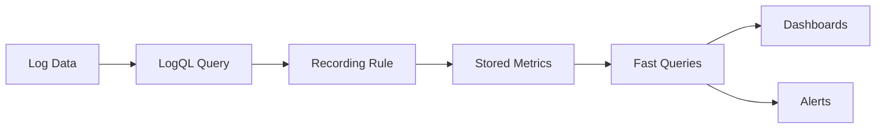

# Recording Rules

## Introduction

Recording rules are a powerful feature in Grafana Loki that allow you to pre-compute frequently used or computationally expensive queries and store their results as new time series. This can significantly improve the performance of your dashboards and alerts by reducing query execution time and resource consumption.

In this guide, we'll explore what recording rules are, why they're useful, and how to create and use them effectively in your Loki monitoring setup.

## What Are Recording Rules?

Recording rules are similar to views in databases or materialized views in some database systems. They periodically evaluate LogQL expressions and store the results as new time series data, which can be queried more efficiently than running the original complex queries repeatedly.

<div className="info-box">
  <strong>Key Point:</strong> Recording rules transform potentially expensive queries into pre-computed metrics that can be accessed quickly.
</div>

## Why Use Recording Rules?

There are several compelling reasons to use recording rules in your Loki deployment:

1. **Performance improvement** - Pre-compute complex queries to reduce dashboard load times
2. **Resource optimization** - Reduce CPU and memory usage by calculating expressions once instead of repeatedly
3. **Query simplification** - Complex aggregations can be referenced with simpler queries
4. **Consistency** - Ensure the same calculation is used across multiple dashboards or alerts

## How Recording Rules Work

Recording rules in Loki operate within the Prometheus-like rules evaluation engine. They run at a defined interval, execute your LogQL query, and store the results as metrics that can be queried later.



## Configuring Recording Rules

Recording rules are defined in YAML configuration files and loaded into Loki's ruler component. Let's look at the structure of a recording rule:

```yaml
groups:
  - name: example_recording_rules
    interval: 1m
    rules:
      - record: job:http_errors:rate5m
        expr: sum by (job) (rate({app="my-app"} |= "ERROR" [5m]))
```

Breaking down the components:

- **groups**: Rules are organized into named groups
- **interval**: How frequently the rules should be evaluated (e.g., every minute)
- **record**: The name of the new time series that will be created
- **expr**: The LogQL expression to evaluate and record

## Practical Examples

Let's explore some practical examples of recording rules that you might find useful in real-world scenarios.

### Example 1: Error Rate by Service

This example creates a recording rule that calculates the error rate per service over a 5-minute window:

```yaml
groups:
  - name: error_rates
    interval: 1m
    rules:
      - record: service:error_rate:5m
        expr: sum by (service) (rate({env="production"} |= "ERROR" [5m])) / sum by (service) (rate({env="production"}[5m]))
```

This rule creates a new metric called `service:error_rate:5m` that represents the percentage of log lines containing "ERROR" for each service.

### Example 2: Slow Requests Tracking

This example tracks the count of slow HTTP requests:

```yaml
groups:
  - name: performance_metrics
    interval: 2m
    rules:
      - record: http:slow_requests:count
        expr: count_over_time({app="web-server"} |= "Request took" |~ "\\d+ms" | regexp "took (\\d+)ms" | unwrap duration > 200ms [10m])
```

This rule counts requests that took longer than 200ms to complete, allowing you to track performance trends over time.

### Example 3: Log Volume by Component

This example helps track log volume trends by component:

```yaml
groups:
  - name: log_volume_metrics
    interval: 5m
    rules:
      - record: logs:lines_per_minute:rate
        expr: sum by (component) (rate({env="production"}[5m]))
```

## Best Practices for Recording Rules

To make the most of recording rules in your Loki setup, consider these best practices:

### Naming Conventions

Use a consistent naming pattern for your recording rules. A common pattern is:

```
level:metric_name:operation
```

- **level**: The aggregation level (e.g., `job`, `instance`, `service`)
- **metric_name**: What's being measured (e.g., `http_errors`, `response_time`)
- **operation**: The type of calculation (e.g., `rate`, `count`, `sum`)

### Optimization Tips

1. **Focus on expensive queries** - Not all queries need to be recording rules. Focus on those that are:
   - Frequently executed
   - Computationally expensive
   - Used in multiple places

2. **Choose appropriate intervals** - Set the evaluation interval based on how frequently the data changes and how fresh it needs to be:
   - Shorter intervals (e.g., 15s) for critical, frequently changing metrics
   - Longer intervals (e.g., 5m) for stable, slowly changing metrics

3. **Balance storage vs. computation** - Recording rules consume storage space. Balance the storage cost against the computational savings.

## Integrating Recording Rules with Grafana Dashboards

Once you've set up recording rules, you can use them in Grafana dashboards for efficient visualizations. Here's how:

1. Create a new panel in Grafana
2. Select Loki as the data source
3. Use a query that references your recording rule:

```
rate(service:error_rate:5m[5m])
```

This approach is much more efficient than running the original complex query directly from the dashboard.

## Monitoring Your Recording Rules

It's important to monitor the health and performance of your recording rules. You can:

1. Track rule evaluation duration
2. Monitor for rule evaluation failures
3. Watch the storage growth from recording rule output

Loki exposes metrics about rule evaluation that you can add to your dashboards:

```
rate(loki_ruler_evaluation_failures_total[5m])
```

## Common Troubleshooting

If you encounter issues with your recording rules:

1. **Rules not being evaluated**: Check the Loki ruler logs and ensure the configuration is loaded correctly
2. **High resource usage**: Review the complexity of your rules and consider optimizing the queries
3. **Stale data**: Verify the evaluation interval is appropriate for your use case

## Summary

Recording rules are a powerful feature in Grafana Loki that can significantly improve the performance and efficiency of your monitoring system. By pre-computing frequently used or complex queries, you can:

- Improve dashboard performance
- Reduce resource utilization
- Simplify querying
- Create a more responsive monitoring experience

When implementing recording rules, focus on optimizing the most expensive and frequently used queries, follow consistent naming conventions, and monitor the health of your rules.

## Additional Resources

To learn more about recording rules in Grafana Loki, consider exploring:

- Grafana Loki's official documentation on recording rules
- The Prometheus documentation on recording rules (as Loki's implementation is similar)
- LogQL query optimization techniques
- Grafana Labs' best practices for monitoring and alerting

## Exercises

1. Create a recording rule that tracks the rate of 4xx errors across different services in your application.
2. Implement a recording rule that calculates the 95th percentile of response times from your logs.
3. Set up a dashboard in Grafana that uses your recording rules for efficient visualization.
4. Compare the performance of a dashboard using direct LogQL queries versus one using recording rules.