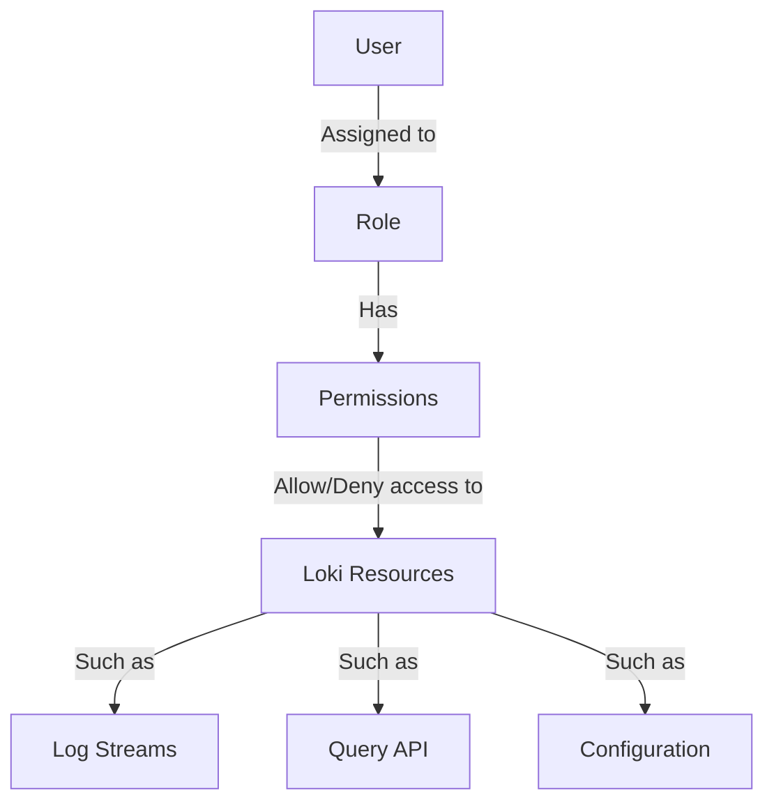
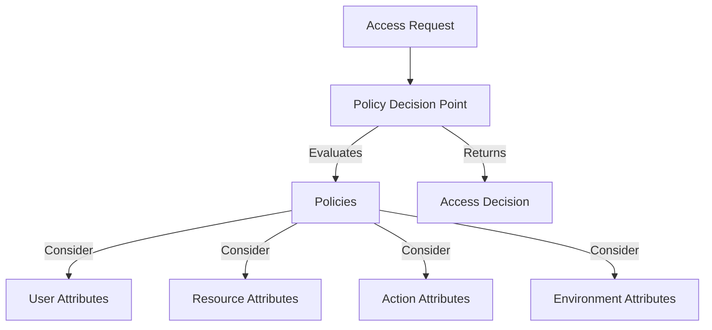
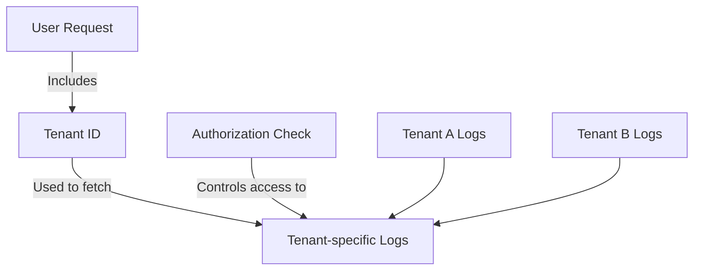
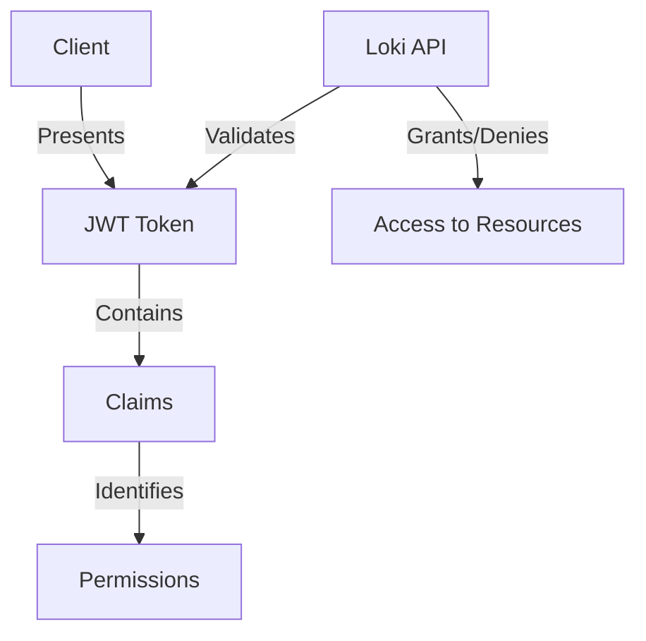

# Authorization Models

## Introduction

Authorization is a critical aspect of security in any logging system like Grafana Loki. While authentication verifies who you are, authorization determines what you're allowed to do. In this section, we'll explore the various authorization models implemented in Grafana Loki that control access to log data and functionality.

Authorization models provide structured frameworks for making access control decisions. They are essential for maintaining security, ensuring compliance, and preventing unauthorized access to sensitive log data. Grafana Loki supports several authorization models, each with its strengths and use cases.

## Basic Concepts of Authorization

Before diving into specific models, let's understand the core elements of authorization:

- **Principals**: The entities requesting access (users, services, applications)
- **Resources**: The data or functionality being accessed (log streams, queries, configurations)
- **Actions**: Operations performed on resources (read, write, delete)
- **Permissions**: The allowed relationships between principals, resources, and actions

## Role-Based Access Control (RBAC)

RBAC is one of the most common authorization models used in Grafana Loki. It assigns permissions to roles rather than individual users, simplifying access management.

### How RBAC Works in Loki

In RBAC, users are assigned roles, and roles have permissions. When a user tries to access a resource, the system checks if any of the user's roles have the necessary permissions.



### RBAC Implementation Example

Here's how you might configure RBAC in a Loki deployment using a configuration file:

```yaml
auth_enabled: true
server:
  http_listen_port: 3100

rbac:
  enabled: true
  roles:
    - name: viewer
      permissions:
        - resources: ["logs:read"]
          actions: ["read"]
    - name: editor
      permissions:
        - resources: ["logs:read", "logs:write"]
          actions: ["read", "write"]
    - name: admin
      permissions:
        - resources: ["logs:*"]
          actions: ["read", "write", "delete", "configure"]
```

When integrating with Grafana, these roles typically map to Grafana's built-in roles:

```yaml
mappings:
  - name: Grafana Viewer
    loki_role: viewer
  - name: Grafana Editor
    loki_role: editor
  - name: Grafana Admin
    loki_role: admin
```

### Advantages of RBAC

- **Simplified Management**: Administrators manage roles instead of individual permissions
- **Reduced Error Risk**: Consistent application of permissions through roles
- **Scalability**: Easily accommodates growing organizations
- **Audit Friendly**: Clear structure makes it easier to review access rights

## Attribute-Based Access Control (ABAC)

ABAC provides more granular control than RBAC by making access decisions based on attributes of users, resources, actions, and environment.

### How ABAC Works in Loki

ABAC evaluates policies that can combine multiple attributes, such as:
- User attributes (department, clearance level)
- Resource attributes (data classification, owner)
- Action attributes (time of access, access method)
- Environmental attributes (location, device type)



### ABAC Implementation Example

Here's a simplified example of ABAC policy definitions in Loki:

```yaml
abac:
  enabled: true
  policies:
    - name: "department-access"
      effect: "allow"
      condition: 
        user.department == resource.owner_department
      actions: ["read"]
      
    - name: "sensitive-logs"
      effect: "deny"
      condition: 
        resource.classification == "sensitive" && 
        !user.has_clearance
      actions: ["read", "write"]
      
    - name: "time-restricted"
      effect: "allow"
      condition: 
        time.hour >= 9 && time.hour < 17
      actions: ["write"]
```

### Advantages of ABAC

- **Granular Control**: Policies can be extremely specific
- **Contextual Decisions**: Can incorporate environmental factors
- **Dynamic**: Adapts to changing conditions without reconfiguration
- **Reduced Administration**: Policies can be written to automatically apply to new users/resources

## Multi-Tenant Authorization

Loki's multi-tenancy features provide isolation between different users or groups, effectively creating separate authorization domains.

### How Multi-Tenancy Works

In Loki, tenant IDs are used to segment data and control access. Each request includes a tenant ID, and users only see logs from their assigned tenants.



### Implementation Example

Here's how to configure multi-tenant authorization in Loki:

```yaml
auth_enabled: true
server:
  http_listen_port: 3100

multi_tenancy:
  enabled: true
  tenant_id_header: "X-Scope-OrgID"
  
limits_config:
  per_tenant_override_config: /etc/loki/tenant-overrides.yaml
```

And a tenant override configuration might look like:

```yaml
# tenant-overrides.yaml
tenants:
  team1:
    ingestion_rate_mb: 10
    max_query_parallelism: 16
  team2:
    ingestion_rate_mb: 5
    max_query_parallelism: 8
```

### Advantages of Multi-Tenancy

- **Strong Isolation**: Complete separation between different teams or applications
- **Custom Limitations**: Resource quotas can be applied per tenant
- **Simplified Compliance**: Makes it easier to meet regulatory requirements
- **Cost Allocation**: Usage can be tracked and charged back to specific teams

## Token-Based Authorization

Loki also supports token-based authorization, often implemented through JSON Web Tokens (JWTs), for fine-grained access control.

### How Token-Based Authorization Works

Tokens contain claims that describe the bearer's identity and permissions. These claims are validated when accessing Loki resources.



### Implementation Example

Configuring Loki to work with JWT-based authorization:

```yaml
auth_enabled: true
server:
  http_listen_port: 3100

auth:
  type: jwt
  jwt:
    secret: "your-secret-key"
    method: "HS256"
    valid_claims:
      - "loki_permissions"
```

Example token claims:

```json
{
  "sub": "user123",
  "exp": 1618776000,
  "loki_permissions": {
    "read": ["tenant1:*"],
    "write": ["tenant1:app1", "tenant1:app2"],
    "delete": []
  }
}
```

### Advantages of Token-Based Auth

- **Stateless**: Servers don't need to store session information
- **Portable**: Works well in distributed systems
- **Expirable**: Access can be time-limited
- **Rich Context**: Tokens can carry detailed authorization information

## Implementing Authorization in Practice

Let's look at a practical example of implementing authorization in a Grafana Loki setup:

### Step 1: Define Authorization Requirements

Start by identifying:
- Who needs access to what data
- What operations they need to perform
- Any special conditions or restrictions

### Step 2: Choose the Right Model

Based on your requirements, select the appropriate authorization model or combination:

```javascript
function selectAuthModel(requirements) {
  if (requirements.needsSimpleStructure) {
    return "RBAC";
  } else if (requirements.needsContextAwareness) {
    return "ABAC";
  } else if (requirements.needsStrictIsolation) {
    return "MultiTenancy";
  } else if (requirements.needsStatelessAuth) {
    return "TokenBased";
  } else {
    return "Combination";
  }
}
```

### Step 3: Configuration Example

Here's a complete configuration example combining multiple authorization models:

```yaml
auth_enabled: true
server:
  http_listen_port: 3100

# Multi-tenancy configuration
multi_tenancy:
  enabled: true
  tenant_id_header: "X-Scope-OrgID"

# RBAC configuration  
rbac:
  enabled: true
  roles_file: "/etc/loki/roles.yaml"

# JWT configuration
auth:
  type: jwt
  jwt:
    secret: "${JWT_SECRET}"
    method: "HS256"
    valid_claims:
      - "loki_permissions"
      - "tenant_id"
```

### Step 4: Testing Authorization

Always verify your authorization setup with test cases:

```bash
# Test RBAC with admin role
curl -H "Authorization: Bearer ${ADMIN_TOKEN}" \
     -H "X-Scope-OrgID: tenant1" \
     http://loki:3100/loki/api/v1/query?query={app="auth-test"}
     
# Test with restricted role (should fail)
curl -H "Authorization: Bearer ${VIEWER_TOKEN}" \
     -H "X-Scope-OrgID: tenant1" \
     -X POST \
     http://loki:3100/loki/api/v1/push
```

## Best Practices for Authorization

When implementing authorization in Grafana Loki, follow these best practices:

1. **Least Privilege**: Grant only the permissions necessary for each role or user
2. **Defense in Depth**: Don't rely solely on authorization; implement other security measures
3. **Regular Auditing**: Periodically review access patterns and permissions
4. **Clear Documentation**: Maintain documentation of your authorization model
5. **Test Edge Cases**: Verify that authorization works as expected in unusual scenarios
6. **Revocation Plan**: Have a process for quickly revoking access when needed

## Common Authorization Pitfalls

Watch out for these common issues:

- **Role Explosion**: Creating too many roles, making management difficult
- **Privilege Creep**: Gradually expanding permissions without review
- **Inconsistent Application**: Applying different standards across the system
- **Inadequate Logging**: Not keeping records of authorization decisions
- **Overlooking Context**: Failing to consider time, location, or other factors

## Summary

Authorization models in Grafana Loki provide the framework for controlling access to your valuable log data. By understanding and properly implementing RBAC, ABAC, multi-tenancy, and token-based authorization, you can create a secure, compliant logging environment that protects your data while enabling appropriate access.

The best authorization approach often combines multiple models, tailored to your specific requirements. Remember that authorization is not a one-time setup but an ongoing process that requires regular review and updates as your organization and threat landscape evolve.

## Additional Resources

To deepen your understanding of authorization in Grafana Loki, consider these resources:

- Official Grafana Loki documentation section on authentication and authorization
- Grafana Labs blog posts on security best practices
- OWASP guides on authorization models
- Books on access control for distributed systems

## Exercises

1. Configure a basic RBAC setup in Loki with three roles: reader, writer, and admin
2. Design an ABAC policy that restricts access to sensitive logs based on user department
3. Implement a multi-tenant configuration that isolates logs for three different application teams
4. Create a JWT token with custom claims for Loki authorization
5. Design an authorization architecture that combines elements of RBAC and multi-tenancy for a complex organization