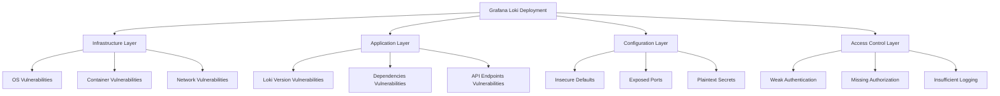
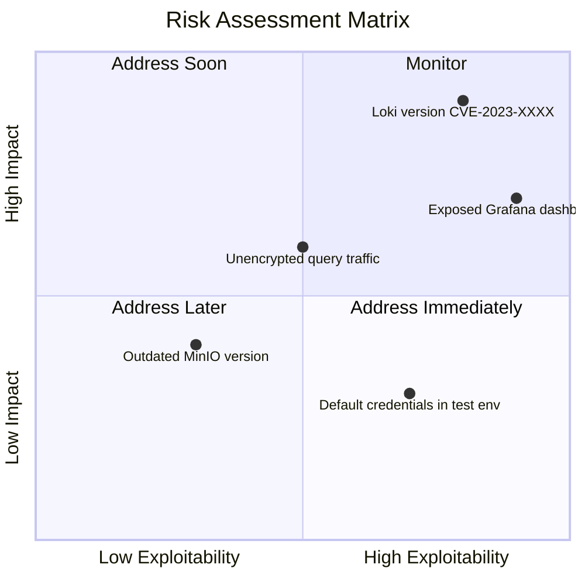

# Vulnerability Management

## Introduction

Vulnerability management is a systematic process of identifying, assessing, prioritizing, and addressing security weaknesses in your Grafana Loki deployment. As log data often contains sensitive information, securing your logging infrastructure is crucial to prevent unauthorized access, data breaches, and service disruptions.

In this guide, we'll explore the fundamental concepts of vulnerability management specific to Grafana Loki, providing you with the knowledge and tools to establish a robust security posture for your logging infrastructure.

## Understanding Vulnerabilities in Logging Systems

Vulnerabilities in logging systems like Grafana Loki can appear at different levels:

1. **Infrastructure vulnerabilities** - weaknesses in the underlying servers, containers, or cloud services
2. **Application vulnerabilities** - flaws in Loki itself or its components
3. **Configuration vulnerabilities** - misconfigurations that expose data or services
4. **Access control vulnerabilities** - inadequate authentication or authorization mechanisms

Let's visualize the vulnerability landscape in a Grafana Loki deployment:



## Setting Up a Vulnerability Management Process

A comprehensive vulnerability management strategy for Grafana Loki involves these key steps:

1. **Discovery and inventory** - Know what you're protecting
2. **Vulnerability scanning** - Identify weaknesses
3. **Risk assessment** - Prioritize vulnerabilities
4. **Remediation** - Fix the issues
5. **Verification** - Confirm the fixes work
6. **Reporting** - Document the process

Let's explore each step in detail.

### 1. Discovery and Inventory

Before you can protect your Loki deployment, you need to know what components you have. Create an inventory that includes:

```javascript
const lokiInventory = {
  components: [
    {
      name: "Loki Gateway",
      version: "2.8.0",
      location: "us-east-cluster",
      owner: "logging-team"
    },
    {
      name: "Distributor",
      version: "2.8.0",
      location: "us-east-cluster",
      owner: "logging-team"
    },
    {
      name: "Ingester",
      version: "2.8.0",
      location: "us-east-cluster",
      owner: "logging-team" 
    },
    {
      name: "Query Frontend",
      version: "2.8.0",
      location: "us-east-cluster",
      owner: "logging-team"
    }
  ],
  dependencies: [
    {
      name: "MinIO Object Storage",
      version: "RELEASE.2023-01-25T00-19-54Z",
      location: "us-east-cluster",
      owner: "storage-team"
    },
    {
      name: "Prometheus",
      version: "2.42.0",
      location: "us-east-cluster",
      owner: "monitoring-team"
    }
  ]
};
```

Document all components, their versions, locations, and the teams responsible for them.

### 2. Vulnerability Scanning

Implement regular scanning to identify vulnerabilities in your Loki deployment. Use a combination of:

- **Container image scanning** - Scan Loki container images for known vulnerabilities
- **Infrastructure scanning** - Check your Kubernetes or server environment
- **Configuration analysis** - Review your Loki configuration files
- **Dependency scanning** - Analyze dependencies for security issues

Here's an example of setting up Trivy to scan your Loki containers:

```bash
# Install Trivy
curl -sfL https://raw.githubusercontent.com/aquasecurity/trivy/main/contrib/install.sh | sh -s -- -b /usr/local/bin

# Scan the Loki container image
trivy image grafana/loki:2.8.0

# Output will list vulnerabilities with severity levels
# CRITICAL: 2
# HIGH: 15
# MEDIUM: 23
# LOW: 10
```

You can also integrate scanning into your CI/CD pipeline with a step like this:

```yaml
scan_loki_image:
  image: aquasec/trivy
  script:
    - trivy image --exit-code 1 --severity HIGH,CRITICAL grafana/loki:2.8.0
```

This will fail the pipeline if HIGH or CRITICAL vulnerabilities are found.

### 3. Risk Assessment

Not all vulnerabilities need immediate attention. Prioritize based on:

- **Severity** - How serious is the vulnerability?
- **Exploitability** - How easy is it to exploit?
- **Impact** - What could an attacker do if they exploit it?
- **Data sensitivity** - What kind of data is at risk?

Create a risk matrix to help with prioritization:



### 4. Remediation

Now it's time to fix the vulnerabilities. Common remediation actions include:

- **Upgrading** - Install the latest Loki version with security patches
- **Patching** - Apply security patches to dependencies
- **Reconfiguring** - Fix misconfigurations
- **Implementing controls** - Add security measures

Here's an example of upgrading Loki using Helm:

```bash
# Update the Helm repository
helm repo update

# Upgrade Loki to the latest version
helm upgrade --install loki grafana/loki --namespace=logging \
  --set loki.auth_enabled=true \
  --set loki.config.storage_config.aws.s3: s3://access_key:secret_key@region/bucket_name \
  --set loki.config.storage_config.aws.s3forcepathstyle: true

# Verify the deployment
kubectl get pods -n logging
```

For configuration-related vulnerabilities, you may need to update your Loki configuration file:

```yaml
auth_enabled: true

server:
  http_listen_port: 3100
  grpc_listen_port: 9096
  http_server_read_timeout: 30s
  http_server_write_timeout: 30s
  grpc_server_max_recv_msg_size: 4194304
  grpc_server_max_send_msg_size: 4194304
  log_level: warn

# Add TLS configuration
tls_config:
  cert_file: /path/to/cert.pem
  key_file: /path/to/key.pem
```

### 5. Verification

After remediation, verify that the vulnerabilities have been fixed:

1. **Rescan** the system to confirm the vulnerability is gone
2. **Test** the security controls you've implemented
3. **Monitor** for any signs of compromise

Here's a script to verify a recent Loki upgrade:

```bash
#!/bin/bash

# Check Loki version
VERSION=$(curl -s http://loki:3100/ready | grep -o "version=.*" | cut -d= -f2)
if [[ "$VERSION" != "2.8.0" ]]; then
  echo "Upgrade failed: Expected version 2.8.0, got $VERSION"
  exit 1
fi

# Check for TLS
TLS_ENABLED=$(curl -k -s https://loki:3100/ready > /dev/null && echo "Yes" || echo "No")
if [[ "$TLS_ENABLED" != "Yes" ]]; then
  echo "TLS not properly configured"
  exit 1
fi

# Check authentication is required
AUTH_REQUIRED=$(curl -s http://loki:3100/loki/api/v1/labels 2>&1 | grep -c "authentication required")
if [[ "$AUTH_REQUIRED" -eq 0 ]]; then
  echo "Authentication not properly configured"
  exit 1
fi

echo "Verification successful!"
```

### 6. Reporting

Document your vulnerability management activities to maintain visibility and track progress:

- **Create dashboards** showing vulnerability status
- **Generate reports** for stakeholders
- **Document lessons learned** for continuous improvement

Here's an example of how to use Grafana to monitor the security status of your Loki deployment:

```bash
# Create a Prometheus metric for Loki vulnerabilities
cat <<EOF > loki_vulnerability_metrics.yaml
- name: loki_vulnerabilities_total
  type: gauge
  help: Number of vulnerabilities by severity
  labels:
    - component
    - severity
EOF

# Push vulnerability counts to Prometheus
cat <<EOF | curl --data-binary @- http://prometheus:9091/metrics/job/loki_security
# HELP loki_vulnerabilities_total Number of vulnerabilities by severity
# TYPE loki_vulnerabilities_total gauge
loki_vulnerabilities_total{component="loki-gateway",severity="critical"} 0
loki_vulnerabilities_total{component="loki-gateway",severity="high"} 2
loki_vulnerabilities_total{component="loki-distributor",severity="critical"} 0
loki_vulnerabilities_total{component="loki-distributor",severity="high"} 3
loki_vulnerabilities_total{component="loki-ingester",severity="critical"} 1
loki_vulnerabilities_total{component="loki-ingester",severity="high"} 5
loki_vulnerabilities_total{component="loki-query-frontend",severity="critical"} 0
loki_vulnerabilities_total{component="loki-query-frontend",severity="high"} 1
EOF
```

Then create a Grafana dashboard to visualize this data.

## Real-World Vulnerability Management for Grafana Loki

Let's look at a practical example of vulnerability management in action:

**Scenario**: Your security scanner has identified that your Loki deployment is vulnerable to CVE-2023-XXXXX, a critical vulnerability in the query handling component that could allow log data exfiltration.

**Step 1**: Assess the risk
- Severity: Critical (CVSS score 9.2)
- Exploitability: Medium (requires authenticated access)
- Impact: High (could expose all log data)

**Step 2**: Plan remediation
1. Temporarily restrict access to query APIs until patched
2. Upgrade Loki to the latest patched version
3. Review logs for signs of exploitation

**Step 3**: Implement temporary mitigation
```yaml
# Update Kubernetes NetworkPolicy to restrict query API access
apiVersion: networking.k8s.io/v1
kind: NetworkPolicy
metadata:
  name: restrict-loki-query
  namespace: logging
spec:
  podSelector:
    matchLabels:
      app: loki
      component: query-frontend
  ingress:
  - from:
    - podSelector:
        matchLabels:
          app: grafana
    ports:
    - protocol: TCP
      port: 3100
```

**Step 4**: Apply the permanent fix (upgrade Loki)
```bash
# Upgrade Loki to patched version
helm upgrade loki grafana/loki --namespace logging --set image.tag=2.8.1
```

**Step 5**: Verify the fix
```bash
# Check if vulnerability is still present
curl -s -X GET -H "Authorization: Bearer $TOKEN" \
  https://loki:3100/vulnerable_endpoint

# Expected response: 404 Not Found (endpoint removed in the fix)
```

**Step 6**: Document and report
- Update the security dashboard with patch status
- Send notification to stakeholders
- Document lessons learned

## Best Practices for Ongoing Vulnerability Management

To maintain a strong security posture for your Grafana Loki deployment:

1. **Stay informed** about new vulnerabilities
   - Subscribe to the [Grafana security mailing list](https://grafana.com/security/)
   - Enable automatic security alerts from your cloud provider

2. **Automate scanning** to catch issues early
   - Implement regular vulnerability scans (daily/weekly)
   - Include scanning in your CI/CD pipeline

3. **Harden your Loki configuration**
   - Enable authentication and authorization
   - Use TLS for all communications
   - Implement least-privilege access controls

4. **Keep dependencies updated**
   - Use a dependency management tool
   - Regularly review and update dependencies

5. **Monitor for suspicious activity**
   - Create alerts for unusual query patterns
   - Log all access to administrative endpoints

6. **Test your security controls**
   - Conduct regular security assessments
   - Perform penetration testing annually

## Implementing a Security-Focused Logging Strategy

While securing Loki itself is important, also consider how to use Loki to improve your overall security posture:

1. **Collect security-relevant logs**
   - Authentication attempts
   - Authorization decisions
   - Configuration changes
   - Administrative actions

2. **Create security dashboards** to visualize:
   - Failed login attempts
   - Unusual access patterns
   - Privilege escalation events

3. **Set up alerting for security events**

Here's an example LogQL query to detect potential security issues:

```logql
{job="nginx"} |= "POST /login" 
| json | status >= 400 
| by_label(ip, user) 
| count_over_time[15m] > 5
```

This query detects multiple failed login attempts from the same IP address within a 15-minute window.

## Summary

Vulnerability management is a critical aspect of securing your Grafana Loki deployment. By implementing a systematic approach to identifying, assessing, and remediating vulnerabilities, you can protect your logging infrastructure and the sensitive data it contains.

Remember that vulnerability management is not a one-time activity but an ongoing process that requires continuous attention and improvement. Stay vigilant, keep your systems updated, and integrate security into your logging practices.

## Additional Resources

- [Grafana Loki Security Documentation](https://grafana.com/docs/loki/latest/operations/security/)
- [OWASP Logging Cheat Sheet](https://cheatsheetseries.owasp.org/cheatsheets/Logging_Cheat_Sheet.html)
- [NIST Vulnerability Management Guide](https://csrc.nist.gov/publications/detail/sp/800-40/rev-3/final)

## Exercises

1. **Vulnerability Scanning Exercise**
   - Install Trivy and scan your Loki container images
   - Document any vulnerabilities found and create a remediation plan

2. **Security Configuration Review**
   - Audit your Loki configuration for security best practices
   - Implement at least three security improvements

3. **Log Analysis Exercise**
   - Create a LogQL query to detect potential security incidents
   - Set up a Grafana dashboard to visualize security events

4. **Incident Response Simulation**
   - Simulate a security incident affecting your Loki deployment
   - Practice your response procedures and document lessons learned