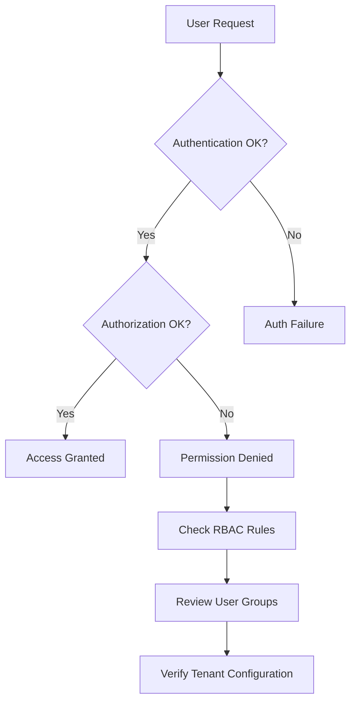

# Security Troubleshooting

## Introduction

When working with Grafana Loki, security issues can arise that need prompt troubleshooting. This guide will walk you through common security problems and their solutions. Security troubleshooting is a critical skill for maintaining the integrity and confidentiality of your logging system, especially in production environments where Loki manages sensitive log data.

## Common Security Issues and Solutions

### Authentication Problems

Authentication issues are among the most frequent security problems when working with Grafana Loki.

#### Symptom: Unable to access Loki API endpoints

If you're encountering "Unauthorized" or "Forbidden" errors when attempting to query Loki, you might be facing authentication issues.

**Troubleshooting Steps:**

1. **Check API Token Validity**:

```bash
# Test your API token with a simple query
curl -H "Authorization: Bearer YOUR_TOKEN" \
  http://your-loki-instance:3100/loki/api/v1/labels
```

2. **Verify Token Configuration in Grafana**:

Navigate to Configuration → Data Sources → Loki and check if your authentication details are correct.

```yaml
# Example of correct configuration in Grafana
apiVersion: 1
datasources:
  - name: Loki
    type: loki
    access: proxy
    url: http://loki:3100
    basicAuth: true
    basicAuthUser: your_username
    secureJsonData:
      basicAuthPassword: your_password
```

3. **Review Loki's Authentication Logs**:

```bash
# Query Loki's internal logs for authentication failures
logcli query '{job="loki"} |= "authentication failed"'
```

### Authorization and Access Control Issues

#### Symptom: Users can see logs they shouldn't have access to

**Troubleshooting Steps:**

1. **Review Tenant Configuration**:

Loki uses multi-tenancy to isolate logs. Check if your tenant IDs are properly configured.

```yaml
# Example tenant configuration in Loki
auth_enabled: true
server:
  http_listen_port: 3100
  
# Tenant-specific configuration
multi_tenant_enabled: true
```

2. **Check Query Permissions**:

```bash
# Test a query with X-Scope-OrgID header to verify tenant isolation
curl -H "X-Scope-OrgID: tenant1" \
  http://your-loki-instance:3100/loki/api/v1/query_range \
  -d 'query={job="system"}' \
  -d 'start=1636000000' \
  -d 'end=1636001000'
```

3. **Audit Access Patterns**:

Enable audit logging to track who's accessing what data.

```yaml
# Enable audit logging in Loki configuration
limits_config:
  audit_log_enabled: true
```

### TLS Certificate Issues

#### Symptom: Certificate validation errors or insecure connections

**Troubleshooting Steps:**

1. **Verify Certificate Validity**:

```bash
# Check if the certificate is valid and hasn't expired
openssl x509 -in /path/to/cert.pem -text -noout | grep "Not After"
```

2. **Test TLS Handshake**:

```bash
# Test the TLS handshake without sending any data
openssl s_client -connect your-loki-instance:3100
```

3. **Review TLS Configuration**:

```yaml
# Proper TLS configuration example
server:
  http_listen_port: 3100
  grpc_listen_port: 9096
  http_server_read_timeout: 1m
  http_server_write_timeout: 1m
  grpc_server_max_recv_msg_size: 1024M
  grpc_server_max_send_msg_size: 1024M
  
  # TLS configuration
  http_tls_config:
    cert_file: /path/to/cert.pem
    key_file: /path/to/key.pem
    client_ca_file: /path/to/ca.pem
```

## Security Monitoring and Auditing

### Setting Up Alerting for Security Events

Monitoring security-related events is crucial for proactive troubleshooting.

```yaml
# Example Alerting Rule for Failed Authentication Attempts
groups:
  - name: loki_security_alerts
    rules:
      - alert: HighNumberOfAuthFailures
        expr: sum(count_over_time({job="loki"} |= "authentication failed"[15m])) > 10
        for: 5m
        labels:
          severity: warning
        annotations:
          summary: High number of authentication failures
          description: There have been more than 10 authentication failures in the last 15 minutes.
```

### Debugging RBAC Configuration

Role-Based Access Control (RBAC) issues can be complex to troubleshoot.



To debug RBAC issues:

1. **Test with different user roles**:

```bash
# Test with an admin user
curl -H "Authorization: Bearer ADMIN_TOKEN" \
  http://your-loki-instance:3100/loki/api/v1/labels

# Test with a read-only user
curl -H "Authorization: Bearer READONLY_TOKEN" \
  http://your-loki-instance:3100/loki/api/v1/labels
```

2. **Verify rule matching**:

```bash
# Check which rules apply to a specific label query
curl -H "Authorization: Bearer YOUR_TOKEN" \
  "http://your-loki-instance:3100/loki/api/v1/rules"
```

## Secrets Management Troubleshooting

### Symptom: Credentials exposed in logs or configurations

**Troubleshooting Steps:**

1. **Scan for exposed secrets**:

```bash
# Use a tool like trufflehog to scan for secrets
trufflehog --regex --entropy=False /path/to/your/config/files
```

2. **Review environment variable usage**:

```yaml
# Safe way to handle secrets in Loki configuration
auth:
  type: basic
  basic:
    username: ${LOKI_USERNAME}
    password: ${LOKI_PASSWORD}
```

3. **Implement proper secrets rotation**:

```bash
# Script to rotate API keys
#!/bin/bash
NEW_KEY=$(openssl rand -hex 16)
# Update key in secret store
kubectl create secret generic loki-api-key --from-literal=key=$NEW_KEY -n loki --dry-run=client -o yaml | kubectl apply -f -
# Restart services to pick up new key
kubectl rollout restart deployment/loki -n loki
```

## Network Security Issues

### Symptom: Unexpected network connectivity or blocked connections

**Troubleshooting Steps:**

1. **Test network connectivity**:

```bash
# Check if Loki port is reachable
nc -zv your-loki-instance 3100

# Trace network path
traceroute your-loki-instance
```

2. **Review firewall rules**:

```bash
# Check iptables rules affecting Loki
sudo iptables -L | grep 3100
```

3. **Verify network policies** (in Kubernetes):

```yaml
# Example NetworkPolicy allowing Grafana to access Loki
apiVersion: networking.k8s.io/v1
kind: NetworkPolicy
metadata:
  name: allow-grafana-to-loki
spec:
  podSelector:
    matchLabels:
      app: loki
  ingress:
  - from:
    - podSelector:
        matchLabels:
          app: grafana
    ports:
    - protocol: TCP
      port: 3100
```

## Best Practices for Security Troubleshooting

1. **Establish a baseline**: Know what normal operation looks like before issues arise.
2. **Use diagnostic tools**: Utilize `logcli`, `curl`, and monitoring tools to diagnose issues.
3. **Maintain an incident response plan**: Document steps to take when security issues are detected.
4. **Regular security audits**: Periodically review your Loki setup for vulnerabilities.
5. **Follow the principle of least privilege**: Ensure users and services have only the permissions they need.

## Advanced Security Troubleshooting

### Debugging Tenant Isolation Issues

Multi-tenancy is a powerful feature in Loki but can lead to complex security issues.

```bash
# Test if logs from tenant1 are visible to tenant2
curl -H "X-Scope-OrgID: tenant1" \
  http://your-loki-instance:3100/loki/api/v1/push \
  -H "Content-Type: application/json" \
  --data-binary '{
    "streams": [
      {
        "stream": {
          "job": "test"
        },
        "values": [
          ["1636000000000000000", "test message for tenant isolation"]
        ]
      }
    ]
  }'

# Now try to query this log as tenant2
curl -H "X-Scope-OrgID: tenant2" \
  http://your-loki-instance:3100/loki/api/v1/query \
  -d 'query={job="test"} |= "tenant isolation"'
```

If tenant2 can see logs pushed by tenant1, you have a tenant isolation issue.

### Troubleshooting Audit Logging

Audit logs are essential for security troubleshooting and compliance.

```yaml
# Enable comprehensive audit logging
limits_config:
  audit_log_enabled: true
  retention_period: 30d

frontend:
  log_queries_longer_than: 5s
  compress_responses: true
```

Query your audit logs to troubleshoot security issues:

```bash
# Find all queries from a specific user
logcli query '{job="loki"} | json | user="suspicious-user"'

# Find all queries accessing sensitive data
logcli query '{job="loki"} | json | query=~".*password.*|.*credential.*|.*secret.*"'
```

## Summary

Security troubleshooting in Grafana Loki requires a systematic approach and understanding of various components:

1. **Authentication and Authorization**: Ensuring proper access controls are in place
2. **TLS and Encryption**: Securing data in transit
3. **Monitoring and Alerting**: Proactively identifying security issues
4. **Network Security**: Controlling who can connect to your Loki instance
5. **Multi-tenancy**: Properly isolating data between different users or organizations

By following the troubleshooting steps in this guide, you'll be better equipped to identify, diagnose, and resolve security issues in your Grafana Loki deployment.

## Additional Resources

- [Official Loki Security Documentation](https://grafana.com/docs/loki/latest/operations/security/)
- [OWASP Logging Cheat Sheet](https://cheatsheetseries.owasp.org/cheatsheets/Logging_Cheat_Sheet.html)
- [CIS Benchmarks for Logging Systems](https://www.cisecurity.org/benchmark/)

## Exercises

1. Set up a test Loki instance and intentionally misconfigure authentication. Practice troubleshooting and fixing the issue.
2. Create a security audit checklist for your Loki deployment.
3. Implement and test tenant isolation in a multi-tenant Loki setup.
4. Configure alerts for common security events in your Loki deployment.
5. Practice responding to a simulated security incident involving unauthorized access to logs.