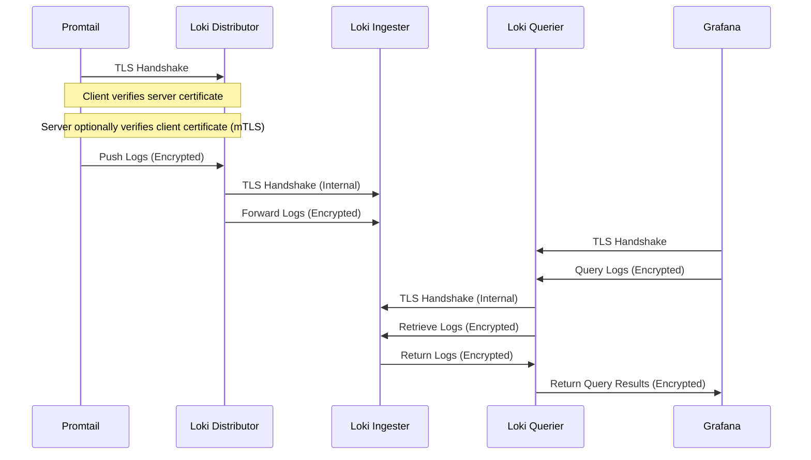

# TLS Configuration

## Introduction

Transport Layer Security (TLS) is a cryptographic protocol designed to provide secure communication over a computer network. When working with Grafana Loki, configuring TLS is essential to protect your log data during transmission between Loki components and clients. This guide will walk you through the process of setting up TLS for Grafana Loki, ensuring that your logging infrastructure remains secure and protected from potential eavesdropping or data tampering.

## Why TLS Matters for Loki

Loki is often used to store sensitive application logs that might contain valuable information. Without proper encryption:

- Log data could be intercepted during transmission
- Unauthorized users might access your logging system
- The integrity of your logs cannot be guaranteed

TLS addresses these concerns by:

1. **Encrypting data** during transmission
2. **Authenticating** the server (and optionally the client)
3. **Ensuring data integrity** by detecting tampering

## TLS Concepts for Loki

Before diving into configuration, let's understand some key concepts:

- **Certificates**: Digital documents that verify the identity of a server or client
- **Private Keys**: Secret keys used to decrypt data encrypted with the corresponding public key
- **Certificate Authority (CA)**: Trusted entity that issues certificates
- **Self-signed Certificates**: Certificates signed by your own private key (useful for testing)

## TLS Configuration Options in Loki

Loki supports TLS configuration in various components:

1. **Server-side TLS**: For securing incoming connections to Loki components
2. **Client-side TLS**: For securing outgoing connections from Loki components
3. **Mutual TLS (mTLS)**: For bidirectional authentication

Let's explore how to configure each of these options.

## Server-side TLS Configuration

To enable TLS on Loki servers (distributor, ingester, querier, etc.), you need to:

1. Obtain valid TLS certificates
2. Configure Loki components to use these certificates

### Example: Configuring Server-side TLS

Here's how to configure a Loki component with TLS in your YAML configuration:

```yaml
server:
  http_listen_port: 3100
  grpc_listen_port: 9095
  http_server_read_timeout: 1m
  http_server_write_timeout: 1m
  grpc_server_max_recv_msg_size: 104857600
  grpc_server_max_send_msg_size: 104857600
  
  # TLS configuration
  http_tls_config:
    cert_file: /path/to/cert.pem
    key_file: /path/to/key.pem
  
  # GRPC TLS configuration
  grpc_tls_config:
    cert_file: /path/to/cert.pem
    key_file: /path/to/key.pem
```

## Client-side TLS Configuration

For Loki components that need to connect to other services (like other Loki components or storage backends), you may need to configure client-side TLS:

```yaml
client:
  grpc_client_config:
    max_recv_msg_size: 104857600
    max_send_msg_size: 104857600
    grpc_compression: ""
    
    # TLS configuration for client connections
    tls_config:
      ca_file: /path/to/ca.pem
      cert_file: /path/to/client-cert.pem
      key_file: /path/to/client-key.pem
      insecure_skip_verify: false
```

## Creating Self-signed Certificates for Testing

For development or testing environments, you can create self-signed certificates using OpenSSL:

```bash
# Generate a private key
openssl genrsa -out loki-key.pem 2048

# Generate a self-signed certificate
openssl req -x509 -new -nodes -key loki-key.pem -sha256 -days 365 -out loki-cert.pem
```

## Configuring Mutual TLS (mTLS)

Mutual TLS adds an extra layer of security by requiring both the server and client to authenticate each other. This is particularly useful in microservice architectures.

To configure mTLS:

```yaml
server:
  http_tls_config:
    cert_file: /path/to/cert.pem
    key_file: /path/to/key.pem
    client_ca_file: /path/to/client-ca.pem
    client_auth_type: RequireAndVerifyClientCert
```

The `client_auth_type` option can be set to:
- `NoClientCert`: Client certificates are not requested
- `RequestClientCert`: Client certificates are requested but not required
- `RequireAnyClientCert`: Client certificates are required but not verified
- `VerifyClientCertIfGiven`: Client certificates are verified if provided
- `RequireAndVerifyClientCert`: Client certificates are required and verified

## TLS Configuration for Promtail

When using Promtail as a log collector, you'll also need to configure TLS:

```yaml
clients:
  - url: https://loki.example.com/loki/api/v1/push
    tls_config:
      ca_file: /path/to/ca.pem
      cert_file: /path/to/client-cert.pem
      key_file: /path/to/client-key.pem
      server_name: loki.example.com
      insecure_skip_verify: false
```

## TLS Configuration Flow

Here's a diagram of how TLS works in a typical Loki setup:



## Common TLS Configuration Issues

### Troubleshooting Certificate Problems

If you encounter TLS errors, check these common issues:

1. **Expired Certificates**: Ensure your certificates are valid and not expired
   ```bash
   openssl x509 -in cert.pem -text -noout | grep "Not After"
   ```

2. **Incorrect Permissions**: Ensure your key files have proper permissions
   ```bash
   chmod 600 /path/to/key.pem
   ```

3. **Certificate Chain Issues**: Ensure your CA file includes the complete certificate chain
   ```bash
   openssl verify -CAfile ca.pem cert.pem
   ```

4. **Hostname Mismatch**: The certificate's CN or SAN must match the hostname used to connect
   ```bash
   openssl x509 -in cert.pem -text -noout | grep -A1 "Subject Alternative Name"
   ```

## Performance Considerations

TLS adds some overhead to your Loki deployment:

1. **CPU Usage**: TLS encryption/decryption requires additional CPU resources
2. **Handshake Latency**: Initial TLS handshakes add connection setup time
3. **Session Reuse**: Enable session reuse to reduce handshake overhead for frequent connections

For high-throughput environments, consider:

```yaml
server:
  http_tls_config:
    cert_file: /path/to/cert.pem
    key_file: /path/to/key.pem
    min_version: TLS12
    max_version: TLS13
    prefer_server_cipher_suites: true
    cipher_suites:
      - TLS_ECDHE_ECDSA_WITH_AES_256_GCM_SHA384
      - TLS_ECDHE_RSA_WITH_AES_256_GCM_SHA384
```

## Best Practices for TLS in Production

1. **Use a Proper CA**: In production, obtain certificates from a trusted certificate authority
2. **Implement Certificate Rotation**: Set up a process to renew certificates before they expire
3. **Use TLS 1.3 When Possible**: Prefer newer TLS versions for better security and performance
4. **Monitor Certificate Expiry**: Set up alerts for certificates nearing expiration
5. **Secure Private Keys**: Store private keys securely and limit access to them
6. **Use Strong Cipher Suites**: Configure secure cipher suites and disable weak ones

## Integrating with Certificate Management Tools

For production environments, consider using certificate management tools:

- **cert-manager**: For Kubernetes-based deployments
- **HashiCorp Vault**: For centralized secret management
- **Let's Encrypt**: For automated certificate issuance and renewal

## Example: Complete TLS Configuration for Loki

Here's a comprehensive example combining server and client TLS configuration:

```yaml
auth_enabled: true

server:
  http_listen_port: 3100
  http_tls_config:
    cert_file: /etc/loki/certs/server.crt
    key_file: /etc/loki/certs/server.key
    client_ca_file: /etc/loki/certs/ca.crt
    client_auth_type: RequireAndVerifyClientCert
  
  grpc_tls_config:
    cert_file: /etc/loki/certs/server.crt
    key_file: /etc/loki/certs/server.key
    client_ca_file: /etc/loki/certs/ca.crt
    client_auth_type: RequireAndVerifyClientCert

common:
  path_prefix: /loki
  storage:
    filesystem:
      chunks_directory: /loki/chunks
      rules_directory: /loki/rules
  ring:
    kvstore:
      store: memberlist

memberlist:
  tls_config:
    cert_file: /etc/loki/certs/memberlist.crt
    key_file: /etc/loki/certs/memberlist.key
    ca_file: /etc/loki/certs/ca.crt

ingester:
  lifecycler:
    ring:
      kvstore:
        store: memberlist
  chunk_idle_period: 1h
  chunk_block_size: 262144
  chunk_encoding: snappy
  chunk_retain_period: 30s
  max_transfer_retries: 0
  wal:
    dir: /loki/wal

storage_config:
  hedging:
    at: 250ms
    max_per_second: 20
    
querier:
  engine:
    timeout: 3m
```

## Summary

TLS configuration is a crucial aspect of securing your Grafana Loki deployment. By properly implementing TLS, you ensure that:

- Your log data remains encrypted during transmission
- Your Loki components can authenticate each other
- Your logging infrastructure is protected against unauthorized access

Remember that TLS is just one part of a comprehensive security strategy for your logging infrastructure. It should be combined with proper authentication, authorization, and network security measures.

## Additional Resources

- [Official Grafana Loki Security Documentation](https://grafana.com/docs/loki/latest/operations/security/)
- [OpenSSL Cookbook](https://www.feistyduck.com/library/openssl-cookbook/)
- [Mozilla SSL Configuration Generator](https://ssl-config.mozilla.org/)

## Exercises

1. Set up a local Loki instance with self-signed certificates and configure Promtail to connect using TLS.
2. Configure mutual TLS between Loki components in a distributed setup.
3. Create a script to monitor certificate expiration dates and alert when certificates are nearing expiration.
4. Implement certificate rotation in a Loki deployment without downtime.
5. Benchmark the performance impact of different TLS configurations on your Loki deployment.