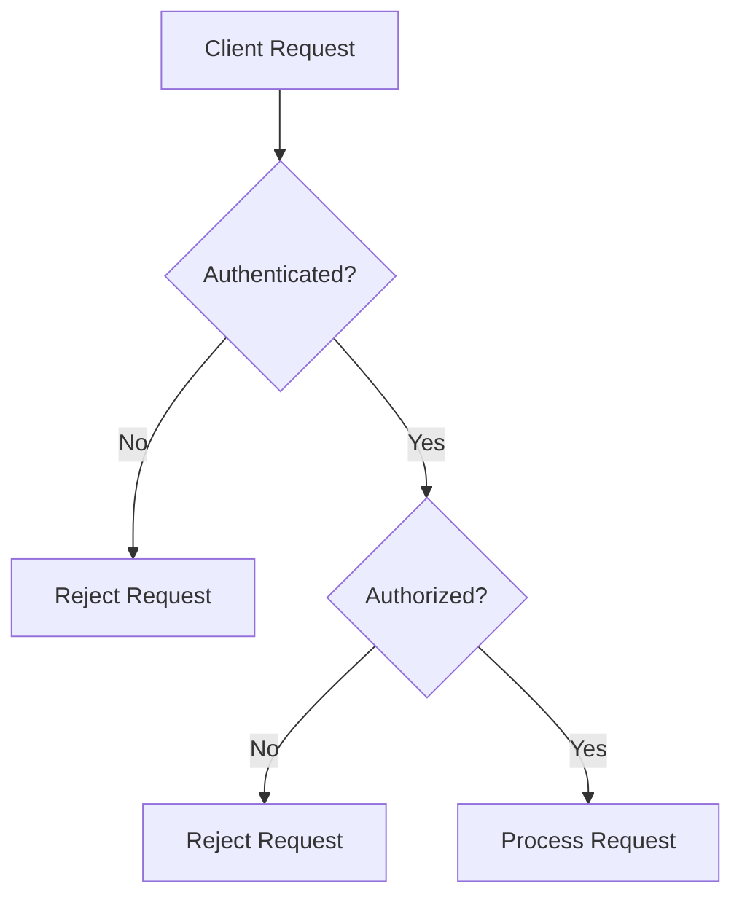

# API Security

## Introduction

API Security is a critical component of modern application ecosystems, especially in observability platforms like Grafana Loki. APIs (Application Programming Interfaces) serve as the communication channels between different services, allowing them to exchange data and functionality. However, these interfaces can become potential attack vectors if not properly secured.

This guide explores essential API security concepts and practices specifically in the context of Grafana Loki implementations. Whether you're exposing APIs for log queries or integrating with other systems, understanding how to protect these endpoints is crucial for maintaining the integrity and confidentiality of your logging data.

## Why API Security Matters for Loki

Grafana Loki's API endpoints are particularly sensitive because they:

1. Provide access to potentially sensitive log data
2. Could be used to overwhelm your system if abused
3. Might expose internal system details if not properly secured
4. Enable configuration changes that could affect your entire observability stack

## Core API Security Concepts

### Authentication vs. Authorization

Before diving into implementation details, let's understand two fundamental concepts:

- **Authentication** (AuthN): Verifies the identity of a user or service ("Who are you?")
- **Authorization** (AuthZ): Determines what the authenticated entity can access ("What can you do?")



## Common API Security Vulnerabilities

When working with Grafana Loki APIs, be aware of these common security issues:

### 1. Insufficient Authentication

Without proper authentication, unauthorized users can access your Loki endpoints and query sensitive logs.

### 2. Missing Authorization Controls

Even with authentication in place, lack of proper authorization can allow authenticated users to access logs they shouldn't see.

### 3. Injection Attacks

Unsanitized inputs in LogQL queries can potentially lead to injection attacks, similar to SQL injection in databases.

### 4. Excessive Data Exposure

Returning excessive information in API responses may leak sensitive data or system information.

### 5. Rate Limiting Bypass

Without proper rate limiting, attackers can overwhelm your Loki instance with numerous requests.

## Securing Loki's API Endpoints

### Authentication Methods

Loki supports several authentication methods:

#### Basic Authentication

Basic auth uses a username and password combination encoded in the request header.

```typescript
// Example of calling Loki API with Basic Auth
const headers = new Headers();
const credentials = btoa('username:password');
headers.append('Authorization', `Basic ${credentials}`);

fetch('http://loki:3100/loki/api/v1/query', {
  method: 'GET',
  headers: headers
})
.then(response => response.json())
.then(data => console.log(data));
```

#### Token-based Authentication

Token-based auth, particularly JWT (JSON Web Tokens), provides a more secure and scalable approach.

```typescript
// Example of calling Loki API with JWT
const headers = new Headers();
headers.append('Authorization', `Bearer ${jwtToken}`);

fetch('http://loki:3100/loki/api/v1/query', {
  method: 'GET',
  headers: headers
})
.then(response => response.json())
.then(data => console.log(data));
```

#### OAuth 2.0 Integration

For enterprise environments, Loki can be integrated with OAuth 2.0 providers like Auth0, Okta, or Keycloak.

### Implementing Authorization Controls

Once a user is authenticated, you need to control what they can access:

#### Role-Based Access Control (RBAC)

Configure RBAC to limit which log streams different users or services can query.

```yaml
# Example Loki RBAC configuration in a Kubernetes environment
apiVersion: v1
kind: ConfigMap
metadata:
  name: loki-rbac-config
data:
  loki.yaml: |
    auth_enabled: true
    server:
      http_listen_port: 3100
    
    # RBAC configuration
    auth:
      type: enterprise
      enterprise:
        rbac:
          enabled: true
          roles:
            - name: admin
              permissions:
                - actions: ["read", "write"]
                  resources: ["*"]
            - name: reader
              permissions:
                - actions: ["read"]
                  resources: ["logs"]
```

#### Tenant Isolation

Implement tenant isolation to segregate logs from different applications or environments.

```typescript
// Example of calling Loki API with tenant header
const headers = new Headers();
headers.append('X-Scope-OrgID', 'tenant123');

fetch('http://loki:3100/loki/api/v1/query', {
  method: 'GET',
  headers: headers
})
.then(response => response.json())
.then(data => console.log(data));
```

### Protecting Against Injection

To prevent LogQL injection attacks, always validate and sanitize user inputs:

```typescript
// Example of sanitizing LogQL query parameters
function sanitizeLogQLQuery(query) {
  // Remove potentially dangerous characters or patterns
  const sanitized = query.replace(/[;\(\)]/g, '');
  
  // Validate the query follows expected patterns
  if (!/^[a-zA-Z0-9\s\{\}\[\]"'=!<>|]+$/.test(sanitized)) {
    throw new Error('Invalid LogQL query format');
  }
  
  return sanitized;
}

// Usage
try {
  const userQuery = '{job="varlogs"}';
  const safeQuery = sanitizeLogQLQuery(userQuery);
  
  fetch(`http://loki:3100/loki/api/v1/query?query=${encodeURIComponent(safeQuery)}`)
    .then(response => response.json());
} catch (error) {
  console.error('Invalid query:', error.message);
}
```

### Implementing Rate Limiting

Protect your Loki API from abuse with rate limiting:

```yaml
# Example rate limiting configuration
limits_config:
  ingestion_rate_mb: 10
  ingestion_burst_size_mb: 20
  max_global_streams_per_user: 5000
  query_timeout: 1m
  max_query_parallelism: 16
  max_query_length: 721h
  max_query_range: 721h
```

## Transport Layer Security

Always use TLS to encrypt API communications:

```yaml
# Example Loki server TLS configuration
server:
  http_listen_port: 3100
  grpc_listen_port: 9096
  http_server_read_timeout: 1m
  http_server_write_timeout: 1m
  grpc_server_max_recv_msg_size: 4194304
  grpc_server_max_send_msg_size: 4194304
  http_server_read_header_timeout: 1m
  http_server_idle_timeout: 1m
  
  tls_config:
    cert_file: /path/to/cert.pem
    key_file: /path/to/key.pem
```

## API Security Testing Tools

Regularly test your Loki API security with these tools:

### OWASP ZAP

OWASP ZAP (Zed Attack Proxy) can scan your API endpoints for vulnerabilities.

```bash
# Example ZAP CLI command to scan Loki API
zap-cli quick-scan --self-contained --start-options "-config api.disablekey=true" http://loki:3100/
```

### Postman

Use Postman to create security test collections for your Loki API.

```javascript
// Example Postman test script for checking auth headers
pm.test("Should reject requests without auth", function () {
    pm.expect(pm.response.code).to.equal(401);
    pm.expect(pm.response.text()).to.include("unauthorized");
});
```

## Real-World Example: Securing Grafana Loki in Production

Let's walk through a complete example of securing a Loki deployment in production:

### 1. Create a TLS Configuration

First, generate certificates for your Loki instance:

```bash
# Generate a self-signed certificate for testing
openssl req -x509 -newkey rsa:4096 -keyout key.pem -out cert.pem -days 365 -nodes
```

### 2. Configure Authentication

Set up an authentication proxy (like OAuth2-Proxy) in front of Loki:

```yaml
# Sample Docker Compose configuration with OAuth2-Proxy
version: '3'
services:
  oauth2-proxy:
    image: quay.io/oauth2-proxy/oauth2-proxy
    command:
      - --provider=github
      - --email-domain=*
      - --upstream=http://loki:3100
      - --http-address=0.0.0.0:4180
      - --cookie-secret=your-secret-here
      - --client-id=your-github-client-id
      - --client-secret=your-github-client-secret
    ports:
      - "4180:4180"
  
  loki:
    image: grafana/loki:latest
    volumes:
      - ./loki-config.yaml:/etc/loki/local-config.yaml
    command: -config.file=/etc/loki/local-config.yaml
```

### 3. Implement RBAC with Labels

Use label-based authorization in Loki to control access to different log streams:

```yaml
# In Loki configuration
auth_enabled: true
server:
  http_listen_port: 3100

auth:
  type: enterprise
  enterprise:
    rbac:
      enabled: true
```

### 4. Set Up API Rate Limiting

```yaml
# Rate limiting configuration
limits_config:
  ingestion_rate_mb: 4
  ingestion_burst_size_mb: 6
  max_query_length: 24h
  max_query_parallelism: 8
  per_tenant_override_config: /etc/loki/tenant-overrides.yaml
```

### 5. Add Query Validation Middleware

Create a middleware to validate LogQL queries:

```typescript
// Express.js middleware example
function validateLogQLMiddleware(req, res, next) {
  const query = req.query.query || '';
  
  // Check for potentially dangerous patterns
  const dangerousPatterns = [
    /\{.*\}\s*;\s*.*/i,  // Multiple statements
    /.*\|\s*.*unwrap.*/i, // Certain operations that might cause high load
  ];
  
  for (const pattern of dangerousPatterns) {
    if (pattern.test(query)) {
      return res.status(400).json({
        error: 'Invalid query pattern detected'
      });
    }
  }
  
  // Check query complexity
  if (query.split('|').length > 5) {
    return res.status(400).json({
      error: 'Query too complex, please simplify'
    });
  }
  
  next();
}

// Apply the middleware to your API routes
app.use('/loki/api/v1/query', validateLogQLMiddleware);
```

## Best Practices Summary

1. **Always use TLS/SSL** for all API communications
2. **Implement proper authentication** for all Loki endpoints
3. **Apply fine-grained authorization** using RBAC or tenant isolation
4. **Validate and sanitize all inputs**, especially LogQL queries
5. **Implement rate limiting** to prevent abuse
6. **Use API gateways** for additional security layers
7. **Apply the principle of least privilege** for all service accounts
8. **Regularly audit API access logs** for suspicious activity
9. **Perform security testing** using tools like OWASP ZAP
10. **Keep Grafana Loki updated** to protect against known vulnerabilities

## Hands-On Exercise: Securing Your First Loki API

Try this exercise to practice implementing API security:

1. Set up a basic Loki instance with authentication enabled
2. Configure TLS for secure communications
3. Create different roles with varying access levels
4. Implement a simple API gateway with rate limiting
5. Write tests to verify your security controls are working

## Additional Resources

- [Grafana Loki Security Documentation](https://grafana.com/docs/loki/latest/operations/security/)
- [OWASP API Security Top 10](https://owasp.org/www-project-api-security/)
- [JWT.io](https://jwt.io/) - Learn more about JSON Web Tokens
- [LogQL Query Language Reference](https://grafana.com/docs/loki/latest/logql/)

## Conclusion

API security is a crucial aspect of any Grafana Loki deployment. By implementing proper authentication, authorization, input validation, and other security controls, you can protect your valuable log data from unauthorized access and potential attacks.

Remember that security is not a one-time implementation but an ongoing process requiring regular audits, updates, and improvements. As your Loki deployment grows, continuously reevaluate your security posture to address new threats and challenges.