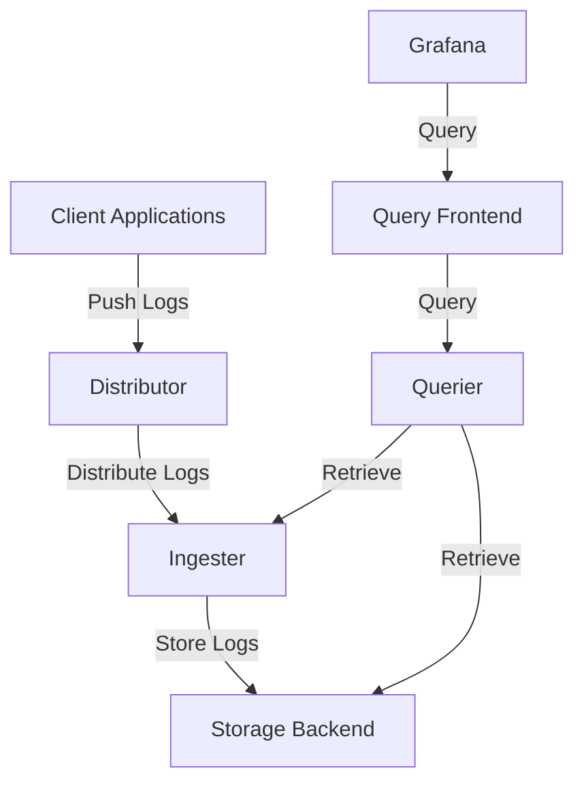
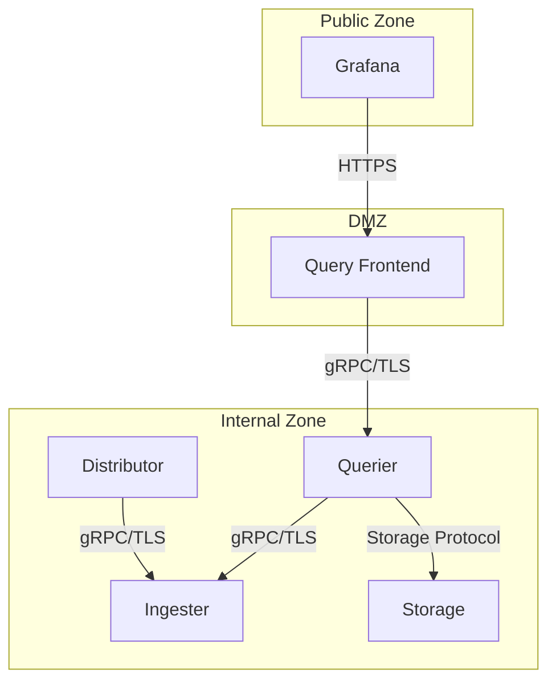

# Network Security

## Introduction

Network security is a critical component of any production Grafana Loki deployment. As Loki often handles sensitive logging data across distributed environments, securing the network layer prevents unauthorized access, data breaches, and ensures the integrity of your logging pipeline.

In this guide, you'll learn how to implement essential network security practices for Grafana Loki deployments, from basic concepts to practical implementations. We'll cover encryption, authentication, firewalls, and monitoring techniques specifically tailored for Loki's distributed architecture.

## Core Network Security Concepts for Loki

### Understanding Loki's Network Communication

Grafana Loki's distributed architecture involves several components that communicate over the network:



Each of these communication pathways represents a potential security vulnerability if not properly secured.

### Key Security Risks

1. **Unauthorized Access**: Without proper authentication, attackers could read sensitive logs or inject malicious data
2. **Data Interception**: Unencrypted traffic can be captured, revealing sensitive information
3. **Denial of Service**: Unsecured endpoints can be overwhelmed with requests
4. **Lateral Movement**: Compromised Loki components can be used to access other parts of your infrastructure

## Implementing TLS Encryption

TLS (Transport Layer Security) encryption is essential for protecting data in transit between Loki components and clients.

### Generating TLS Certificates

First, create a Certificate Authority (CA) and generate certificates:

```bash
# Generate CA key and certificate
openssl genrsa -out ca.key 2048
openssl req -new -x509 -key ca.key -out ca.crt -days 365

# Generate server key and CSR
openssl genrsa -out server.key 2048
openssl req -new -key server.key -out server.csr

# Sign the server certificate
openssl x509 -req -in server.csr -CA ca.crt -CAkey ca.key -CAcreateserial -out server.crt -days 365
```

### Configuring Loki with TLS

Update your Loki configuration to use TLS:

```yaml
server:
  http_listen_port: 3100
  grpc_listen_port: 9096
  
  http_server_config:
    tls_config:
      cert_file: /path/to/server.crt
      key_file: /path/to/server.key
  
  grpc_server_config:
    tls_config:
      cert_file: /path/to/server.crt
      key_file: /path/to/server.key
```

### Client Configuration Example

Configure Promtail to use TLS when communicating with Loki:

```yaml
clients:
  - url: https://loki:3100/loki/api/v1/push
    tls_config:
      ca_file: /path/to/ca.crt
      insecure_skip_verify: false
```

## Network Authentication

### Setting Up Basic Authentication

Basic authentication provides a simple way to secure access to your Loki API:

```yaml
auth_enabled: true

server:
  http_listen_port: 3100

# Configure the server-side auth
auth:
  type: basic
  basic:
    username: admin
    password: securepassword
```

### Implementing mTLS for Stronger Security

Mutual TLS (mTLS) provides two-way verification, ensuring both client and server authenticate each other:

```yaml
server:
  http_server_config:
    tls_config:
      cert_file: /path/to/server.crt
      key_file: /path/to/server.key
      client_auth_type: RequireAndVerifyClientCert
      client_ca_file: /path/to/ca.crt
```

Client configuration with mTLS:

```yaml
clients:
  - url: https://loki:3100/loki/api/v1/push
    tls_config:
      cert_file: /path/to/client.crt
      key_file: /path/to/client.key
      ca_file: /path/to/ca.crt
```

## Firewall Configuration

### Network Segmentation

Properly segment your Loki deployment to limit exposure:



### Recommended Firewall Rules

Here's an example of iptables rules to protect your Loki deployment:

```bash
# Allow Grafana to access Query Frontend
iptables -A INPUT -p tcp -s [Grafana_IP] --dport 3100 -j ACCEPT

# Allow internal communication between Loki components
iptables -A INPUT -p tcp -s [Internal_Network] --dport 9096 -j ACCEPT

# Default deny all other traffic
iptables -A INPUT -j DROP
```

## Securing Loki Behind a Reverse Proxy

### Nginx Configuration Example

Using Nginx as a reverse proxy adds an additional security layer:

```nginx
server {
    listen 443 ssl;
    server_name loki.example.com;

    ssl_certificate /path/to/cert.pem;
    ssl_certificate_key /path/to/key.pem;
    
    # Enable HTTP Strict Transport Security
    add_header Strict-Transport-Security "max-age=31536000; includeSubDomains" always;
    
    # Prevent clickjacking
    add_header X-Frame-Options "DENY" always;
    
    # Rate limiting
    limit_req zone=loki_limit burst=20 nodelay;
    
    location / {
        proxy_pass http://localhost:3100;
        proxy_set_header X-Real-IP $remote_addr;
        
        # HTTP Basic Authentication
        auth_basic "Loki Authentication";
        auth_basic_user_file /etc/nginx/.htpasswd;
    }
}
```

## Network Security Monitoring for Loki

### Logging Network Activity

Configure Loki to log network-related events:

```yaml
limits_config:
  reject_old_samples: true
  reject_old_samples_max_age: 168h

server:
  log_level: info
  log_format: json
```

### Monitoring Network Traffic with Prometheus Metrics

Loki exposes metrics that can help identify security issues:

```yaml
# Prometheus scrape configuration
scrape_configs:
  - job_name: 'loki'
    static_configs:
      - targets: ['loki:3100']
```

Create alerts for suspicious network activity:

```yaml
groups:
- name: loki_network_security
  rules:
  - alert: HighRateOfFailedRequests
    expr: sum(rate(loki_request_duration_seconds_count{status_code=~"4.*|5.*"}[5m])) by (job) > 5
    for: 5m
    labels:
      severity: warning
    annotations:
      summary: "High rate of failed requests"
      description: "Loki instance {{ $labels.job }} has a high rate of failed requests."
```

## Practical Example: Secure Multi-Tenant Loki Setup

Let's implement a secure multi-tenant setup for Loki:

```yaml
auth_enabled: true

server:
  http_listen_port: 3100
  grpc_listen_port: 9096
  
  http_server_config:
    tls_config:
      cert_file: /path/to/server.crt
      key_file: /path/to/server.key

# Multi-tenancy configuration with auth
multi_tenant_enabled: true

# Tenant-specific rate limits
limits_config:
  per_tenant_override_config: /etc/loki/tenant-overrides.yaml
  
# Storage configuration with encryption
storage_config:
  boltdb_shipper:
    active_index_directory: /data/loki/index
    cache_location: /data/loki/index_cache
    shared_store: s3
  aws:
    s3: s3://bucket:path
    s3forcepathstyle: true
    sse_encryption: true
```

## Common Pitfalls and Best Practices

### Common Security Mistakes

1. **Using default credentials** - Always change default usernames and passwords
2. **Neglecting to encrypt internal traffic** - Even internal component communication should be encrypted
3. **Overly permissive firewall rules** - Follow the principle of least privilege
4. **Ignoring logs and alerts** - Regularly review security logs and alerts

### Security Checklist

- [ ] TLS encryption enabled for all communications
- [ ] Strong authentication configured
- [ ] Proper network segmentation implemented
- [ ] Regular certificate rotation
- [ ] Updated to latest Loki version (security patches)
- [ ] Firewall rules regularly audited
- [ ] Security monitoring in place

## Summary

Network security for Grafana Loki requires a multi-layered approach:

1. **Encryption** using TLS to protect data in transit
2. **Authentication** to prevent unauthorized access
3. **Firewalls and network segmentation** to limit exposure
4. **Monitoring** to detect and respond to security events

By implementing these practices, you can ensure your Loki deployment remains secure while still providing valuable logging capabilities to your organization.

## Additional Resources

- [Grafana Loki Security Documentation](https://grafana.com/docs/loki/latest/operations/security/)
- [OWASP Network Security Cheat Sheet](https://cheatsheetseries.owasp.org/)
- [Prometheus and Grafana Security Best Practices](https://prometheus.io/docs/operating/security/)

## Exercises

1. Set up a local Loki instance with TLS encryption and basic authentication.
2. Create a firewall configuration for a distributed Loki deployment.
3. Implement mTLS between Promtail and Loki.
4. Configure Prometheus alerts for suspicious Loki network activity.
5. Design a network segmentation plan for a production Loki deployment.