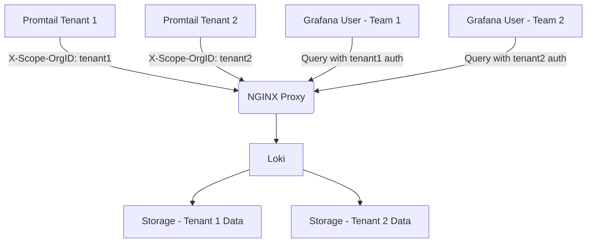

# Loki Access Control

## Introduction

Access control is a critical aspect of any logging infrastructure, especially in production environments where log data may contain sensitive information. Grafana Loki, as a horizontally scalable log aggregation system, provides various mechanisms to control who can access what data and what operations they can perform.

In this guide, we'll explore how Loki handles access control, from basic authentication to more advanced multi-tenant configurations. By the end, you'll understand how to secure your Loki deployment and implement proper access control for your logging infrastructure.

## Access Control Fundamentals

Loki's access control system is built around two core concepts:

1. **Authentication** - Verifying the identity of users or services
2. **Authorization** - Determining what actions authenticated users can perform

Let's break down both aspects and see how they work in Loki.

## Authentication in Loki

Authentication in Loki can be implemented in several ways depending on your deployment model and integration with other systems.

### Basic Authentication

For simple deployments, Loki supports basic HTTP authentication. This can be configured in your Loki configuration file:

```yaml
auth_enabled: true

server:
  http_listen_port: 3100

# Basic auth configuration
auth:
  type: basic
  basic:
    username: loki
    password: secret_password
```

When basic auth is enabled, all requests to Loki must include the proper authentication headers.

### Using an Authentication Proxy

For more sophisticated setups, you might want to use an authentication proxy (like NGINX or Traefik) in front of Loki:

```yaml
# Loki config with auth_enabled
auth_enabled: true

server:
  http_listen_port: 3100
```

And then in your NGINX configuration:

```nginx
server {
    listen 80;
    
    location / {
        auth_basic "Restricted";
        auth_basic_user_file /etc/nginx/.htpasswd;
        
        proxy_pass http://loki:3100;
        proxy_set_header X-Scope-OrgID "tenant1";
    }
}
```

This approach allows you to leverage existing authentication mechanisms while adding the required headers for Loki.

## Multi-Tenancy in Loki

One of Loki's powerful features is multi-tenancy, which allows different teams or applications to use the same Loki instance while keeping their data completely separated.

### How Multi-Tenancy Works

In Loki, tenants are identified by the `X-Scope-OrgID` HTTP header. This header must be present in all requests to Loki when multi-tenancy is enabled.

Here's how to configure multi-tenancy:

```yaml
auth_enabled: true

server:
  http_listen_port: 3100
  
# Multi-tenancy settings
multi_tenant_enabled: true
```

With this configuration, Loki will:
- Require the `X-Scope-OrgID` header in all requests
- Store and query log data separately for each tenant
- Apply tenant-specific rate limits and quotas

### Configuring Clients for Multi-Tenancy

When using Promtail (Loki's agent) with multi-tenancy, you need to configure it to send the tenant ID:

```yaml
clients:
  - url: http://loki:3100/loki/api/v1/push
    tenant_id: tenant1
```

Similarly, for Grafana, you can configure the Loki data source with the appropriate tenant ID:

```yaml
apiVersion: 1
datasources:
  - name: Loki
    type: loki
    access: proxy
    url: http://loki:3100
    jsonData:
      maxLines: 1000
    secureJsonData:
      httpHeaderValue1: "tenant1"
    httpHeaders:
      X-Scope-OrgID: "${httpHeaderValue1}"
```

## Authorization and Role-Based Access Control

While Loki itself has a relatively simple access control model, when used with Grafana, you can implement more sophisticated Role-Based Access Control (RBAC).

### Grafana-Based RBAC

Grafana allows you to control:
- Which users can view which Loki data sources
- What queries users can run
- What dashboards and panels they can access

This is configured through Grafana's permissions system:

```yaml
# In Grafana configuration
[auth]
# Various auth providers can be configured

[users]
# User management settings

[auth.anonymous]
enabled = true
org_role = Viewer
```

### Query Restrictions with Label Matchers

A powerful way to implement authorization in Loki is through label-based restrictions. You can configure Grafana to add specific label matchers to queries based on user roles.

For example, you can use Grafana's template variables to restrict queries:

```
{app="frontend", environment="production", team="$team"}
```

Where `$team` is a variable that gets populated based on the user's permissions.

## Practical Example: Setting Up Secure Multi-Tenant Loki

Let's walk through a complete example of setting up a secure multi-tenant Loki deployment.

### Step 1: Configure Loki for Multi-Tenancy

First, create a `loki-config.yaml` file:

```yaml
auth_enabled: true
multi_tenant_enabled: true

server:
  http_listen_port: 3100

limits_config:
  per_tenant_override_config: /etc/loki/tenant-overrides.yaml
  
storage:
  filesystem:
    directory: /loki/chunks

schema_config:
  configs:
    - from: 2020-07-01
      store: boltdb-shipper
      object_store: filesystem
      schema: v11
      index:
        prefix: index_
        period: 24h
```

### Step 2: Create Tenant-Specific Limits

Create a `tenant-overrides.yaml` file:

```yaml
tenant1:
  ingestion_rate_mb: 10
  ingestion_burst_size_mb: 20
  max_query_length: 24h
  
tenant2:
  ingestion_rate_mb: 5
  ingestion_burst_size_mb: 10
  max_query_length: 12h
```

### Step 3: Set Up NGINX as an Authentication Proxy

Create an NGINX configuration file:

```nginx
server {
    listen 80;
    
    # Tenant 1 access
    location /tenant1/ {
        auth_basic "Tenant 1";
        auth_basic_user_file /etc/nginx/tenant1_users;
        
        rewrite ^/tenant1/(.*) /$1 break;
        proxy_pass http://loki:3100;
        proxy_set_header X-Scope-OrgID "tenant1";
    }
    
    # Tenant 2 access
    location /tenant2/ {
        auth_basic "Tenant 2";
        auth_basic_user_file /etc/nginx/tenant2_users;
        
        rewrite ^/tenant2/(.*) /$1 break;
        proxy_pass http://loki:3100;
        proxy_set_header X-Scope-OrgID "tenant2";
    }
}
```

### Step 4: Configure Promtail for Each Tenant

For Tenant 1:

```yaml
clients:
  - url: http://nginx/tenant1/loki/api/v1/push
    basic_auth:
      username: tenant1user
      password: tenant1pass
    tenant_id: tenant1
    
scrape_configs:
  - job_name: system
    static_configs:
      - targets: [localhost]
        labels:
          job: varlogs
          tenant: tenant1
          __path__: /var/log/*log
```

For Tenant 2:

```yaml
clients:
  - url: http://nginx/tenant2/loki/api/v1/push
    basic_auth:
      username: tenant2user
      password: tenant2pass
    tenant_id: tenant2
    
scrape_configs:
  - job_name: system
    static_configs:
      - targets: [localhost]
        labels:
          job: varlogs
          tenant: tenant2
          __path__: /var/log/*log
```

### Step 5: Configure Grafana Data Sources

In Grafana, set up two data sources:

```yaml
apiVersion: 1
datasources:
  - name: Loki-Tenant1
    type: loki
    access: proxy
    url: http://nginx/tenant1
    basicAuth: true
    basicAuthUser: tenant1user
    secureJsonData:
      basicAuthPassword: tenant1pass
      
  - name: Loki-Tenant2
    type: loki
    access: proxy
    url: http://nginx/tenant2
    basicAuth: true
    basicAuthUser: tenant2user
    secureJsonData:
      basicAuthPassword: tenant2pass
```

## Tenant Isolation Diagram

Here's a visual representation of how multi-tenant isolation works in Loki:



## Security Best Practices

When implementing access control in Loki, keep these best practices in mind:

1. **Never use default or weak credentials** - Implement strong password policies for all authentication mechanisms
2. **Use TLS/SSL** - Encrypt all communications with Loki, especially in production environments
3. **Implement least privilege** - Only give users and services the minimum access needed
4. **Regularly audit access** - Monitor who is accessing your logs and what queries they're running
5. **Use separate tenants for sensitive data** - Isolate sensitive log data in dedicated tenants with stricter access controls
6. **Implement network-level security** - Use firewalls and network policies to restrict who can connect to your Loki instances
7. **Consider token-based authentication** - For more secure deployments, use token-based authentication instead of basic auth

## Advanced: Integrating with External Auth Systems

For enterprise environments, you might want to integrate Loki with your existing authentication systems like LDAP, OAuth, or SAML.

This is typically done by using an API gateway or proxy that handles authentication and then adds the appropriate headers for Loki. Tools like:

- Kong
- Traefik
- Istio
- Keycloak

Can all be configured to work with Loki's authentication requirements.

For example, with Keycloak and NGINX:

```nginx
server {
    listen 80;
    
    # OIDC authentication with Keycloak
    auth_request /auth;
    error_page 401 = @error401;
    
    # Authentication endpoint
    location = /auth {
        internal;
        proxy_pass http://keycloak/auth/realms/loki/protocol/openid-connect/auth;
        proxy_pass_request_body off;
        proxy_set_header Content-Length "";
        proxy_set_header X-Original-URI $request_uri;
    }
    
    location @error401 {
        return 302 /login?redirect_uri=$request_uri;
    }
    
    # Loki proxy with tenant header
    location /loki/ {
        proxy_pass http://loki:3100/;
        proxy_set_header X-Scope-OrgID "$remote_user";
    }
}
```

## Summary

Access control is a crucial aspect of securing your Loki deployment. In this guide, we've covered:

- Basic authentication mechanisms in Loki
- Multi-tenancy configuration for isolating data between teams and applications
- Integration with authentication proxies for enhanced security
- Role-based access control through Grafana
- Practical examples of setting up secure multi-tenant deployments
- Security best practices for Loki access control

By implementing proper access control, you can ensure that your log data remains secure while still being accessible to those who need it.

## Additional Resources

To deepen your understanding of Loki access control, consider exploring:

- [Grafana Loki Documentation](https://grafana.com/docs/loki/latest/) - Official documentation on Loki configuration
- [Grafana RBAC Documentation](https://grafana.com/docs/grafana/latest/administration/roles-and-permissions/) - Information on Grafana's role-based access control
- [NGINX Auth Documentation](https://docs.nginx.com/nginx/admin-guide/security-controls/configuring-http-basic-authentication/) - Guide on configuring authentication in NGINX

## Exercises

1. Set up a basic Loki instance with authentication enabled and configure Promtail to authenticate properly.
2. Create a multi-tenant Loki deployment with two separate tenants and configure Grafana to query both.
3. Implement label-based restrictions in Grafana to limit what log data different users can see.
4. Set up an NGINX proxy in front of Loki that handles authentication and adds the appropriate tenant headers.
5. Configure different rate limits for different tenants and test that they're properly enforced.