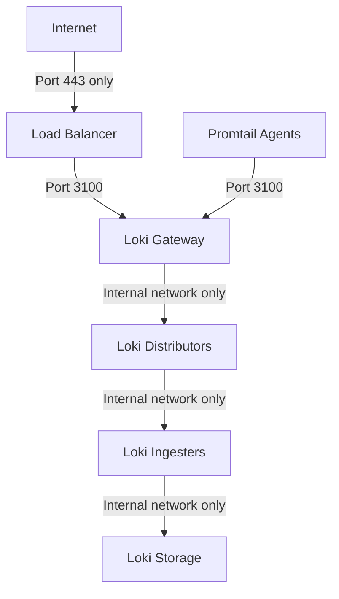

# Security Best Practices

## Introduction

Security is a critical aspect of any logging system, especially one that handles potentially sensitive data like Grafana Loki. This guide covers essential security best practices to help you protect your Loki deployment from unauthorized access and data breaches. We'll explore authentication mechanisms, authorization controls, encryption protocols, and other security measures to ensure your logging infrastructure remains robust and secure.

## Why Security Matters for Logging Systems

Logging systems like Loki store vast amounts of operational data that might contain sensitive information, including:

- User activities and behaviors
- System configurations
- Error messages revealing internal architecture
- API keys or tokens (if accidentally logged)
- Personal identifiable information (PII)

A security breach in your logging system could expose this sensitive data or even provide attackers with valuable information to plan further attacks against your infrastructure.

## Authentication

Authentication verifies the identity of users and services attempting to access your Loki installation.

### Setting Up Basic Authentication

For simple deployments, you can configure basic authentication in your Loki configuration file:

```yaml
auth_enabled: true

server:
  http_listen_port: 3100

http_server:
  http_listen_port: 3100

ingester:
  lifecycler:
    ring:
      kvstore:
        store: inmemory
      replication_factor: 1
    final_sleep: 0s
  chunk_idle_period: 5m
  chunk_retain_period: 30s

basic_auth:
  username: loki
  password: supersecretpassword
```

### Using OAuth or OIDC

For production environments, integrate with OAuth or OpenID Connect:

```yaml
auth:
  type: oauth
  oauth:
    client_id: loki
    client_secret: loki_secret
    token_url: https://your-oauth-provider/oauth2/token
    auth_url: https://your-oauth-provider/oauth2/auth
    redirect_url: https://your-loki-domain/oauth2/callback
    scopes: [openid, profile, email]
```

### Securing Promtail

When using Promtail as your log collector, secure its connections to Loki:

```yaml
clients:
  - url: https://loki.example.com/loki/api/v1/push
    tenant_id: tenant1
    basic_auth:
      username: promtail
      password: promtailsecretpassword
    tls_config:
      ca_file: /path/to/ca.crt
      insecure_skip_verify: false
```

## Authorization

Authorization determines what authenticated users or services can do within your Loki system.

### Multi-tenancy

Loki supports multi-tenancy, allowing you to isolate log data between different teams or applications:

```yaml
auth_enabled: true

server:
  http_listen_port: 3100

frontend:
  compress_responses: true
  tenant_id_header: X-Scope-OrgID

distributor:
  ring:
    kvstore:
      store: inmemory

ingester:
  lifecycler:
    ring:
      kvstore:
        store: inmemory
      replication_factor: 1
```

When sending logs to a multi-tenant Loki setup, include the tenant ID:

```bash
curl -X POST -H "Content-Type: application/json" -H "X-Scope-OrgID: tenant1" \
  -d '{
    "streams": [
      {
        "stream": {
          "job": "test"
        },
        "values": [
          ["1633004640000000000", "test message"]
        ]
      }
    ]
  }' \
  http://localhost:3100/loki/api/v1/push
```

### Role-Based Access Control (RBAC)

When using Grafana to query Loki, implement RBAC to control who can view specific log data:

1. Define roles in Grafana
2. Set up teams with specific permissions
3. Configure data source permissions
4. Use label-based access control to restrict visibility of certain logs

## Encryption

Protecting data in transit and at rest is essential for a secure logging setup.

### TLS for Network Communication

Configure TLS for all Loki API endpoints:

```yaml
server:
  http_listen_port: 3100
  grpc_listen_port: 9096
  http_server_read_timeout: 1m
  http_server_write_timeout: 1m
  grpc_server_max_recv_msg_size: 1048576
  grpc_server_max_send_msg_size: 1048576
  tls_config:
    cert_file: /path/to/server.crt
    key_file: /path/to/server.key
```

### Encrypting Stored Logs

While Loki itself doesn't provide built-in encryption for stored logs, consider these approaches:

1. Use encrypted volumes or filesystems for storage
2. Configure encryption at the storage provider level (e.g., S3 server-side encryption)
3. Use a secret management system for any sensitive credentials

```yaml
storage_config:
  aws:
    s3: s3://access_key:secret_access_key@region/bucket_name
    s3forcepathstyle: true
    sse_encryption: true  # Enable server-side encryption
```

## Network Security

Protect your Loki deployment with proper network controls.

### Firewall Rules

Implement restrictive firewall rules to limit access to Loki components:



### Network Segmentation

Create separate network segments for different Loki components:

1. Public-facing components in a DMZ
2. Core Loki services in a protected internal network
3. Storage in a highly restricted network segment

## Log Data Protection

### Sensitive Data Handling

Configure Promtail to scrub sensitive information before sending logs to Loki:

```yaml
scrape_configs:
  - job_name: system
    static_configs:
      - targets: [localhost]
        labels:
          job: varlogs
          __path__: /var/log/*log
    pipeline_stages:
      - regex:
          expression: '(?P<ip>\d{1,3}\.\d{1,3}\.\d{1,3}\.\d{1,3})'
      - replace:
          expression: '{{ .ip }}'
          replace: 'REDACTED-IP'
      - regex:
          expression: '(?P<email>[a-zA-Z0-9._%+-]+@[a-zA-Z0-9.-]+\.[a-zA-Z]{2,})'
      - replace:
          expression: '{{ .email }}'
          replace: 'REDACTED-EMAIL'
```

### Log Retention and Deletion

Implement appropriate log retention policies:

```yaml
limits_config:
  retention_period: 90d
  per_tenant_override_config: /etc/loki/retention.yaml
```

Example `retention.yaml`:

```yaml
overrides:
  tenant1:
    retention_period: 30d
  tenant2:
    retention_period: 180d
```

## Operational Security

### Regular Updates

Keep all Loki components updated to protect against security vulnerabilities:

1. Subscribe to the Grafana security mailing list
2. Set up a regular update schedule
3. Test updates in a staging environment before deploying to production

### Security Monitoring

Monitor your Loki deployment for potential security issues:

1. Enable audit logging
2. Set up alerts for suspicious activities
3. Regularly review access logs

```yaml
limits_config:
  # Enable audit logging
  audit_log_enabled: true
  audit_log_dir: /var/log/loki/audit
```

### Security Scanning

Regularly scan your Loki deployment for vulnerabilities:

1. Use container security scanning tools if running in containers
2. Perform periodic penetration testing
3. Conduct configuration audits

## Best Practices Checklist

Use this checklist to ensure you've implemented the key security measures:

- [ ] Implemented strong authentication
- [ ] Configured proper authorization and access controls
- [ ] Enabled TLS for all network communications
- [ ] Protected storage with encryption
- [ ] Implemented network security controls
- [ ] Set up sensitive data filtering
- [ ] Configured appropriate log retention policies
- [ ] Established regular update procedures
- [ ] Implemented security monitoring
- [ ] Performed security scanning and audits

## Summary

Securing your Grafana Loki deployment requires a multi-layered approach that addresses authentication, authorization, encryption, network security, and operational practices. By following the best practices outlined in this guide, you can significantly reduce the risk of security breaches and protect your valuable log data.

Remember that security is an ongoing process, not a one-time setup. Regularly review and update your security measures to address new threats and vulnerabilities as they emerge.

## Additional Resources

Here are some resources to learn more about security for Grafana Loki:

- [Grafana Loki Security Documentation](https://grafana.com/docs/loki/latest/operations/security/)
- [OWASP Logging Cheat Sheet](https://cheatsheetseries.owasp.org/cheatsheets/Logging_Cheat_Sheet.html)
- [Cloud Native Security Best Practices](https://www.cncf.io/blog/2019/01/14/9-kubernetes-security-best-practices-everyone-must-follow/)

## Exercises

1. Set up a test Loki environment with basic authentication and TLS enabled.
2. Configure Promtail to filter out sensitive information from logs using regex patterns.
3. Implement a multi-tenant Loki setup with different retention periods for each tenant.
4. Create a network diagram for a secure Loki deployment in your environment.
5. Perform a security audit of your current Loki setup and identify areas for improvement.