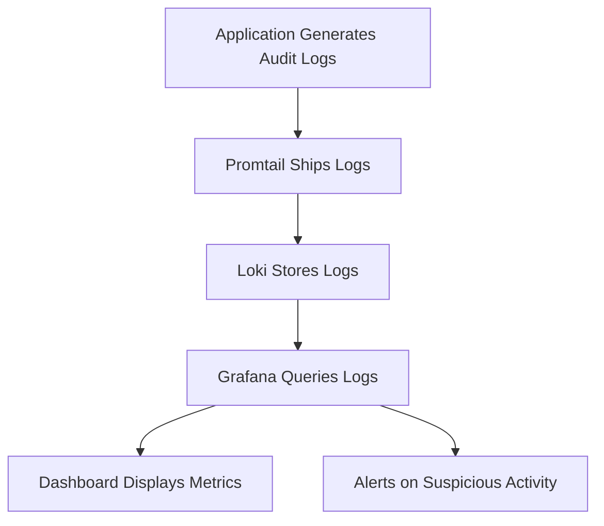

# Audit Logging

## Introduction

Audit logging is a critical security practice that involves recording events and activities within a system to maintain a trail of who did what and when. In the context of Grafana Loki, audit logging provides a structured approach to monitor and track access, modifications, and other significant actions across your logging infrastructure.

Unlike general application logs that focus on system behavior and errors, audit logs specifically track user and system actions for security and compliance purposes. They serve as an immutable record that can be used for troubleshooting security incidents, demonstrating regulatory compliance, and identifying suspicious activities.

## Why Audit Logging Matters

Audit logging serves several essential functions in a secure system:

- **Security Incident Investigation**: When something goes wrong, audit logs provide the trail of breadcrumbs to understand what happened.
- **Compliance Requirements**: Many regulatory frameworks (GDPR, HIPAA, SOC2, etc.) require detailed audit trails.
- **Insider Threat Detection**: Helps identify unusual behavior patterns from authenticated users.
- **Accountability**: Creates a record of who performed specific actions in the system.
- **Non-repudiation**: Provides evidence that a specific user performed a particular action.

## Audit Logging in Grafana Loki

Grafana Loki provides robust capabilities for implementing audit logging. Here's how to set it up and use it effectively:

### Basic Configuration

To enable audit logging in Loki, you'll need to modify your configuration file. Loki uses a YAML configuration format:

```yaml
auth_enabled: true

server:
  http_listen_port: 3100

# Audit logging configuration
audit:
  enabled: true
  # Where to store audit logs
  log_file: /var/log/loki/audit.log
  # What types of events to log
  events:
    - login
    - logout
    - query
    - config_change
    - data_access
```

This configuration enables audit logging for login, logout, query, configuration changes, and data access events.

### Understanding Audit Log Format

Loki audit logs typically include the following fields:

- **timestamp**: When the event occurred
- **userID**: Who performed the action
- **action**: What was done
- **resource**: What was accessed or modified
- **status**: Success or failure
- **clientIP**: Source IP address
- **userAgent**: Browser or client information
- **requestID**: Unique identifier for the request

Here's an example of what an audit log entry might look like:

```json
{
  "timestamp": "2023-05-15T14:22:33Z",
  "userID": "admin",
  "action": "query",
  "resource": "/loki/api/v1/query_range",
  "status": "success",
  "clientIP": "192.168.1.105",
  "userAgent": "Mozilla/5.0 (Windows NT 10.0; Win64; x64) AppleWebKit/537.36",
  "requestID": "8d3f4c2a1b098e7f",
  "details": {
    "query": "{app=\"nginx\"}",
    "start": "1620000000",
    "end": "1620010000"
  }
}
```

### Querying Audit Logs in Loki

One of the powerful features of using Loki for audit logging is the ability to query these logs using LogQL. Here are some example queries:

#### Find all actions by a specific user

```logql
{source="audit"} | json | userID="admin"
```

#### Find all failed login attempts

```logql
{source="audit"} | json | action="login" and status="failure"
```

#### Count actions by type in the last hour

```logql
{source="audit"} 
| json 
| action != "" 
| by(action) 
| count_over_time[1h]
```

## Best Practices for Audit Logging

To get the most value from your audit logging setup with Loki, follow these best practices:

### 1. Log the Right Events

Focus on capturing security-relevant events:
- Authentication events (login/logout/failed attempts)
- Authorization decisions (access grants/denials)
- Administrative actions (user creation, permission changes)
- Data access (especially for sensitive information)
- System configuration changes

### 2. Include Sufficient Context

Each log entry should answer:
- Who performed the action? (user identifier)
- What action was performed? (operation details)
- When did it occur? (precise timestamp)
- Where did it originate? (source IP, device)
- How was it performed? (API method, interface)
- What was the outcome? (success/failure)

### 3. Protect Audit Log Integrity

Audit logs should be:
- Write-only to prevent tampering
- Stored separately from application logs
- Retained for an appropriate period
- Access-controlled to prevent unauthorized viewing

### 4. Set Up Alerting

Configure alerts for suspicious activities:
- Multiple failed login attempts
- Actions by deactivated users
- Access outside normal business hours
- Unusual data access patterns

Here's an example of setting up an alert rule in Loki for multiple failed login attempts:

```yaml
groups:
  - name: audit_alerts
    rules:
      - alert: MultipleFailedLogins
        expr: sum by(userID) (count_over_time({source="audit"} | json | action="login" and status="failure" [5m])) > 5
        for: 1m
        labels:
          severity: warning
        annotations:
          summary: Multiple failed login attempts detected
          description: "User {{ $labels.userID }} has failed to login {{ $value }} times in the last 5 minutes."
```

## Implementing Audit Logging: A Real-World Example

Let's walk through a complete example of implementing audit logging for a microservices application using Grafana Loki.

### Step 1: Configure Log Shipping

First, let's configure Promtail to ship our application logs to Loki:

```yaml
clients:
  - url: http://loki:3100/loki/api/v1/push

scrape_configs:
  - job_name: audit_logs
    static_configs:
      - targets:
        - localhost
        labels:
          job: audit_logs
          source: audit
          environment: production
    
    pipeline_stages:
      - json:
          expressions:
            timestamp: timestamp
            userID: userID
            action: action
            resource: resource
            status: status
            clientIP: clientIP
      - timestamp:
          source: timestamp
          format: RFC3339
      - labels:
          userID:
          action:
          status:
```

### Step 2: Generate Audit Logs in Your Application

Here's an example of how to create audit logs in a Node.js application:

```javascript
const winston = require('winston');

// Configure audit logger
const auditLogger = winston.createLogger({
  level: 'info',
  format: winston.format.json(),
  defaultMeta: { service: 'user-service' },
  transports: [
    new winston.transports.File({ filename: '/var/log/app/audit.log' }),
  ],
});

// Middleware to log API requests
function auditMiddleware(req, res, next) {
  // Capture the start time
  const startTime = Date.now();
  
  // Process the request
  next();
  
  // Once response is sent, log the audit event
  res.on('finish', () => {
    auditLogger.info({
      timestamp: new Date().toISOString(),
      userID: req.user ? req.user.id : 'anonymous',
      action: req.method,
      resource: req.originalUrl,
      status: res.statusCode < 400 ? 'success' : 'failure',
      clientIP: req.ip,
      userAgent: req.get('User-Agent'),
      requestID: req.id,
      duration: Date.now() - startTime,
      details: {
        method: req.method,
        query: req.query,
        statusCode: res.statusCode
      }
    });
  });
}

// Use the middleware in your Express app
app.use(auditMiddleware);
```

### Step 3: Create a Dashboard to Monitor Audit Logs

Once your logs are flowing into Loki, you can create a Grafana dashboard to visualize audit data:



Here's an example of what you might include in your dashboard:

1. **Login Activity**:
   - Count of successful/failed logins over time
   - Failed login attempts by user ID
   - Geographic distribution of login attempts

2. **Data Access**:
   - Most accessed resources
   - Resource access by user
   - Unusual access patterns

3. **Administrative Actions**:
   - Configuration changes over time
   - User permission modifications
   - System setting updates

## Compliance Considerations

Different regulatory frameworks have specific requirements for audit logging:

### GDPR
- Log all data access related to personal information
- Record data exports and transfers
- Document consent actions

### HIPAA
- Track access to patient health information
- Log disclosure of protected health information
- Record security-related configuration changes

### PCI DSS
- Log all access to cardholder data
- Track account and permission changes
- Monitor system component access

## Troubleshooting Common Issues

### High Volume of Audit Logs

If you're generating too many audit logs:
- Be more selective about what events to audit
- Implement log rotation and compression
- Consider using separate instances for different log types

### Missing Contextual Information

If your audit logs lack necessary context:
- Enhance your logging middleware to capture more details
- Add correlation IDs to track actions across services
- Include user context and session information

### Performance Impact

If audit logging affects performance:
- Use asynchronous logging when possible
- Optimize your log processing pipeline
- Consider batching log entries

## Summary

Audit logging is a critical component of a comprehensive security strategy. With Grafana Loki, you can implement robust audit logging that not only satisfies compliance requirements but also provides valuable security insights.

Key takeaways:
- Audit logs track who did what and when
- Loki provides powerful querying capabilities for audit data
- Proper configuration ensures comprehensive security coverage
- Best practices enhance the value and integrity of audit logs

## Additional Resources

- [Grafana Loki Documentation](https://grafana.com/docs/loki/latest/)
- [LogQL Query Language Reference](https://grafana.com/docs/loki/latest/logql/)
- [OWASP Logging Cheat Sheet](https://cheatsheetseries.owasp.org/cheatsheets/Logging_Cheat_Sheet.html)

## Exercises

1. Configure Loki to capture and store audit logs for a sample application.
2. Create a LogQL query to find all failed login attempts from a specific IP range.
3. Build a Grafana dashboard that visualizes key audit metrics.
4. Implement an alert rule that triggers when sensitive data is accessed.
5. Design an audit logging strategy for a microservices architecture that maintains a cohesive audit trail across services.