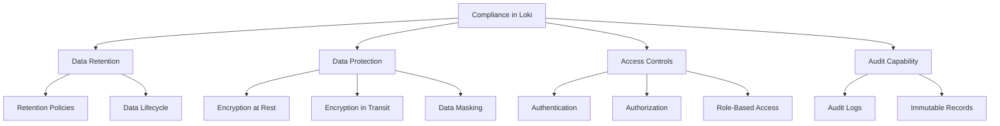

# Compliance Considerations

## Introduction

When implementing Grafana Loki in production environments, particularly in regulated industries, compliance considerations become a critical aspect of your logging infrastructure. In this module, we'll explore how Loki can be configured to meet various compliance requirements, data retention policies, and audit capabilities that support regulatory frameworks like GDPR, HIPAA, SOC 2, and others.

Compliance isn't just about checking boxes for auditors—it's about implementing logging practices that protect sensitive data, maintain appropriate access controls, and ensure your organization can demonstrate adherence to both internal policies and external regulations.

## Regulatory Requirements for Logging Systems

Different industries and regions have specific compliance requirements that directly impact how you configure and use Grafana Loki:

### Common Regulatory Frameworks

| Framework | Logging Requirements |
| --------- | -------------------- |
| GDPR | Data minimization, right to erasure, access controls |
| HIPAA | Audit trails, access logs, data encryption |
| PCI DSS | Retention of logs, intrusion detection |
| SOC 2 | Evidence of controls, monitoring, alerting |
| ISO 27001 | Documentation of security events, incident response |

### Key Compliance Areas in Loki



## Implementing Data Retention Policies

Most compliance frameworks specify minimum and/or maximum data retention periods. Loki provides robust mechanisms to implement these policies:

### Configuring Retention in Loki

Retention can be configured in your Loki configuration file. Here's an example of setting up a basic retention policy:

```yaml
limits_config:
  retention_period: 90d

schema_config:
  configs:
    - from: 2020-07-01
      index:
        period: 24h
      object_store: filesystem
      schema: v11
      store: boltdb-shipper
```

In this example, we're setting a retention period of 90 days, which means logs older than that will be automatically deleted.

### Per-Tenant Retention Policies

For multi-tenant environments, you can set different retention policies per tenant:

```yaml
limits_config:
  retention_period: 30d  # Default retention
  
  per_tenant_override_config: /etc/loki/retention-overrides.yaml
  
  multi_tenant_enabled: true
```

And in your `retention-overrides.yaml`:

```yaml
finance:
  retention_period: 7y  # Finance needs 7 years for compliance
  
healthcare:
  retention_period: 6y  # Healthcare retention requirement
  
marketing:
  retention_period: 90d  # Marketing has shorter needs
```

## Data Protection Strategies

### Log Encryption

Loki supports encryption for data at rest and in transit. Here's how to configure TLS for secure communication:

```yaml
server:
  http_listen_port: 3100
  grpc_listen_port: 9096
  http_server_read_timeout: 120s
  http_server_write_timeout: 120s
  grpc_server_max_recv_msg_size: 4194304
  
  # TLS configuration
  http_tls_config:
    cert_file: /path/to/cert.pem
    key_file: /path/to/key.pem
  grpc_tls_config:
    cert_file: /path/to/cert.pem
    key_file: /path/to/key.pem
```

### Log Scrubbing and Data Masking

To comply with data protection regulations, you may need to scrub sensitive information before it enters Loki. This can be done using Promtail's pipeline stages:

```yaml
scrape_configs:
  - job_name: system
    pipeline_stages:
      - regex:
          expression: '(?P<email>[a-zA-Z0-9._%+-]+@[a-zA-Z0-9.-]+\.[a-zA-Z]{2,})'
      - labels:
          email: ""
      - output:
          source: message
          expression: '{{ regexReplaceAll "([a-zA-Z0-9._%+-]+@[a-zA-Z0-9.-]+\\.[a-zA-Z]{2,})" .message "[EMAIL REDACTED]" }}'
```

This pipeline configuration will:
1. Identify email addresses in your logs using a regex pattern
2. Replace them with "[EMAIL REDACTED]" before the logs are sent to Loki

## Access Control Implementation

### Tenant Isolation

Loki supports multi-tenancy to isolate data between different teams or applications:

```yaml
auth_enabled: true

server:
  http_listen_port: 3100

ingester:
  lifecycler:
    ring:
      kvstore:
        store: inmemory
      replication_factor: 1
    final_sleep: 0s
  chunk_idle_period: 5m
  chunk_retain_period: 30s

schema_config:
  configs:
    - from: 2020-05-15
      store: boltdb-shipper
      object_store: filesystem
      schema: v11
      index:
        prefix: index_
        period: 24h
```

With this configuration, you can use the `X-Scope-OrgID` header to separate tenants when sending queries or pushing logs.

### Integration with External Auth Providers

For more robust authentication, you can integrate Loki with external auth providers through Grafana:

```yaml
# In your Grafana configuration (grafana.ini)
[auth.generic_oauth]
enabled = true
client_id = YOUR_OAUTH_CLIENT_ID
client_secret = YOUR_OAUTH_CLIENT_SECRET
scopes = openid profile email
auth_url = https://your-auth-provider/authorize
token_url = https://your-auth-provider/oauth/token
api_url = https://your-auth-provider/userinfo
```

## Audit Capabilities

### Creating an Audit Trail

You can use Loki itself to create audit trails of user interactions with your logging system. First, enable audit logging in Grafana:

```ini
# In grafana.ini
[log]
mode = console file
level = info

[auditing]
enabled = true
log_outputs = file
log_dir = /var/log/grafana/audit
```

Then, configure Promtail to collect these audit logs:

```yaml
scrape_configs:
  - job_name: grafana_audit
    static_configs:
      - targets:
          - localhost
        labels:
          job: grafana_audit
          __path__: /var/log/grafana/audit/*.log
    pipeline_stages:
      - json:
          expressions:
            timestamp: time
            level: level
            message: message
            user: ctx.userId
            action: ctx.action
      - timestamp:
          source: timestamp
          format: RFC3339
      - labels:
          level:
          user:
          action:
```

### Query Examples for Compliance Reporting

Here are some LogQL queries useful for compliance reporting:

```logql
# Find all login attempts
{job="grafana_audit"} |= "login"

# Find all actions by a specific user
{job="grafana_audit", user="admin@example.com"}

# Track data access patterns
{job="grafana_audit"} |= "dataAccess" | json | line_format "{{.ctx.user}} accessed {{.ctx.dataSource}} at {{.time}}"

# Monitor configuration changes
{job="grafana_audit"} |= "configuration" | json
```

## Best Practices for Compliance

1. **Document Everything**: Maintain detailed documentation of your Loki configuration, retention policies, and access controls.

2. **Regular Audits**: Schedule periodic reviews of your logging system to ensure it meets compliance requirements.

3. **Test Your Retention**: Verify that logs are actually being deleted according to your retention policies.

4. **Secure Your Loki Installation**:
   - Use strong authentication
   - Implement network segmentation
   - Apply the principle of least privilege
   - Keep Loki and related components updated

5. **Data Classification**: Classify your logs based on sensitivity and apply appropriate controls to each class.

6. **Compliance as Code**: Version-control your Loki configurations to track compliance-related changes.

## Example: Building a Compliant Healthcare Logging Solution

Let's put these concepts together in a realistic scenario for a healthcare provider:

```yaml
# loki-config.yaml for healthcare provider
auth_enabled: true

server:
  http_listen_port: 3100
  grpc_listen_port: 9096
  http_tls_config:
    cert_file: /certs/loki.crt
    key_file: /certs/loki.key

limits_config:
  retention_period: 2190d  # 6 years for healthcare records
  
  per_tenant_override_config: /etc/loki/tenant-overrides.yaml
  multi_tenant_enabled: true

schema_config:
  configs:
    - from: 2020-01-01
      store: boltdb-shipper
      object_store: s3
      schema: v11
      index:
        prefix: index_
        period: 24h

storage_config:
  boltdb_shipper:
    active_index_directory: /data/loki/index
    cache_location: /data/loki/index_cache
    shared_store: s3
  aws:
    s3: s3://access_key:secret_key@region/bucket_name
    s3forcepathstyle: true
    
# Separate tenant for patient data logs
ruler:
  storage:
    type: local
    local:
      directory: /rules
  rule_path: /tmp/rules
  alertmanager_url: http://alertmanager:9093
  ring:
    kvstore:
      store: inmemory
  enable_api: true
```

With this configuration:
- Patient data is kept for 6 years as required by HIPAA
- All data is encrypted at rest in S3 and in transit with TLS
- Multi-tenancy ensures separation between departments
- Alerting rules can notify about compliance issues

## Summary

Implementing proper compliance controls in Grafana Loki involves a combination of:

- Understanding regulatory requirements specific to your industry
- Configuring appropriate data retention policies
- Implementing robust data protection mechanisms
- Setting up proper access controls
- Creating comprehensive audit trails

By following the guidelines and examples in this module, you can configure Loki to meet compliance requirements while maintaining an efficient and scalable logging system. Remember that compliance is an ongoing process—regularly review and update your configurations as regulations and your system requirements evolve.

## Additional Resources

- [Grafana Loki Security Documentation](https://grafana.com/docs/loki/latest/operations/security/)
- [LogQL Guide for Audit Queries](https://grafana.com/docs/loki/latest/logql/)
- [Multi-tenancy in Loki](https://grafana.com/docs/loki/latest/operations/multi-tenancy/)
- [HIPAA Compliance for Logging Systems](https://www.hhs.gov/hipaa/index.html)
- [GDPR Requirements for Log Management](https://gdpr.eu/data-protection/)

## Exercises

1. Configure a Loki installation with different retention periods for different tenants.
2. Create a Promtail pipeline that masks sensitive data like credit card numbers, social security numbers, and personally identifiable information.
3. Set up an audit trail that captures all query activities in your Loki deployment.
4. Design a disaster recovery plan for your Loki deployment that ensures compliance with data protection regulations.
5. Create a compliance report template using LogQL queries that demonstrates adherence to a specific regulatory framework.