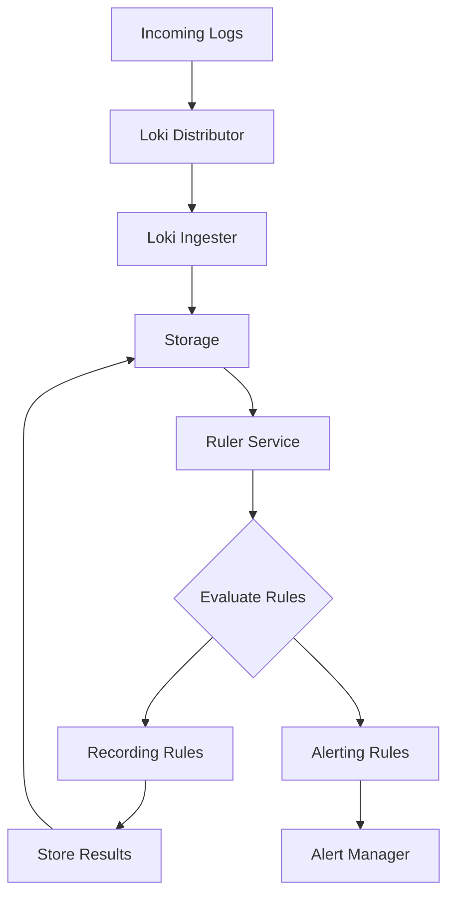

# Ruler Service in Grafana Loki

## Introduction

The Ruler service is a powerful component in Grafana Loki's architecture that extends Loki beyond just log storage and querying. It enables you to automatically evaluate LogQL expressions over time and take actions based on the results. This functionality is split into two main capabilities:

1. **Recording rules** - Pre-compute frequently used queries and store their results
2. **Alerting rules** - Trigger notifications when specific conditions in your logs are met

This guide will walk you through understanding, configuring, and using the Ruler service effectively in your Loki deployment.

## Understanding the Ruler Service

The Ruler service in Loki closely follows the design of Prometheus' rule evaluation system, making it familiar for users who have experience with Prometheus. It periodically evaluates expressions defined in rule files and can:

- Store the results of recording rules as new time series in the storage
- Fire alerts when alert conditions are met



## Enabling the Ruler Service

Before using the Ruler, you need to make sure it's properly configured in your Loki deployment. The Ruler needs a backend to store rule definitions, which can be local files or objects in a supported object store.

### Basic Configuration

Here's a simple configuration to enable the Ruler service with local file storage:

```yaml
ruler:
  storage:
    type: local
    local:
      directory: /loki/rules
  rule_path: /loki/rules-temp
  alertmanager_url: http://alertmanager:9093
  ring:
    kvstore:
      store: inmemory
  enable_api: true
```

This configuration:
- Uses local storage for rules
- Sets a temporary path for rule evaluation
- Connects to Alertmanager for handling alerts
- Enables the Ruler API to manage rules programmatically

## Creating Recording Rules

Recording rules allow you to pre-compute frequently used or computationally expensive queries. This improves performance and reduces the load on your system.

### Rule File Format

Recording rules are defined in YAML files with a specific structure:

```yaml
groups:
  - name: example_recording_rules
    interval: 1m
    rules:
      - record: job:loki_request_duration_seconds_bucket:sum_rate
        expr: sum(rate(loki_request_duration_seconds_bucket[5m])) by (job, le)
      - record: job:loki_request_errors_total:sum_rate
        expr: sum(rate(loki_request_errors_total[5m])) by (job)
```

### Example: Creating a Recording Rule to Track Error Rates

Let's create a recording rule that calculates the rate of error logs for different services:

```yaml
groups:
  - name: service_errors
    interval: 2m
    rules:
      - record: service:error_rate:5m
        expr: sum by (service) (rate({app="production"} |= "error" [5m]))
```

This rule:
- Creates a new metric called `service:error_rate:5m`
- Calculates the rate of logs containing "error" for each service over 5-minute windows
- Evaluates every 2 minutes

Once defined, you can query this pre-computed metric directly:

```logql
service:error_rate:5m{service="authentication"}
```

## Setting Up Alerting Rules

Alerting rules define conditions that trigger alerts when they're met. These alerts can be sent to an Alertmanager instance for notification routing.

### Alert Rule Format

Alert rules follow a similar format to recording rules but include additional fields:

```yaml
groups:
  - name: example_alert_rules
    interval: 1m
    rules:
      - alert: HighErrorRate
        expr: job:loki_request_errors_total:sum_rate > 0.5
        for: 10m
        labels:
          severity: critical
        annotations:
          summary: "High error rate detected"
          description: "Error rate is {{ $value }} errors per second"
```

### Example: Creating an Alert for High Error Rates

Let's create an alert that triggers when a service's error rate exceeds a threshold:

```yaml
groups:
  - name: service_alerts
    interval: 1m
    rules:
      - alert: ServiceHighErrorRate
        expr: sum by (service) (rate({app="production"} |= "error" [5m])) > 0.1
        for: 5m
        labels:
          severity: critical
          team: "{{ $labels.service }}"
        annotations:
          summary: "{{ $labels.service }} has a high error rate"
          description: "{{ $labels.service }} is experiencing {{ $value }} errors per second for the last 5 minutes"
```

This alert:
- Triggers when a service's error rate exceeds 0.1 errors per second
- Must persist for 5 minutes before firing
- Includes dynamic labels and annotations based on the evaluated data

## Managing Rules via the API

Loki provides a REST API to manage rules programmatically, allowing you to create, update, and delete rules without modifying files directly.

### Listing Rule Groups

```bash
curl -X GET http://loki:3100/loki/api/v1/rules | jq
```

Example response:

```json
{
  "status": "success",
  "data": {
    "groups": [
      {
        "name": "service_errors",
        "interval": 120,
        "rules": [
          {
            "record": "service:error_rate:5m",
            "expr": "sum by (service) (rate({app=\"production\"} |= \"error\" [5m]))"
          }
        ]
      }
    ]
  }
}
```

### Creating or Updating Rules

Rules can be created or updated by making POST requests to the Ruler API:

```bash
curl -X POST http://loki:3100/loki/api/v1/rules/namespace \
  -H "Content-Type: application/yaml" \
  --data-binary @rules.yaml
```

## Real-World Use Cases

### Case 1: Service Health Monitoring

Create recording rules to track service health metrics and alerting rules to notify teams of potential issues:

```yaml
groups:
  - name: service_health
    interval: 1m
    rules:
      # Recording rule for service response times
      - record: service:response_time:p95
        expr: |
          quantile_over_time(0.95,
            {app="web-service"}
            | json
            | unwrap response_time_ms
            [5m]
          )
      
      # Alert when response time is too high
      - alert: SlowServiceResponse
        expr: service:response_time:p95 > 500
        for: 10m
        labels:
          severity: warning
        annotations:
          summary: "Service response time is degraded"
          description: "95th percentile response time is {{ $value }}ms (threshold: 500ms)"
```

### Case 2: Security Monitoring

Set up rules to detect security-related events in your logs:

```yaml
groups:
  - name: security_monitoring
    interval: 1m
    rules:
      # Recording rule tracking failed logins
      - record: security:failed_logins:rate5m
        expr: sum by (username) (rate({app="auth-service"} |= "login failed" [5m]))
      
      # Alert on brute force attempts
      - alert: PossibleBruteForceAttempt
        expr: security:failed_logins:rate5m > 0.2
        for: 5m
        labels:
          severity: critical
          category: security
        annotations:
          summary: "Possible brute force attack detected"
          description: "User {{ $labels.username }} has {{ $value }} failed login attempts per second"
```

## Best Practices

### Optimizing Rule Performance

1. **Limit the number of rules**: Each rule consumes resources when evaluated
2. **Use appropriate intervals**: Balance between freshness and resource usage
3. **Optimize LogQL queries**: Complex queries in rules can be expensive
4. **Use recording rules for complex queries**: Pre-compute expensive expressions

### Rule Organization

1. **Group related rules together**: Makes management easier
2. **Use namespaces to organize rules**: Separate rules by team or application
3. **Follow consistent naming conventions**: Makes rules more discoverable

### Alert Design

1. **Avoid alert fatigue**: Only alert on actionable conditions
2. **Include context in annotations**: Help responders understand the alert
3. **Set appropriate thresholds**: Tune based on normal behavior patterns
4. **Use `for` clause wisely**: Prevents flapping alerts for transient conditions

## Troubleshooting the Ruler Service

### Common Issues

1. **Rules not evaluating**: Check Ruler service logs and configuration
2. **Alertmanager not receiving alerts**: Verify the `alertmanager_url` configuration
3. **High resource usage**: Rules may be too complex or too frequent

### Debugging Steps

1. Check the Ruler's status:
   ```bash
   curl -X GET http://loki:3100/loki/api/v1/rules/state
   ```

2. Verify rule syntax with the Loki API:
   ```bash
   curl -X GET "http://loki:3100/loki/api/v1/query?query=<your rule expression>"
   ```

3. Review Ruler logs for any errors or warnings:
   ```bash
   docker logs <loki-container> | grep ruler
   ```

## Summary

The Ruler service extends Loki's capabilities from a log storage and query system to a complete monitoring solution. By using recording rules and alerting rules, you can:

- Pre-compute expensive queries to improve performance
- Automate anomaly detection in your logs
- Create alerts for important conditions in your applications
- Build a comprehensive monitoring system alongside metrics

The Ruler's design will feel familiar to Prometheus users, making it easy to adopt if you're already using Prometheus for metrics monitoring.

## Additional Resources

- [Loki Ruler Service Documentation](https://grafana.com/docs/loki/latest/configuration/ruler/)
- [LogQL Query Language Guide](https://grafana.com/docs/loki/latest/logql/)
- [Alertmanager Documentation](https://prometheus.io/docs/alerting/latest/alertmanager/)

## Exercises

1. Create a recording rule that tracks the rate of HTTP 500 errors across different services.
2. Set up an alert that triggers when a specific log pattern appears more than 10 times in 5 minutes.
3. Modify an existing alert to include more context in its annotations.
4. Create a dashboard in Grafana that visualizes data from your recording rules.
5. Write a script that uses the Ruler API to dynamically update alert thresholds based on time of day.