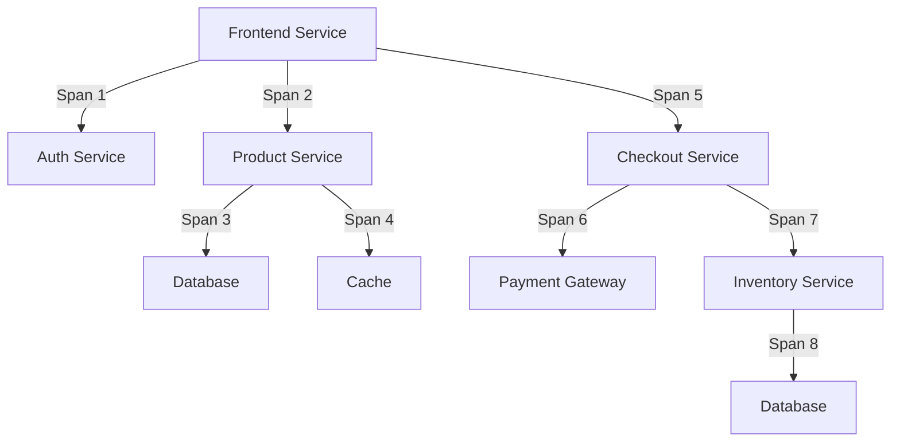

# Distributed Tracing

## Introduction

Distributed tracing is a powerful observability technique that helps developers understand the flow of requests as they travel through complex distributed systems. In modern microservices architectures, a single user action might trigger dozens of interactions between various services. When something goes wrong, identifying the root cause becomes challenging without a way to visualize these interactions.

This is where distributed tracing comes in. It creates a "trace" - essentially a map of a request's journey through your entire system - showing you exactly where time was spent, which services were involved, and where errors occurred.

In this guide, we'll explore how distributed tracing works with Grafana Loki and how you can leverage it to gain deeper insights into your applications.

## Understanding Distributed Tracing Concepts

### What is a Trace?

A trace represents the complete journey of a request as it moves through your distributed system. It's composed of multiple **spans**, each representing work done by an individual service or component.

### Key Components

1. **Spans**: The fundamental unit of work in a trace. A span represents an operation within a service.
2. **Trace ID**: A unique identifier that connects all spans in a trace.
3. **Span ID**: A unique identifier for each span.
4. **Parent Span ID**: Identifies which span is the parent of the current span.
5. **Tags/Attributes**: Key-value pairs that provide additional context about a span.
6. **Events**: Time-stamped logs within a span.

Here's a visualization of how spans relate in a trace:



## Distributed Tracing in Grafana Loki

Grafana Loki integrates nicely with distributed tracing systems. Let's explore how to set up and use distributed tracing with Loki.

### Setting Up Tracing with Loki

To enable tracing with Loki, you'll need:

1. A tracing backend (Tempo, Jaeger, or Zipkin)
2. Your applications instrumented with a tracing library
3. Loki configured to extract trace IDs from logs

#### Step 1: Configure Loki to Extract Trace IDs

Add the following to your Loki configuration:

```yaml
ruler:
  wal:
    dir: /tmp/wal
  storage:
    type: local
    local:
      directory: /tmp/rules
  rule_path: /tmp/rules-temp
  alertmanager_url: http://localhost:9093
  ring:
    kvstore:
      store: inmemory
  enable_api: true

tracing:
  enabled: true
```

#### Step 2: Configure Your Application

You'll need to instrument your application with a tracing library like OpenTelemetry. Here's a simple example using Node.js:

```javascript
const { NodeTracerProvider } = require('@opentelemetry/node');
const { registerInstrumentations } = require('@opentelemetry/instrumentation');
const { ExpressInstrumentation } = require('@opentelemetry/instrumentation-express');
const { HttpInstrumentation } = require('@opentelemetry/instrumentation-http');
const { Resource } = require('@opentelemetry/resources');
const { SemanticResourceAttributes } = require('@opentelemetry/semantic-conventions');
const { SimpleSpanProcessor } = require('@opentelemetry/tracing');
const { JaegerExporter } = require('@opentelemetry/exporter-jaeger');

// Configure the tracer
const provider = new NodeTracerProvider({
  resource: new Resource({
    [SemanticResourceAttributes.SERVICE_NAME]: 'my-service',
  }),
});

// Configure exporter to send traces to Jaeger
const exporter = new JaegerExporter({
  endpoint: 'http://jaeger:14268/api/traces',
});

// Add exporter to the provider
provider.addSpanProcessor(new SimpleSpanProcessor(exporter));
provider.register();

// Register instrumentations
registerInstrumentations({
  instrumentations: [
    new HttpInstrumentation(),
    new ExpressInstrumentation(),
  ],
});

// Your application code goes here...
const express = require('express');
const app = express();

app.get('/', (req, res) => {
  res.send('Hello World!');
  // Add the trace ID to your logs
  console.log(`Request processed traceID=${req.headers['traceparent']}`);
});

app.listen(3000, () => {
  console.log('Listening on port 3000');
});
```

#### Step 3: Add Derived Fields in Grafana

To connect Loki logs with traces:

1. In Grafana, go to Configuration > Data Sources > Loki
2. Scroll down to "Derived fields"
3. Add a new derived field with:
   - Name: TraceID
   - Regex: `traceID=(\w+)`
   - Query: Select your tracing data source (Tempo/Jaeger)
   - URL: `/explore?orgId=1&left={"datasource":"Tempo","queries":[{"query":"$${__value.raw}"}]}`

## Practical Example: Troubleshooting with Distributed Tracing

Let's walk through a practical example of using distributed tracing to troubleshoot a slow checkout process in an e-commerce application.

### Scenario

Users report that the checkout process occasionally takes more than 5 seconds, causing frustration.

### Step 1: Identify the Trace

In Grafana Loki, search for error logs related to checkout:

```
{app="ecommerce"} |= "checkout" |= "slow"
```

When you find a relevant log entry, click on the TraceID derived field to view the complete trace.

### Step 2: Analyze the Trace Timeline

In the trace view, you'll see something like this:

```mermaid
gantt
    title Checkout Process Trace
    dateFormat  s
    axisFormat %S.%L
    
    Frontend Call    :a1, 0, 5.2s
    Auth Check       :a2, 0, 0.1s
    Cart Calculation :a3, 0.1s, 0.3s
    Inventory Check  :a4, 0.4s, 3.8s
    Payment Process  :a5, 4.2s, 1.0s
```

### Step 3: Identify the Bottleneck

From the trace visualization, it's clear that the inventory check is taking the most time (3.4 seconds).

### Step 4: Examine Span Details

Clicking on the Inventory Check span reveals additional details:

```
Database Query: "SELECT * FROM inventory WHERE product_id IN (101, 203, 305)"
Tags:
  db.type: "mysql"
  db.instance: "inventory-db-1"
  db.statement: "SELECT * FROM inventory WHERE product_id IN (101, 203, 305)"
Events:
  - timestamp: 2023-03-15T12:34:56.789Z
    name: "db.lock_wait"
    attributes:
      wait_time_ms: 3200
```

Now you can see the exact issue: a database lock is causing a 3.2-second wait time during the inventory check.

## Integrating Tracing with Loki Logs and Metrics

The real power of distributed tracing comes when you combine it with logs and metrics. This is often called the "three pillars of observability."

### Correlating Logs, Traces, and Metrics

Here's how to correlate all three in Grafana:

1. **From Logs to Traces**: When viewing logs in Loki, click on a trace ID to view the associated trace.

2. **From Traces to Logs**: When viewing a trace, you can often click on a span to see related logs.

3. **From Metrics to Traces**: Configure exemplars in Prometheus to link specific high-latency data points to the corresponding traces.

Example Prometheus configuration for exemplars:

```yaml
global:
  scrape_interval: 15s
  evaluation_interval: 15s

scrape_configs:
  - job_name: 'my-service'
    static_configs:
      - targets: ['localhost:9090']
    params:
      exemplar: ['true']  # Enable exemplars
```

## Writing Trace-Aware Logs

To get the most from distributed tracing, your logs should include trace context. Here's an example in Python using the OpenTelemetry library:

```python
from opentelemetry import trace
from opentelemetry.exporter.jaeger.thrift import JaegerExporter
from opentelemetry.sdk.resources import SERVICE_NAME, Resource
from opentelemetry.sdk.trace import TracerProvider
from opentelemetry.sdk.trace.export import BatchSpanProcessor
import logging

# Configure the tracer
resource = Resource(attributes={
    SERVICE_NAME: "order-service"
})
jaeger_exporter = JaegerExporter(
    agent_host_name="jaeger",
    agent_port=6831,
)
provider = TracerProvider(resource=resource)
processor = BatchSpanProcessor(jaeger_exporter)
provider.add_span_processor(processor)
trace.set_tracer_provider(provider)

tracer = trace.get_tracer(__name__)

# Configure logging
logging.basicConfig(level=logging.INFO)
logger = logging.getLogger(__name__)

# Example function with tracing and logging
def process_order(order_id):
    with tracer.start_as_current_span("process_order") as span:
        # Add order_id as a span attribute
        span.set_attribute("order_id", order_id)
        
        # Get the current span context for logging
        current_span = trace.get_current_span()
        trace_id = format(current_span.get_span_context().trace_id, '016x')
        
        # Log with trace_id
        logger.info(f"Processing order {order_id}, trace_id={trace_id}")
        
        # Simulate processing
        try:
            # Business logic here
            logger.info(f"Order {order_id} processed successfully, trace_id={trace_id}")
        except Exception as e:
            logger.error(f"Error processing order {order_id}: {str(e)}, trace_id={trace_id}")
            span.record_exception(e)
            span.set_status(trace.StatusCode.ERROR)
            raise

# Usage
process_order("12345")
```

## Best Practices for Distributed Tracing

1. **Be Selective**: Don't trace everything. Focus on critical paths and user-facing operations.

2. **Use Sampling**: In high-volume production systems, sample traces to reduce overhead.

3. **Add Context**: Add relevant business context as span attributes (user ID, order ID, etc.).

4. **Name Spans Clearly**: Use consistent naming conventions for spans.

5. **Track Key Events**: Record important events within spans to provide more context.

6. **Set Appropriate Sampling Rates**: Start with a lower sampling rate and adjust based on your needs.

7. **Propagate Context**: Ensure trace context is properly propagated between services.

## Common Challenges and Solutions

### Challenge 1: Too Much Data

**Solution**: Implement intelligent sampling strategies:
- Always sample errors
- Sample a percentage of normal requests
- Use tail-based sampling to capture interesting traces

### Challenge 2: Missing Context

**Solution**: Standardize on what context to include:
- User ID
- Request ID
- Session ID
- Business-specific IDs (order ID, product ID, etc.)

### Challenge 3: Trace Propagation Across Technology Boundaries

**Solution**: Use standardized headers like W3C Trace Context:

```
traceparent: 00-0af7651916cd43dd8448eb211c80319c-b7ad6b7169203331-01
tracestate: congo=t61rcWkgMzE
```

## Summary

Distributed tracing is an essential tool for understanding and troubleshooting modern distributed systems. When integrated with Grafana Loki, it provides powerful insights into your application's behavior by connecting logs with traces.

Key takeaways:
- Traces show the full journey of a request through your system
- Spans represent individual operations within services
- Correlating logs and traces provides deeper insights
- Properly instrumented applications make debugging much easier
- Grafana's ecosystem makes it simple to switch between logs, traces, and metrics

## Exercises

1. Set up a basic OpenTelemetry instrumentation in a sample application and view the traces in Grafana.

2. Configure Loki to extract trace IDs from your application logs.

3. Create a dashboard in Grafana that shows both logs and associated traces.

4. Simulate a performance problem in your application and use distributed tracing to identify the root cause.

## Additional Resources

- [OpenTelemetry Documentation](https://opentelemetry.io/docs/)
- [Grafana Tempo Documentation](https://grafana.com/docs/tempo/latest/)
- [Grafana Loki Documentation](https://grafana.com/docs/loki/latest/)
- [W3C Trace Context Specification](https://www.w3.org/TR/trace-context/)