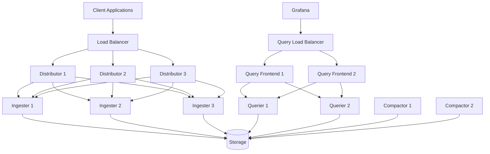

# High Availability Setup

## Introduction

High Availability (HA) is a critical characteristic of any production-ready logging system. In this guide, we'll explore how to set up Grafana Loki in a high availability configuration to ensure your logging infrastructure remains operational even when individual components fail.

Grafana Loki is designed with scalability and resilience in mind, allowing you to deploy it in distributed configurations that eliminate single points of failure. By understanding and implementing HA concepts with Loki, you'll be able to build logging infrastructure that meets enterprise requirements for uptime and reliability.

## Understanding High Availability in Loki

Loki's architecture is composed of several microservices that can be deployed in various configurations. For high availability, we need to deploy multiple instances of each component and ensure they can work together seamlessly.

The main components that need to be considered for HA are:

1. **Distributor** - Handles incoming log streams
2. **Ingester** - Writes log data to long-term storage
3. **Querier** - Handles queries from Grafana or LogCLI
4. **Query Frontend** - Optimizes and distributes query load
5. **Compactor** - Optimizes storage in the background

Let's examine how these components work together in an HA setup:



## Prerequisites

Before setting up Loki in HA mode, ensure you have:

- Kubernetes cluster or multiple servers for deployment
- Shared object storage (S3, GCS, Azure Blob, etc.)
- A key-value store like Consul or etcd for ring management
- Load balancer for distributing traffic

## Implementation Steps

### Step 1: Configure Storage Backend

First, we need to configure a shared storage backend that all Loki components can access. This is crucial for HA as it allows components to access data regardless of which instance processed it originally.

Here's an example configuration using S3:

```yaml
storage_config:
  aws:
    s3: s3://access_key:secret_access_key@region/bucket_name
    s3forcepathstyle: true
  boltdb_shipper:
    active_index_directory: /loki/boltdb-shipper-active
    cache_location: /loki/boltdb-shipper-cache
    cache_ttl: 24h
    shared_store: s3
```

### Step 2: Set Up Ring Membership

Loki uses a "ring" for distributed coordination between components. We'll configure this to use Consul:

```yaml
kvstore:
  store: consul
  consul:
    host: consul:8500
    prefix: loki/

ring:
  kvstore:
    store: consul
    consul:
      host: consul:8500
      prefix: loki/ring/
```

### Step 3: Configure Components for HA

Each component needs to be configured for HA operation. Here's an example for the distributor:

```yaml
distributor:
  ring:
    kvstore:
      store: consul
      consul:
        host: consul:8500
        prefix: loki/ring/
    replication_factor: 3
```

And for the ingester:

```yaml
ingester:
  lifecycler:
    ring:
      kvstore:
        store: consul
        consul:
          host: consul:8500
          prefix: loki/ring/
      replication_factor: 3
    final_sleep: 0s
  chunk_idle_period: 1h
  max_chunk_age: 1h
  chunk_target_size: 1048576
  chunk_retain_period: 30s
  max_transfer_retries: 0
```

### Step 4: Deploy Multiple Instances

Using Kubernetes, we can deploy multiple instances of each component. Here's a simplified example for the distributor:

```yaml
apiVersion: apps/v1
kind: Deployment
metadata:
  name: loki-distributor
spec:
  replicas: 3
  selector:
    matchLabels:
      app: loki
      component: distributor
  template:
    metadata:
      labels:
        app: loki
        component: distributor
    spec:
      containers:
      - name: loki
        image: grafana/loki:latest
        args:
          - "-target=distributor"
          - "-config.file=/etc/loki/config.yaml"
        ports:
          - containerPort: 3100
            name: http
        volumeMounts:
          - name: config
            mountPath: /etc/loki
      volumes:
        - name: config
          configMap:
            name: loki-config
```

### Step 5: Configure Load Balancers

Set up load balancers to distribute traffic to your multiple Loki instances:

```yaml
apiVersion: v1
kind: Service
metadata:
  name: loki-distributor
spec:
  type: ClusterIP
  selector:
    app: loki
    component: distributor
  ports:
    - port: 3100
      targetPort: 3100
```

## Practical Example: Complete HA Configuration

Let's put it all together with a full configuration example for a production environment:

```yaml
auth_enabled: true

server:
  http_listen_port: 3100

ingester:
  lifecycler:
    address: 127.0.0.1
    ring:
      kvstore:
        store: consul
        consul:
          host: consul:8500
          prefix: loki/ring/
      replication_factor: 3
    final_sleep: 0s
  chunk_idle_period: 1h
  chunk_target_size: 1536000
  max_chunk_age: 1h

schema_config:
  configs:
    - from: 2020-07-01
      store: boltdb-shipper
      object_store: s3
      schema: v11
      index:
        prefix: index_
        period: 24h

storage_config:
  aws:
    s3: s3://access_key:secret_access_key@region/bucket_name
    s3forcepathstyle: true
  boltdb_shipper:
    active_index_directory: /loki/boltdb-shipper-active
    cache_location: /loki/boltdb-shipper-cache
    cache_ttl: 24h
    shared_store: s3

compactor:
  working_directory: /loki/compactor
  shared_store: s3
  compaction_interval: 10m

limits_config:
  retention_period: 744h
  enforce_metric_name: false
  reject_old_samples: true
  reject_old_samples_max_age: 168h
  ingestion_rate_mb: 10
  ingestion_burst_size_mb: 20

frontend:
  compress_responses: true
  log_queries_longer_than: 10s
  
frontend_worker:
  frontend_address: loki-query-frontend:9095

ruler:
  storage:
    type: local
    local:
      directory: /loki/rules
  rule_path: /loki/rules
  alertmanager_url: http://alertmanager:9093
  ring:
    kvstore:
      store: consul
      consul:
        host: consul:8500
        prefix: loki/ruler/
  enable_api: true
```

## Verifying Your HA Setup

Once deployed, you can verify your HA setup by:

1. **Testing component resilience** - Temporarily shutting down individual pods to confirm the system remains available
2. **Monitoring the ring status** - Using the `/ring` endpoint to verify all instances are healthy
3. **Load testing** - Generating high volumes of log traffic to ensure proper distribution

You can check the ring status with:

```bash
curl http://loki:3100/ring
```

Example output:

```json
{
  "status": "success",
  "data": {
    "ingester": {
      "tokens": [
        {
          "id": "ingester-1",
          "state": "ACTIVE",
          "address": "10.0.0.1:3100",
          "timestamp": "2023-05-17T15:20:30Z"
        },
        {
          "id": "ingester-2",
          "state": "ACTIVE",
          "address": "10.0.0.2:3100",
          "timestamp": "2023-05-17T15:20:30Z"
        },
        {
          "id": "ingester-3",
          "state": "ACTIVE",
          "address": "10.0.0.3:3100",
          "timestamp": "2023-05-17T15:20:30Z"
        }
      ]
    }
  }
}
```

## Performance Considerations

When running Loki in HA mode, consider these performance optimizations:

1. **Resource allocation** - Ensure each component has adequate CPU and memory
2. **Storage performance** - Use high-performance storage backends
3. **Network latency** - Deploy components in the same region to minimize latency
4. **Query caching** - Enable and tune query caching for better performance

## Troubleshooting Common Issues

### Issue: Ingesters Not Joining the Ring

**Solution**: Check Consul connectivity and permissions. Ensure all ingesters can reach the KV store:

```bash
kubectl exec -it loki-ingester-0 -- curl consul:8500/v1/kv/loki/ring/?recurse=true
```

### Issue: Log Data Not Distributed Evenly

**Solution**: Verify your replication factor and make sure distributors are configured correctly:

```bash
kubectl logs deploy/loki-distributor | grep "distributing"
```

### Issue: Queries Failing in HA Mode

**Solution**: Check that queriers can access all ingesters and the storage backend:

```bash
kubectl logs deploy/loki-querier | grep "error"
```

## Advanced HA Features

### Multi-Zone Deployment

For even higher availability, you can deploy Loki across multiple availability zones:

```yaml
ingester:
  lifecycler:
    zone_awareness_enabled: true
    availability_zone: us-east-1a
```

### Tenant Isolation

In multi-tenant environments, consider isolating resources per tenant:

```yaml
limits_config:
  per_tenant_override_config: /etc/loki/tenant-overrides.yaml
```

### Autoscaling

Configure Kubernetes Horizontal Pod Autoscalers (HPA) to scale components based on load:

```yaml
apiVersion: autoscaling/v2
kind: HorizontalPodAutoscaler
metadata:
  name: loki-distributor-hpa
spec:
  scaleTargetRef:
    apiVersion: apps/v1
    kind: Deployment
    name: loki-distributor
  minReplicas: 3
  maxReplicas: 10
  metrics:
  - type: Resource
    resource:
      name: cpu
      target:
        type: Utilization
        averageUtilization: 60
```

## Summary

Setting up Grafana Loki in a high availability configuration is essential for production environments where reliability and scalability are critical. By deploying multiple instances of each component, configuring shared storage, and implementing proper coordination through rings, you can build a robust logging infrastructure that can withstand component failures.

Key takeaways:
- Use shared object storage for log data
- Configure a distributed key-value store for ring management
- Deploy multiple instances of each component
- Use load balancers to distribute traffic
- Implement monitoring to detect and address issues quickly

With these practices in place, your Loki deployment will be resilient and capable of handling production workloads reliably.

## Additional Resources

- Practice setting up a simple HA configuration on a local Kubernetes cluster using Minikube
- Experiment with different replication factors and observe their impact on resilience and resource usage
- Try simulating failures by shutting down components and observing how the system responds

## Exercises

1. Deploy a basic Loki HA setup with 3 distributors, 3 ingesters, and 2 queriers
2. Implement a monitoring dashboard to track the health of your Loki components
3. Create a disaster recovery plan for your Loki deployment, including backup and restore procedures
4. Configure alerting to notify you when components fail or performance degrades
5. Benchmark your HA setup to determine maximum log ingestion rates