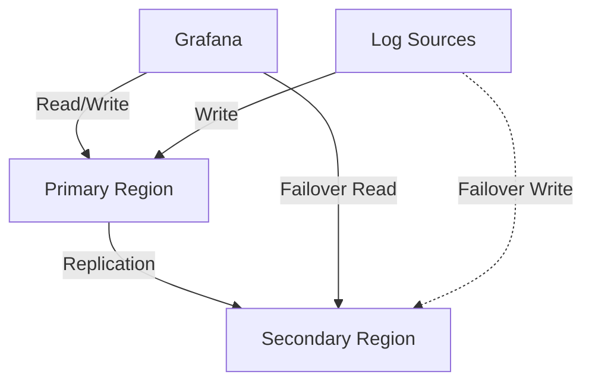
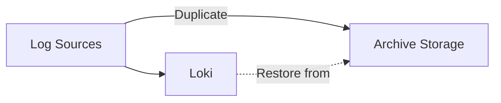

# Disaster Recovery Strategies

## Introduction

Disaster recovery is a critical aspect of any production logging system. In the context of Grafana Loki, disaster recovery strategies ensure that your logging data remains available even in the face of hardware failures, data corruption, or catastrophic events. This guide will walk you through various approaches to disaster recovery in Grafana Loki, providing you with the knowledge to implement robust recovery mechanisms for your logging infrastructure.

Grafana Loki's distributed architecture already provides some resilience against failures, but a comprehensive disaster recovery plan extends this protection further, ensuring business continuity and minimal data loss during unexpected events.

## Core Concepts

Before diving into specific strategies, let's understand some fundamental concepts related to disaster recovery in Grafana Loki:

### Recovery Point Objective (RPO)

The RPO defines the maximum amount of data you're willing to lose in the event of a disaster. For logging systems like Loki, this could range from zero data loss to accepting the loss of the most recent few minutes of logs.

### Recovery Time Objective (RTO)

The RTO specifies how quickly your system needs to be operational after a disaster. This metric helps determine the recovery mechanisms you'll implement.

### Backup Types

- **Full Backups**: Complete copies of all Loki data
- **Incremental Backups**: Only data changed since the last backup
- **Continuous Backups**: Real-time or near-real-time backup mechanisms

## Disaster Recovery Strategies for Loki

### 1. Multi-Region Deployment

One of the most effective strategies for disaster recovery is distributing your Loki deployment across multiple regions or data centers.



#### Implementation Steps:

1. Deploy Loki components in at least two separate regions
2. Configure replication between regions
3. Set up automated failover mechanisms
4. Regularly test the failover process

#### Example Configuration:

```yaml
loki:
  storage:
    type: s3
    s3:
      s3: s3://primary-bucket/loki
      region: us-west-2
      endpoint: s3.us-west-2.amazonaws.com
  replication_factor: 3
  ring:
    kvstore:
      store: multi
      prefix: loki/
      multi:
        primary: consul
        secondary: etcd
```

The secondary region would have a similar configuration but with different bucket and region settings.

### 2. Object Storage Backups

Grafana Loki typically stores chunks and indexes in object storage systems like S3, GCS, or Azure Blob Storage, which already offer high durability. However, implementing regular backups ensures protection against accidental deletions or corruption.

#### Implementation Steps:

1. Schedule regular snapshots of your object storage buckets
2. Implement versioning on your object storage
3. Consider cross-region replication for your buckets

#### Example AWS S3 Cross-Region Replication:

```json
{
  "ReplicationConfiguration": {
    "Role": "arn:aws:iam::account-id:role/role-name",
    "Rules": [
      {
        "Status": "Enabled",
        "Priority": 1,
        "DeleteMarkerReplication": { "Status": "Enabled" },
        "Filter": {},
        "Destination": {
          "Bucket": "arn:aws:s3:::destination-bucket",
          "StorageClass": "STANDARD",
          "ReplicationTime": {
            "Status": "Enabled",
            "Time": {
              "Minutes": 15
            }
          },
          "Metrics": {
            "Status": "Enabled",
            "EventThreshold": {
              "Minutes": 15
            }
          }
        }
      }
    ]
  }
}
```

### 3. Database Backups

Loki's index storage (typically Cassandra, BoltDB, or a cloud-native database) also requires backup procedures.

#### For Cassandra:

```bash
# Taking a snapshot of Loki keyspace
nodetool snapshot loki

# Backing up schema
cqlsh -e "DESC KEYSPACE loki" > loki_schema.cql

# Restoring from snapshot (example)
sstableloader -d node1,node2,node3 /path/to/snapshot/loki/tables/
```

#### For BoltDB:

```bash
# Simple file copy for backup
cp /path/to/index.db /path/to/backup/index.db.bak

# For consistency, stop Loki or use filesystem snapshots
```

### 4. Continuous Archiving of Logs

Implementing a continuous log archiving strategy provides an additional safety net.



#### Implementation:

1. Configure your log shippers (Promtail, Fluentd, etc.) to send logs to both Loki and a long-term archive
2. Set up retention policies on both systems according to your needs
3. Implement processes to restore from archives when needed

#### Example Promtail Configuration with Multiple Targets:

```yaml
clients:
  - url: http://loki:3100/loki/api/v1/push
    tenant_id: tenant1
  - url: http://archive-service:8080/logs
    tenant_id: tenant1

scrape_configs:
  - job_name: system
    static_configs:
      - targets:
          - localhost
        labels:
          job: varlogs
          __path__: /var/log/*log
```

### 5. Snapshot and Restore

Loki provides tools to create snapshots of specific time ranges, which can be useful for targeted backups or migration between clusters.

#### Creating a Snapshot:

```bash
# Using the Loki API to create a snapshot
curl -X POST "http://loki:3100/loki/api/v1/admin/snapshots" \
  -H "Content-Type: application/json" \
  -d '{
    "name": "daily-backup",
    "start": "2023-01-01T00:00:00Z",
    "end": "2023-01-02T00:00:00Z"
  }'
```

#### Restoring from a Snapshot:

```bash
# Using the Loki API to restore a snapshot
curl -X POST "http://loki:3100/loki/api/v1/admin/restore" \
  -H "Content-Type: application/json" \
  -d '{
    "snapshot_name": "daily-backup"
  }'
```

## Implementing a Comprehensive Disaster Recovery Plan

A complete disaster recovery plan for Grafana Loki includes several components:

### 1. Regular Automated Backups

Set up scheduled backups of both object storage and index databases.

```yaml
# Example cron job configuration for backups
apiVersion: batch/v1
kind: CronJob
metadata:
  name: loki-backup
spec:
  schedule: "0 2 * * *"  # Daily at 2 AM
  jobTemplate:
    spec:
      template:
        spec:
          containers:
          - name: backup
            image: backup-tool:latest
            args:
            - --source=s3://loki-bucket
            - --destination=s3://backup-bucket
          restartPolicy: OnFailure
```

### 2. Monitoring and Alerting

Implement monitoring for your backup processes to ensure they're working correctly.

```yaml
# Example Prometheus alert rule
groups:
- name: backup-monitoring
  rules:
  - alert: BackupMissing
    expr: time() - loki_backup_last_success_timestamp_seconds > 86400
    for: 1h
    labels:
      severity: critical
    annotations:
      summary: "Loki backup has not succeeded in the last 24 hours"
      description: "The last successful backup was {{ $value }} seconds ago."
```

### 3. Documentation and Runbooks

Create detailed documentation of your disaster recovery procedures and regularly update them.

### 4. Regular Testing

Schedule periodic disaster recovery drills to ensure your plans work as expected.

## Real-World Example: Recovering from a Region Failure

Let's walk through a practical example of recovering from a regional outage:

### Scenario: Primary Region is Unavailable

1. **Detection**: Monitoring systems detect that the primary region is not responding
2. **Failover**: Traffic is automatically redirected to the secondary region
3. **Assessment**: The team evaluates the extent of the outage
4. **Recovery Actions**:

```bash
# Update DNS to point to secondary region
aws route53 change-resource-record-sets \
  --hosted-zone-id ZXXXXXXXXXXXX \
  --change-batch '{"Changes":[{"Action":"UPSERT","ResourceRecordSet":{"Name":"loki.example.com","Type":"CNAME","TTL":300,"ResourceRecords":[{"Value":"loki-secondary.example.com"}]}}]}'

# Promote secondary Loki cluster to primary
kubectl -n loki apply -f loki-primary-config.yaml

# Verify data integrity
curl -X GET "https://loki-secondary.example.com/loki/api/v1/query_range" \
  -H "Content-Type: application/json" \
  -d '{
    "query": "{job=\"test\"}",
    "start": "2023-01-01T00:00:00Z",
    "end": "2023-01-02T00:00:00Z",
    "limit": 10
  }'
```

5. **Communication**: Keep stakeholders informed about the situation and expected resolution
6. **Post-Recovery**: Once the primary region is available again, evaluate whether to fail back or keep the new configuration

## Summary

Disaster recovery for Grafana Loki requires a thoughtful approach that balances your RPO/RTO needs with the resources available. By implementing a combination of strategies—multi-region deployment, regular backups, continuous archiving, and automated failover—you can create a resilient logging infrastructure that withstands even significant outages.

Remember that a disaster recovery plan is only as good as its testing regime. Regular drills and updates to your procedures ensure that when a real disaster strikes, your team is prepared and can execute the recovery efficiently.

## Additional Resources

- Grafana Loki documentation on operations and scaling
- Cloud provider documentation on backup and recovery strategies
- Infrastructure-as-code templates for automating DR setup

## Exercises

1. Set up a multi-region Loki deployment in a test environment and practice failover procedures.
2. Create a backup and restore strategy for your Loki deployment and test it by restoring to a new cluster.
3. Design a monitoring dashboard specifically for tracking the health of your disaster recovery components.
4. Develop a runbook for responding to different types of failures in your Loki infrastructure.
5. Implement and test a solution for continuous archiving of logs to a secondary storage system.