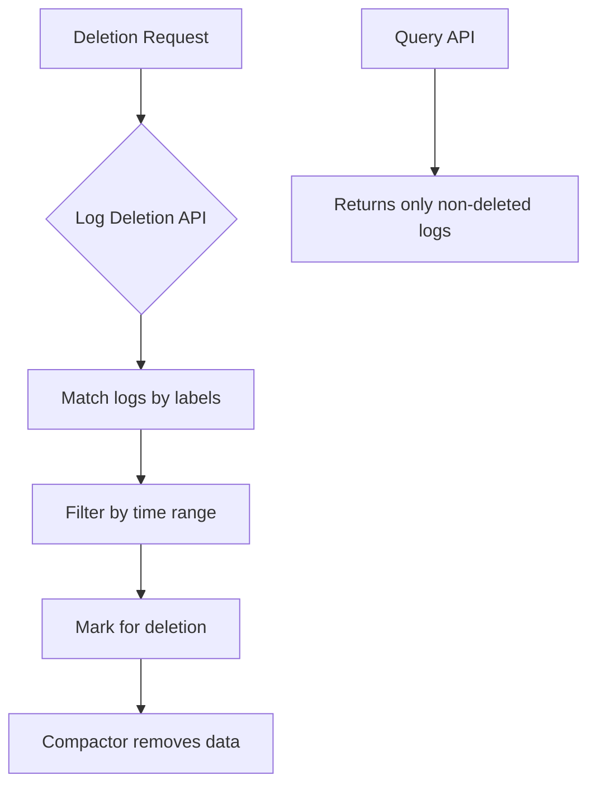

# Log Deletion API

## Introduction

The Log Deletion API is a powerful feature in Grafana Loki that allows you to selectively delete log data based on specific criteria. As log data accumulates over time, managing storage becomes crucial for both performance and cost reasons. While Loki has automatic retention policies, there are scenarios where you need more granular control over which logs to keep and which to remove.

This API enables you to programmatically delete specific logs matching certain labels or time ranges, helping you maintain control over your log storage while preserving important data.

## Why Use the Log Deletion API?

- **Compliance requirements**: Remove sensitive data to comply with regulations like GDPR
- **Storage optimization**: Selectively delete low-value logs to reduce storage costs
- **Performance improvement**: Maintain query performance by removing unnecessary data
- **Data cleanup**: Remove test data, logs from decommissioned services, or erroneous entries

## Prerequisites

Before using the Log Deletion API, ensure you have:

- Grafana Loki v2.3.0 or higher
- Appropriate access permissions to the Loki API
- Basic understanding of Loki's label structure and LogQL

## How the Log Deletion API Works

The Log Deletion API allows you to submit deletion requests that specify which logs to remove based on:

1. **Label selectors**: Target logs with specific label combinations
2. **Time range**: Specify start and end times for deletion
3. **Tenant ID**: For multi-tenant setups, specify which tenant's data to delete



## Using the Log Deletion API

### API Endpoint

The Log Deletion API endpoint is:

```
POST /loki/api/v1/delete
```

### Request Format

The deletion request requires a JSON body with the following parameters:

```json
{
  "query": "{app=\"frontend\", env=\"production\"}",
  "start": "2023-01-01T00:00:00Z",
  "end": "2023-01-02T00:00:00Z"
}
```

Where:
- `query`: A LogQL selector to match the logs you want to delete
- `start`: The start timestamp (RFC3339 format)
- `end`: The end timestamp (RFC3339 format)

### Example: Basic Log Deletion

Let's see how to delete all logs from a specific application in the production environment for a certain date range:

```bash
curl -X POST http://loki:3100/loki/api/v1/delete \
  -H "Content-Type: application/json" \
  -d '{
    "query": "{app=\"payment-service\", env=\"production\"}",
    "start": "2023-03-15T00:00:00Z",
    "end": "2023-03-16T00:00:00Z"
  }'
```

If successful, you'll receive a response like:

```json
{
  "status": "success",
  "data": {
    "requestId": "1a2b3c4d5e6f7g8h9i0j"
  }
}
```

The `requestId` can be used to check the status of your deletion request.

### Checking Deletion Status

To check the status of a deletion request:

```bash
curl -X GET http://loki:3100/loki/api/v1/delete/1a2b3c4d5e6f7g8h9i0j
```

Response:

```json
{
  "status": "success",
  "data": {
    "requestId": "1a2b3c4d5e6f7g8h9i0j",
    "status": "complete"
  }
}
```

Possible status values include:
- `pending`: The deletion request is queued
- `processing`: Loki is actively working on the deletion
- `complete`: The deletion has been completed
- `failed`: The deletion could not be completed

## Advanced Usage

### Deleting Logs with Complex Selectors

You can use more complex LogQL selectors to target specific logs:

```bash
curl -X POST http://loki:3100/loki/api/v1/delete \
  -H "Content-Type: application/json" \
  -d '{
    "query": "{app=~\"auth.*\", env=\"staging\", status=~\"5..\"}",
    "start": "2023-04-01T00:00:00Z",
    "end": "2023-04-30T23:59:59Z"
  }'
```

This example deletes all logs from April 2023 that:
- Come from any app starting with "auth" (like "auth-service" or "auth-api")
- Are from the staging environment
- Have status codes in the 500 range (server errors)

### Multi-tenant Deletion

If you're using Loki in a multi-tenant setup, you'll need to specify the tenant ID:

```bash
curl -X POST http://loki:3100/loki/api/v1/delete \
  -H "Content-Type: application/json" \
  -H "X-Scope-OrgID: tenant-123" \
  -d '{
    "query": "{app=\"user-service\"}",
    "start": "2023-02-01T00:00:00Z",
    "end": "2023-02-28T23:59:59Z"
  }'
```

## Practical Examples

### Scenario 1: Removing PII Data

Imagine you discovered that personal identifiable information (PII) was accidentally logged in your application. You need to remove it to comply with privacy regulations:

```bash
curl -X POST http://loki:3100/loki/api/v1/delete \
  -H "Content-Type: application/json" \
  -d '{
    "query": "{app=\"user-service\"} |= \"email=\" |= \"@\"",
    "start": "2023-01-01T00:00:00Z", 
    "end": "2023-06-30T23:59:59Z"
  }'
```

This example attempts to find and delete logs containing email addresses in the user service.

### Scenario 2: Cleaning Up After a Test Run

After running a load test in your staging environment, you want to clean up the test data:

```bash
curl -X POST http://loki:3100/loki/api/v1/delete \
  -H "Content-Type: application/json" \
  -d '{
    "query": "{env=\"staging\", source=\"load-test\"}",
    "start": "2023-05-10T09:00:00Z",
    "end": "2023-05-10T17:00:00Z"
  }'
```

### Scenario 3: Storage Optimization

You want to keep detailed debug logs for only 7 days while retaining error logs for longer:

```bash
# Get current date minus 7 days in the proper format
START_DATE=$(date -u -d "7 days ago" "+%Y-%m-%dT00:00:00Z")
CURRENT_DATE=$(date -u "+%Y-%m-%dT00:00:00Z")

curl -X POST http://loki:3100/loki/api/v1/delete \
  -H "Content-Type: application/json" \
  -d '{
    "query": "{level=\"debug\", env=\"production\"}",
    "start": "2022-01-01T00:00:00Z",
    "end": "'$START_DATE'"
  }'
```

## Implementation in a Node.js Application

Here's how you might implement log deletion in a Node.js application:

```javascript
const axios = require('axios');

async function deleteLogs(query, startTime, endTime) {
  try {
    const response = await axios.post('http://loki:3100/loki/api/v1/delete', {
      query,
      start: startTime,
      end: endTime
    }, {
      headers: {
        'Content-Type': 'application/json'
      }
    });
    
    console.log(`Deletion request submitted with ID: ${response.data.data.requestId}`);
    return response.data.data.requestId;
  } catch (error) {
    console.error('Error submitting deletion request:', error.response?.data || error.message);
    throw error;
  }
}

async function checkDeletionStatus(requestId) {
  try {
    const response = await axios.get(`http://loki:3100/loki/api/v1/delete/${requestId}`);
    return response.data.data.status;
  } catch (error) {
    console.error('Error checking deletion status:', error.response?.data || error.message);
    throw error;
  }
}

// Example usage
async function main() {
  try {
    // Delete all error logs from a specific service older than 90 days
    const ninetyDaysAgo = new Date();
    ninetyDaysAgo.setDate(ninetyDaysAgo.getDate() - 90);
    
    const requestId = await deleteLogs(
      '{service="payment-gateway", level="error"}',
      '2022-01-01T00:00:00Z',
      ninetyDaysAgo.toISOString()
    );
    
    // Check status after 5 seconds
    setTimeout(async () => {
      const status = await checkDeletionStatus(requestId);
      console.log(`Deletion status: ${status}`);
    }, 5000);
    
  } catch (error) {
    console.error('Failed to manage log deletion:', error);
  }
}

main();
```

## Best Practices

1. **Be specific with your queries**: Target only the logs you need to delete
2. **Use time ranges effectively**: Delete older logs first, and use smaller time ranges for more predictable performance
3. **Monitor deletion requests**: Check the status of long-running deletions
4. **Schedule regular cleanups**: Implement automated deletion jobs for routine maintenance
5. **Test in non-production first**: Always test your deletion queries in a non-production environment before running them on production data
6. **Document deletions**: Keep a record of what was deleted and why, especially for compliance purposes

## Limitations and Considerations

- **Performance impact**: Large deletion operations can impact query performance
- **Storage reclamation delay**: Storage space might not be immediately reclaimed due to compaction scheduling
- **Deletion granularity**: The smallest unit of deletion is a log entry (you cannot delete parts of a log entry)
- **No undoing deletions**: Once deleted, logs cannot be recovered
- **Authorization**: Ensure proper access controls so only authorized users can delete logs

## Summary

The Log Deletion API is a powerful tool for managing your log data in Grafana Loki. It provides a way to selectively remove logs based on label selectors and time ranges, helping you maintain control over storage costs, comply with regulations, and optimize system performance.

Remember that log deletion is permanent, so always double-check your queries before executing deletion operations, especially in production environments.

## Exercises

1. Write a deletion query to remove all logs from a decommissioned service called "legacy-api".
2. Create a script that automatically deletes debug logs older than 14 days while preserving error and warning logs.
3. Design a scheduled job that runs weekly to clean up test data from your staging environment.

## Additional Resources

- [Grafana Loki Documentation](https://grafana.com/docs/loki/latest/)
- [LogQL Query Language Reference](https://grafana.com/docs/loki/latest/logql/)
- [Data Retention in Loki](https://grafana.com/docs/loki/latest/operations/storage/retention/)
- [Loki API Documentation](https://grafana.com/docs/loki/latest/api/)