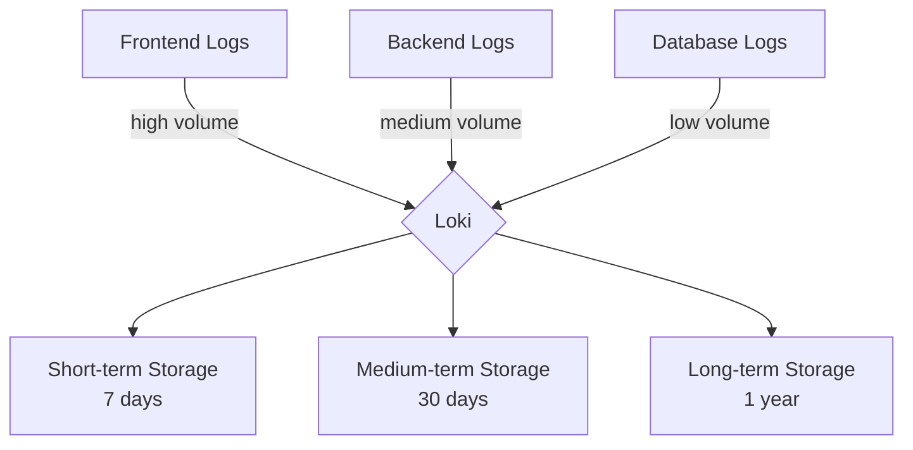

# Log Retention

## Introduction

Log retention is a critical aspect of any logging system, including Grafana Loki. It refers to how long your logs are stored before being automatically deleted or archived. Understanding and configuring log retention properly helps you:

- Control storage costs
- Maintain system performance
- Comply with data retention regulations
- Ensure you have access to logs when you need them

In this guide, we'll explore how log retention works in Grafana Loki, how to configure retention policies, and best practices for managing your log data effectively.

## Understanding Log Retention in Loki

Loki's approach to log retention is centered around the concept of "chunks" - compressed batches of log data that are stored and managed together. Log retention in Loki involves deciding when these chunks should be deleted or moved to different storage tiers.

### Why Log Retention Matters

Without proper retention policies:

1. **Storage costs can skyrocket**: Logs accumulate quickly in production environments
2. **Query performance degrades**: More data means slower queries
3. **Compliance risks increase**: Many industries have specific requirements for how long logs must be kept

## Basic Retention Configuration

Loki supports several methods for configuring retention:

1. **Time-based retention**: Delete logs older than a specified period
2. **Size-based retention**: Limit the total storage used for logs
3. **Stream-based retention**: Set different retention policies for different log streams

Let's look at how to configure each approach.

### Time-Based Retention

Time-based retention is the most common approach. Here's how to configure it in your Loki configuration file:

```yaml
limits_config:
  retention_period: 744h # 31 days
```

This configuration tells Loki to keep logs for 31 days (744 hours) before deleting them.

You can also configure retention periods for specific tenants:

```yaml
limits_config:
  retention_period: 744h # Default retention period

  per_tenant_override_config: /etc/loki/retention-overrides.yaml
```

With a `retention-overrides.yaml` file that looks like:

```yaml
overrides:
  "tenant1":
    retention_period: 1440h # 60 days
  "tenant2":
    retention_period: 168h  # 7 days
```

### Size-Based Retention

To limit storage based on size:

```yaml
compactor:
  retention_enabled: true
  
limits_config:
  retention_period: 0   # 0 means no time-based deletion
  retention_stream_size_mb: 100  # Max size per stream
  retention_total_size_mb: 10000  # Max total size
```

In this example, logs will be deleted when:
- A single stream exceeds 100MB
- Total log storage exceeds 10GB

### Stream-Based Retention with Labels

You can set different retention periods for different log streams using Loki's stream selector syntax:

```yaml
limits_config:
  retention_period: 744h # Default retention period

  retention_stream_selectors:
    - '{app="critical-service"}': 8760h  # 1 year
    - '{env="development"}': 72h        # 3 days
    - '{namespace="monitoring"}': 2160h  # 90 days
```

## Implementing Retention in a Microservices Architecture

Let's look at a practical example of configuring retention in a microservices environment:



In this architecture, we want to configure different retention policies:

1. Frontend logs (high volume, less critical): 7 days
2. Backend logs (medium volume, important): 30 days
3. Database logs (low volume, critical): 1 year

Here's the configuration:

```yaml
limits_config:
  retention_period: 168h # Default: 7 days

  retention_stream_selectors:
    - '{component="backend"}': 720h     # 30 days
    - '{component="database"}': 8760h   # 365 days
```

## Best Practices for Log Retention

### 1. Align with Business Requirements

Configure retention based on:
- Compliance requirements (GDPR, HIPAA, SOX, etc.)
- Incident investigation needs
- Audit requirements
- Debugging needs

### 2. Consider a Tiered Storage Approach

Loki supports moving older logs to cheaper storage:

```yaml
schema_config:
  configs:
    - from: 2022-01-01
      store: boltdb-shipper
      object_store: filesystem
      schema: v11
      index:
        prefix: index_
        period: 24h

storage_config:
  boltdb_shipper:
    active_index_directory: /loki/index
    cache_location: /loki/cache
    cache_ttl: 24h
    shared_store: s3
  
  filesystem:
    directory: /loki/chunks
    
  aws:
    s3: s3://bucket/prefix
    region: us-west-2
```

This configuration stores recent logs in the filesystem for fast access and moves older logs to S3 for cost-effective long-term storage.

### 3. Optimize for Query Patterns

If you frequently query only recent logs, set a shorter retention period for fast queries and keep longer retention for specific critical components.

### 4. Monitor Storage Usage

Set up alerts for storage usage to avoid unexpected costs:

```yaml
# In your Prometheus alerting rules
- alert: LokiHighStorageUsage
  expr: sum(loki_ingester_memory_chunks) > 1000000
  for: 10m
  labels:
    severity: warning
  annotations:
    summary: "High number of chunks in memory"
    description: "Loki has a high number of chunks in memory, which might indicate retention policies need adjustment."
```

## Deletion vs. Compaction

Loki supports two main approaches to managing old data:

1. **Deletion**: Completely removes old logs
2. **Compaction**: Combines and compresses old logs to reduce storage needs

To enable compaction:

```yaml
compactor:
  working_directory: /loki/compactor
  shared_store: s3
  compaction_interval: 24h
```

## Implementing a Log Lifecycle Policy

A complete log management strategy often involves multiple stages:

1. **Hot storage** (0-7 days): Kept in memory/local storage for fast queries
2. **Warm storage** (8-30 days): Moved to object storage but still indexed
3. **Cold storage** (31+ days): Archived with limited indexing
4. **Deletion**: Removed after retention period

Here's how to implement this in Loki:

```yaml
schema_config:
  configs:
    - from: 2022-01-01
      store: boltdb-shipper
      object_store: filesystem
      schema: v11
      index:
        prefix: index_
        period: 24h

storage_config:
  boltdb_shipper:
    active_index_directory: /loki/index/hot
    cache_location: /loki/cache
    cache_ttl: 24h
    shared_store: s3
  
  aws:
    s3: s3://loki-bucket
    s3forcepathstyle: true
    
storage_schema:
  - regex: ".*"
    prefix: loki/
    object_store: s3_hot
    schema: v11
    index:
      enabled: true
      store: boltdb-shipper
      prefix: loki/index/
      period: 24h

  - regex: ".*"
    prefix: loki_cold/
    object_store: s3_cold
    schema: v11
    index:
      enabled: false

ruler:
  storage:
    type: local
    local:
      directory: /loki/rules
  rule_path: /loki/rules-temp
  alertmanager_url: http://alertmanager:9093
  ring:
    kvstore:
      store: inmemory
  enable_api: true
```

## Common Challenges and Solutions

### Challenge 1: Balancing Performance and Retention

**Solution**: Use Loki's stream labels to retain important logs longer while keeping retention shorter for high-volume, less critical logs.

### Challenge 2: Compliance with Varying Requirements

**Solution**: Configure tenant-specific retention policies that align with each department's compliance needs.

### Challenge 3: Cost Management

**Solution**: Implement a tiered storage approach with automated movement from expensive to cheaper storage.

## Example: Log Retention in Production

Let's examine a complete production example with a combination of strategies:

```yaml
limits_config:
  # Global defaults
  retention_period: 168h # 7 days default

  # Per-stream retention based on importance
  retention_stream_selectors:
    - '{app="payment-service"}': 2160h    # 90 days for payment logs
    - '{app="auth-service"}': 720h        # 30 days for auth logs
    - '{level="error"}': 720h             # 30 days for all errors
    - '{env="development"}': 72h          # 3 days for dev environment

compactor:
  working_directory: /loki/compactor
  shared_store: s3
  retention_enabled: true
  retention_delete_delay: 2h
  compaction_interval: 10m
  
storage_config:
  aws:
    s3: s3://logs-bucket
    region: us-west-2
    bucketnames: logs-bucket
    access_key_id: ${AWS_ACCESS_KEY_ID}
    secret_access_key: ${AWS_SECRET_ACCESS_KEY}
    s3forcepathstyle: true
    insecure: false
```

## Summary

Log retention in Grafana Loki is a powerful feature that helps you balance storage costs, performance, and compliance requirements. Key takeaways include:

- Configure retention based on time, size, or stream characteristics
- Consider a tiered storage approach for cost optimization
- Set different retention periods for different log types based on importance
- Monitor storage usage to avoid unexpected costs
- Implement compaction to optimize storage while retaining valuable logs

By implementing a thoughtful log retention strategy, you can ensure your Loki deployment remains performant, cost-effective, and compliant with your organization's requirements.

## Additional Resources

- [Official Loki Documentation on Retention](https://grafana.com/docs/loki/latest/operations/storage/retention/)
- [Storage Best Practices](https://grafana.com/docs/loki/latest/operations/storage/)
- [Compactor Documentation](https://grafana.com/docs/loki/latest/operations/compactor/)

## Exercises

1. Configure a basic time-based retention policy for Loki that keeps logs for 14 days.
2. Create a multi-tier retention policy that keeps error logs for 60 days and all other logs for 7 days.
3. Set up a monitoring dashboard in Grafana to track Loki storage usage over time.
4. Design a retention policy that complies with GDPR requirements for a web application.