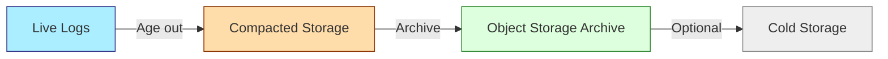

# Log Archiving

## Introduction

Log archiving is a critical feature in Grafana Loki that enables you to store logs for extended periods in cost-effective storage solutions. While Loki excels at handling recent logs for real-time analysis, archiving provides a way to retain logs long-term for compliance, audit, or historical analysis purposes without compromising performance or managing excessive storage costs.

In this guide, we'll explore how Loki's log archiving works, how to configure it, and best practices for implementing an effective log archiving strategy.

## Why Archive Logs?

Before diving into implementation details, let's understand why log archiving is important:

- **Compliance requirements**: Many industries require logs to be retained for specific timeframes
- **Cost optimization**: Moving older logs to cheaper storage tiers reduces operational costs
- **Performance improvement**: Loki performs better with focused, recent datasets
- **Historical analysis**: Archived logs can be retrieved when needed for investigation
- **Disaster recovery**: Archives serve as backups in case of primary system failures

## How Loki Log Archiving Works

Loki uses a multi-tiered storage approach where logs transition through different stages:



1. **Ingestion**: Logs first enter Loki's **ingester** component
2. **Storage**: Logs are stored in the primary storage system (local filesystem, object storage)
3. **Compaction**: Over time, logs are compacted for efficiency
4. **Archiving**: Based on rules, logs are moved to archive storage

Loki doesn't automatically delete logs after archiving - you must configure retention policies separately.

## Configuring Log Archiving

Let's look at how to configure log archiving in Loki. The archiving features are configured in the `storage_config` and `chunk_store_config` sections of your Loki configuration.

### Basic Configuration

Here's a basic example configuring S3 as an archive destination:

```yaml
storage_config:
  boltdb_shipper:
    active_index_directory: /loki/index
    cache_location: /loki/cache
    shared_store: s3
    
  aws:
    s3: s3://access_key:secret_access_key@region/bucket_name
    s3forcepathstyle: true
    
  filesystem:
    directory: /loki/chunks
    
schema_config:
  configs:
    - from: 2020-07-01
      store: boltdb-shipper
      object_store: filesystem
      schema: v11
      index:
        prefix: index_
        period: 24h

compactor:
  working_directory: /loki/compactor
  shared_store: s3

ruler:
  storage:
    type: local
    local:
      directory: /loki/rules

limits_config:
  retention_period: 744h  # 31 days

chunk_store_config:
  max_look_back_period: 744h  # 31 days

table_manager:
  retention_deletes_enabled: true
  retention_period: 744h  # 31 days
```

### Advanced Archiving Configuration

For more advanced archiving needs, you can use Loki's `period_config` to define different storage tiers based on log age:

```yaml
schema_config:
  configs:
    - from: 2020-07-01
      store: boltdb-shipper
      object_store: filesystem
      schema: v11
      index:
        prefix: index_
        period: 24h

period_config:
  # Recent logs (0-7 days)
  - from: 0
    store: boltdb-shipper
    object_store: filesystem
    index:
      prefix: recent_
      period: 24h
      
  # Medium-term logs (7-30 days)
  - from: 168h  # 7 days
    store: boltdb-shipper
    object_store: s3
    index:
      prefix: medium_
      period: 24h
      
  # Archived logs (30+ days)
  - from: 720h  # 30 days
    store: boltdb-shipper
    object_store: s3-archive
    index:
      prefix: archive_
      period: 168h  # Weekly index files for archives
```

## Archiving to Different Object Stores

Loki supports several object storage backends for archiving. Let's look at the configuration for the most common ones:

### Amazon S3

```yaml
storage_config:
  aws:
    s3: s3://access_key:secret_access_key@region/bucket_name
    s3forcepathstyle: true
    # Optional S3 settings
    insecure: false
    http_config:
      idle_conn_timeout: 90s
      response_header_timeout: 0s
      insecure_skip_verify: false
    s3: s3://access_key:secret_access_key@region/bucket_name
    s3forcepathstyle: true
```

### Google Cloud Storage (GCS)

```yaml
storage_config:
  gcs:
    bucket_name: loki-archives
    # Optional - use service account file (if not using workload identity)
    service_account: /path/to/service-account.json
```

### Azure Blob Storage

```yaml
storage_config:
  azure:
    account_name: lokiarchive
    account_key: your-account-key
    container_name: loki-archives
    endpoint_suffix: core.windows.net
```

## Retrieving Archived Logs

Archived logs in Loki are not automatically queried when you run standard queries. To query archived logs, you need to use specific parameters in your LogQL queries:

```logql
{app="myapp"} | archive_store=true
```

This tells Loki to include archived logs in the search. Be aware that querying archived logs:

1. May take significantly longer
2. Could incur additional costs if your archive storage charges for data retrieval
3. Might require higher query timeout settings

For better performance, always try to narrow down your archived queries with specific labels and time ranges:

```logql
{app="myapp", env="production"} | archive_store=true | time > 2weeks
```

## Implementing a Cost-Effective Archiving Strategy

To maximize the benefits of log archiving while minimizing costs, consider these strategies:

### 1. Tiered Retention Policies

Define different retention periods based on log importance:

```yaml
limits_config:
  # Default retention for all logs
  retention_period: 744h  # 31 days
  
  # Per-tenant overrides
  per_tenant_override_config: /etc/loki/retention-overrides.yaml
```

In `retention-overrides.yaml`:

```yaml
overrides:
  tenant1:
    retention_period: 8760h  # 1 year for critical tenant
  tenant2:
    retention_period: 2160h  # 90 days
```

### 2. Lifecycle Rules for Archive Storage

Configure lifecycle rules in your cloud storage to automatically transition archived logs to cheaper storage tiers:

**S3 Example:**
- Store recent archives (1-3 months) in S3 Standard
- Transition older archives (3-12 months) to S3 Standard-IA
- Move very old archives (>1 year) to S3 Glacier

**GCS Example:**
- Store recent archives in Standard Storage
- Transition older archives to Nearline Storage
- Move very old archives to Coldline or Archive Storage

### 3. Selective Archiving

Not all logs need to be archived. Use Loki's label selectors to archive only important logs:

```yaml
archive_config:
  selectors:
    - selector: '{app="payment-service"}'
      priority: high
    - selector: '{env="production"}'
      priority: medium
    - selector: '{app="debug-logger"}'
      priority: skip  # Don't archive these logs
```

## Real-World Example: Compliance Archiving System

Let's build a complete example for a financial services company that needs to:
- Keep all transaction logs for 7 years
- Keep security logs for 1 year
- Keep application logs for 90 days
- Ensure cost-effective storage

### Step 1: Configure Loki's Storage Tiers

```yaml
schema_config:
  configs:
    - from: 2020-01-01
      store: boltdb-shipper
      object_store: filesystem
      schema: v11
      index:
        prefix: index_
        period: 24h

storage_config:
  # Primary storage (recent logs)
  filesystem:
    directory: /loki/chunks
  
  # Archive storage (S3)
  aws:
    s3: s3://access_key:secret_access_key@region/financial-logs-archive
    s3forcepathstyle: true
    
  # BoltDB for indices
  boltdb_shipper:
    active_index_directory: /loki/index
    cache_location: /loki/cache
    shared_store: s3

period_config:
  # Recent logs (0-90 days): Local filesystem
  - from: 0
    store: boltdb-shipper
    object_store: filesystem
    
  # Medium-term logs (90-365 days): S3 Standard
  - from: 2160h  # 90 days
    store: boltdb-shipper
    object_store: s3
    
  # Long-term logs (1-7 years): S3 with lifecycle rules
  - from: 8760h  # 365 days
    store: boltdb-shipper
    object_store: s3
```

### Step 2: Configure Selective Retention

```yaml
limits_config:
  # Default retention
  retention_period: 2160h  # 90 days for application logs
  
  # Configure per-stream overrides
  retention_stream_selector:
    # Transaction logs: 7 years
    - selector: '{service="transactions"}'
      retention: 61320h  # 7 years
      
    # Security logs: 1 year
    - selector: '{category="security"}'
      retention: 8760h  # 1 year
```

### Step 3: Set Up S3 Lifecycle Rules

In AWS S3 console, set up lifecycle rules for the `financial-logs-archive` bucket:

1. For objects with prefix `medium_` (90-365 days):
   - Store in S3 Standard

2. For objects with prefix `archive_` (1+ years):
   - Transition to S3 Standard-IA after 30 days
   - Transition to S3 Glacier after 180 days

### Step 4: Monitoring Archive Health

Deploy a monitoring solution to ensure archives are correctly maintained:

```yaml
# Prometheus rules for archive monitoring
groups:
  - name: loki_archiving
    rules:
      - alert: LokiArchiveFailure
        expr: rate(loki_archive_operation_failures_total[5m]) > 0
        for: 15m
        labels:
          severity: critical
        annotations:
          summary: "Loki archive operations failing"
          description: "Loki archive operations have been failing for 15 minutes."
```

## Querying Examples

### Basic Query Including Archives

```logql
{service="payment-gateway"} |= "transaction failed" | archive_store=true
```

### Specific Time Range Query

```logql
{service="payment-gateway", user_id="12345"} 
| archive_store=true 
| time > unix_timestamp("2022-01-01") and time < unix_timestamp("2022-01-31")
```

### Combining Live and Archive Data

```logql
{service="auth"} |= "login" | archive_store=include
```

The `archive_store=include` parameter tells Loki to search both live and archived data, combining the results.

## Best Practices for Log Archiving

1. **Understand your retention requirements** before implementing archiving
2. **Test recovery procedures** regularly to ensure archived logs can be accessed
3. **Monitor archiving operations** to detect failures early
4. **Use compression** to reduce storage costs (Loki supports this natively)
5. **Add sufficient metadata** via labels to make archived logs searchable
6. **Document your archiving strategy** for compliance audits
7. **Implement least-privilege access** to archive storage
8. **Use lifecycle policies** in your cloud storage to optimize costs
9. **Audit archive access** for security compliance

## Troubleshooting Archive Issues

### Common Issues and Solutions

| Issue | Symptoms | Solution |
|-------|----------|----------|
| Failed Archive Operations | Logs in Loki but missing in archive | Check permissions, connectivity to object store |
| Slow Archive Queries | Timeout when querying archives | Increase query timeout, narrow query scope |
| High Storage Costs | Unexpected cloud storage bills | Review lifecycle policies, compression settings |
| Archive Corruption | Errors when retrieving specific chunks | Verify checksums, restore from backups if available |

### Diagnostic Commands

Check archive operation metrics:

```bash
curl -s http://loki:3100/metrics | grep loki_archive
```

Verify archive accessibility:

```bash
# For S3
aws s3 ls s3://bucket-name/chunks/ --recursive | head
```

## Summary

Log archiving in Grafana Loki provides a powerful way to maintain logs for extended periods while optimizing for cost and performance. By implementing a well-designed archiving strategy, you can:

- Meet compliance and regulatory requirements
- Reduce operational costs through tiered storage
- Maintain system performance by offloading historical data
- Create a searchable log history for investigations

Proper implementation requires understanding your retention needs, configuring appropriate storage backends, and setting up lifecycle policies to manage costs over time.

## Additional Resources

- Explore the [Loki documentation](https://grafana.com/docs/loki/latest/) for more details
- Learn about cloud storage lifecycle policies:
  - [AWS S3 Lifecycle Configuration](https://docs.aws.amazon.com/AmazonS3/latest/userguide/lifecycle-configuration-examples.html)
  - [GCS Object Lifecycle Management](https://cloud.google.com/storage/docs/lifecycle)
  - [Azure Blob Storage Lifecycle Management](https://docs.microsoft.com/en-us/azure/storage/blobs/lifecycle-management-overview)

## Exercises

1. Set up a basic Loki archiving configuration using local file storage for testing
2. Create a multi-tiered archiving strategy with different retention periods for various log types
3. Implement a monitoring solution to track archive operations and detect failures
4. Practice retrieving archived logs using LogQL with the archive parameters
5. Design a cost-optimization strategy for a hypothetical application with varying compliance requirements