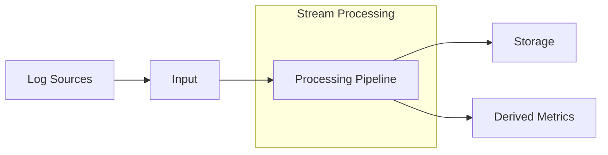

# Stream Processing

## Introduction

Stream processing is a powerful capability within Grafana Loki that allows you to process, filter, and transform your log data in real-time as it flows through the system. Unlike traditional batch processing, which operates on static data sets, stream processing works on continuous streams of data as they arrive.

In the context of Grafana Loki, stream processing enables you to:

- Filter logs before they're stored to reduce storage costs
- Transform log data to extract meaningful information
- Create derived metrics from log content
- Enrich logs with additional context
- Route different types of logs to different storage backends

This guide will introduce you to Loki's stream processing capabilities, explaining the concepts and providing practical examples to help you get started.

## Understanding Stream Processing in Loki

### The Processing Pipeline

Loki's stream processing works through a pipeline model, where log data passes through a series of stages that can modify, filter, or transform the data.



Each stage in the pipeline can perform operations like:

- Parsing structured data from unstructured logs
- Filtering logs based on content
- Adding labels based on log content
- Creating metrics from log patterns
- Transforming log format

### Configuration Basics

Stream processing in Loki is configured in the Loki configuration file. Here's a simple example of a stream processing configuration:

```yaml
stream_processing:
  pipelines:
    - name: extract_status_codes
      stages:
        - regex:
            expression: 'status=(?P<status>\d+)'
        - labels:
            status:
    - name: count_errors
      stages:
        - match:
            selector: '{status=~"5.."}'
        - metrics:
            error_count:
              type: counter
              description: "Count of HTTP 5xx errors"
              source: status
              config:
                action: inc
```

## Key Stream Processing Stages

Let's explore the most important stages available in Loki's stream processing pipeline:

### 1. Parsing Stages

#### JSON Stage

The JSON stage parses JSON log lines and extracts values into the log entry's extracted map.

```yaml
- json:
    expressions:
      level: level
      user: user.name
      status: response.status
```

Example Input:
```
{"level":"info","user":{"name":"john"},"response":{"status":200}}
```

After processing, the extracted map would contain:
- `level` → "info"
- `user` → "john"
- `status` → 200

#### Regex Stage

The regex stage extracts data using regular expressions.

```yaml
- regex:
    expression: '(?P<method>\w+) (?P<path>[^\s]+) HTTP/(?P<version>\d+\.\d+) (?P<status>\d+)'
```

Example Input:
```
GET /api/users HTTP/1.1 200
```

After processing, the extracted map would contain:
- `method` → "GET"
- `path` → "/api/users"
- `version` → "1.1"
- `status` → "200"

### 2. Transformation Stages

#### Template Stage

The template stage creates a new log line using a Go template and values from the extracted map.

```yaml
- template:
    source: "{{ .level | upper }} - User {{ .user }} made a request to {{ .path }} with status {{ .status }}"
```

Example Input (with extracted map from previous stages):
```
{"level":"info","user":"john","path":"/api/users","status":200}
```

Output:
```
INFO - User john made a request to /api/users with status 200
```

#### Labels Stage

The labels stage adds or updates labels based on the extracted map.

```yaml
- labels:
    level:
    user:
    status:
```

This would add labels `level`, `user`, and `status` using values from the extracted map.

### 3. Filtering Stages

#### Match Stage

The match stage filters logs based on selector expressions.

```yaml
- match:
    selector: '{app="frontend"} |= "error"'
    action: keep
```

This keeps only logs with the label `app=frontend` and containing the word "error".

#### Drop Stage

The drop stage explicitly drops logs based on criteria.

```yaml
- drop:
    source: status
    expression: "2.."
    action: drop
```

This drops logs where the extracted `status` field starts with "2" (all 2xx HTTP status codes).

### 4. Metrics Stages

#### Metrics Stage

The metrics stage creates metrics from log data.

```yaml
- metrics:
    http_requests_total:
      type: counter
      description: "Count of HTTP requests"
      source: status
      config:
        match_all: true
        action: inc
    request_duration_seconds:
      type: histogram
      description: "HTTP request duration in seconds"
      source: duration
      config:
        buckets: [0.1, 0.5, 1, 2, 5, 10]
```

This creates:
- A counter metric `http_requests_total` that increments for each log
- A histogram metric `request_duration_seconds` that records the value of `duration` from the log

## Real-World Examples

### Example 1: Extracting and Processing JSON Logs

Let's set up a pipeline to process JSON logs from a web application:

```yaml
stream_processing:
  pipelines:
    - name: web_app_processing
      stages:
        - json:
            expressions:
              method: request.method
              path: request.path
              status: response.status
              duration: response.duration
              user_id: user.id
        - labels:
            method:
            status:
        - metrics:
            http_request_duration_seconds:
              type: histogram
              description: "HTTP request duration"
              source: duration
              config:
                buckets: [0.01, 0.05, 0.1, 0.5, 1, 5]
        - match:
            selector: '{status=~"5.."}'
            action: keep
        - template:
            source: "ERROR - {{ .method }} {{ .path }} failed with status {{ .status }} for user {{ .user_id }}"
```

This pipeline:
1. Parses JSON logs, extracting method, path, status, duration, and user_id
2. Adds method and status as labels
3. Creates a histogram metric for request durations
4. Keeps only logs with 5xx status codes
5. Reformats these error logs into a more readable format

### Example 2: Log Reduction and Security Analysis

This example shows how to reduce log volume while capturing important security events:

```yaml
stream_processing:
  pipelines:
    - name: security_events
      stages:
        - regex:
            expression: 'user=(?P<username>[a-zA-Z0-9_-]+) action=(?P<action>\w+) status=(?P<result>success|failure)'
        - labels:
            username:
            action:
            result:
        - match:
            selector: '{result="failure"} |~ "login|authorization|permission"'
            action: keep
        - metrics:
            failed_security_events:
              type: counter
              description: "Failed security events count"
              config:
                match_all: true
                action: inc
                labels:
                  username: '{{ .username }}'
                  action: '{{ .action }}'
```

This pipeline:
1. Extracts username, action, and result from log lines
2. Adds these as labels
3. Keeps only logs showing failed security-related actions
4. Creates a counter metric for these security failures with username and action labels

## Advanced Features

### Conditional Processing with Tenant Stage

The tenant stage allows you to route logs to different tenants based on their content:

```yaml
- tenant:
    source: team
    value: '{{ .team_name }}'
```

This routes logs to different tenants based on the `team_name` value extracted from logs.

### Dynamic Templating

You can use complex Go templates for sophisticated transformations:

```yaml
- template:
    source: >
      {{ if eq .level "error" }}
        CRITICAL: {{ .message }} (Error code: {{ .code }})
      {{ else if eq .level "warn" }}
        WARNING: {{ .message }}
      {{ else }}
        {{ .level | upper }}: {{ .message }}
      {{ end }}
```

This formats log lines differently based on their level.

## Best Practices

When implementing stream processing in Loki, consider these best practices:

1. **Process Early**: Apply filtering as early as possible in the pipeline to reduce processing overhead.

2. **Be Selective with Labels**: Only extract values as labels if you need to query by them. Too many label values can impact performance.

3. **Test Thoroughly**: Test your pipelines with sample data before deploying to production.

4. **Monitor Pipeline Performance**: Keep an eye on the performance impact of your stream processing pipelines.

5. **Iterate Gradually**: Start with simple pipelines and add complexity incrementally.

6. **Document Your Pipelines**: Maintain clear documentation about what each pipeline does.

## Summary

Stream processing in Grafana Loki provides powerful capabilities for filtering, transforming, and enriching your log data in real-time. By implementing effective stream processing pipelines, you can:

- Reduce storage costs by filtering out noise
- Extract structured data from unstructured logs
- Generate metrics directly from log content
- Format logs to enhance readability
- Route logs dynamically based on content

These capabilities make Loki not just a log storage and query system, but a comprehensive log processing platform.

## Exercises

1. Create a stream processing pipeline that extracts HTTP method, path, and status code from Nginx logs.

2. Implement a pipeline that filters out debug logs but keeps warnings and errors.

3. Design a pipeline that extracts and creates metrics for response times from your application logs.

4. Create a pipeline that enriches logs with geographic information based on IP addresses.

## Additional Resources

- [Official Loki Stream Processing Documentation](https://grafana.com/docs/loki/latest/configuration/stream-processing/)
- [Grafana Labs Blog: Stream Processing in Loki](https://grafana.com/blog/2021/08/05/how-to-use-grafana-lokis-new-log-processing-features/)
- [LogQL: Loki's Query Language](https://grafana.com/docs/loki/latest/logql/)
- [Loki Architecture Overview](https://grafana.com/docs/loki/latest/fundamentals/architecture/)