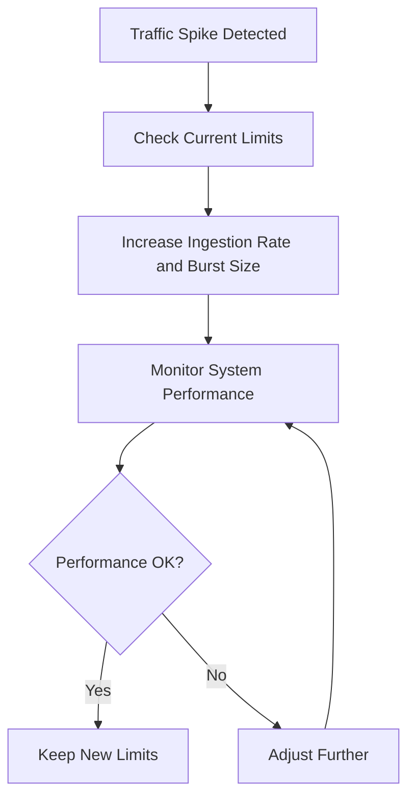

# Runtime Configuration

## Introduction

Runtime Configuration is a powerful feature in Grafana Loki that allows you to modify certain configuration parameters while the system is running, without having to restart your Loki instances. This capability is particularly valuable in production environments where downtime needs to be minimized and where you might need to adjust settings based on changing conditions or requirements.

In traditional configurations, changing a parameter often requires editing a configuration file and restarting the service, which can lead to temporary unavailability and potential data loss. Runtime Configuration solves this problem by enabling dynamic updates to specific configuration elements.

## How Runtime Configuration Works

Grafana Loki implements Runtime Configuration through a combination of:

1. A configuration API endpoint
2. A set of designated parameters that can be changed during runtime
3. Internal mechanisms that detect and apply these changes without service disruption

Let's explore how this works in practice and which configuration elements can be modified on the fly.

## Enabling Runtime Configuration

To use Runtime Configuration in Loki, you first need to ensure that the HTTP API server is properly configured in your Loki setup:

```yaml
http_server:
  http_listen_port: 3100
```

When this is enabled, Loki exposes a set of API endpoints that can be used to view and modify runtime configurations.

## Available Runtime Configurations

Not all configuration parameters can be modified at runtime. Here are the key components that support runtime configuration:

### 1. Limits Overrides

You can dynamically adjust various limits that control resource usage:

```yaml
limits_config:
  ingestion_rate_mb: 4
  ingestion_burst_size_mb: 6
  max_global_streams_per_user: 5000
  max_query_length: 721h
```

### 2. Ruler Configuration

The Loki ruler, responsible for evaluating alert rules, supports runtime updates to its rule files and configurations:

```yaml
ruler:
  enable_api: true
  storage:
    type: local
    local:
      directory: /tmp/loki/rules
```

### 3. Runtime Configuration File

You can specify a runtime configuration file that Loki will periodically check and reload:

```yaml
runtime_config:
  file: /tmp/loki/runtime-config.yaml
```

## Interacting with Runtime Configuration

### Using the Configuration API

The primary way to interact with runtime configurations is through the `/api/v1/runtime_config` endpoint.

To view the current runtime configuration:

```bash
curl -X GET http://localhost:3100/api/v1/runtime_config
```

Example output:
```json
{
  "limits": {
    "ingestion_rate_mb": 4,
    "ingestion_burst_size_mb": 6,
    "max_global_streams_per_user": 5000,
    "max_query_length": "721h0m0s"
  }
}
```

To update a runtime configuration:

```bash
curl -X POST -H "Content-Type: application/json" -d '{
  "limits": {
    "ingestion_rate_mb": 8,
    "ingestion_burst_size_mb": 10
  }
}' http://localhost:3100/api/v1/runtime_config
```

This would double the ingestion rate and burst size limits without requiring a restart.

### Using the Runtime Configuration File

If you've configured Loki to use a runtime configuration file, you can simply edit that file, and Loki will automatically reload it based on the checking interval:

```yaml
# /tmp/loki/runtime-config.yaml
limits:
  ingestion_rate_mb: 6
  max_query_length: 72h
```

## Real-world Examples

### Example 1: Adjusting Limits During Traffic Spikes

Imagine you're running Loki in a production environment and observe a sudden increase in log volume due to an incident or planned event:



Implementation:

1. First, check the current limits:
```bash
curl -X GET http://localhost:3100/api/v1/runtime_config
```

2. Temporarily increase the limits:
```bash
curl -X POST -H "Content-Type: application/json" -d '{
  "limits": {
    "ingestion_rate_mb": 10,
    "ingestion_burst_size_mb": 15
  }
}' http://localhost:3100/api/v1/runtime_config
```

3. Once the traffic spike normalizes, you can reduce the limits again:
```bash
curl -X POST -H "Content-Type: application/json" -d '{
  "limits": {
    "ingestion_rate_mb": 4,
    "ingestion_burst_size_mb": 6
  }
}' http://localhost:3100/api/v1/runtime_config
```

### Example 2: Managing Query Load

If your Loki instance is experiencing heavy query load, you might want to adjust query-related parameters:

```bash
curl -X POST -H "Content-Type: application/json" -d '{
  "limits": {
    "max_query_parallelism": 8,
    "max_outstanding_per_tenant": 50
  }
}' http://localhost:3100/api/v1/runtime_config
```

This increases the parallelism of queries and allows for more concurrent queries per tenant.

## Best Practices

When working with Runtime Configuration in Loki, keep the following best practices in mind:

1. **Document Changes**: Keep a record of any runtime configuration changes made, especially in production environments.

2. **Validate Before Applying**: Test configuration changes in a staging environment before applying them to production.

3. **Monitor Impact**: Always monitor system performance after making runtime configuration changes to ensure they have the desired effect.

4. **Automate Where Possible**: For predictable patterns (like daily traffic spikes), consider automating runtime configuration changes.

5. **Security Considerations**: Restrict access to the runtime configuration API to prevent unauthorized changes.

## Limitations

While Runtime Configuration is powerful, it has some limitations:

1. Not all configuration parameters can be modified at runtime.
2. Some changes may not take effect immediately and might require propagation time across distributed Loki deployments.
3. Changes made via the API are not persistent after a restart unless also updated in the main configuration file.

## Summary

Runtime Configuration in Grafana Loki provides a flexible way to adjust system behavior without service disruptions. Key points to remember:

- It allows for dynamic adjustments to limits, rules, and other configurations
- Configuration changes can be made via the API or through a runtime configuration file
- Not all parameters support runtime changes
- Best practices include documenting changes and monitoring impact

By mastering Runtime Configuration, you can make your Loki deployment more resilient and responsive to changing conditions, ultimately improving its performance and reliability in production environments.

## Additional Resources

- [Grafana Loki Configuration Documentation](https://grafana.com/docs/loki/latest/configuration/)
- [Loki HTTP API Reference](https://grafana.com/docs/loki/latest/api/)

## Exercises

1. Set up a local Loki instance with a runtime configuration file and practice modifying limits through both the file and API methods.

2. Create a script that automatically adjusts Loki's ingestion rate based on the current log volume.

3. Design a monitoring dashboard that shows when runtime configuration changes occur and their impact on system performance.