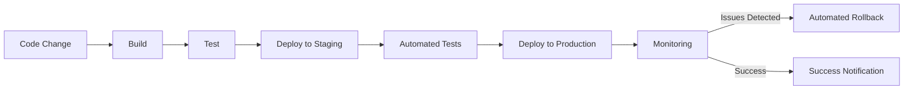

# Continuous Deployment with Grafana Loki

## Introduction

Continuous Deployment (CD) is a software development practice where code changes are automatically built, tested, and deployed to production environments. In the context of Grafana Loki, continuous deployment enables teams to maintain an up-to-date logging infrastructure that evolves with their applications. This approach reduces manual intervention, minimizes human error, and ensures your logging system is always running the latest version with the most recent configurations.

In this guide, we'll explore how to implement continuous deployment for your Grafana Loki installation, allowing you to automatically update your logging infrastructure as your observability needs evolve.

## Continuous Deployment vs. Continuous Delivery

Before diving into implementation, let's clarify the difference between two similar terms:

| Continuous Delivery | Continuous Deployment |
|---------------------|------------------------|
| Automated process that prepares code changes for release to production | Automated process that deploys code changes directly to production |
| Requires manual approval for the final step to production | Fully automated pipeline with no manual intervention |
| Lower risk, but slower release cycle | Higher risk, but faster release cycle |

For Grafana Loki implementations, either approach can work depending on your organizational requirements and risk tolerance.

## Prerequisites

Before implementing continuous deployment for Grafana Loki, ensure you have:

- A running Grafana Loki instance
- Access to a CI/CD platform (GitHub Actions, GitLab CI, Jenkins, etc.)
- Your Loki configuration stored in a Git repository
- Basic understanding of YAML and containerization
- Appropriate permissions to deploy to your environment

## Continuous Deployment Architecture for Loki

Let's visualize a typical continuous deployment pipeline for Grafana Loki:



## Implementation Guide

### Step 1: Store Your Loki Configuration as Code

The first step to implementing continuous deployment is storing your Loki configuration as code. This practice is often called "Infrastructure as Code" (IaC).

Create a Git repository with the following structure:

```
loki-deployment/
├── loki-config.yaml
├── promtail-config.yaml
├── docker-compose.yml
└── .github/
    └── workflows/
        └── deploy.yml
```

Here's an example of a basic `loki-config.yaml`:

```yaml
auth_enabled: false

server:
  http_listen_port: 3100

ingester:
  lifecycler:
    address: 127.0.0.1
    ring:
      kvstore:
        store: inmemory
      replication_factor: 1
    final_sleep: 0s
  chunk_idle_period: 5m
  chunk_retain_period: 30s

schema_config:
  configs:
  - from: 2020-05-15
    store: boltdb
    object_store: filesystem
    schema: v11
    index:
      prefix: index_
      period: 168h

storage_config:
  boltdb:
    directory: /tmp/loki/index
  
  filesystem:
    directory: /tmp/loki/chunks
```

### Step 2: Set Up Your CI/CD Pipeline

For this example, we'll use GitHub Actions. Create a `.github/workflows/deploy.yml` file:

```yaml
name: Deploy Loki

on:
  push:
    branches: [ main ]
  pull_request:
    branches: [ main ]

jobs:
  validate:
    runs-on: ubuntu-latest
    steps:
    - uses: actions/checkout@v3
    - name: Validate Loki Config
      run: |
        # Install Loki validation tools
        wget https://github.com/grafana/loki/releases/latest/download/loki-linux-amd64.zip
        unzip loki-linux-amd64.zip
        chmod +x loki-linux-amd64
        
        # Validate configuration
        ./loki-linux-amd64 -validate-config=true -config.file=loki-config.yaml
        
  deploy_staging:
    needs: validate
    runs-on: ubuntu-latest
    steps:
    - uses: actions/checkout@v3
    - name: Deploy to Staging
      run: |
        echo "Deploying to staging environment"
        # Add your deployment script here
        # Example: kubectl apply -f loki-staging.yaml
        
  test_staging:
    needs: deploy_staging
    runs-on: ubuntu-latest
    steps:
    - name: Test Staging Deployment
      run: |
        echo "Running tests against staging environment"
        # Add your testing script here
        # Example: Run tests to verify Loki is ingesting logs properly
        
  deploy_production:
    needs: test_staging
    runs-on: ubuntu-latest
    steps:
    - uses: actions/checkout@v3
    - name: Deploy to Production
      run: |
        echo "Deploying to production environment"
        # Add your production deployment script here
        # Example: kubectl apply -f loki-production.yaml
```

### Step 3: Implementing Deployment Strategies

For Grafana Loki, there are several deployment strategies you can use:

#### Blue-Green Deployment

Blue-green deployment involves running two identical production environments, with only one active at a time.

```yaml
# Example Kubernetes manifest for blue-green deployment
apiVersion: apps/v1
kind: Deployment
metadata:
  name: loki-blue  # or loki-green
spec:
  replicas: 1
  selector:
    matchLabels:
      app: loki
      deployment: blue  # or green
  template:
    metadata:
      labels:
        app: loki
        deployment: blue  # or green
    spec:
      containers:
      - name: loki
        image: grafana/loki:latest
        ports:
        - containerPort: 3100
        volumeMounts:
        - name: config
          mountPath: /etc/loki
      volumes:
      - name: config
        configMap:
          name: loki-config
```

#### Canary Deployment

Canary deployment gradually routes a small percentage of traffic to the new version.

```yaml
# Example Kubernetes manifest for canary deployment
apiVersion: networking.k8s.io/v1
kind: Ingress
metadata:
  name: loki-ingress
  annotations:
    nginx.ingress.kubernetes.io/canary: "true"
    nginx.ingress.kubernetes.io/canary-weight: "20"  # 20% of traffic goes to new version
spec:
  rules:
  - host: loki.example.com
    http:
      paths:
      - path: /
        pathType: Prefix
        backend:
          service:
            name: loki-new-version
            port:
              number: 3100
```

### Step 4: Monitoring and Automated Rollbacks

Implement monitoring to automatically detect issues with your Loki deployment:

```yaml
# Example Prometheus alerting rule
groups:
- name: loki.rules
  rules:
  - alert: LokiHighErrorRate
    expr: sum(rate(loki_request_errors_total[5m])) / sum(rate(loki_request_duration_seconds_count[5m])) > 0.05
    for: 5m
    labels:
      severity: critical
    annotations:
      summary: "High error rate in Loki"
      description: "Loki is experiencing high error rate above 5%"
```

For automated rollbacks, add this to your CI/CD pipeline:

```yaml
  rollback:
    needs: deploy_production
    if: failure()
    runs-on: ubuntu-latest
    steps:
    - uses: actions/checkout@v3
      with:
        ref: ${{ github.event.before }}  # Get the previous commit
    - name: Rollback Deployment
      run: |
        echo "Rolling back to previous version"
        # Add your rollback script here
        # Example: kubectl apply -f loki-previous.yaml
```

## Real-World Example: Updating Loki Retention Policies

Let's walk through a practical example of using continuous deployment to update your Loki retention policies.

1. Update your `loki-config.yaml` in your repository:

```yaml
# Original retention period
schema_config:
  configs:
  - from: 2020-05-15
    store: boltdb
    object_store: filesystem
    schema: v11
    index:
      prefix: index_
      period: 168h  # 7 days

# Updated retention period
schema_config:
  configs:
  - from: 2020-05-15
    store: boltdb
    object_store: filesystem
    schema: v11
    index:
      prefix: index_
      period: 720h  # 30 days
```

2. Commit and push the change to your repository:

```bash
git add loki-config.yaml
git commit -m "Update retention policy from 7 to 30 days"
git push origin main
```

3. The CI/CD pipeline automatically:
   - Validates the configuration
   - Deploys to staging
   - Tests the new configuration
   - Deploys to production

4. You can verify the update took effect by querying Loki's configuration endpoint:

```bash
curl http://your-loki-instance:3100/config
```

## Best Practices for Loki Continuous Deployment

1. **Version Control**: Always store your Loki configuration in version control.
2. **Configuration Validation**: Validate configuration files before deployment.
3. **Incremental Changes**: Make small, incremental changes rather than large ones.
4. **Automated Testing**: Implement automated tests to verify Loki functionality.
5. **Monitoring**: Set up comprehensive monitoring for your Loki deployment.
6. **Rollback Plan**: Always have an automated rollback strategy.
7. **Documentation**: Document your deployment processes and configuration changes.

## Common Challenges and Solutions

| Challenge | Solution |
|-----------|----------|
| Data loss during deployment | Use persistent storage and ensure proper backup strategies |
| Configuration errors | Implement thorough validation before deployment |
| Performance impact | Use canary deployments to test performance before full rollout |
| Integration issues | Test integrations (Grafana, Prometheus) in staging environment |
| Scaling problems | Implement horizontal scaling and load testing in your pipeline |

## Summary

Implementing continuous deployment for Grafana Loki provides numerous benefits:

- Automated, reliable updates to your logging infrastructure
- Reduced manual intervention and human error
- Faster implementation of new features and configurations
- Consistent deployment processes across environments
- Quick rollback capabilities in case of issues

By following the steps and best practices outlined in this guide, you can establish a robust continuous deployment pipeline for your Grafana Loki installation, ensuring your logging infrastructure remains up-to-date and aligned with your application development process.

## Additional Resources

- [Grafana Loki GitHub Repository](https://github.com/grafana/loki)
- [CI/CD Best Practices](https://docs.gitlab.com/ee/ci/introduction/index.html#cicd-best-practices)
- [Kubernetes Deployment Strategies](https://kubernetes.io/docs/concepts/workloads/controllers/deployment/)

## Exercises

1. Set up a basic CI/CD pipeline for Loki using GitHub Actions or GitLab CI.
2. Implement a blue-green deployment strategy for your Loki installation.
3. Create an automated test suite to verify Loki functionality after deployment.
4. Design a monitoring dashboard to track Loki performance metrics during and after deployment.
5. Develop a comprehensive rollback strategy for your Loki deployment pipeline.