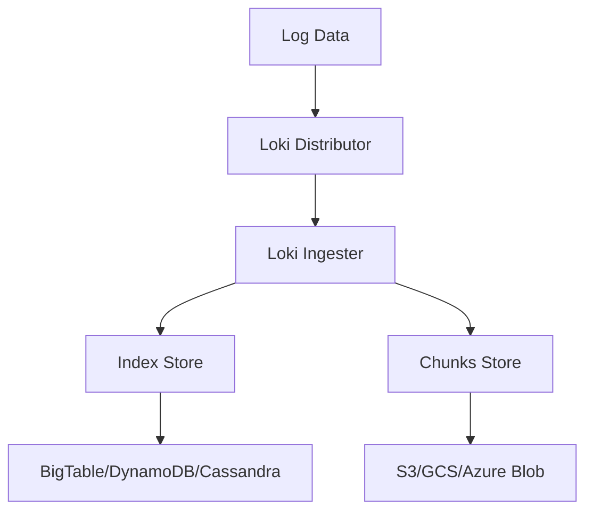
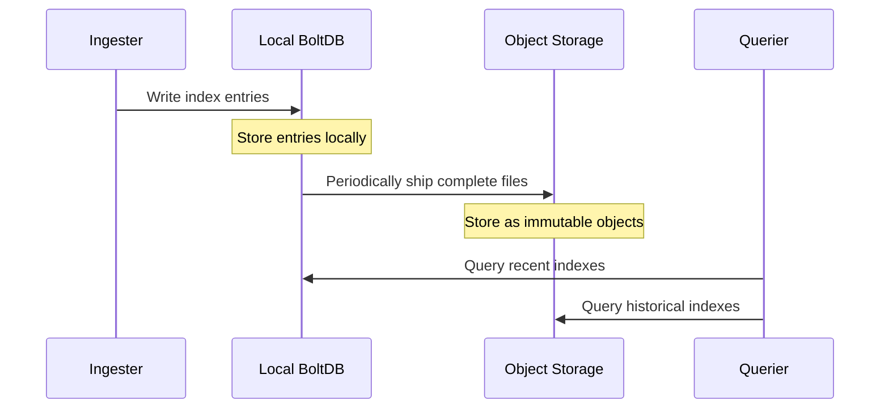

# Boltdb-shipper

## Introduction

In the world of log management systems, efficient storage is crucial for performance and scalability. Grafana Loki's Boltdb-shipper is an advanced storage mechanism designed to provide a cost-effective and scalable solution for storing log indexes. It builds upon the foundation of Loki's storage architecture by implementing a unique approach to handling indexes.

Boltdb-shipper was introduced to address specific challenges in Loki deployments, particularly for users who need to:
- Reduce storage costs while maintaining performance
- Scale horizontally across distributed storage systems
- Simplify operations in cloud-native environments

In this guide, we'll explore how Boltdb-shipper works, its advantages, configuration options, and practical implementation scenarios.

## Understanding Loki's Storage Architecture

Before diving into Boltdb-shipper, let's quickly review Loki's core storage components:

1. **Index**: Stores metadata about your logs, including labels and their locations in the chunks storage
2. **Chunks**: Contains the actual compressed log data

Traditionally, Loki supported several backends for these components:
- BigTable, DynamoDB, or Cassandra for indexes
- Object storage solutions (S3, GCS, etc.) for chunks



## What is Boltdb-shipper?

Boltdb-shipper is a storage mechanism that provides an alternative approach to handling indexes. It works by:

1. Using local [BoltDB](https://github.com/boltdb/bolt) databases for temporary storage of index data
2. Periodically "shipping" (uploading) these databases to an object storage system
3. Allowing queries to access both local and uploaded index files

This approach combines the performance benefits of local storage with the scalability and durability of object storage.

### How Boltdb-shipper Works

The process can be broken down into several steps:



1. **Local Storage Phase**: 
   - Ingesters write index data to local BoltDB files
   - Each file covers a specific time period (configured by `active_index_directory`)

2. **Shipping Phase**:
   - Completed files are uploaded to object storage
   - Files become immutable once uploaded
   - Local files can be removed after successful upload

3. **Query Phase**:
   - Queriers download relevant index files from object storage
   - Files are cached locally for performance
   - Queries combine results from both local and downloaded files

## Configuring Boltdb-shipper

Let's look at how to configure Loki to use Boltdb-shipper. Below is a basic configuration:

```yaml
schema_config:
  configs:
    - from: 2020-07-01
      store: boltdb-shipper
      object_store: s3
      schema: v11
      index:
        prefix: loki_index_
        period: 24h

storage_config:
  boltdb_shipper:
    active_index_directory: /loki/index
    cache_location: /loki/cache
    shared_store: s3
    cache_ttl: 24h
  aws:
    s3: s3://bucket-name/loki/index
    region: us-west-2
```

Key configuration parameters include:

- **active_index_directory**: Where active index files are stored locally
- **cache_location**: Where downloaded index files are cached
- **shared_store**: Which object store to use for shipping (must match the object_store in schema_config)
- **cache_ttl**: How long to keep downloaded index files before cleaning up

## Advantages of Boltdb-shipper

### 1. Cost Efficiency

Boltdb-shipper significantly reduces storage costs compared to traditional database solutions:

- No need for managed database services like DynamoDB or BigTable
- Uses the same object storage for both indexes and chunks
- Reduces operational complexity and associated costs

### 2. Scalability

Scaling becomes much simpler with Boltdb-shipper:

- No need to provision or scale databases
- Object storage automatically scales with your needs
- Query performance scales with more querier instances

### 3. Simplified Operations

Operational benefits include:

- Fewer components to manage and monitor
- Single storage backend for both indexes and chunks
- Consistent backup and disaster recovery procedures

## Real-world Example: Setting Up Boltdb-shipper in a Kubernetes Environment

Let's implement Boltdb-shipper in a Kubernetes environment using Helm. First, we'll create a values file for the Loki Helm chart:

```yaml
loki:
  schemaConfig:
    configs:
      - from: 2020-07-01
        store: boltdb-shipper
        object_store: s3
        schema: v11
        index:
          prefix: loki_index_
          period: 24h
  
  storageConfig:
    boltdb_shipper:
      active_index_directory: /data/loki/index
      cache_location: /data/loki/cache
      shared_store: s3
      cache_ttl: 24h
    aws:
      s3: s3://loki-logs-storage/loki/index
      region: us-west-2
      access_key_id: ${AWS_ACCESS_KEY_ID}
      secret_access_key: ${AWS_SECRET_ACCESS_KEY}

persistence:
  enabled: true
  size: 10Gi
```

Apply this configuration with Helm:

```bash
helm upgrade --install loki grafana/loki-stack --values loki-values.yaml
```

### Monitoring Boltdb-shipper

To ensure Boltdb-shipper is functioning correctly, you can monitor several metrics:

- `loki_boltdb_shipper_uploads_total`: Total number of index files uploaded
- `loki_boltdb_shipper_upload_failures_total`: Failed uploads
- `loki_boltdb_shipper_upload_duration_seconds`: Time taken for uploads
- `loki_boltdb_shipper_active_files`: Number of active (non-uploaded) files

You can create a Grafana dashboard to visualize these metrics:

```yaml
apiVersion: v1
kind: ConfigMap
metadata:
  name: loki-boltdb-shipper-dashboard
data:
  dashboard.json: |
    {
      "title": "Loki BoltDB-Shipper Metrics",
      "panels": [
        {
          "title": "Upload Rate",
          "type": "graph",
          "targets": [
            {
              "expr": "rate(loki_boltdb_shipper_uploads_total[5m])"
            }
          ]
        },
        {
          "title": "Active Files",
          "type": "graph",
          "targets": [
            {
              "expr": "loki_boltdb_shipper_active_files"
            }
          ]
        }
      ]
    }
```

## Troubleshooting Boltdb-shipper

### Common Issues and Solutions

1. **High disk usage in active_index_directory**
   - Check if uploads are failing
   - Increase upload frequency by decreasing `active_index_directory` retention
   - Ensure enough disk space is provisioned

2. **Slow query performance**
   - Increase cache TTL
   - Provision more disk space for cache_location
   - Consider adjusting `index.period` to have smaller, more manageable files

3. **Upload failures**
   - Check S3 permissions
   - Verify network connectivity to object storage
   - Examine Loki logs for specific error messages

### Debugging Example

If you're experiencing issues, enable debug logging:

```yaml
config:
  server:
    http_listen_port: 3100
  limits_config:
    enforce_metric_name: false
    reject_old_samples: true
    reject_old_samples_max_age: 168h
  schema_config:
    configs:
      - from: 2020-07-01
        store: boltdb-shipper
        object_store: s3
        schema: v11
        index:
          prefix: loki_index_
          period: 24h
  storage_config:
    boltdb_shipper:
      active_index_directory: /loki/index
      cache_location: /loki/cache
      shared_store: s3
      cache_ttl: 24h
  aws:
    s3: s3://bucket-name/loki/index
    region: us-west-2
  table_manager:
    retention_deletes_enabled: true
    retention_period: 336h

logger:
  level: debug
```

## Performance Tuning

For optimal performance with Boltdb-shipper:

1. **Storage Considerations**:
   - Use SSD for active_index_directory and cache_location
   - Allocate enough disk space for both directories
   - Monitor disk usage and performance

2. **Caching Settings**:
   - Adjust cache_ttl based on your query patterns
   - For frequently accessed recent data, use longer TTLs
   - For less frequent access, shorter TTLs conserve disk space

3. **Index Period**:
   - Smaller periods (12h, 6h) create more manageable files but increase upload frequency
   - Larger periods (24h, 48h) reduce uploads but create larger files that may impact query performance

## Summary

Boltdb-shipper represents a significant advancement in Loki's storage capabilities, offering a cost-effective, scalable, and operationally simple solution for log indexes. By combining local BoltDB storage with object storage, it provides an elegant solution that works well in both small and large-scale deployments.

Key takeaways:
- Uses local BoltDB files and object storage instead of databases
- Significantly reduces operational costs and complexity
- Simplifies scaling and maintenance
- Works well in Kubernetes and cloud environments

## Additional Resources

- [Grafana Loki Storage Documentation](https://grafana.com/docs/loki/latest/operations/storage/)
- [BoltDB GitHub Repository](https://github.com/boltdb/bolt)
- [Loki Architecture Documentation](https://grafana.com/docs/loki/latest/fundamentals/architecture/)

## Practice Exercises

1. Set up a local Loki instance using Docker Compose with Boltdb-shipper configured
2. Configure Boltdb-shipper with different object storage providers (S3, GCS, Azure Blob)
3. Experiment with different index periods and monitor the impact on performance
4. Create a monitoring dashboard for Boltdb-shipper metrics in Grafana
5. Simulate a failure scenario and practice recovery procedures