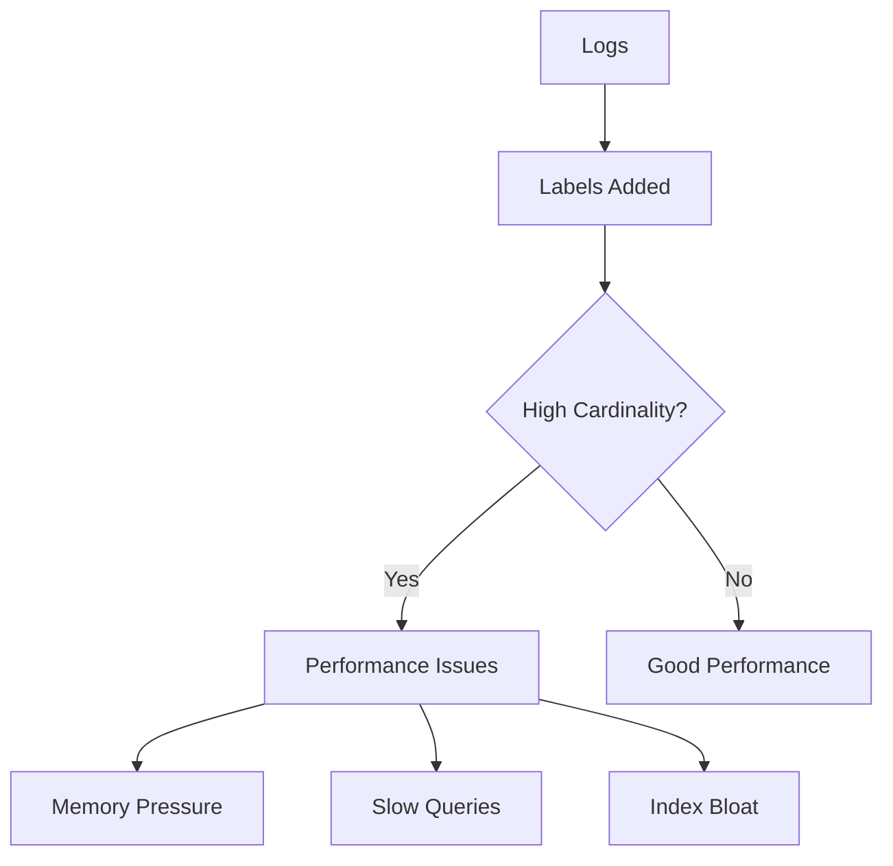

# Common Issues in Grafana Loki

## Introduction

Grafana Loki is a powerful log aggregation system designed to be cost-effective and easy to operate. However, like any complex system, users often encounter various challenges during setup, configuration, and operation. This guide covers the most common issues you might face when working with Grafana Loki and provides detailed solutions to help you troubleshoot effectively.

## Connection Issues

### Cannot Connect to Loki

One of the most basic issues is the inability to connect to your Loki instance.

#### Symptoms
- "Data source is not working" error in Grafana
- Empty query results despite logs being present
- Connection timeout errors

#### Troubleshooting Steps

1. **Check Loki Service Status**:
   ```bash
   # For Docker installations
   docker ps | grep loki
   
   # For Kubernetes
   kubectl get pods -n <namespace> | grep loki
   ```

2. **Verify Network Access**:
   ```bash
   # Test connection using curl
   curl -v http://loki:3100/ready
   
   # Or for Kubernetes
   kubectl port-forward -n <namespace> svc/loki 3100:3100
   curl -v http://localhost:3100/ready
   ```

3. **Check Grafana Data Source Configuration**:
   Ensure your Grafana is configured with the correct URL for Loki. Common mistakes include:
   - Using incorrect protocol (http vs https)
   - Missing port number
   - Incorrect service name in Kubernetes environments

4. **Authentication Issues**:
   If you've configured authentication, verify your credentials are correct in the Grafana data source configuration.

## Query Problems

### No Logs Found

Sometimes Loki appears to be connected properly, but queries return no results.

#### Symptoms
- "No logs found" message
- Empty query results despite knowing logs exist

#### Troubleshooting Steps

1. **Check Time Range**:
   A common mistake is querying for logs outside your selected time range. Try:
   - Extending your time range
   - Using the "Last 24 hours" preset to see if any logs appear

2. **Verify Log Labels**:
   ```logql
   {job="my-job"}
   ```
   - Start with a simple label query to verify logs exist
   - Use the Grafana "Explore" view to browse available labels and their values

3. **Check Log Retention**:
   Logs might have been deleted due to retention policies:
   ```bash
   # Check retention period configuration
   grep -A 5 "retention_period" /path/to/loki-config.yaml
   ```

4. **Inspect Index Status**:
   ```bash
   curl -s http://loki:3100/loki/api/v1/index/stats | jq
   ```

### Malformed Queries

LogQL syntax issues can prevent your queries from working correctly.

#### Common Query Errors and Solutions

1. **Invalid Label Matcher**:
   ```logql
   # Wrong - space after label name
   {job = "app"}
   
   # Correct
   {job="app"}
   ```

2. **Missing Closing Brackets**:
   ```logql
   # Wrong
   {job="app" | json
   
   # Correct
   {job="app"} | json
   ```

3. **Incorrect Filter Expression**:
   ```logql
   # Wrong
   {job="app"} | logfmt | status == 500
   
   # Correct
   {job="app"} | logfmt | status = 500
   ```

4. **Escape Special Characters**:
   ```logql
   # Wrong - unescaped quotes in filter
   {job="app"} |~ "error: "user not found""
   
   # Correct
   {job="app"} |~ "error: \"user not found\""
   ```

## Performance Issues

### Slow Queries

Loki queries can sometimes be slow to execute, especially with large data volumes.

#### Symptoms
- Queries taking several seconds or timing out
- Error messages about query timeouts

#### Solutions

1. **Refine Label Filters**:
   Always include label filters to narrow the search scope:
   ```logql
   # Too broad
   {} |= "error"
   
   # Better
   {job="app", env="production"} |= "error"
   ```

2. **Optimize Regular Expressions**:
   Complex regex patterns can significantly slow down queries:
   ```logql
   # Slow regex
   {job="app"} |~ ".*error.*in.*process.*"
   
   # More efficient
   {job="app"} |= "error" |= "process"
   ```

3. **Reduce Time Range**:
   Query the smallest time range necessary for your analysis.

4. **Use Line Filters Before Processing**:
   Apply line filters before JSON or logfmt parsing:
   ```logql
   # Less efficient
   {job="app"} | json | error != ""
   
   # More efficient
   {job="app"} |= "error" | json | error != ""
   ```

### High Memory Usage

Loki can sometimes use excessive memory, especially in high-volume environments.

#### Symptoms
- OOM (Out of Memory) errors
- Loki service restarts
- General performance degradation

#### Solutions

1. **Adjust Query Limits**:
   ```yaml
   # In Loki configuration
   limits_config:
     max_entries_limit_per_query: 5000
     max_query_series: 500
   ```

2. **Increase Chunk Size**:
   ```yaml
   chunk_store_config:
     max_look_back_period: 168h
   ```

3. **Implement Sharding**:
   For large deployments, consider setting up query sharding:
   ```yaml
   query_scheduler:
     max_outstanding_requests_per_tenant: 2048
   ```

4. **Monitor Resource Usage**:
   Use Prometheus metrics to monitor Loki's resource consumption:
   ```logql
   rate(loki_distributor_bytes_received_total[5m])
   ```

## Series Cardinality Problems

High cardinality is one of the most common issues affecting Loki performance.

### Symptoms
- Error messages about "too many series"
- Slow query performance
- Increased memory usage

### Understanding Cardinality

Cardinality refers to the number of unique label combinations in your logs. High cardinality can occur when:

- Using highly variable labels (like request IDs or timestamps)
- Having too many label values
- Logging unique identifiers as labels



### Solutions

1. **Identify High-Cardinality Labels**:
   ```bash
   curl -s http://loki:3100/loki/api/v1/cardinality/label_names | jq
   ```

2. **Reduce Label Cardinality**:
   - Remove high-cardinality labels from log streams
   - Use derived fields in Grafana instead of labels for high-cardinality data
   - Keep dynamic values in the log message, not in labels

3. **Configure Cardinality Limits**:
   ```yaml
   limits_config:
     cardinality_limit: 100000
     max_label_name_length: 1024
     max_label_value_length: 2048
   ```

4. **Use the `stream` Selector Cautiously**:
   ```logql
   # Potentially high cardinality
   sum by(stream) (rate({app="frontend"}[5m]))
   
   # Better
   sum by(job, instance) (rate({app="frontend"}[5m]))
   ```

## Storage Issues

### Logs Not Persisting

Sometimes logs may appear briefly but then disappear unexpectedly.

#### Symptoms
- Logs visible for recent time ranges but missing for older periods
- Inconsistent query results

#### Solutions

1. **Check Retention Configuration**:
   ```yaml
   # In Loki configuration
   limits_config:
     retention_period: 744h  # 31 days
   ```

2. **Inspect Storage Backend**:
   For object storage backends (S3, GCS):
   ```bash
   # For AWS S3
   aws s3 ls s3://loki-bucket/chunks/ --recursive | head
   
   # For GCS
   gsutil ls gs://loki-bucket/chunks/ | head
   ```

3. **Verify Compactor Operation**:
   ```bash
   # Check compactor logs
   kubectl logs -n <namespace> -l app=loki,component=compactor
   ```

### Disk Space Issues

Local storage can fill up quickly with high-volume log ingestion.

#### Solutions

1. **Monitor Disk Usage**:
   ```bash
   # Check disk usage
   df -h /path/to/loki/data
   
   # Set up Prometheus alerts
   disk_free:node_filesystem_avail_bytes:ratio < 0.10
   ```

2. **Configure Retention and Compaction**:
   ```yaml
   compactor:
     working_directory: /loki/compactor
     shared_store: s3
   ```

3. **Migrate to Object Storage**:
   For production environments, consider using object storage like S3, GCS, or Azure Blob Storage instead of local disk.

## Ingestion Issues

### Log Lines Not Being Ingested

Sometimes logs sent to Loki don't appear in query results.

#### Symptoms
- Logs not appearing despite successful Promtail/agent responses
- Missing specific log patterns

#### Troubleshooting Steps

1. **Check Promtail/Agent Status**:
   ```bash
   # View Promtail logs
   kubectl logs -n <namespace> -l app=promtail
   
   # Check Promtail targets
   curl http://promtail:9080/targets
   ```

2. **Monitor Ingestion Rate**:
   ```bash
   # Loki metrics in Prometheus
   rate(loki_distributor_lines_received_total[5m])
   ```

3. **Verify Rate Limits**:
   ```yaml
   # In Loki configuration
   limits_config:
     ingestion_rate_mb: 10
     ingestion_burst_size_mb: 20
   ```

4. **Check for Rejected Logs**:
   ```bash
   # Look for rejection metrics
   rate(loki_distributor_lines_rejected_total[5m])
   ```

### Too Many Label Values Error

Loki has limits on label value combinations to prevent performance issues.

#### Solutions

1. **Identify Problematic Labels**:
   ```bash
   curl -s http://loki:3100/loki/api/v1/label/job/values | jq | wc -l
   ```

2. **Configure Higher Limits** (if appropriate for your environment):
   ```yaml
   limits_config:
     max_label_names_per_series: 30
     max_label_value_length: 2048
   ```

3. **Relabel or Drop High-Cardinality Labels**:
   In Promtail configuration:
   ```yaml
   scrape_configs:
     - job_name: app
       relabel_configs:
         - source_labels: [high_cardinality_label]
           action: drop
   ```

## Authentication and Authorization Issues

### Access Denied Errors

Security configuration can sometimes prevent legitimate access to logs.

#### Symptoms
- "Access denied" or "Unauthorized" errors
- Authentication failures

#### Solutions

1. **Check Tenant ID Configuration**:
   ```yaml
   auth_enabled: true
   server:
     http_listen_port: 3100
   ```

2. **Verify Auth Tokens**:
   ```bash
   # Test with curl
   curl -H "X-Scope-OrgID: tenant1" http://loki:3100/loki/api/v1/label
   ```

3. **RBAC Configuration** (when using Kubernetes):
   Ensure your ServiceAccount has the proper permissions:
   ```yaml
   apiVersion: rbac.authorization.k8s.io/v1
   kind: ClusterRole
   metadata:
     name: loki-role
   rules:
   - apiGroups: [""]
     resources: ["pods", "nodes"]
     verbs: ["get", "list", "watch"]
   ```

## Multi-tenancy Problems

### Cross-tenant Query Issues

In multi-tenant setups, isolation between tenants is important.

#### Symptoms
- Seeing logs from other tenants
- Missing logs that should be visible

#### Solutions

1. **Configure Proper Tenant IDs**:
   ```yaml
   # In Promtail config
   clients:
     - url: http://loki:3100/loki/api/v1/push
       tenant_id: tenant1
   ```

2. **Test Tenant Isolation**:
   ```bash
   # Query as tenant1
   curl -H "X-Scope-OrgID: tenant1" http://loki:3100/loki/api/v1/query_range -d 'query={job="app"}' -d 'start=1625000000' -d 'end=1625001000'
   
   # Query as tenant2
   curl -H "X-Scope-OrgID: tenant2" http://loki:3100/loki/api/v1/query_range -d 'query={job="app"}' -d 'start=1625000000' -d 'end=1625001000'
   ```

3. **Check Tenant Configurations**:
   ```yaml
   limits_config:
     per_tenant_override_config: /etc/loki/tenant-overrides.yaml
   ```

## Upgrading Issues

### Version Compatibility

Upgrading Loki can sometimes lead to compatibility issues.

#### Symptoms
- Service failures after upgrading
- Missing logs after version change
- Schema incompatibility errors

#### Solutions

1. **Check Release Notes**:
   Always review the release notes before upgrading: https://github.com/grafana/loki/releases

2. **Backup Configuration**:
   ```bash
   # Backup config files
   cp /path/to/loki-config.yaml /path/to/loki-config.yaml.backup
   ```

3. **Migrate Schema Gradually**:
   When upgrading between major versions, consider running both schemas in parallel:
   ```yaml
   schema_config:
     configs:
       - from: 2020-07-01
         store: boltdb-shipper
         object_store: s3
         schema: v11
         index:
           prefix: index_
           period: 24h
       - from: 2022-06-01
         store: boltdb-shipper
         object_store: s3
         schema: v12
         index:
           prefix: index_
           period: 24h
   ```

4. **Test in a Staging Environment**:
   Always test upgrades in a non-production environment first.

## Summary

This guide covered the most common issues you might encounter when working with Grafana Loki:

- Connection problems and how to diagnose them
- Query issues and syntax errors
- Performance optimization techniques
- High cardinality management
- Storage configuration and troubleshooting
- Log ingestion problems
- Authentication and multi-tenancy issues
- Upgrade challenges

Remember that Loki is designed to be simple and cost-effective, but proper configuration is key to avoiding these common pitfalls. Regular monitoring of your Loki instance can help catch issues before they become critical.

## Additional Resources

- [Official Loki Troubleshooting Guide](https://grafana.com/docs/loki/latest/operations/troubleshooting/)
- [LogQL Query Language Reference](https://grafana.com/docs/loki/latest/logql/)
- [Loki Best Practices](https://grafana.com/docs/loki/latest/best-practices/)
- [Community Forums](https://community.grafana.com/c/grafana-loki/42)

## Exercises

1. **Diagnostic Challenge**: 
   Set up a local Loki instance and intentionally misconfigure it. Then use the troubleshooting techniques in this guide to identify and fix the issues.

2. **Query Optimization**:
   Take a complex LogQL query and optimize it for performance using the strategies outlined in this guide.

3. **Cardinality Analysis**:
   Analyze a set of logs and identify potential high-cardinality labels. Develop a strategy to reduce cardinality while maintaining useful information.

4. **Monitoring Setup**:
   Create a Grafana dashboard to monitor the health and performance of your Loki instance using the metrics mentioned in this guide.