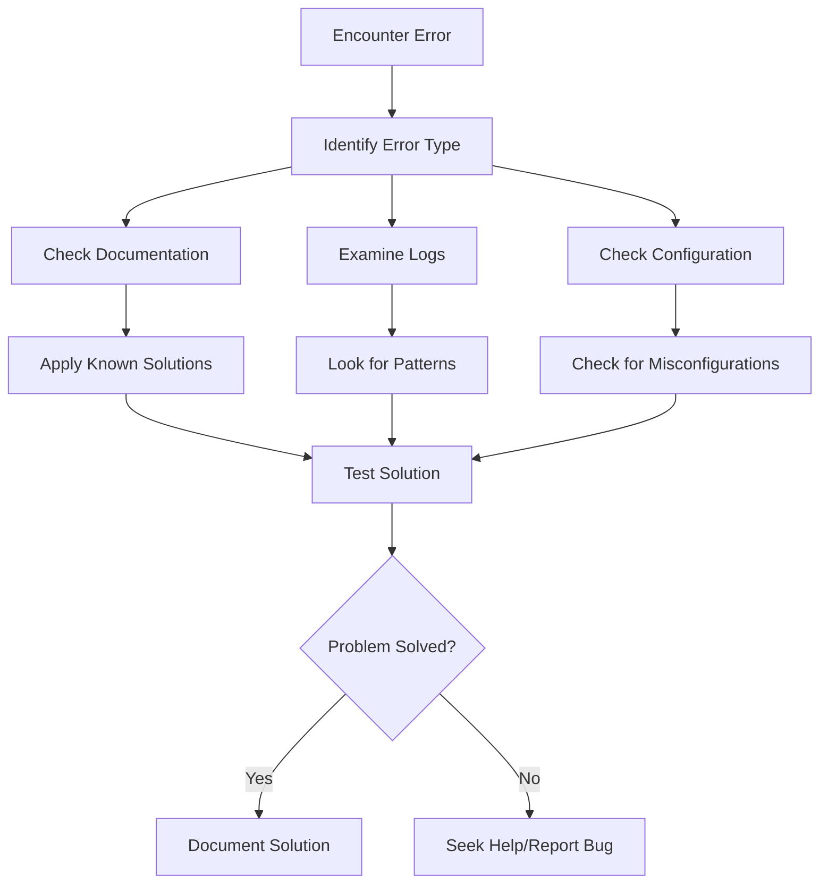

# Error Messages Explained

## Introduction

When working with Grafana Loki, encountering error messages is an inevitable part of the development and operations process. Error messages might seem cryptic at first, but they contain valuable information that can help you identify and resolve issues quickly. This guide will help you understand common Loki error messages, interpret their meaning, and provide practical troubleshooting steps to resolve them.

## Understanding Error Message Structure

Loki error messages typically follow a consistent structure that includes:

- **Error code**: A unique identifier for the type of error
- **Error message**: A brief description of what went wrong
- **Context information**: Details about where and when the error occurred
- **Suggested action**: Sometimes includes hints on how to resolve the issue

Let's look at how to interpret these components to diagnose problems effectively.

## Common Loki Error Messages

### Error 1: Rate Limit Exceeded

```
Error 429: Rate limit exceeded (limit: 10MB/sec): ingestion rate over last 1m: 15MB/sec
```

#### What it means:

This error occurs when you're sending logs to Loki at a rate that exceeds your configured limits.

#### How to fix it:

1. **Adjust your rate limits**: If you're in a testing environment, you can increase your rate limits:

```yaml
limits_config:
  ingestion_rate_mb: 20
  ingestion_burst_size_mb: 30
```

2. **Implement log filtering**: Reduce the volume of logs being sent:

```yaml
- match:
    selector: '{app="high-volume-app"}'
    stages:
    - drop:
        expression: 'DEBUG|INFO'
```

3. **Consider log sampling**: For high-volume logs, implement sampling:

```yaml
- match:
    selector: '{app="verbose-service"}'
    stages:
    - sampling:
        rate: 10 # Keep only 1 in 10 logs
```

### Error 2: Log Line Too Long

```
Error 413: Log entry too large: maximum size of log entry is 1MB, got 2.5MB
```

#### What it means:

Loki has a configurable maximum log line size to prevent performance issues. This error appears when a log entry exceeds that limit.

#### How to fix it:

1. **Adjust the max line size** (if appropriate for your use case):

```yaml
limits_config:
  max_line_size: 2000000 # 2MB in bytes
```

2. **Split large log entries** at the source:

```javascript
// Instead of:
logger.info(JSON.stringify(largeObject));

// Do this:
logger.info(`Processing started for ID: ${largeObject.id}`);
logger.debug(`Details: ${JSON.stringify(largeObject.details.slice(0, 1000))}`);
// Split additional details into manageable chunks
```

### Error 3: Query Timeout

```
Error: Query exceeded maximum execution time
```

#### What it means:

Your LogQL query is too complex or is processing too much data and has exceeded the configured timeout.

#### How to fix it:

1. **Add more specific label filters**:

```
# Instead of:
{app="payment-service"}

# Use more specific filters:
{app="payment-service", env="production", component="transaction-processor"}
```

2. **Narrow your time range**:

```
{app="payment-service"} | json | status=500
    | unwrap latency_ms 
    | by (endpoint) 
    | last 30m     # Focus on a shorter time window
```

3. **Increase the query timeout** (if you control the Loki configuration):

```yaml
query_timeout: 5m  # Increase from default
```

### Error 4: Failed to Parse LogQL Query

```
Error: parse error at line 1, col 42: syntax error: unexpected IDENTIFIER, expecting STRING
```

#### What it means:

There's a syntax error in your LogQL query.

#### How to fix it:

1. **Check your query syntax**:

Common mistakes include:

- Unbalanced quotes or parentheses
- Incorrect operators
- Typos in label names

2. **Build your query incrementally**:

Start with a simple query and gradually add complexity:

```
# Start with basic label matching:
{app="myapp"}

# Then add a line filter:
{app="myapp"} |= "error"

# Then add parsing:
{app="myapp"} |= "error" | json

# Finally add extracted field operations:
{app="myapp"} |= "error" | json | status_code >= 500
```

### Error 5: No Data Found

```
Error: query returned no results
```

#### What it means:

Loki couldn't find any log entries matching your query criteria.

#### How to fix it:

1. **Verify your label selectors**:

```
# Use Loki's series API to list available labels
curl -s -H "Content-Type: application/json" \
  -XGET "http://loki:3100/loki/api/v1/series"
```

2. **Check your time range**:

Make sure the time range in your query includes the period when the logs were generated.

3. **Verify that logs are being ingested**:

```
# Use a very broad query to confirm logs are being received:
{} | limit 10
```

### Error 6: Missing Labels

```
Error: labels with name "app" not found
```

#### What it means:

Your query is looking for a label that doesn't exist in the indexed logs.

#### How to fix it:

1. **List available labels**:

```
# Get all label names
curl -s -G -H "Content-Type: application/json" \
  "http://loki:3100/loki/api/v1/labels"
```

2. **Check label values**:

```
# Get values for a specific label
curl -s -G -H "Content-Type: application/json" \
  "http://loki:3100/loki/api/v1/label/app/values"
```

3. **Adjust your query to use available labels**:

```
# Instead of:
{app="myapp"}

# Use what's available:
{service="myapp"}  # If your label is named "service" instead of "app"
```

## Diagnosing Complex Errors

For more complex issues, follow this systematic approach:



## Common Troubleshooting Tools

### Loki Query API

The Loki API provides endpoints that can help diagnose errors:

```bash
# Check Loki's status
curl -s http://loki:3100/ready

# List label names
curl -s http://loki:3100/loki/api/v1/labels

# List label values
curl -s http://loki:3100/loki/api/v1/label/app/values

# Run a simple query
curl -s -G "http://loki:3100/loki/api/v1/query" \
  --data-urlencode 'query={app="test"}' \
  --data-urlencode 'limit=5'
```

### Log Tailing

Watching logs in real-time can help identify issues as they occur:

```bash
# Using LogCLI
logcli query --tail '{app="loki"}' --output jsonl

# Using curl with the tail endpoint
curl -s -G "http://loki:3100/loki/api/v1/tail" \
  --data-urlencode 'query={app="loki"}'
```

### Configuration Validation

Before deploying changes to fix errors, validate your configuration:

```bash
# Validate Loki config
loki -config.file=/path/to/loki-config.yaml -validate-config

# Validate Promtail config
promtail -config.file=/path/to/promtail-config.yaml -validate-config
```

## Advanced Error Resolution Techniques

### Using the Debug Endpoint

For persistent issues, Loki provides a debug endpoint:

```bash
# Get debug info
curl -s http://loki:3100/debug/pprof/
```

### Analyzing Metrics

Loki exposes Prometheus metrics that can help identify the root cause of errors:

```
# Key metrics to monitor
loki_distributor_bytes_received_total
loki_ingester_memory_chunks
loki_query_frontend_queries_total
```

### Log Level Adjustment

Increasing the log verbosity can provide more insight:

```yaml
# In Loki configuration
server:
  log_level: debug  # Options: debug, info, warn, error
```

## Error Prevention Best Practices

### Log Volume Management

1. **Implement log filtering** at the source:

```yaml
# Promtail configuration example
scrape_configs:
  - job_name: system
    pipeline_stages:
      - match:
          selector: '{job="varlogs"}'
          stages:
          - drop:
              expression: '.*DEBUG.*'
```

2. **Use dynamic logging levels** in your application:

```javascript
// Example in a Node.js application
const logLevel = process.env.LOG_LEVEL || 'info';
const logger = winston.createLogger({
  level: logLevel,
  // other configuration
});
```

### Efficient LogQL Queries

1. **Use label filters before line filters**:

```
# Less efficient:
{} |= "error" |= "payment" | json

# More efficient:
{app="payment-service"} |= "error" | json
```

2. **Limit the amount of returned data**:

```
{app="api"} | json | status=500 | limit 100
```

### Regular Configuration Reviews

Schedule regular reviews of your Loki configuration to ensure it scales with your application's growth:

```yaml
# Example scalable configuration
limits_config:
  ingestion_rate_mb: 10
  ingestion_burst_size_mb: 20
  max_global_streams_per_user: 5000
  max_query_length: 12h
  max_query_parallelism: 32
  cardinality_limit: 100000
```

## Summary

Understanding error messages is a crucial skill for effectively using Grafana Loki. By learning to interpret these messages, you can quickly identify issues, apply appropriate fixes, and prevent similar problems in the future.

When troubleshooting:
1. Read the error message carefully
2. Check related logs for context
3. Review your configuration
4. Apply the appropriate solution
5. Document what you learned for future reference

With practice, what was once a cryptic error message becomes a helpful guide toward solving problems efficiently.

## Additional Resources

- [Grafana Loki Documentation](https://grafana.com/docs/loki/latest/)
- [LogQL Query Language Reference](https://grafana.com/docs/loki/latest/logql/)
- [Loki Troubleshooting Guide](https://grafana.com/docs/loki/latest/operations/troubleshooting/)

## Exercises

1. Create a test environment and trigger each of the errors mentioned in this guide
2. Practice writing LogQL queries that avoid common error causes
3. Set up alerts for common error conditions in your Loki deployment
4. Create a custom error resolution playbook for your team