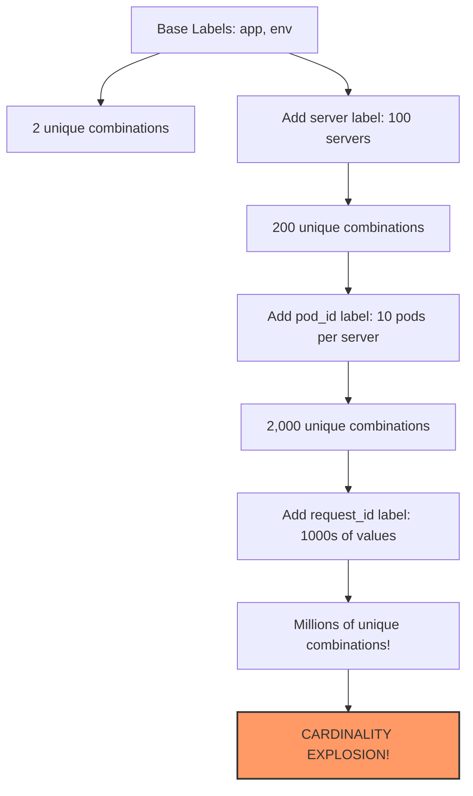

# Cardinality Explosion

## Introduction

When working with Grafana Loki, you might encounter a performance issue known as **cardinality explosion**. This phenomenon occurs when your log data contains too many unique label combinations, leading to system performance degradation or even outages. Understanding and preventing cardinality explosion is crucial for maintaining a healthy and efficient logging system.

In this guide, we'll explore what cardinality explosion is, why it happens in Loki, how to identify it, and most importantly, how to prevent it.

## What is Cardinality?

Before diving into cardinality explosion, let's understand what cardinality means in the context of Loki:

**Cardinality** refers to the number of unique label combinations in your log data. In Loki, logs are organized by streams, which are identified by their unique set of label key-value pairs.

For example, consider these label combinations:

```
{app="frontend", environment="production", server="server-01"}
{app="frontend", environment="production", server="server-02"}
{app="backend", environment="production", server="server-03"}
```

Each unique combination creates a separate stream in Loki.

## What is Cardinality Explosion?

Cardinality explosion occurs when the number of unique label combinations grows uncontrollably, often exponentially. This happens when:

1. You use highly variable data as label values
2. You have too many label dimensions
3. Labels change frequently over time

When cardinality explodes, Loki's index can become overwhelmed, leading to:

- Increased memory usage
- Slower query performance
- Higher storage costs
- System instability or crashes

## Visualizing Cardinality Explosion

Let's visualize how cardinality can grow exponentially:



## Common Causes of Cardinality Explosion in Loki

### 1. Using Dynamic Values as Labels

One of the most common causes is using highly variable data as labels:

```yaml
# BAD PRACTICE
scrape_configs:
  - job_name: 'app_logs'
    static_configs:
      - targets: ['localhost']
        labels:
          request_id: '{{.request_id}}'  # Every request creates a new stream!
          user_id: '{{.user_id}}'        # Every user creates a new stream!
          timestamp: '{{.timestamp}}'    # Every second creates a new stream!
```

### 2. Using Too Many Labels

Another common cause is using too many dimensions:

```yaml
# TOO MANY DIMENSIONS
scrape_configs:
  - job_name: 'app_logs'
    static_configs:
      - targets: ['localhost']
        labels:
          app: 'frontend'
          environment: 'production'
          region: 'us-west'
          zone: 'us-west-1a'
          pod: 'frontend-pod-1234'
          node: 'node-9876'
          cluster: 'cluster-a'
          version: 'v1.2.3'
          # Each additional label multiplies possible combinations!
```

### 3. Frequent Label Changes

When label values change frequently:

```yaml
# CHANGING LABELS
scrape_configs:
  - job_name: 'app_logs'
    static_configs:
      - targets: ['localhost']
        labels:
          app: 'frontend'
          build_number: '{{.build_number}}'  # Changes with each deployment
```

## Identifying Cardinality Issues

### Metrics to Watch

Loki exposes several metrics that can help identify cardinality issues:

```
loki_ingester_memory_streams: Number of streams in memory
loki_ingester_memory_streams_created_total: Total number of streams created
loki_ingester_memory_streams_removed_total: Total number of streams removed
```

If you see a rapid increase in these metrics, you might be experiencing cardinality explosion.

### Loki Query to Check Cardinality

You can use LogQL to check the cardinality of your log streams:

```logql
count by (__name__) (count_over_time({job="loki"}[1h]))
```

This query counts the number of unique streams over the past hour.

## Preventing Cardinality Explosion

### 1. Keep High-Cardinality Data in Log Content, Not Labels

The golden rule: **Put high-cardinality data in the log content, not in labels.**

```yaml
# GOOD PRACTICE
scrape_configs:
  - job_name: 'app_logs'
    static_configs:
      - targets: ['localhost']
        labels:
          app: 'frontend'
          environment: 'production'
          # Only a few stable labels
          
# Then search within log content:
# {app="frontend"} |= "request_id=abc123"
```

### 2. Limit the Number of Label Dimensions

Aim to keep your label count under 10. Consider which labels are truly necessary for querying vs. which data can be extracted from log lines when needed.

### 3. Use Static or Low-Cardinality Labels

Choose labels that have a limited set of possible values:

```yaml
# GOOD CHOICES FOR LABELS
scrape_configs:
  - job_name: 'app_logs'
    static_configs:
      - targets: ['localhost']
        labels:
          app: 'frontend'                   # Limited number of applications
          environment: 'production'         # Usually dev/staging/prod only
          tier: 'web'                       # Limited set of tiers
          component: 'auth'                 # Limited set of components
```

### 4. Use Label Normalization

If you must include potentially high-cardinality data, normalize it first:

```yaml
# BEFORE NORMALIZATION
user_id: '12345'    # Unlimited unique values

# AFTER NORMALIZATION
user_type: 'premium'  # Limited set: free, basic, premium
```

### 5. Configure Stream Limits

Set appropriate limits in your Loki configuration:

```yaml
limits_config:
  max_label_name_length: 1024
  max_label_value_length: 2048
  max_label_names_per_series: 30
  reject_old_samples: true
  reject_old_samples_max_age: 168h
  ingestion_rate_mb: 4
  ingestion_burst_size_mb: 6
```

## Real-World Example: Troubleshooting a Cardinality Explosion

Let's walk through a real-world scenario of diagnosing and fixing a cardinality explosion issue:

### Initial Setup

A web application is sending logs to Loki with the following configuration:

```yaml
scrape_configs:
  - job_name: 'webapp_logs'
    static_configs:
      - targets: ['localhost']
        labels:
          app: 'webapp'
          environment: 'production'
          server: '{{.hostname}}'
          session_id: '{{.session_id}}'  # Problem: High cardinality!
```

### The Problem

The Loki instance started experiencing performance issues after a traffic spike. Memory usage exploded, and queries became extremely slow.

### Diagnosis

Checking the metrics, we observe:

```
loki_ingester_memory_streams: 2,500,000 (was ~1,000 before)
```

Using a query to examine the label combinations:

```logql
count by (session_id) (count_over_time({app="webapp"}[1h]))
```

Results show thousands of unique `session_id` values creating separate streams.

### The Solution

1. Remove `session_id` from labels:

```yaml
scrape_configs:
  - job_name: 'webapp_logs'
    static_configs:
      - targets: ['localhost']
        labels:
          app: 'webapp'
          environment: 'production'
          server: '{{.hostname}}'
          # session_id removed!
```

2. Update application to include session_id in the log message itself:

```
2023-06-15T12:34:56Z INFO Session started session_id=abc123 user=anonymous
```

3. Update queries to filter by log content:

```logql
{app="webapp"} |= "session_id=abc123"
```

### Results

After implementing these changes:

- Stream count dropped from 2,500,000 to 50
- Memory usage decreased by 95%
- Query performance improved dramatically
- Storage costs reduced significantly

## Best Practices Summary

1. **Label Philosophy**: Use labels for identifying the source of logs, not the content
2. **Content vs. Labels**: Keep variable data in log content, not in labels
3. **Label Dimensions**: Limit the number of label dimensions (aim for `<10`)
4. **Static Labels**: Use static or low-cardinality labels
5. **Monitor Cardinality**: Regularly check metrics for stream growth
6. **Configure Limits**: Set appropriate limits in your Loki configuration
7. **Template Variables**: Be cautious with template variables in label values

## Exercises

1. Review your current Loki configuration and identify any potential high-cardinality labels.
2. Create a dashboard to monitor the number of streams in your Loki instance.
3. Practice converting a high-cardinality label-based query to a log content filter query.
4. Calculate the theoretical maximum number of streams your current label structure could create.

## Additional Resources

- [Grafana Loki Best Practices](https://grafana.com/docs/loki/latest/best-practices/)
- [LogQL: Loki's Query Language](https://grafana.com/docs/loki/latest/logql/)
- [Loki Cardinality Documentation](https://grafana.com/docs/loki/latest/operations/cardinality/)
- [Promtail Configuration](https://grafana.com/docs/loki/latest/clients/promtail/configuration/)