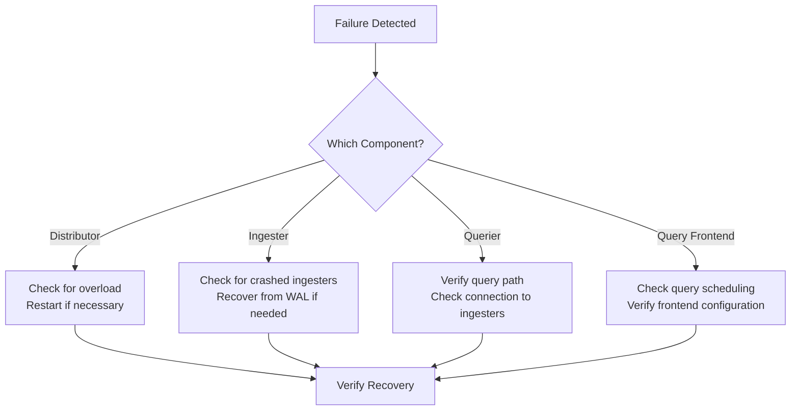

# Recovery Procedures

## Introduction

When working with Grafana Loki, you may occasionally encounter issues that require recovery procedures. This guide will walk you through common recovery scenarios and the steps needed to restore your Loki deployment to a healthy state. Recovery procedures are essential skills for maintaining reliable logging systems in production environments.

Loki's distributed architecture provides resilience, but also introduces complexity when troubleshooting issues. Understanding how to effectively recover from various failure modes will help you minimize downtime and data loss.

## Common Failure Scenarios

### 1. Storage Issues

Storage problems are among the most common issues with Loki deployments. These can range from disk space exhaustion to permission problems or storage connectivity issues.

#### Disk Space Exhaustion

When Loki runs out of disk space, it can't write new logs or maintain existing indexes properly.

**Signs of disk space issues:**
- Error messages in Loki logs containing phrases like `no space left on device`
- Queries failing with timeout errors
- Ingestion slowing down significantly

**Recovery steps:**

```bash
# Check current disk usage
df -h /path/to/loki/storage

# Identify large chunks that can be safely removed (if using filesystem storage)
find /path/to/loki/storage -type f -name "*.gz" -size +100M | sort -k 5 -n
```

If you're using object storage like S3 or GCS, review your retention policies and check if they're being properly applied.

#### Recovery from corrupted indexes

If Loki's index becomes corrupted, you might need to rebuild it:

```bash
# Stop Loki service
sudo systemctl stop loki

# Backup current index (if possible)
cp -r /path/to/loki/index /path/to/backup/

# Remove corrupted index files
rm -rf /path/to/loki/index/*

# Restart Loki to rebuild index
sudo systemctl start loki
```

:::caution
This will cause temporary query unavailability while the index rebuilds from storage.
:::

### 2. Component Failures

Loki consists of several components that can be deployed in microservices mode. Recovery procedures differ depending on which component has failed.



#### Ingester Recovery

Ingesters are responsible for receiving and storing log data. When an ingester fails, you might need to recover from the Write-Ahead Log (WAL).

**Recovery steps:**

```bash
# Check the status of WAL directory
ls -la /path/to/loki/wal

# Restart the ingester service
kubectl rollout restart deployment/loki-ingester # If using Kubernetes
```

If multiple ingesters have failed:

```bash
# Scale down and then up to force recovery
kubectl scale deployment loki-ingester --replicas=0
sleep 10
kubectl scale deployment loki-ingester --replicas=3
```

### 3. Network and Connectivity Issues

Network problems can cause components to become isolated, leading to various failure modes.

**Diagnosis commands:**

```bash
# Check if Loki endpoints are reachable
curl -v http://loki:3100/ready

# Verify network connectivity between components
kubectl exec loki-distributor-XXX -- curl -v http://loki-ingester:3100/ready
```

**Recovery steps:**

1. Check network policies and firewall rules
2. Verify DNS resolution is working correctly
3. Ensure load balancers are properly configured
4. Restart affected components if necessary

## Data Recovery Strategies

### Using Compactor for Recovery

The Loki compactor can help recover from certain types of data corruption by consolidating and cleaning up chunks.

```bash
# Configure compactor in your Loki configuration
loki:
  compactor:
    working_directory: /loki/compactor
    shared_store: s3
    retention_enabled: true
```

### Backup and Restore Procedures

Implementing regular backups is crucial for recovery. Here's a basic backup strategy:

1. **Back up configuration files**

```bash
# Create a backup of Loki configuration
cp /etc/loki/loki-local-config.yaml /backup/loki-config-$(date +%Y%m%d).yaml
```

2. **Back up storage data** (if using filesystem storage)

```bash
# Create a snapshot of Loki chunks
tar -czf /backup/loki-chunks-$(date +%Y%m%d).tar.gz /path/to/loki/chunks
```

3. **Back up indexes** (if using BoltDB)

```bash
# Create a snapshot of Loki indexes
cp -r /path/to/loki/index /backup/loki-index-$(date +%Y%m%d)
```

To restore from backup:

```bash
# Stop Loki
sudo systemctl stop loki

# Restore configuration
cp /backup/loki-config-YYYYMMDD.yaml /etc/loki/loki-local-config.yaml

# Restore data
tar -xzf /backup/loki-chunks-YYYYMMDD.tar.gz -C /

# Restore index
cp -r /backup/loki-index-YYYYMMDD/* /path/to/loki/index/

# Start Loki
sudo systemctl start loki
```

## Prevention Is Better Than Recovery

While recovery procedures are essential, implementing preventive measures can save you from needing them in the first place:

1. **Implement monitoring and alerting** for Loki components
2. **Set up proper resource limits** to prevent OOM kills
3. **Configure appropriate retention policies** to manage storage growth
4. **Use redundancy** where possible to minimize single points of failure
5. **Regularly test backup and recovery procedures** before you need them

## Hands-on Exercise: Simulating and Recovering from Failure

Let's practice recovering from a simulated ingester failure:

1. Create a test Loki deployment with multiple ingesters
2. Force-kill one ingester to simulate a failure
3. Observe how logs are redistributed
4. Practice recovering using the WAL

```bash
# Simulate an ingester crash
kubectl delete pod -l app=loki,component=ingester --selector=name=loki-ingester-1

# Watch recovery process
kubectl logs -f -l app=loki,component=distributor
```

## Summary

Recovery procedures are a critical part of operating Grafana Loki in production environments. In this guide, we've covered:

- Common failure scenarios and their symptoms
- Step-by-step recovery procedures for each type of failure
- Preventive measures to reduce the need for recovery
- Practical exercises to build recovery skills

By understanding these recovery procedures, you'll be better prepared to maintain a healthy Loki deployment and minimize downtime when issues occur.

## Additional Resources

- [Grafana Loki Operational Guide](https://grafana.com/docs/loki/latest/operations/)
- [Loki Architecture](https://grafana.com/docs/loki/latest/fundamentals/architecture/)
- [Loki Best Practices](https://grafana.com/docs/loki/latest/best-practices/)