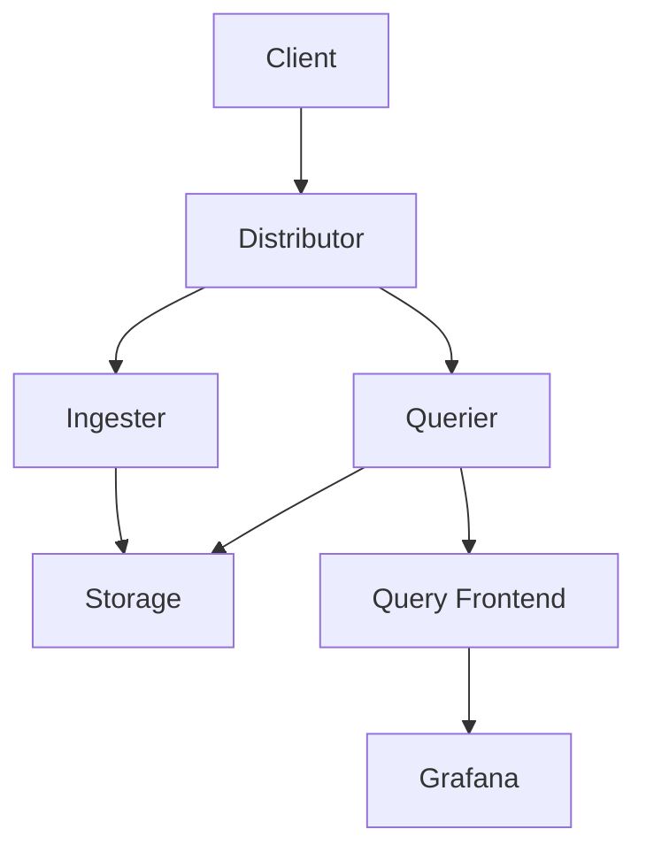

# Debugging Techniques

## Introduction

Debugging is an essential skill for anyone working with Grafana Loki. When your log queries don't return expected results or your Loki deployment encounters issues, knowing how to systematically identify and resolve problems becomes invaluable. This guide will walk you through common debugging techniques specifically tailored for Grafana Loki environments, providing you with a structured approach to troubleshooting that will save you time and frustration.

## Understanding Common Loki Issues

Before diving into specific debugging techniques, let's understand the types of issues you might encounter when working with Grafana Loki:

1. **Query-related issues**: Problems with LogQL syntax, unexpected or missing results
2. **Performance issues**: Slow queries, timeouts, high resource usage
3. **Configuration issues**: Improper setup of Loki components
4. **Integration issues**: Problems with log shipping or visualization in Grafana

## Essential Debugging Techniques

### 1. Check Loki Logs

The first place to look when troubleshooting Loki is in its own logs. Loki components generate logs that provide valuable insights into what's happening behind the scenes.

```bash
# View logs from Loki containers if using Docker
docker logs loki-container-name

# Or if using Kubernetes
kubectl logs -n loki-namespace loki-pod-name
```

Look for error messages, warnings, or any unusual patterns that might indicate the source of your problem.

### 2. Verify Configuration

Many issues stem from misconfiguration. Review your Loki configuration files to ensure they're correctly set up:

```yaml
auth_enabled: false

server:
  http_listen_port: 3100

ingester:
  lifecycler:
    address: 127.0.0.1
    ring:
      kvstore:
        store: inmemory
      replication_factor: 1
    final_sleep: 0s
  chunk_idle_period: 5m
  chunk_retain_period: 30s

schema_config:
  configs:
  - from: 2020-10-24
    store: boltdb-shipper
    object_store: filesystem
    schema: v11
    index:
      prefix: index_
      period: 24h
```

Common configuration issues include:

- Incorrect storage configuration
- Insufficient resource allocation
- Mismatched schema versions
- Incorrect network settings

### 3. Use LogQL to Debug

LogQL is a powerful tool for debugging. Start with simple queries and gradually add complexity:

```logql
{job="loki"}
```

Then narrow down to specific components:

```logql
{job="loki", component="querier"} |= "error"
```

Examine specific time ranges for errors:

```logql
{job="loki"} |= "error" | logfmt | duration > 1s
```

### 4. Inspect Metrics

Loki exposes Prometheus metrics that can help identify issues:

1. Navigate to `http://loki-address:3100/metrics`
2. Look for metrics related to your issue area:

- `loki_distributor_bytes_received_total`: Monitors ingest volume
- `loki_ingester_memory_chunks`: Tracks memory usage
- `loki_query_frontend_queries_total`: Counts queries

You can visualize these metrics in Grafana to spot patterns:

```logql
rate(loki_distributor_bytes_received_total[5m])
```

### 5. Use the Query Stats Feature

When troubleshooting slow queries, use the built-in query statistics feature in Grafana:

1. Execute your LogQL query in Grafana's Explore view
2. Click "Query Stats" to see:
   - Execution time
   - Bytes processed
   - Total entries examined

This helps identify inefficient queries that might benefit from optimization.

### 6. Isolate Components

When debugging complex issues, isolate components to narrow down the problem:



Test each component individually:

1. Check if logs are being sent correctly from clients
2. Verify the distributor is receiving logs
3. Confirm ingesters are processing data
4. Test if queriers can retrieve data from storage

### 7. Binary Search Method

When dealing with a large volume of logs, use the binary search method:

1. Start with a wide time range
2. Examine the middle point
3. Determine if the issue occurs before or after this point
4. Repeat with the half that contains the issue
5. Continue until you narrow down the exact time when the problem began

This helps identify the trigger event for your issue.

### 8. Create Minimal Reproducible Examples

When you've identified a potential issue, create a minimal reproducible example:

```bash
# Example of a minimal test case for a query issue
curl -g -s "http://localhost:3100/loki/api/v1/query" --data-urlencode 'query={job="test"}' | jq
```

This makes it easier to:
- Confirm the issue consistently
- Share with others when seeking help
- Test potential fixes

### 9. Use Debug Logging

Increase the log verbosity when troubleshooting specific issues:

```yaml
# In Loki configuration
limits_config:
  debug_logging: true

# Or start Loki with increased verbosity
./loki -config.file=loki-config.yaml -log.level=debug
```

Debug logs provide more detailed information, helping identify subtle issues.

## Real-world Debugging Examples

### Example 1: Troubleshooting Missing Logs

**Scenario**: Logs from a particular service aren't showing up in Grafana.

**Debugging steps**:

1. Check if logs are being shipped:

```bash
# If using Promtail, check its logs
docker logs promtail-container
```

2. Verify label configuration in Promtail:

```yaml
scrape_configs:
  - job_name: system
    static_configs:
    - targets:
        - localhost
      labels:
        job: varlogs
        __path__: /var/log/*log
```

3. Test a direct query to Loki's API:

```bash
curl -g "http://loki:3100/loki/api/v1/query_range" \
  --data-urlencode 'query={job="varlogs"}' \
  --data-urlencode 'start=1625000000' \
  --data-urlencode 'end=1625100000' \
  --data-urlencode 'step=60'
```

4. Check Loki's ingest metrics:

```logql
rate(loki_distributor_bytes_received_total{job="varlogs"}[5m])
```

**Resolution**: The issue was in the Promtail configuration where the `__path__` pattern didn't match the actual log files.

### Example 2: Debugging Slow Queries

**Scenario**: LogQL queries are taking too long to execute.

**Debugging approach**:

1. Check query stats in Grafana
2. Examine Loki's querier logs:

```logql
{job="loki", component="querier"} |= "slow query"
```

3. Look at resource metrics:

```logql
sum by (instance) (rate(container_cpu_usage_seconds_total{container="loki-querier"}[5m]))
```

4. Test query complexity by simplifying:

```logql
# Original slow query
{app="myapp"} |= "error" | json | response_time > 200 | unwrap response_time | rate [5m]

# Simplified for testing
{app="myapp"} |= "error"
```

**Resolution**: The issue was resolved by adding a more specific label filter to reduce the initial data set and optimizing the extracted fields.

## Best Practices for Efficient Debugging

1. **Document your steps**: Keep notes of what you've tried and the results
2. **One change at a time**: Modify only one thing before testing again
3. **Use version control**: Track configuration changes
4. **Reproduce before fixing**: Ensure you can consistently trigger the issue
5. **Monitor system resources**: Watch CPU, memory, and disk I/O
6. **Create alert thresholds**: Set up alerts to catch issues early

## Troubleshooting Checklist

Use this checklist when debugging Loki issues:

- [ ] Check Loki component logs for errors
- [ ] Verify configuration parameters  
- [ ] Test with simple LogQL queries
- [ ] Examine relevant metrics
- [ ] Inspect network connectivity
- [ ] Check resource utilization
- [ ] Verify log shipping is working
- [ ] Test with different time ranges
- [ ] Validate index and storage configuration

## Summary

Effective debugging in Grafana Loki involves a systematic approach that combines examining logs, metrics, and configurations while using LogQL as a powerful diagnostic tool. By understanding common issues and applying the techniques covered in this guide, you'll be able to quickly identify and resolve problems in your Loki deployment.

Remember that debugging is partly a science and partly an art—the more you practice, the more efficient you'll become at troubleshooting. Start with simple checks and progressively work toward more complex investigations as needed.

## Additional Resources

- [Official Loki Troubleshooting Guide](https://grafana.com/docs/loki/latest/operations/troubleshooting/)
- [LogQL Query Language Reference](https://grafana.com/docs/loki/latest/logql/)
- [Grafana Community Forums](https://community.grafana.com/)

## Exercises

1. Set up a test Loki environment and intentionally misconfigure a component. Use the debugging techniques to identify the issue.
2. Create a complex LogQL query, then optimize it using the query stats tool to improve performance.
3. Develop a simple monitoring dashboard for your Loki deployment that helps identify potential issues before they become problems.