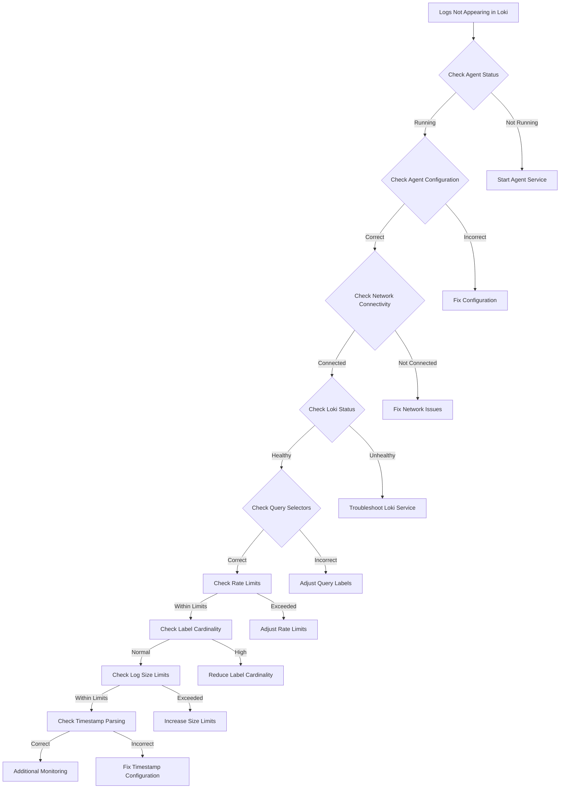

# Log Ingestion Problems

## Introduction

Log ingestion is the process of collecting, parsing, and storing log data from various sources into Grafana Loki. While Loki is designed to be efficient and reliable, various issues can occur during the ingestion process that prevent logs from being properly collected, labeled, or stored.

In this guide, we'll explore common log ingestion problems in Grafana Loki, how to identify them, and most importantly, how to solve them. Whether you're seeing missing logs, experiencing performance issues, or encountering error messages, this troubleshooting guide will help you get your logging pipeline back on track.

## Common Log Ingestion Problems

Let's explore the most frequent issues you might encounter when ingesting logs into Loki.

### 1. No Logs Appearing in Loki

One of the most common issues is when logs simply don't appear in Loki's interface even though your applications are generating them.

#### Potential Causes

- **Agent Configuration Issues**: Promtail or other log agents might be misconfigured
- **Connectivity Problems**: Network issues between your agents and Loki
- **Rate Limiting**: Loki might be throttling ingest requests
- **Labels and Selectors**: Incorrect query selectors when viewing logs

#### Diagnosing the Issue

First, check if your log agent (like Promtail) is actually sending logs:

```bash
# Check Promtail's status and logs
sudo systemctl status promtail
sudo journalctl -u promtail -f
```

Verify Promtail's configuration file has the correct targets:

```yaml
scrape_configs:
  - job_name: system
    static_configs:
    - targets:
        - localhost
      labels:
        job: varlogs
        __path__: /var/log/*log
```

Check connectivity to your Loki instance:

```bash
# Test connection from agent to Loki
curl -v http://loki:3100/ready
```

#### Solution

1. **Check agent logs** for error messages related to sending logs
2. **Verify configurations**:
   - Ensure log paths are correct
   - Check Loki URL and credentials
   - Validate label configurations
3. **Examine network connectivity** between your agents and Loki
4. **Verify Loki is healthy** by checking its ready and metrics endpoints

### 2. Rate Limiting and Throttling Issues

Loki includes rate limiting to protect itself from being overwhelmed by log volume.

#### Symptoms

- Logs appearing with delay
- Logs being dropped
- Error messages about rate limits or throttling
- Inconsistent log ingestion

#### Diagnosing Rate Limiting

Check Loki's logs for rate limiting messages:

```bash
# Find rate limiting messages in Loki logs
kubectl logs -f deployment/loki -n loki | grep -i "rate limit"
```

Review metrics for rate limiting:

```bash
# Query rate limiting metrics
curl -s http://loki:3100/metrics | grep -i rate_limit
```

#### Solution

1. **Increase limits** in Loki configuration:

```yaml
limits_config:
  ingestion_rate_mb: 10
  ingestion_burst_size_mb: 20
  per_stream_rate_limit: 10MB
  per_stream_rate_limit_burst: 15MB
```

2. **Implement batching** in your agent config to smooth ingestion rates
3. **Add more Loki distributors** to handle higher throughput
4. **Consider upgrading** to a clustered Loki setup for better scaling

### 3. Label Cardinality Issues

High cardinality labels can severely impact Loki's performance. This happens when you have labels with many potential values.

#### Symptoms

- Slow queries
- Out of memory errors
- High disk usage
- Error messages about series limits

Here's what a high cardinality problem might look like in Loki logs:

```
level=warn ts=2023-10-15T14:22:30.123Z caller=metrics.go:111 msg="too many series labels matched" error="per-user series limit exceeded: limit 10000 series, matched: 12500 series"
```

#### Diagnosing Cardinality Issues

Use Loki's metrics to identify high cardinality:

```bash
# Check series count metrics
curl -s http://loki:3100/metrics | grep 'loki_ingester_memory_series'
```

Examine your label configuration in Promtail:

```yaml
scrape_configs:
  - job_name: app
    static_configs:
    - targets:
        - localhost
      labels:
        app: myapp
        # High cardinality label example:
        request_id: ${REQUEST_ID}  # This could generate unlimited unique values!
```

#### Solution

1. **Remove high cardinality labels** from your configuration
2. **Use dynamic labels sparingly**, especially for values like:
   - User IDs
   - Session IDs
   - Request IDs
   - IP addresses
   - Timestamps
3. **Keep high cardinality data in the log content**, not in labels
4. **Increase series limits** if absolutely necessary (but fix the root cause first!)

```yaml
limits_config:
  max_label_name_length: 1024
  max_label_value_length: 2048
  max_label_names_per_series: 30
  max_global_streams_per_user: 15000
```

### 4. Log Line Size Limits

Loki enforces maximum log line sizes to prevent performance issues.

#### Symptoms

- Truncated logs
- Missing log entries
- Error messages about size limits

#### Diagnosing Size Limit Issues

Check for error messages about line size:

```bash
# Look for size limit errors in Promtail
journalctl -u promtail | grep -i "size limit"
```

#### Solution

1. **Increase line size limits** in Loki configuration:

```yaml
limits_config:
  max_line_size: 512000  # Increased from default
```

2. **Configure line splitting** in your log agent
3. **Consider restructuring** very large log messages

### 5. Timestamp Parsing Issues

Loki requires logs to be in chronological order within each stream.

#### Symptoms

- "Entry out of order" errors
- Missing logs
- Duplicate timestamps

#### Diagnosing Timestamp Issues

Check for timestamp-related errors in Loki logs:

```bash
# Find timestamp errors
kubectl logs deployment/loki -n loki | grep -i "out of order"
```

Review your timestamp parsing configuration:

```yaml
scrape_configs:
  - job_name: app_logs
    pipeline_stages:
      - regex:
          expression: '(?P<timestamp>\d{4}-\d{2}-\d{2} \d{2}:\d{2}:\d{2}.\d{3})'
      - timestamp:
          source: timestamp
          format: '2006-01-02 15:04:05.000'
```

#### Solution

1. **Configure proper timestamp parsing** in your agent
2. **Increase the `reject_old_samples` threshold** in Loki config

```yaml
limits_config:
  reject_old_samples: true
  reject_old_samples_max_age: 168h  # 1 week, increased from default
```

3. **Ensure logs are sent in a timely manner** from source to Loki

## Troubleshooting Workflow

Let's put together a systematic approach to troubleshoot log ingestion issues:



## Advanced Troubleshooting Techniques

### Using Loki's API for Diagnostics

Loki provides several API endpoints that can help with troubleshooting:

```bash
# Check if Loki is ready
curl http://loki:3100/ready

# Get build information
curl http://loki:3100/loki/api/v1/status/buildinfo

# Check configured limits
curl http://loki:3100/config
```

### Monitoring Loki's Metrics

Loki exposes Prometheus metrics that can help identify ingestion issues:

```bash
# Get all metrics
curl http://loki:3100/metrics

# Filter for ingestion-related metrics
curl -s http://loki:3100/metrics | grep 'loki_distributor_bytes_received_total'
```

Key metrics to monitor:

- `loki_distributor_bytes_received_total`: Total bytes received per tenant
- `loki_distributor_lines_received_total`: Total lines received per tenant
- `loki_distributor_ingester_append_failures_total`: Failed append requests to ingesters
- `loki_ingester_memory_streams`: Number of streams in memory
- `loki_ingester_memory_series`: Number of series in memory

### Debugging with Promtail

Enable debug logging in Promtail for more detailed information:

```yaml
server:
  http_listen_port: 9080

positions:
  filename: /tmp/positions.yaml

clients:
  - url: http://loki:3100/loki/api/v1/push

log_level: debug  # Set to debug for more verbose logging
```

You can also use Promtail's dry-run feature to test configurations without actually sending logs:

```bash
promtail --dry-run --config.file=promtail-config.yaml
```

## Common Log Ingestion Error Messages

| Error Message | Possible Cause | Solution |
|---------------|----------------|----------|
| `server returned HTTP status 429 Too Many Requests` | Rate limiting | Increase rate limits or batch logs |
| `entry out of order, rejecting` | Timestamp issues | Fix timestamp parsing or increase max age |
| `per-user series limit exceeded` | High cardinality | Reduce label cardinality |
| `max size of a single log line exceeded` | Log line too big | Increase max line size or split logs |
| `failed to connect to loki` | Network/availability | Check network and Loki status |

## Real-World Example: Troubleshooting a Kubernetes Application

Let's see a practical example of troubleshooting log ingestion for a Kubernetes application.

### Scenario

You've deployed a microservice application in Kubernetes and set up Promtail as a DaemonSet to collect container logs. However, you notice that logs from one particular service aren't appearing in Loki.

### Step 1: Check if Promtail is collecting the logs

```bash
# Check Promtail pods
kubectl get pods -n logging

# Check Promtail logs
kubectl logs -f promtail-abcd1 -n logging
```

### Step 2: Verify Promtail configuration

```yaml
scrape_configs:
  - job_name: kubernetes
    kubernetes_sd_configs:
      - role: pod
    relabel_configs:
      - source_labels: [__meta_kubernetes_pod_label_app]
        target_label: app
      - source_labels: [__meta_kubernetes_namespace]
        target_label: namespace
```

### Step 3: Test direct log queries

```bash
# Query logs with minimal filtering
curl -G -s "http://loki:3100/loki/api/v1/query_range" \
  --data-urlencode "query={namespace=\"my-namespace\"}" \
  --data-urlencode "start=1609459200000000000" \
  --data-urlencode "end=1609545600000000000" \
  --data-urlencode "limit=10"
```

### Step 4: Examine Loki metrics for ingestion issues

```bash
# Check if logs are being received
curl -s http://loki:3100/metrics | grep 'loki_distributor_lines_received_total'
```

### Step 5: Solution implementation

After investigation, we discover that the application was using multiline JSON logs that weren't being parsed correctly. We update the Promtail configuration to handle this:

```yaml
scrape_configs:
  - job_name: kubernetes
    kubernetes_sd_configs:
      - role: pod
    pipeline_stages:
      - json:
          expressions:
            timestamp: time
            level: level
            message: message
      - timestamp:
          source: timestamp
          format: RFC3339
```

## Summary

Successfully troubleshooting log ingestion problems in Grafana Loki requires systematic investigation and a good understanding of how the logging pipeline works. In this guide, we've covered:

- Common log ingestion issues and their symptoms
- How to diagnose each type of problem
- Specific solutions for each category of issue
- A systematic troubleshooting workflow
- Advanced techniques for deeper investigation
- Real-world examples of log ingestion problems

Remember that effective log ingestion troubleshooting comes down to understanding:

1. **The path logs take** from source to Loki
2. **Loki's architecture** and how it processes logs
3. **The configuration options** that affect log ingestion
4. **How to use metrics and logs** to identify bottlenecks or failures

## Additional Resources

- [Grafana Loki Documentation](https://grafana.com/docs/loki/latest/)
- [Promtail Configuration Reference](https://grafana.com/docs/loki/latest/clients/promtail/configuration/)
- [Loki Troubleshooting Guide](https://grafana.com/docs/loki/latest/fundamentals/troubleshooting/)
- [Best Practices for Labels](https://grafana.com/docs/loki/latest/best-practices/)

## Exercises

1. Set up a local Loki and Promtail instance, then deliberately misconfigure one aspect to practice troubleshooting.
2. Create a high cardinality situation and observe its effects on Loki's performance.
3. Experiment with different rate limits to find the optimal configuration for your log volume.
4. Implement a multiline logging pipeline and ensure timestamps are correctly parsed.
5. Create a monitoring dashboard in Grafana to track key Loki ingestion metrics.