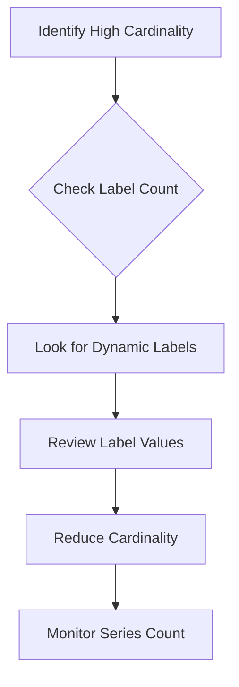

# Query Troubleshooting

## Introduction

When working with Grafana Loki, you may encounter situations where your queries don't return the expected results or fail entirely. Query troubleshooting is an essential skill that helps you identify and resolve these issues efficiently. This guide explores common query problems in Loki, provides diagnostic techniques, and offers practical solutions to help you get your log queries back on track.

## Common Query Issues

### No Results Returned

One of the most frequent issues is when your query doesn't return any results, even though you're certain the logs exist.

#### Possible Causes:

1. **Time Range Issues**: The logs might exist but fall outside your selected time range.
2. **Label Selector Mismatch**: Your label selectors might not match any streams.
3. **Filter Expression Too Restrictive**: Your filter expression might be filtering out all logs.
4. **Data Not Yet Ingested**: The logs might not have been ingested yet.

#### Troubleshooting Steps:

```logql
# Start with a basic query to verify data exists
{app="frontend"}

# Then progressively add filters
{app="frontend"} |= "error"
```

Try expanding your time range or simplifying your query to see if results appear. Start with just the stream selector (e.g., `{app="frontend"}`) to confirm data exists before adding filters.

### Query Timeout Errors

Queries that process large volumes of data or use complex operations might time out.

#### Possible Causes:

1. **Time Range Too Large**: Scanning too much data can cause timeouts.
2. **Too Many Streams**: Querying across many streams increases processing time.
3. **Inefficient Regex**: Complex regular expressions can be resource-intensive.
4. **Resource Limitations**: Your Loki instance might have limited resources.

#### Solutions:

```logql
# Instead of a wide time range
{app="frontend"} |= "error" # over last 24 hours

# Use multiple narrower queries
{app="frontend"} |= "error" # over last 6 hours, then repeat for next time chunks
```

Try reducing your time range or adding more specific label selectors to narrow down the data being processed. Optimize regex patterns and consider using parsers to extract structured data.

### Parsing Errors

When using LogQL's parsing functions like `json`, `logfmt`, or custom regex patterns, you might encounter parsing errors.

#### Troubleshooting Steps:

```logql
# Test your parser on a small sample
{app="frontend"} | json

# Check specific fields
{app="frontend"} | json | line_format "{{.request_id}} {{.status_code}}"
```

To debug parsing issues:
1. Test your parser on a small log sample
2. Verify that logs are actually in the format you expect
3. Use the `line_format` operator to inspect parsed fields
4. Check for syntax errors in your parsing expressions

## Advanced Troubleshooting Techniques

### Using Metrics to Debug Queries

Loki provides metrics that can help you understand query performance issues.

```logql
# Query to check ingestion rate
rate({app="loki"}[5m]) | json | status_code=~"5.."

# Check for errors in Loki's logs
{app="loki", component="querier"} |= "error"
```

### Diagnosing Cardinality Issues

High cardinality can lead to performance problems and query failures.



To identify high cardinality issues:
1. Use the Loki "Series" API to check the number of series
2. Look for dynamic label values like IDs, timestamps, or IP addresses
3. Examine your label schema for unnecessary high-cardinality labels

Example of checking series count:

```bash
curl -G -s "http://localhost:3100/loki/api/v1/series" \
  --data-urlencode 'match[]={app="frontend"}' \
  | jq '.data | length'
```

## Real-World Examples

### Debugging a Production Error Spike

Imagine you notice a spike in errors on your dashboard. Here's a systematic approach to troubleshoot:

```logql
# 1. First, identify which services are generating errors
sum by(app) (rate({level="error"}[5m]))

# 2. Drill down into the specific service
{app="payment-service", level="error"}

# 3. Look for patterns in the errors
{app="payment-service", level="error"} | json | status_code != ""
| count_over_time[5m]) by (status_code)

# 4. Examine detailed error logs from the problematic component
{app="payment-service", level="error", component="transaction-processor"}
| json
| line_format "{{.timestamp}} {{.error_type}}: {{.error_message}}"
```

This methodical approach helps you identify:
1. Which services are experiencing errors
2. The types and distribution of errors
3. Specific components generating errors
4. Error patterns and potential root causes

### Optimizing a Slow Query

If you have a query that's performing poorly, here's how to optimize it:

Original slow query:
```logql
{env="production"} |= "error" | json | user_id != "" | unwrap duration_ms | avg_over_time[1h]
```

Optimized query:
```logql
{env="production", component="api", level="error"} 
| json 
| user_id != "" and duration_ms != "" 
| unwrap duration_ms 
| avg_over_time[1h]
```

The optimization includes:
1. Adding more specific label selectors (`component="api", level="error"`)
2. Adding pre-filtering for fields that will be used (`duration_ms != ""`)
3. Using the same time range but with more targeted data

## Preventive Measures

### Log Structure Best Practices

Following these practices helps prevent query issues:

1. **Consistent Log Formats**: Use structured logging (JSON or logfmt)
2. **Thoughtful Label Design**: Avoid high-cardinality labels
3. **Smart Log Levels**: Use appropriate log levels to filter noise

### Query Design Patterns

Design queries that are efficient and resilient:

```logql
# Instead of this
{app=~"frontend.*"} |= "error" | json

# Consider this more efficient approach
{app=~"frontend.*", level="error"} | json
```

Best practices include:
1. Use label filters before pattern matching
2. Filter as early as possible in the query chain
3. Use metric queries when counting/aggregating
4. Split complex queries into simpler ones

## Summary

Troubleshooting Loki queries requires understanding both the query language and the underlying log data. By following a systematic approach to identify issues, applying the right diagnostic techniques, and implementing best practices, you can resolve query problems effectively and optimize your log exploration experience.

Key takeaways:
- Start with simple queries and progressively add complexity
- Use label selectors efficiently before applying filters
- Be mindful of time ranges and data volume
- Structure logs consistently to make querying easier
- Monitor and manage cardinality

## Additional Resources

- Check the [Loki LogQL documentation](https://grafana.com/docs/loki/latest/logql/) for detailed query syntax
- Use the [Loki Troubleshooting Guide](https://grafana.com/docs/loki/latest/operations/troubleshooting/) for more advanced issues
- Practice with the [LogQL query examples](https://grafana.com/docs/loki/latest/logql/query_examples/) to build expertise

## Exercises

1. Debug a query that returns no results by systematically simplifying it until data appears
2. Optimize a slow-performing query that uses regex filtering
3. Create a query to identify the top 5 error types in your application logs
4. Develop a diagnostic query to monitor Loki's own performance
5. Design a dashboard panel that shows query performance over time