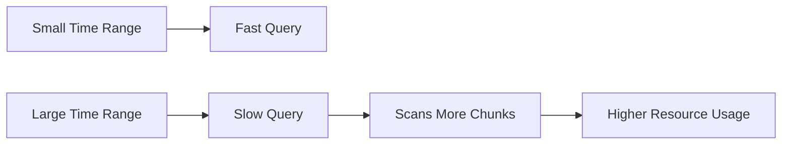
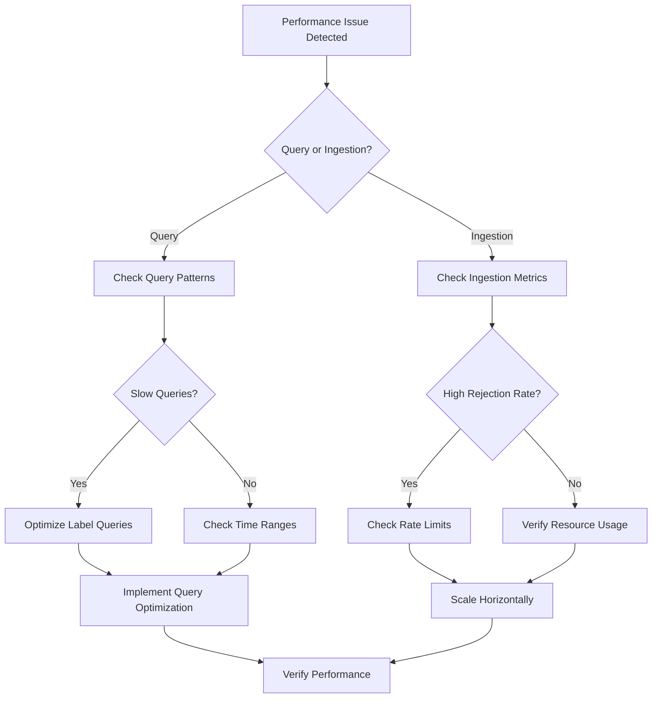

# Performance Problems

## Introduction

Performance issues in Grafana Loki can manifest in various ways - from slow query responses to increased resource consumption and system latency. This guide will help you identify common performance bottlenecks, understand their root causes, and implement effective solutions to optimize your Loki deployment.

Loki is designed to be efficient with storage and provide fast query capabilities, but like any system, it can encounter performance challenges as scale increases or under specific usage patterns. By understanding these patterns and applying the right troubleshooting techniques, you can ensure your Loki deployment remains performant.

## Common Performance Issues

### 1. Slow Query Performance

One of the most noticeable performance issues in Loki is slow query execution. This is often the first symptom users notice.

#### Symptoms
- Queries take a long time to complete
- Timeouts when executing queries
- Inconsistent query performance

#### Diagnosis

To diagnose slow query performance, examine your query patterns:

```bash
# Check query statistics in Loki's metrics
curl http://localhost:3100/metrics | grep loki_query
```

Look for these specific metrics:
- `loki_query_range_duration_seconds`: Duration of range queries
- `loki_query_instant_duration_seconds`: Duration of instant queries

#### Common Causes and Solutions

**1. Inefficient Label Filters**

Inefficient queries that scan too much data are a primary cause of performance problems.

❌ Inefficient query example:
```
{job="production"} |= "error"
```

✅ Improved query with better label filtering:
```
{job="production", component="api", level="error"}
```

**2. Large Time Ranges**

Queries over large time ranges force Loki to scan more chunks of data.



**Solution:** Use smaller time ranges when possible, or implement pagination for large result sets.

**3. High Cardinality**

High cardinality (too many unique label combinations) can severely impact performance.

```javascript
// Example showing high cardinality label usage
const badLabels = {
  // ❌ Bad: High cardinality labels
  user_id: "12345",          // Unique per user
  request_id: "abc-123-xyz", // Unique per request
  timestamp: "1614556800",   // Constantly changing
  
  // ✅ Good: Low cardinality labels
  service: "payment-api",
  environment: "production",
  region: "us-west"
}
```

**Solution:** Redesign your labeling strategy to use fewer, more meaningful labels.

### 2. High Memory Usage

Loki can consume significant memory, especially during query operations.

#### Diagnosis

Monitor these metrics:
- `process_resident_memory_bytes`: Total memory used
- `loki_ingester_memory_chunks`: Number of chunks in memory
- `loki_ingester_memory_users`: Number of active users

```bash
# Check memory metrics
curl http://localhost:3100/metrics | grep memory
```

#### Solutions

1. **Adjust Memory Limits**

Configure appropriate memory limits in your configuration:

```yaml
limits_config:
  ingestion_rate_mb: 10
  ingestion_burst_size_mb: 20
  max_global_streams_per_user: 5000
  max_chunks_per_query: 1000000
```

2. **Optimize Chunk Size**

```yaml
chunk_store_config:
  max_look_back_period: 168h  # How far back to look for chunks
  
schema_config:
  configs:
    - from: 2020-07-01
      store: boltdb-shipper
      object_store: s3
      schema: v11
      index:
        prefix: index_
        period: 24h
```

3. **Implement Query Splitting**

For large queries, consider splitting them into smaller time ranges and aggregating results in your application.

### 3. Ingestor Bottlenecks

Ingestion bottlenecks can occur when your system is sending logs faster than Loki can process them.

#### Symptoms
- Increasing lag in log availability
- Failed push requests
- Growing queue of pending writes

#### Diagnosis

Check these metrics:
- `loki_distributor_ingester_append_failures_total`: Failures when appending to ingesters
- `loki_distributor_bytes_received_total`: Total bytes received
- `loki_ingester_streams_created_total`: Number of streams created

#### Solutions

1. **Horizontal Scaling**

Add more ingesters to distribute the load:

```yaml
# Example Kubernetes scaling
apiVersion: apps/v1
kind: Deployment
metadata:
  name: loki-ingester
spec:
  replicas: 3  # Increase based on load
```

2. **Rate Limiting**

Implement rate limiting to prevent ingest overload:

```yaml
limits_config:
  ingestion_rate_mb: 4
  ingestion_burst_size_mb: 6
  max_line_size: 256000
  max_line_size_truncate: true
```

3. **Batch Optimization**

Adjust client-side batching to optimize ingestion:

```python
# Promtail client example with batching
import time
from promtail import Promtail

client = Promtail(
    {"url": "http://localhost:3100/loki/api/v1/push"},
    batch_size=100,  # Number of log lines per batch
    batch_interval=1.0  # Seconds between batch sends
)

# Add logs efficiently 
for i in range(1000):
    client.log({
        "job": "test",
        "level": "info"
    }, f"Test log line {i}")
    
    if i % 100 == 0:
        time.sleep(0.1)  # Avoid overwhelming the system
```

## Real-World Performance Tuning Examples

### Example 1: E-commerce Platform

An e-commerce company was experiencing query timeouts during peak shopping hours. Investigation revealed:

1. **Problem**: Queries scanning all logs for error messages
2. **Solution**: Implemented structured logging with dedicated error labels

Before:
```
{app="shop"} |= "error"  # Scans all logs, very inefficient
```

After:
```
{app="shop", level="error"}  # Uses label index, much faster
```

**Results**: Query times reduced from 30+ seconds to under 1 second.

### Example 2: Microservice Architecture

A company with 50+ microservices experienced memory pressure in their Loki deployment.

1. **Problem**: High cardinality from service-generated unique IDs in labels
2. **Solution**: 
   - Moved unique IDs from labels to log content
   - Implemented log aggregation by service and component
   - Increased memory limits for query frontends

**Configuration Change**:
```yaml
# Before
limits_config:
  max_global_streams_per_user: 5000

# After
limits_config:
  max_global_streams_per_user: 15000
  max_chunks_per_query: 2000000
  max_query_parallelism: 32
```

**Results**: 80% reduction in OOM errors and query stability improved significantly.

## Performance Optimization Checklist

Use this checklist to systematically address performance issues:

1. **Query Optimization**
   - [ ] Use specific label matchers
   - [ ] Limit time ranges
   - [ ] Avoid regex where possible
   - [ ] Use line filtering after label matching

2. **Cardinality Management**
   - [ ] Audit current label usage
   - [ ] Remove high-cardinality labels
   - [ ] Implement cardinality limits

3. **Resource Configuration**
   - [ ] Set appropriate memory limits
   - [ ] Configure chunk caching
   - [ ] Optimize for hardware resources

4. **Monitoring**
   - [ ] Set up alerts for query latency
   - [ ] Monitor memory usage
   - [ ] Track ingestion rates and failures

## Troubleshooting Decision Tree



## Summary

Performance problems in Grafana Loki typically stem from inefficient queries, high cardinality, resource constraints, or ingestion bottlenecks. By understanding these common issues and applying the troubleshooting techniques outlined in this guide, you can maintain an efficient and responsive logging system.

Remember these key principles:
1. Use specific label queries to leverage Loki's index
2. Keep cardinality low by designing a thoughtful labeling strategy
3. Monitor and adjust resource allocations based on usage patterns
4. Scale horizontally when vertical scaling reaches its limits

## Additional Resources

- [Loki Cardinality Best Practices](https://grafana.com/docs/loki/latest/best-practices/)
- [Optimizing Loki Queries](https://grafana.com/docs/loki/latest/logql/)
- [Loki Configuration Reference](https://grafana.com/docs/loki/latest/configuration/)

## Exercises

1. Analyze your current log queries and identify opportunities for optimization. Convert at least three inefficient queries to more efficient versions.

2. Implement a cardinality audit on your current Loki deployment:
   - Which labels have the highest cardinality?
   - Which could be moved to log content instead?
   - Draft a new labeling strategy based on your findings.

3. Create a monitoring dashboard that tracks key Loki performance metrics and set up alerts for performance degradation.