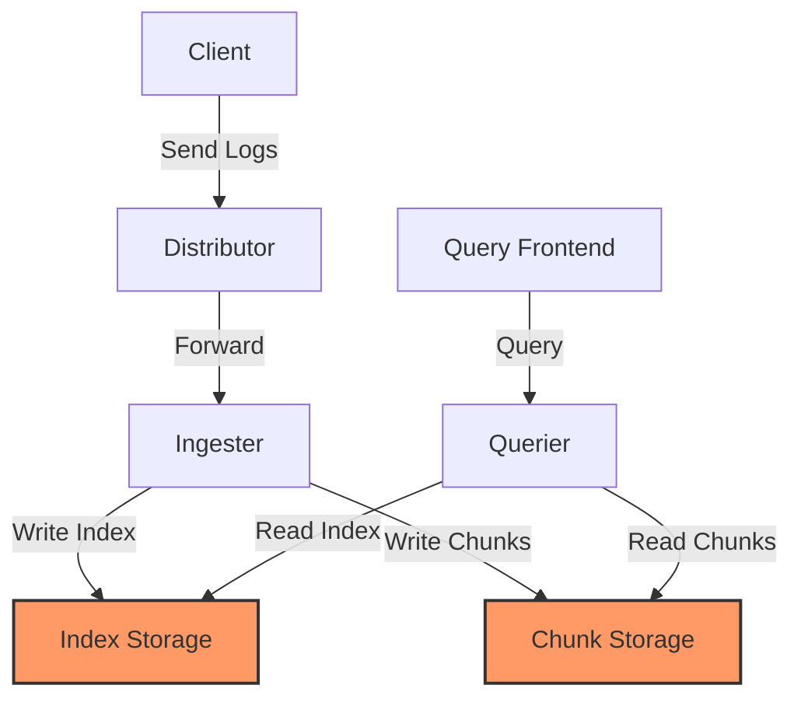

# Storage Issues

## Introduction

Grafana Loki is a horizontally scalable, highly available log aggregation system inspired by Prometheus. As your logging volumes grow, storage issues can become one of the most common challenges you'll face when running Loki in production. In this guide, we'll explore the various storage-related problems that can occur, how to identify them, and strategies to resolve these issues efficiently.

Loki's storage architecture uses two primary storage components:

1. **Index** - Stores metadata about your logs including labels and pointers to chunks
2. **Chunks** - The actual compressed log content

Understanding how these storage components work is essential for troubleshooting storage-related problems in Loki.

## Common Storage Issues

### 1. Storage Backend Connectivity Issues

One of the most frequent storage issues is connectivity problems with the configured storage backend.

#### Symptoms:
- Error messages in Loki logs like `failed to write chunks`, `failed to query index`, or `storage request failed`
- Queries returning partial or no results
- Logs not appearing in Grafana even though they've been sent to Loki

#### Troubleshooting Steps:

Check Loki's logs for specific error messages:

```bash
kubectl logs -f loki-0 -n loki
# Or if using Docker:
docker logs loki
```

Verify connectivity to your storage backend:

```bash
# For S3:
aws s3 ls s3://your-loki-bucket/

# For GCS:
gsutil ls gs://your-loki-bucket/

# For Azure Blob Storage:
az storage blob list --container your-loki-container
```

#### Solution:

If you identify connectivity issues, check your storage configuration in Loki's config file:

```yaml
storage_config:
  aws:
    s3: s3://access_key:secret_access_key@region/bucket_name
    s3forcepathstyle: true
  boltdb_shipper:
    active_index_directory: /loki/boltdb-shipper-active
    cache_location: /loki/boltdb-shipper-cache
    cache_ttl: 24h
    shared_store: s3
```

Ensure your credentials and permissions are correctly configured for your storage provider.

### 2. Insufficient Storage Space

As log volumes grow, you might run into storage capacity issues.

#### Symptoms:
- Error messages like `no space left on device`
- Loki pods failing or crashing
- Failed write operations

#### Troubleshooting Steps:

Check disk usage on local storage:

```bash
# If running in a Kubernetes environment
kubectl exec -it loki-0 -n loki -- df -h

# If running directly on a host
df -h
```

For cloud storage, check your bucket size and quotas through your cloud provider's console or CLI.

#### Solution:

1. **Increase local storage**:
   - For Kubernetes deployments, update the PersistentVolumeClaim size
   - For standalone deployments, add more disk space

2. **Implement retention policies** to automatically remove older logs:

```yaml
limits_config:
  retention_period: 7d
  
compactor:
  working_directory: /loki/compactor
  shared_store: s3
  compaction_interval: 10m
```

3. **Enable compression** to reduce storage requirements:

```yaml
chunk_store_config:
  chunk_cache_config:
    enable_fifocache: true
    fifocache:
      max_size_bytes: 500MB
  write_dedupe_cache_config:
    enable_fifocache: true
    fifocache:
      max_size_bytes: 500MB
```

### 3. Index Corruption

Index corruption can occur due to sudden system crashes or improper shutdowns.

#### Symptoms:
- Queries returning inconsistent results
- Error messages mentioning `invalid index format` or `corrupted index`
- Missing logs for specific time ranges

#### Troubleshooting:

Check Loki logs for index-related errors:

```bash
kubectl logs -f loki-0 -n loki | grep -i "index"
```

#### Solution:

1. **Restore from backup** if available

2. **Rebuild indexes** - With BoltDB Shipper, you might need to restart the ingesters to rebuild local indexes:

```bash
kubectl rollout restart statefulset/loki -n loki
```

3. **Configure periodic compaction** to maintain index health:

```yaml
compactor:
  working_directory: /loki/compactor
  shared_store: s3
  compaction_interval: 10m
```

## Optimizing Storage Performance

### 1. Chunk Caching

Implementing chunk caching can significantly improve query performance while reducing storage access costs:

```yaml
chunk_store_config:
  chunk_cache_config:
    enable_fifocache: true
    fifocache:
      max_size_bytes: 1GB
```

### 2. Index Caching

Similar to chunk caching, index caching improves query latency:

```yaml
storage_config:
  index_queries_cache_config:
    enable_fifocache: true
    fifocache:
      max_size_bytes: 500MB
```

### 3. Implementing Effective Schema

The schema configuration controls how Loki organizes your log data, which affects storage efficiency:

```yaml
schema_config:
  configs:
    - from: 2022-01-01
      store: boltdb-shipper
      object_store: s3
      schema: v11
      index:
        prefix: index_
        period: 24h
```

## Common Storage-Related Error Messages and Solutions

| Error Message | Likely Cause | Solution |
|---------------|--------------|----------|
| `no space left on device` | Disk space exhausted | Increase storage or implement retention |
| `failed to write chunks to s3` | S3 connectivity issue | Check credentials and network |
| `failed to query index` | Index corruption or unavailable | Verify storage backend connectivity |
| `too many outstanding requests` | Storage backend throttling | Implement backpressure or increase limits |
| `failed to load chunks` | Chunk storage issues | Check storage configuration and permissions |

## Diagnosing Storage Performance

Let's create a diagram to visualize the storage flow and potential bottlenecks:



## Practical Examples

### Example 1: Troubleshooting S3 Storage Issues

Suppose you notice logs aren't being stored in Loki. Let's diagnose and fix this:

1. Check Loki logs for S3-related errors:

```bash
kubectl logs -f loki-0 -n loki | grep -i "s3"
```

Possible output:
```
level=error ts=2023-05-10T15:04:23.456Z caller=client.go:123 msg="error uploading chunk" err="AccessDenied: Access Denied status code: 403"
```

2. Verify S3 permissions using AWS CLI:

```bash
aws s3 ls s3://your-loki-bucket/ --profile loki
```

3. Update IAM policy to grant proper access:

```json
{
  "Version": "2012-10-17",
  "Statement": [
    {
      "Effect": "Allow",
      "Action": [
        "s3:PutObject",
        "s3:GetObject",
        "s3:ListBucket",
        "s3:DeleteObject"
      ],
      "Resource": [
        "arn:aws:s3:::your-loki-bucket/*",
        "arn:aws:s3:::your-loki-bucket"
      ]
    }
  ]
}
```

4. Update Loki configuration with correct credentials and test again.

### Example 2: Managing Storage Growth

Let's create a practical example of implementing a retention policy to manage storage growth:

1. Current configuration with unlimited retention (problematic):

```yaml
limits_config:
  # No retention period specified
```

2. Updated configuration with retention and compaction:

```yaml
limits_config:
  retention_period: 30d
  
compactor:
  working_directory: /loki/compactor
  shared_store: s3
  compaction_interval: 10m
  retention_enabled: true
  retention_delete_delay: 2h
  retention_delete_worker_count: 150
```

3. Verify retention is working by checking compactor logs:

```bash
kubectl logs -f loki-compactor-0 -n loki | grep -i "retention"
```

Expected output:
```
level=info ts=2023-05-10T10:20:30.123Z caller=retention.go:123 msg="applying retention" cutoff=1682854830
level=info ts=2023-05-10T10:20:35.456Z caller=retention.go:145 msg="deleted table" table=index_123
```

## Production Readiness Checklist for Storage

Before deploying Loki to production, ensure you've addressed these storage considerations:

- [ ] Storage backend is properly configured and accessible
- [ ] Retention policies are in place to manage storage growth
- [ ] Monitoring is set up for storage metrics (usage, latency, errors)
- [ ] Alerting is configured for storage-related issues
- [ ] Backup and recovery procedures are documented and tested
- [ ] Scaling strategy is defined for growing storage needs
- [ ] Storage performance has been benchmarked with expected load

## Monitoring Storage Metrics

Monitor these key metrics to proactively identify storage issues:

```
# Chunk storage operation failures
rate(loki_chunk_store_operation_failures_total[5m])

# Query latency due to storage issues
histogram_quantile(0.99, sum(rate(loki_query_range_duration_seconds_bucket[5m])) by (le, job))

# Storage operation duration
histogram_quantile(0.99, sum(rate(loki_storage_operation_duration_seconds_bucket[5m])) by (le, operation))
```

Add these queries to your Grafana dashboards to monitor storage health.

## Summary

Storage issues in Grafana Loki can significantly impact the reliability and performance of your logging system. By understanding the common problems, implementing proper monitoring, and following best practices for configuration, you can ensure your Loki deployment remains healthy even as your logging volumes grow.

Key takeaways:
- Configure appropriate storage backends based on your scale and requirements
- Implement retention policies to manage storage growth
- Use caching to improve performance and reduce storage access costs
- Monitor storage metrics and set up alerts for early detection of issues
- Properly size your storage based on expected log volumes and retention period
- Regularly test backup and recovery procedures

## Additional Resources

- [Grafana Loki Documentation: Storage](https://grafana.com/docs/loki/latest/operations/storage/)
- [Grafana Loki Configuration: Storage](https://grafana.com/docs/loki/latest/configuration/#storage_config)
- [BoltDB Shipper Documentation](https://grafana.com/docs/loki/latest/operations/storage/boltdb-shipper/)

## Exercises

1. Set up a Loki instance with S3 as the backend and implement a 7-day retention policy.
2. Create a Grafana dashboard to monitor key storage metrics for your Loki deployment.
3. Simulate a storage failure and practice the recovery process.
4. Benchmark query performance with and without chunk/index caching enabled.
5. Calculate the estimated storage requirements for your log volume with different retention periods.