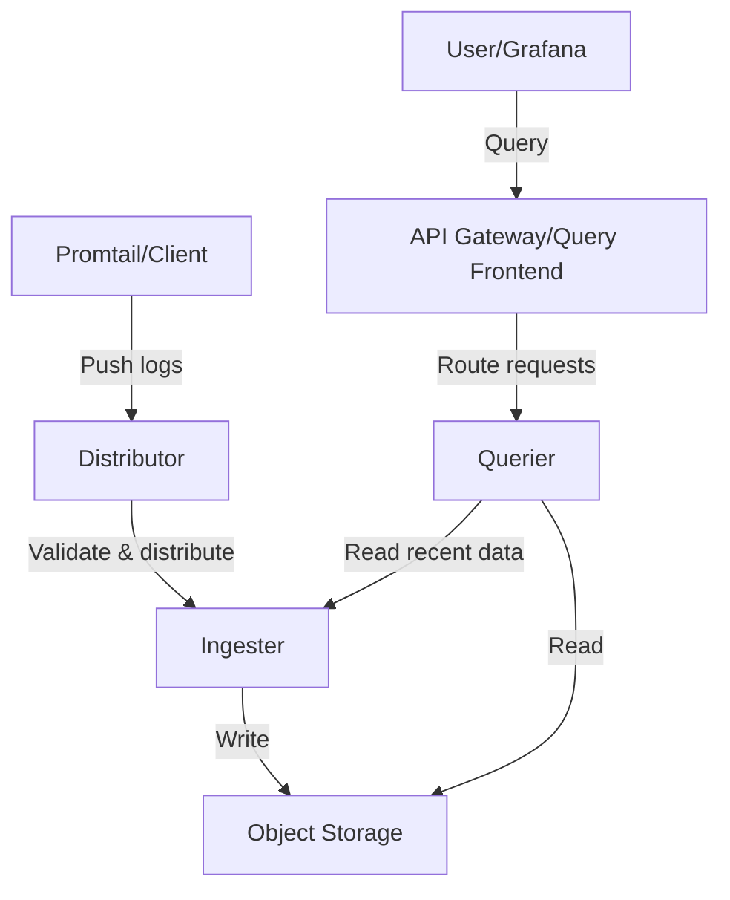

# Component Failures

## Introduction

When working with Grafana Loki, you may encounter situations where components within the system fail or behave unexpectedly. Component failures can manifest as service outages, degraded performance, or data loss. Understanding how to identify, diagnose, and resolve these failures is crucial for maintaining a healthy logging system.

In this guide, we'll explore common component failures in Grafana Loki, how to detect them, and strategies for resolving these issues efficiently.

## Understanding Loki's Components

Before diving into failures, let's review Loki's key components:



Each component serves a specific purpose:

- **Distributor**: Receives logs and distributes them to ingesters
- **Ingester**: Writes logs to storage and handles queries for recent data
- **Querier**: Executes queries against both storage and ingesters
- **Query Frontend/Gateway**: Routes and optimizes queries
- **Storage**: Persists log data (object storage like S3, GCS, etc.)
- **Clients**: Send logs to Loki (Promtail, Fluentd, etc.)

When any of these components fail, it affects the entire system's functionality.

## Common Component Failures

### 1. Distributor Failures

Distributors act as the entry point for logs into Loki. When they fail, log ingestion stops.

#### Symptoms:
- Log transmission errors from clients
- Increasing error rates in metrics like `loki_distributor_errors_total`
- HTTP 5xx responses when sending logs

#### Diagnosis:

Check distributor logs for errors:

```bash
kubectl logs -l app=loki,component=distributor -n loki
```

Look for relevant metrics:

```promql
rate(loki_distributor_errors_total[5m])
```

#### Resolution:

1. Check for resource constraints:

```bash
kubectl describe pods -l app=loki,component=distributor -n loki
```

2. Scale distributors if they're overloaded:

```yaml
distributors:
  replicas: 3  # Increase this number
  resources:
    requests:
      cpu: 200m
      memory: 256Mi
    limits:
      cpu: 500m
      memory: 512Mi
```

3. Check network connectivity between clients and distributors.

### 2. Ingester Failures

Ingesters are responsible for writing logs to storage and serving recent data. Their failure can cause data loss or query failures.

#### Symptoms:
- Logs not appearing in queries
- High error rates on `loki_ingester_chunks_stored_total`
- Distributor reporting ingester unavailability

#### Diagnosis:

Check ingester health and state:

```bash
kubectl logs -l app=loki,component=ingester -n loki | grep "level=error"
```

Verify ring status:

```bash
curl http://loki-ingester:3100/ring
```

#### Resolution:

1. Check for disk pressure if using local storage:

```bash
kubectl describe node <node-name> | grep "Disk Pressure"
```

2. Verify ingester configuration, especially retention settings:

```yaml
ingester:
  chunk_idle_period: 30m
  chunk_retain_period: 1m
  lifecycler:
    ring:
      kvstore:
        store: memberlist
      replication_factor: 3
```

3. Restart ingesters if necessary, but be cautious about potential data loss:

```bash
kubectl rollout restart statefulset/loki-ingester -n loki
```

### 3. Querier Failures

Queriers execute log queries across storage and ingesters. When they fail, users cannot access their logs.

#### Symptoms:
- Queries timing out or returning errors
- Error messages in Grafana when attempting to view logs
- High latency in query execution

#### Diagnosis:

Check querier logs for errors or timeouts:

```bash
kubectl logs -l app=loki,component=querier -n loki | grep "query timeout"
```

Review query metrics:

```promql
sum(rate(loki_query_frontend_queries_total{status="error"}[5m])) by (route)
```

#### Resolution:

1. Optimize query parameters to prevent resource-intensive queries:

```
{app="nginx"} |= "error" != "heartbeat" | limit 1000
```

2. Increase querier resources:

```yaml
querier:
  replicas: 2
  resources:
    requests:
      cpu: 200m
      memory: 512Mi
    limits:
      cpu: 1000m
      memory: 1Gi
```

3. Consider implementing query limits to prevent resource exhaustion:

```yaml
limits_config:
  max_entries_limit_per_query: 5000
  max_query_length: 721h
  max_query_parallelism: 32
```

### 4. Storage Failures

Loki depends heavily on object storage (S3, GCS, etc.). Storage issues can cause ingestion or query failures.

#### Symptoms:
- Write failures in ingester logs
- Query errors related to chunk fetching
- Increasing storage operation errors in metrics

#### Diagnosis:

Check storage operation metrics:

```promql
sum(rate(loki_boltdb_shipper_operation_duration_seconds_count{operation="write",status="fail"}[5m]))
```

Verify storage connectivity:

```bash
# For S3
aws s3 ls s3://loki-bucket/

# For GCS
gsutil ls gs://loki-bucket/
```

#### Resolution:

1. Verify storage permissions:

```yaml
storage_config:
  aws:
    s3: s3://access_key:secret_access_key@region/bucket_name
    s3forcepathstyle: true
```

2. Check bucket policies and IAM roles.

3. Consider implementing retries for storage operations:

```yaml
chunk_store_config:
  max_retries: 10
  retry_delay: 30s
```

## Monitoring for Component Failures

Prevention is better than cure. Set up monitoring to detect failures early:

### Key Metrics to Watch

1. **Health metrics**: Monitor `up` metric for all components.

```promql
up{job=~"loki.*"}
```

2. **Error rates**: Track errors by component.

```promql
sum(rate(loki_request_duration_seconds_count{status_code=~"5.."}[5m])) by (component)
```

3. **Resource usage**: Monitor CPU, memory, and disk.

```promql
container_memory_usage_bytes{pod=~"loki.*"}
```

### Setting Up Alerts

Create alerts for potential component failures:

```yaml
groups:
- name: loki.rules
  rules:
  - alert: LokiDistributorErrors
    expr: |
      sum(rate(loki_distributor_errors_total[5m])) by (namespace) > 0.1
    for: 10m
    labels:
      severity: warning
    annotations:
      summary: Loki distributor experiencing errors
      description: "Loki distributor is experiencing errors at a rate of {{ $value }} errors/s"
      
  - alert: LokiIngesterErrors
    expr: |
      sum(rate(loki_ingester_chunks_stored_total{status="fail"}[5m])) > 0
    for: 5m
    labels:
      severity: critical
    annotations:
      summary: Loki ingester storing chunks failures
      description: "Loki ingesters are experiencing errors storing chunks"
```

## Debugging Techniques

When a component fails, these techniques can help identify the root cause:

### 1. Enable Debug Logging

Temporarily increase log level for detailed diagnostics:

```yaml
server:
  log_level: debug  # Change from info to debug
```

### 2. Use Profiling Endpoints

Loki components expose pprof endpoints for profiling:

```bash
# Capture CPU profile from an ingester
curl http://loki-ingester:3100/debug/pprof/profile?seconds=30 > cpu.prof

# Analyze with pprof
go tool pprof cpu.prof
```

### 3. Analyze Request Traces

If tracing is enabled (Jaeger/Tempo), analyze traces to identify bottlenecks:

```yaml
tracing:
  enabled: true
  tempo:
    endpoint: tempo:4317
```

## Prevention Strategies

Implement these strategies to prevent component failures:

1. **Redundancy**: Deploy multiple replicas of each component.

```yaml
distributor:
  replicas: 3
ingester:
  replicas: 3
querier:
  replicas: 2
```

2. **Resource Planning**: Allocate sufficient resources based on workload.

3. **Regular Upgrades**: Keep Loki updated to benefit from bug fixes.

4. **Load Testing**: Test your configuration under expected load.

## Practical Example: Debugging a Complete Loki System

Let's walk through a real-world scenario of troubleshooting component failures:

### Scenario: Logs not appearing in Grafana

1. **Check Client Configuration**:

```yaml
# Promtail config
clients:
  - url: http://loki-distributor:3100/loki/api/v1/push
    tenant_id: tenant1
    batchwait: 1s
    batchsize: 102400
```

2. **Verify Distributors**:

```bash
# Check log errors
kubectl logs -l app=loki,component=distributor -n loki | grep ERROR

# Check metrics
curl -s http://loki-distributor:3100/metrics | grep distributor_errors
```

3. **Examine Ingesters**:

```bash
# Check if ingesters are receiving data
curl -s http://loki-ingester:3100/metrics | grep ingester_chunks
```

4. **Verify Storage**:

```bash
# Check for storage errors
kubectl logs -l app=loki,component=ingester -n loki | grep "storage"
```

5. **Review Query Path**:

```bash
# Check querier logs
kubectl logs -l app=loki,component=querier -n loki
```

The issue might be:
- Clients not sending logs
- Distributors rejecting logs
- Ingesters failing to store logs
- Storage issues preventing writes
- Queriers unable to access logs

In this case, let's say we discover the issue in the ingester logs:

```
level=error ts=2023-04-15T10:15:30Z caller=ingester.go:254 msg="failed to write chunks to storage" err="access denied"
```

The solution would be to check and correct storage permissions.

## Summary

Component failures in Grafana Loki can disrupt your logging system, but with proper understanding and troubleshooting techniques, you can quickly identify and resolve these issues. Remember:

- Understand Loki's architecture and how components interact
- Monitor key metrics to detect failures early
- Use systematic debugging approaches to isolate problems
- Implement redundancy and proper resource planning
- Keep your Loki deployment updated

By following these practices, you'll be well-equipped to handle component failures and maintain a reliable logging system.

## Additional Resources

- [Grafana Loki Troubleshooting Guide](https://grafana.com/docs/loki/latest/operations/troubleshooting/)
- [Loki Architecture Documentation](https://grafana.com/docs/loki/latest/fundamentals/architecture/)
- [Monitoring Loki](https://grafana.com/docs/loki/latest/operations/observability/)

## Exercises

1. Set up a monitoring dashboard in Grafana that shows the health of all Loki components.
2. Create alert rules for critical component failures in your Loki deployment.
3. Simulate a distributor failure and practice the troubleshooting steps outlined in this guide.
4. Review your current Loki configuration and identify potential weaknesses that could lead to component failures.